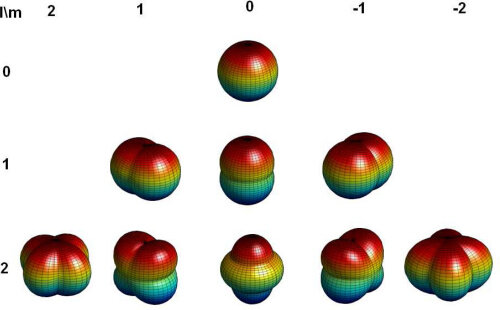

# Spherical Harmonics (SH)

> 컴퓨터 그래픽스에서 **구면 위의 함수**(direction → value)를  
> 효율적으로 표현·근사하기 위한 기저(basis) 함수 체계.  
>  
> 주로 **환경광(Environment Map)**, **BRDF의 각도 의존 성분**,  
> **3D Gaussian Splatting에서의 뷰 의존 색상(방사휘도)** 을  
> 저차수 계수로 압축해 다루는 데 사용된다.

---

## 1. Spherical Harmonics란 무엇인가

Spherical Harmonics는 **구면, 즉 방향 공간 위에 정의된 함수**를  
난이도(차수)별 **방향 패턴들의 조합**으로 표현하는 방법이다.

그래픽스에서 자주 등장하는 다음과 같은 것들은 모두  
**방향 → 값**의 형태를 가지는 구면 위의 함수이다.

- 어느 방향에서 빛이 들어오는가
- 카메라가 어떤 방향에서 물체를 보는가
- 표면 법선이 어느 방향을 향하는가

Spherical Harmonics는 이러한 **방향 의존 함수**를  
효율적으로 표현하기 위한 수단이다.

---

## 2. 푸리에 변환과의 비교

푸리에 변환이 시간/공간 신호를  
**사인(sin), 코사인(cos)** 기저의 조합으로 표현하는 방법이라면,

Spherical Harmonics는  
**방향(구면) 신호**를  
**구면 위의 기본 방향 패턴들**의 조합으로 표현하는 방법이다.

즉,

- 푸리에 변환:  
  - 시간/공간 → 주파수
- Spherical Harmonics:  
  - 방향(구면) → 방향 변화의 복잡도

이런 관점에서 SH는  
**“방향 버전의 푸리에 기저”**라고 볼 수 있다.

---

## 3. SH의 구성 요소: l과 m

  
*Source: Peter-Pike Sloan, “Stupid Spherical Harmonics (SH Tricks)”*

Spherical Harmonics는 두 개의 인덱스로 구성된다.

### 3.1 l (degree)

- `l`은 **방향 변화의 차수**를 의미한다.
- 푸리에 변환에서의 **주파수 크기**와 같은 역할을 한다.

직관적으로 보면:

- `l = 0`  
  - 모든 방향에서 값이 동일  
  - 방향 무관 (DC term)
- `l = 1`  
  - 한쪽은 커지고, 반대쪽은 작아지는 **1차(선형) 방향 변화**
- `l = 2`  
  - 위/아래, 좌/우 등의 관계가 드러나는 **2차 방향 구조**
- `l ↑`  
  - 방향 관계의 표현이 점점 더 복잡해짐

즉, `l`이 커질수록  
**방향의 개수**가 늘어나는 것이 아니라  
**방향 변화의 표현 차수**가 높아진다.

---

### 3.2 m (order)

- `m`은 **같은 복잡도(l) 안에서의 방향 배치**를 의미한다.
- `l`이 정해지면 `m`은 `-l ~ +l` 범위를 가지며, 총 `(2l + 1)`개가 된다.

직관적으로 말하면:

- `l` = “얼마나 복잡한 패턴인가”
- `m` = “그 패턴이 어느 방향으로 놓여 있는가”

`m`은 새로운 복잡도를 추가하지 않으며,  
**같은 차수의 패턴을 서로 다른 방향으로 회전시킨 것**에 가깝다.

---

## 4. SH를 사용한다는 의미

SH를 사용한다는 것은 다음과 같은 의미이다.

> 어떤 함수가 방향에 따라 변할 때,  
> 그 변화를 몇 개의 **기본 방향 패턴**의 조합으로 근사하겠다.

이를 통해 방향별 값을 전부 저장하지 않고도  
부드러운 방향 의존성을 효율적으로 표현할 수 있다.

---

## 5. 3D Gaussian Splatting에서 SH를 사용하는 이유

3D Gaussian Splatting에서 하나의 Gaussian을 단순한 점으로 보면  
항상 같은 색을 가진다.

하지만 실제로는:

- 보는 방향에 따라
- 반짝임, 명암, 색상이 조금씩 달라진다.

이 변화를 뷰마다 저장하면  
필요한 데이터가 뷰 수에 비례해 증가한다.

그래서 3DGS에서는:

- **색을 고정값이 아닌 함수로 보고**
- `색 = f(카메라 방향)`
- 이 함수를 **Spherical Harmonics로 근사**한다.

결과적으로 **각 Gaussian은 하나의 색-방향 함수**를 가지게 된다.

---

## 6. DC term의 의미

DC term은 `l = 0`에 해당하는 항이다.

- 모든 방향에서 값이 동일한 항
- 방향 정보를 제거했을 때 남는 값

즉,

> **“어느 방향에서 보든 기본적으로 이 색이다”**

를 의미한다.

3DGS에서:

- DC term은 Gaussian의 **기본 색**
- `l ≥ 1` 항들은 방향에 따른 변화량을 표현한다.

---

## 7. SH 계수란 무엇인가

3DGS에서 **SH 계수**란,

> 한 Gaussian의 색이  
> **방향에 따라 어떻게 변하는지**를 저장한 숫자들이다.

즉,

- 일반적인 색 표현:  
  - `color = (R, G, B)`
- SH 기반 표현:  
  - `color = f(카메라 방향)`

이 함수 `f`를 SH 기저의 조합으로 표현할 때,  
그 조합의 가중치가 바로 **SH 계수**이다.

따라서 SH 계수는:
- 색 그 자체가 아니라
- **색을 계산하기 위한 파라미터**이다.

3DGS 및 Skyfall-GS에서는  
이 방식을 통해 방향 의존 색상을  
효율적으로 표현하고 학습한다.

---

## Appendix: 푸리에 변환 개념 요약

푸리에 변환은  
**값의 변화를 어떻게 가장 효율적으로 저장할 수 있을까**라는 질문에서 출발한다.

- 시간에 따라 변하는 소리
- 위치에 따라 변하는 색
- 방향에 따라 변하는 밝기

이러한 신호를 모든 위치/시간/방향마다 저장하는 대신,

> “이 변화는 몇 가지 기본 패턴의 합이 아닐까?”

라고 생각한 것이 푸리에 변환이다.

- **basis**: 세상을 설명하는 최소 단위  
  - 푸리에에서는 sin, cos
- **coefficient**: 그 패턴이 얼마나 섞였는가

푸리에 변환은  
**이 계수들을 찾는 과정**이다.

푸리에는 주로 시간, 1D/2D 평면에서 강력하며  
그래픽스에서 자주 등장하는 **방향·회전·구면**에는 적합하지 않다.

이러한 방향 공간을 다루기 위해  
Spherical Harmonics가 사용된다.
