2026-03-24
회의내용 정리, 보고

## 1. UV Atlas

atlas unwrap 과정에서 2D로 저장하기 위해 packing이 필요하고, 이 과정에서 mesh가 무작위 조각(fragmentation) 형태로 펼쳐지면서 형상의 일관성이 깨지는 문제 발생. 그 결과 UV 공간에서 semantic consistency를 유지하는 것이 불가능하며, UV resolution을 높이거나 multi-layer 구조를 사용하는 방식으로도 근본적인 해결이 되지 않는 한계 존재.

이를 해결하기 위해 UV map을 효율을 고려하지 않고 재구성. 치아/잇몸 단위 분리 방식과 grouping 유지 방식을 각각 설정하였으며, resolution은 가능한 최대한 사용하면서 각 구조가 유지되도록 구성.

| Original UV | Tooth/Gum Split UV | Grouped UV |
|------------|------------|------------|
| 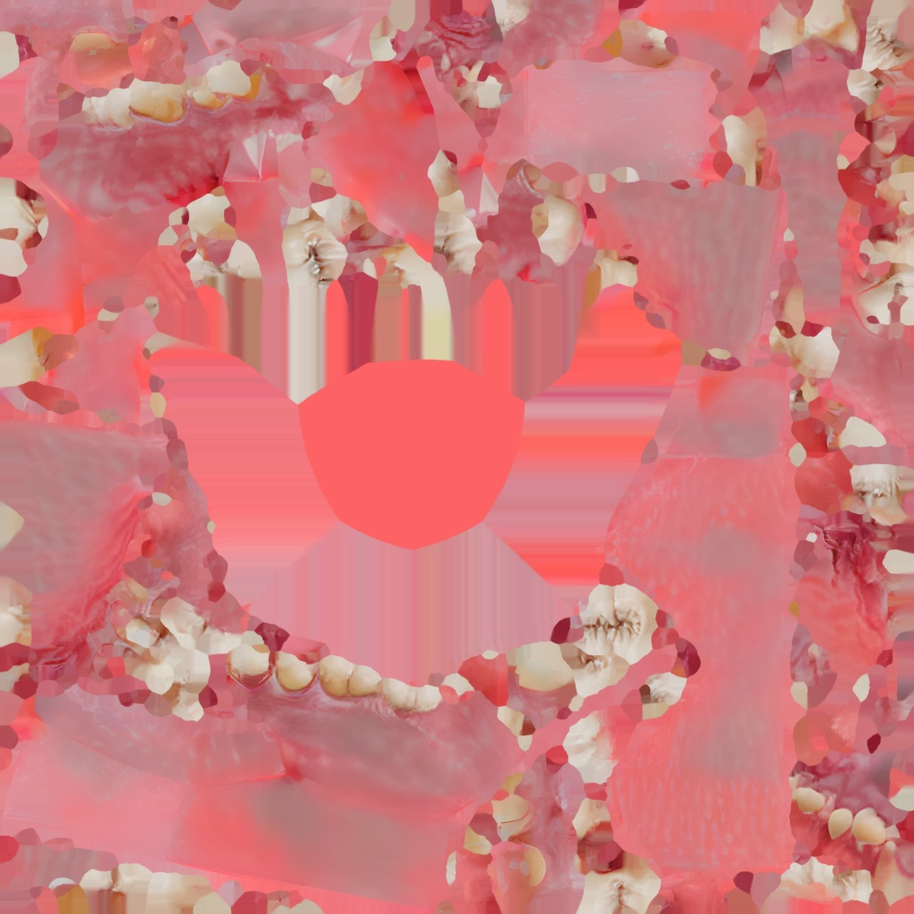 | 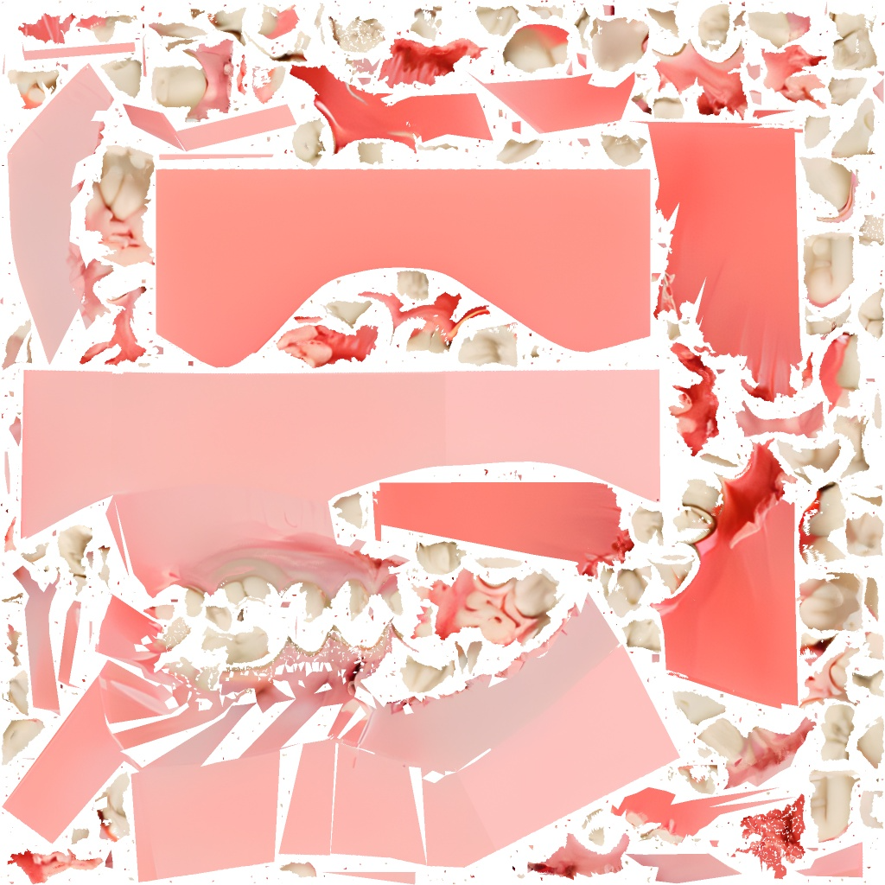 | 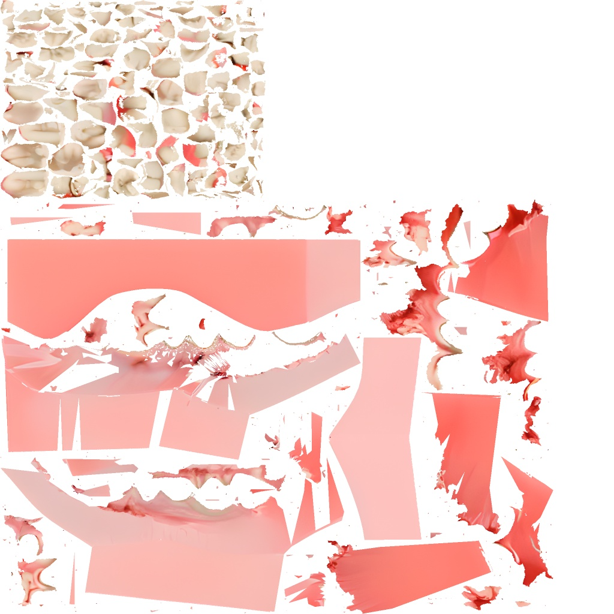 |

## 2. Diffusion vs DiT

DiT 계열은 부분적인 노이즈 제거 및 refinement가 가능하지만, diffusion 계열 모델들은 기본적으로 전체 이미지를 재생성하는 구조이기 때문에 특정 영역만 제어하는 것이 어려움. Stable Diffusion, MaterialMVP, MV-Adapter 모두 동일한 특성 보유.

현재 실험에서는 MaterialMVP가 전체적인 생성 품질은 좋지만 semantic loss가 크게 발생하는 문제가 있으며, Stable Diffusion 2.1은 전반적으로 realism이 부족한 결과를 보임. 스타일이 충분히 realistic하지 않다는 점에서 한계가 명확함.

이 차이가 foundation model capacity의 한계인지, 혹은 DiT와 diffusion 구조 자체의 차이에서 발생하는 것인지는 아직 확인 필요. 검증 방식은 아직 미정.

## 3. MaterialMVP ControlNet+ Semantic Loss
MaterialMVP에서 발생하는 semantic loss를 줄이기 위해 segmentation 기반으로 semantic을 분리하고, 해당 정보를 loss에 포함하는 방식으로 제어하는 방향 진행중.

## 4. Multi-view (50 Views) + Gaussian Splatting
NanoBanana를 사용하여 view를 생성하고, 이를 Gaussian Splatting에 적용하는 방향으로 실험 진행.

NanoBanana를 사용해 생성한 이미지와 GT이미지 비교
| Compare (GT / NanoBanana) | Overlay |
|----------------------------|---------|
| 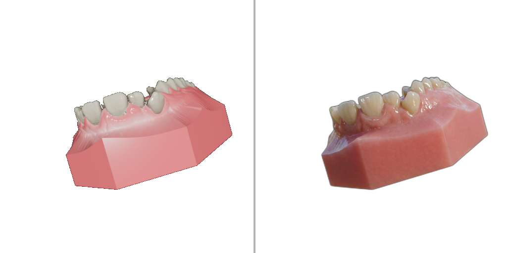 | 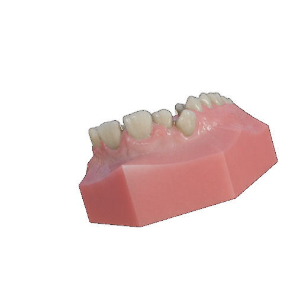 |
| 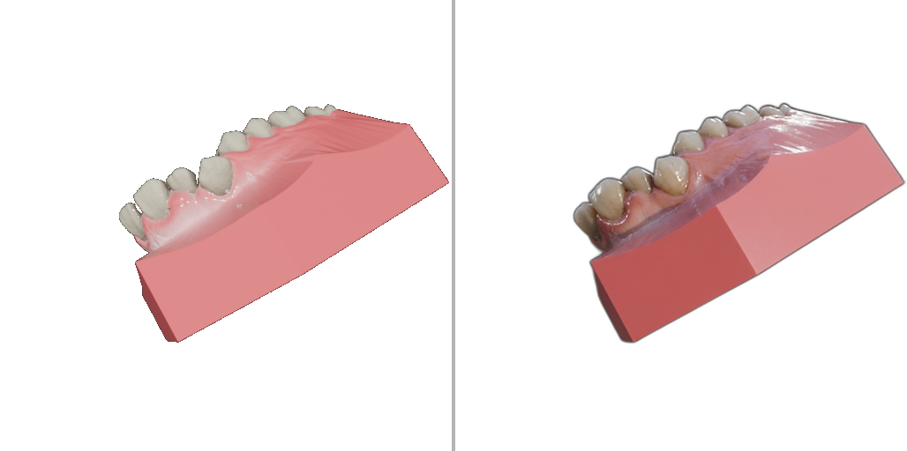 | 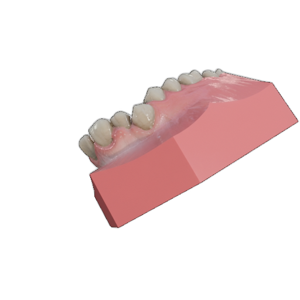 |
| 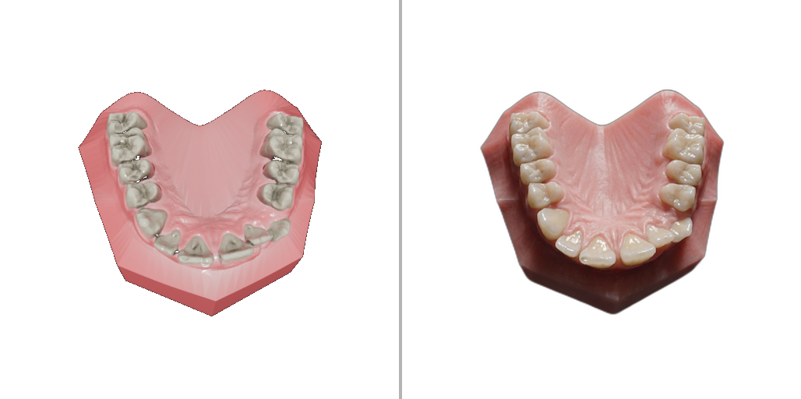 | 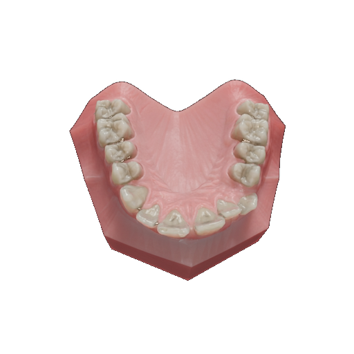 |

결과
| view1 | view2 | view3 | view4 |
|----------|----------|----------|----------|
| 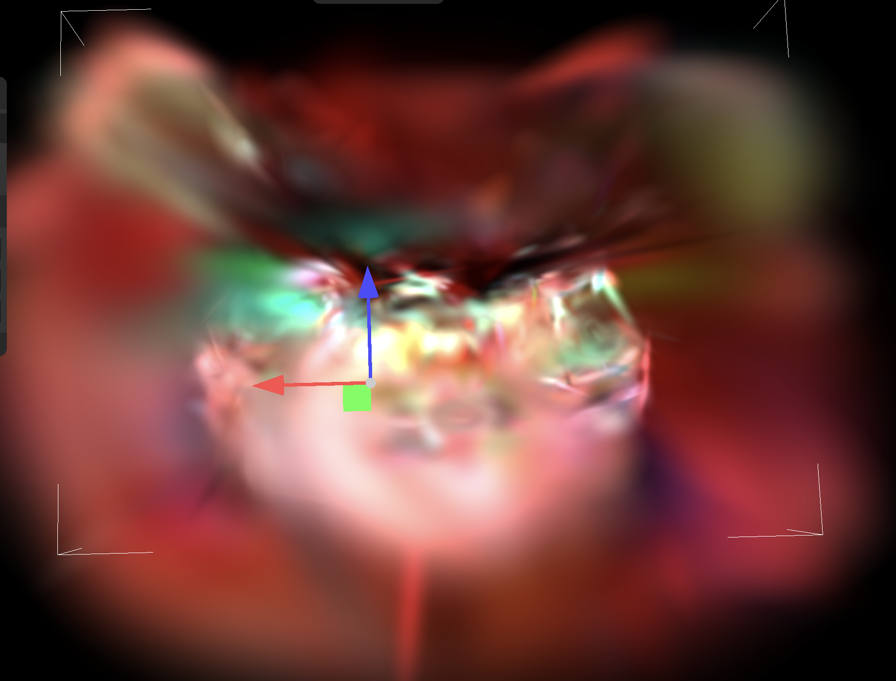 | 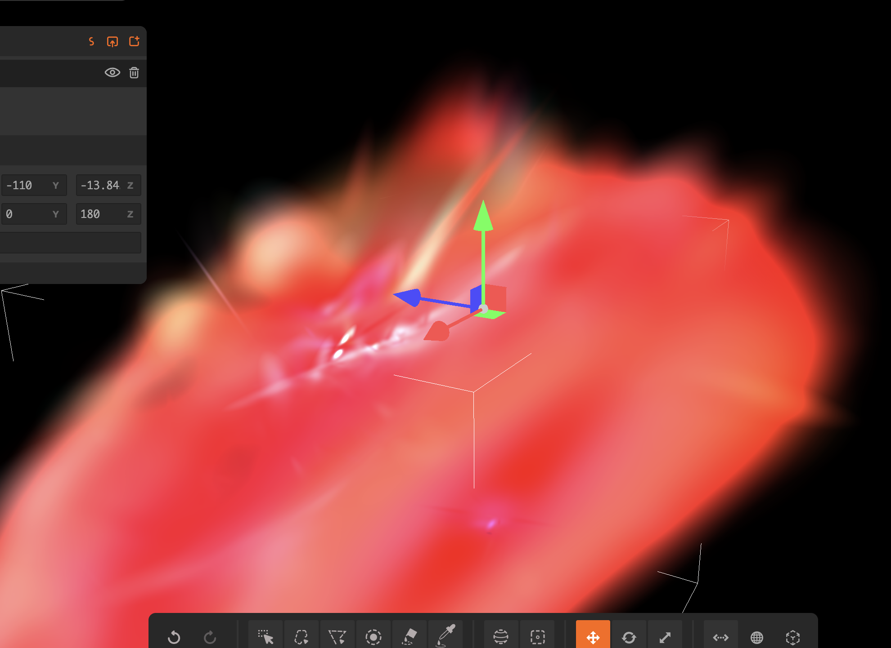 | 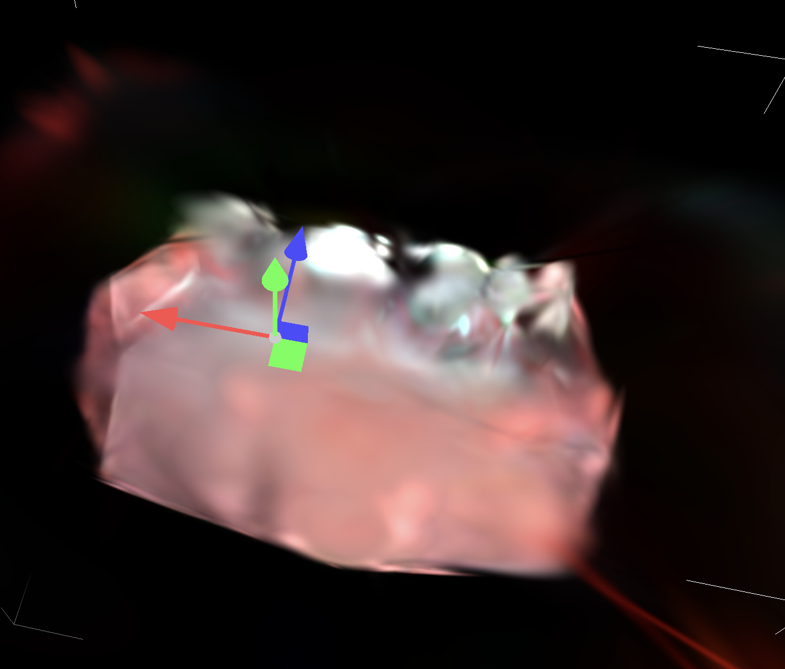 | 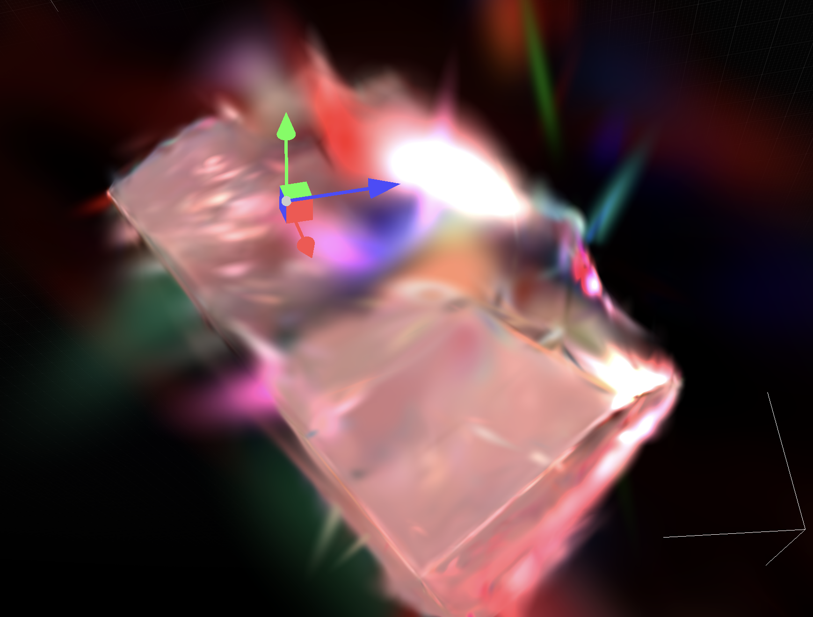 |

뒷면에 대해서는 nanobanana가 생성을 잘 못해줘서, 뒷면은 기존 GT이미지를 그대로 가져가서 썼는데 뒷면은 잘 나타냄 즉, 나노바나나가 만들어낸 이미지 consistency가 붕괴되어 생긴 문제같음
| GT image | NanoBanana가 만들어낸 뒷면 이미지 | GS Output |
|----------|----------|----------|
| 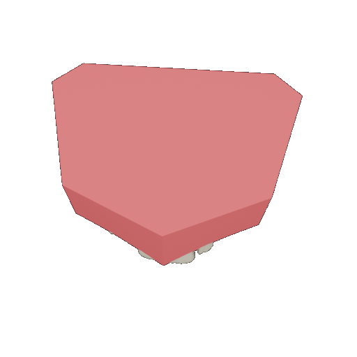 | 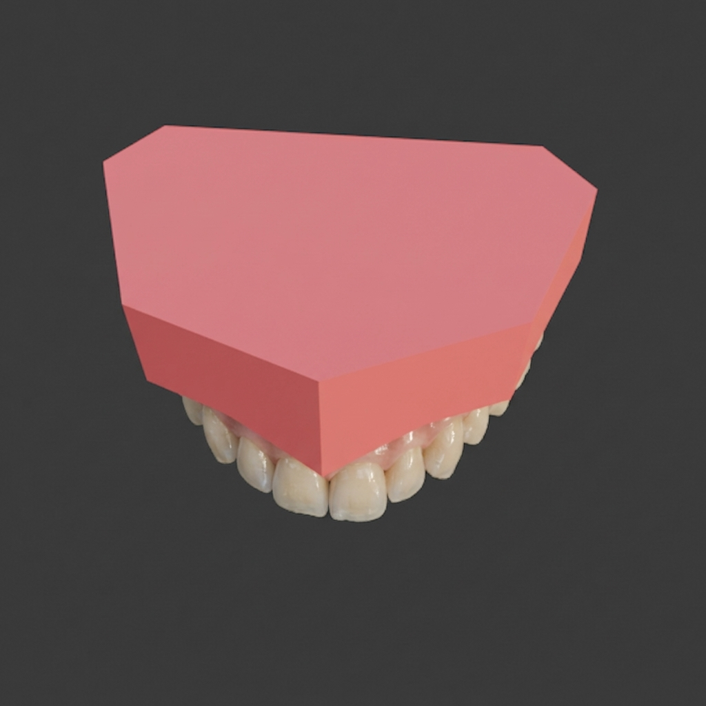 | 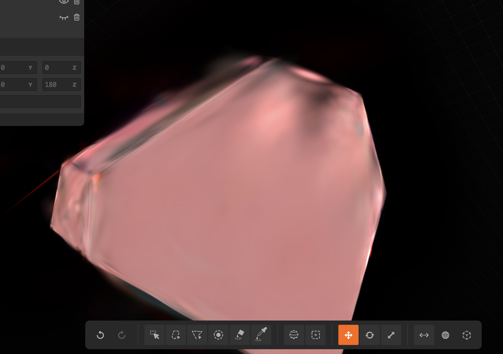 |

## 5. NeRF vs Gaussian Splatting

NeRF는 서로 다른 시간대나 조명 조건에서 촬영된 이미지들을 사용해도 안정적으로 3D reconstruction이 가능하지만, Gaussian Splatting은 동일 조건에서도 결과가 쉽게 깨지는 문제 발생.

이 차이는 representation 방식에서 기인하는 것으로 판단 가능성 존재. NeRF는 volumetric integration 기반으로 inconsistency를 어느 정도 흡수할 수 있는 반면, Gaussian Splatting은 explicit representation이기 때문에 입력 데이터의 inconsistency에 매우 민감하게 반응.

이 차이는 representation과 optimization 방식의 차이에서 발생. NeRF는 volumetric rendering 기반으로 여러 view에서의 photometric error를 누적하여 최적화하기 때문에 입력 데이터 간의 inconsistency를 어느 정도 평균화하거나 흡수 가능. 반면 Gaussian Splatting은 explicit point-based representation을 사용하여 각 Gaussian이 직접 색과 밀도를 가지며, view 간 불일치가 그대로 optimization 과정에 반영됨.

또한 NeRF는 ray integration 과정에서 view-dependent effect를 자연스럽게 처리할 수 있지만, Gaussian Splatting은 view별 색 차이가 존재할 경우 이를 하나의 consistent 값으로 수렴시키기 어렵고, 그 결과 blur, duplication, 혹은 구조 붕괴가 발생.  

결과적으로 NeRF는 inconsistency를 허용하는 구조이고, Gaussian Splatting은 입력 자체의 consistency를 요구하는 구조이기 때문에 동일한 데이터 조건에서도 성능 차이 발생.
