# 2026-03-31  
회의내용 정리, 보고

---

## 1. 전체 흐름

1. Novel view 생성 (diffusion 기반 보정 포함)
2. → NeRF (정렬된 3D 공간 확보)
3. → 두 가지 활용
   - (A) Gaussian Splatting
   - (B) PBR Material + UV Remapping
일단 (A) Gaussian Splatting 먼저 진행

### 선택 이유

- NeRF에서 정렬된 3D를 확보했기 때문에 GS 적용 가능
- lighting 차이 존재 → wild GS 필요

---

## 2. NerF

- 역할:
  - view synthesis
  - geometry consistency 유지

### instant NeRF vs wild NeRF
| View | Original NeRF | Wild NeRF |
| --- | --- | --- |
| 1 |  |  |
| 2 |  |  |
| 3 |  |  |
| 4 | 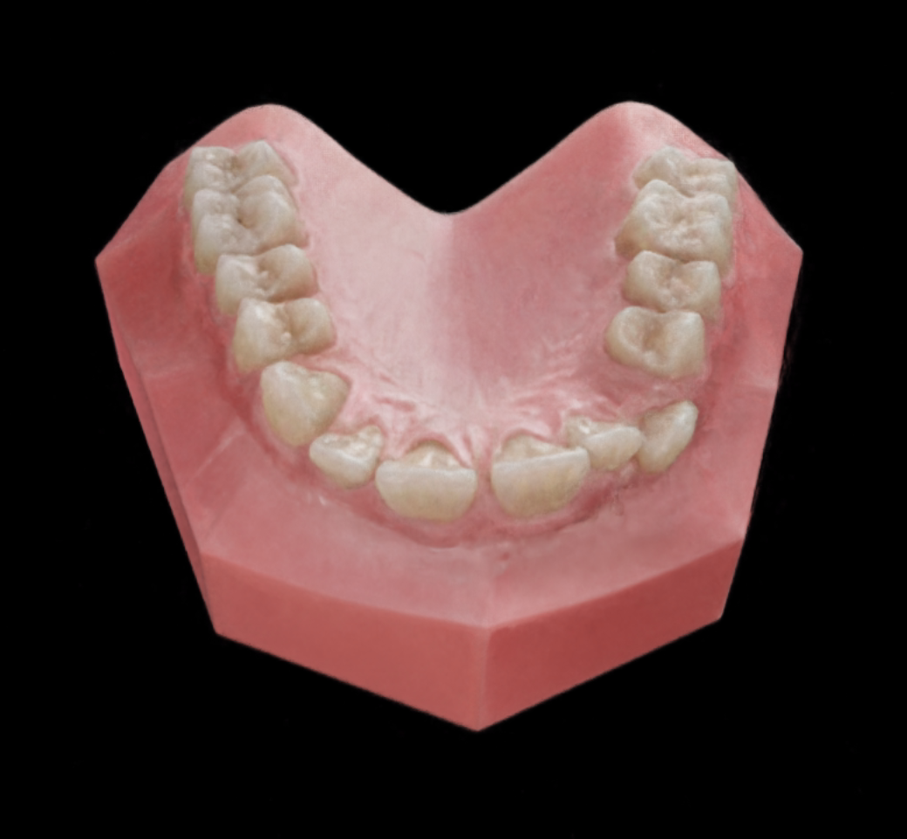 | 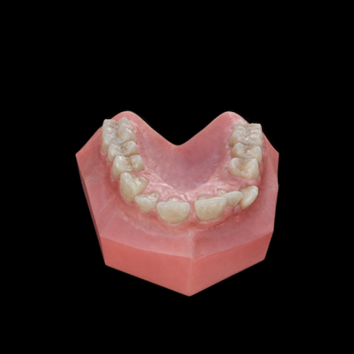 |
| 5 | 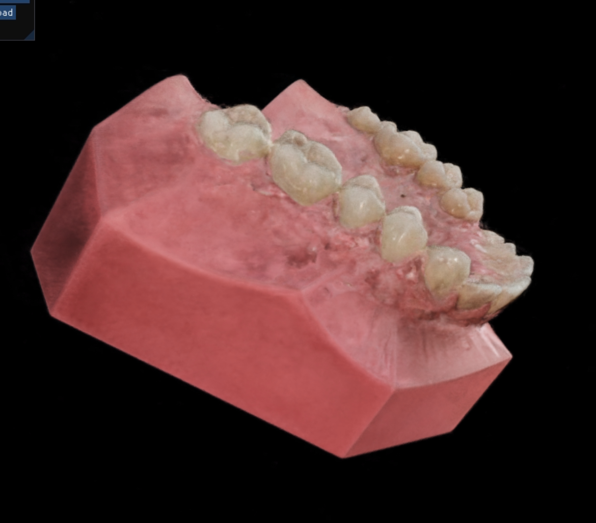 | 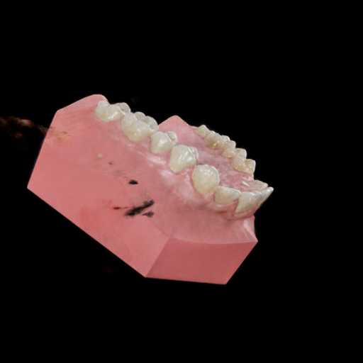 |

---

## 3. Gaussian Splatting

#### 방법
- NeRF에서 **다중 view 생성 → GS 학습**
- 일단 wild GS의 성능 검증을 위해 single lighting image 54 view에 대해 normal GS와 wild GS 비교

| View | Normal GS | Wild GS |
| --- | --- | --- |
| 1 | 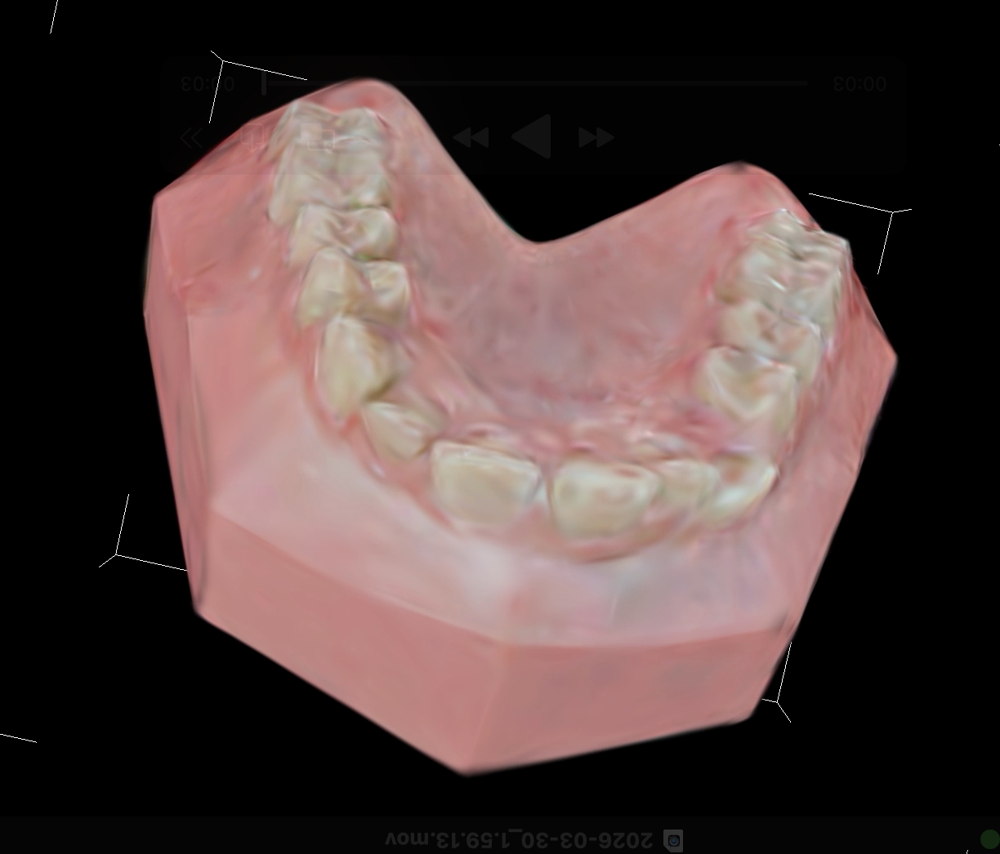 | 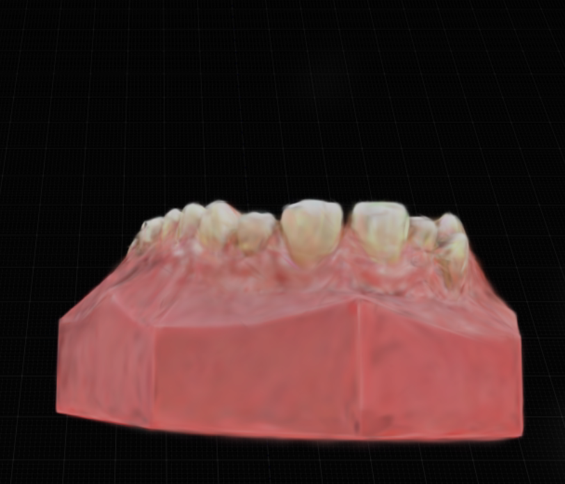 |
| 2 | 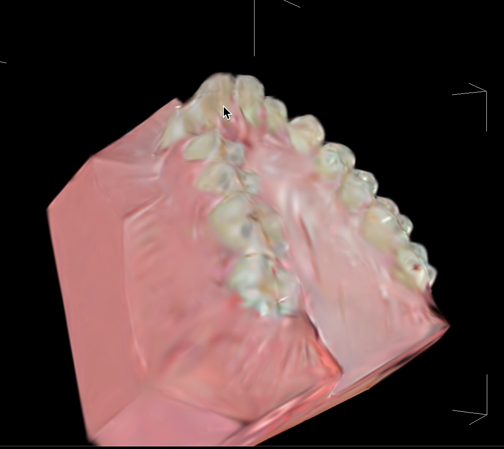 | 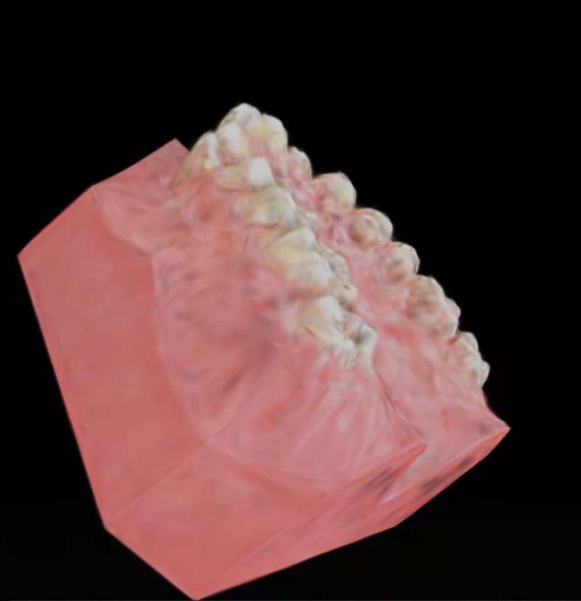 |
| 3 | 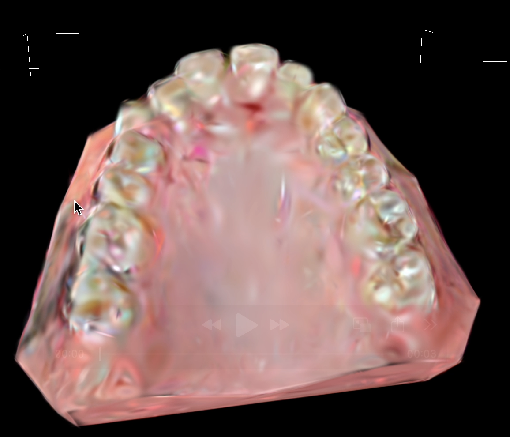 | 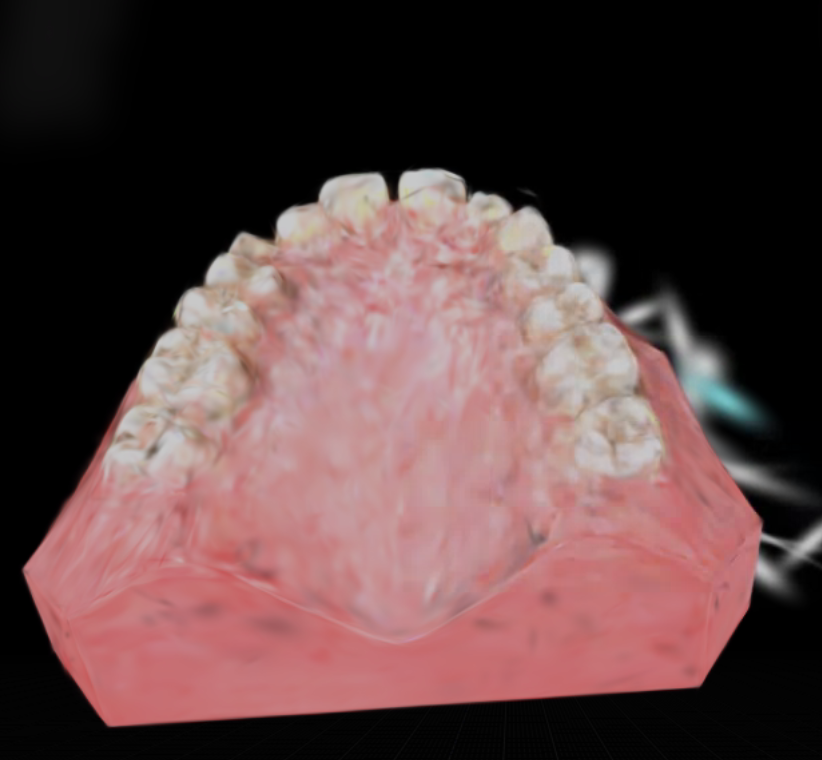 |
| 4 | 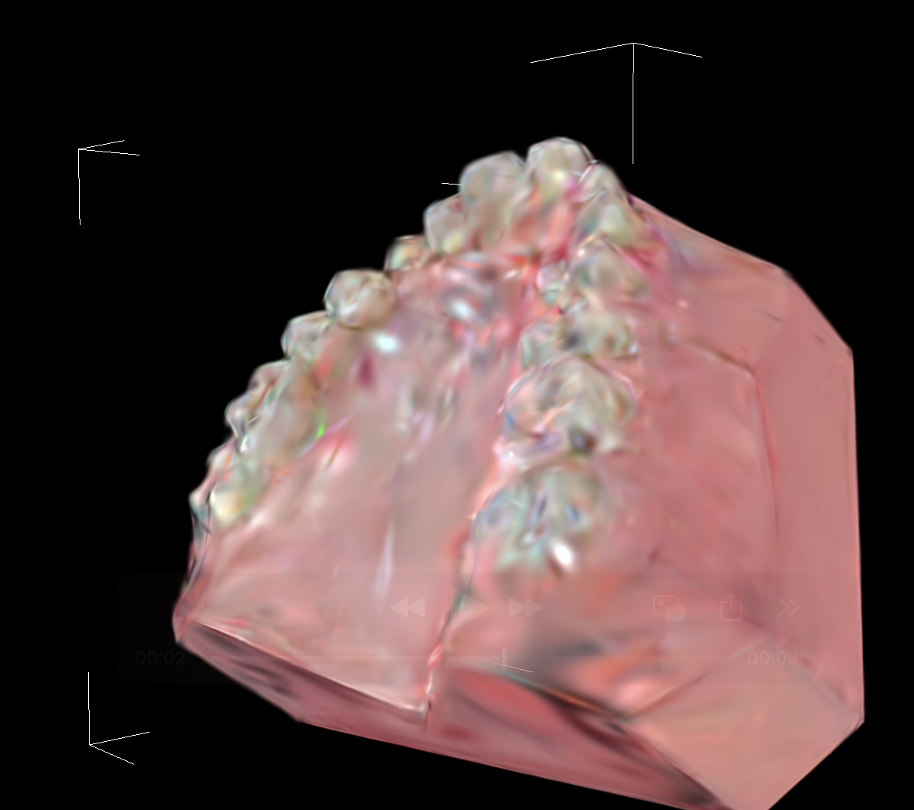 | 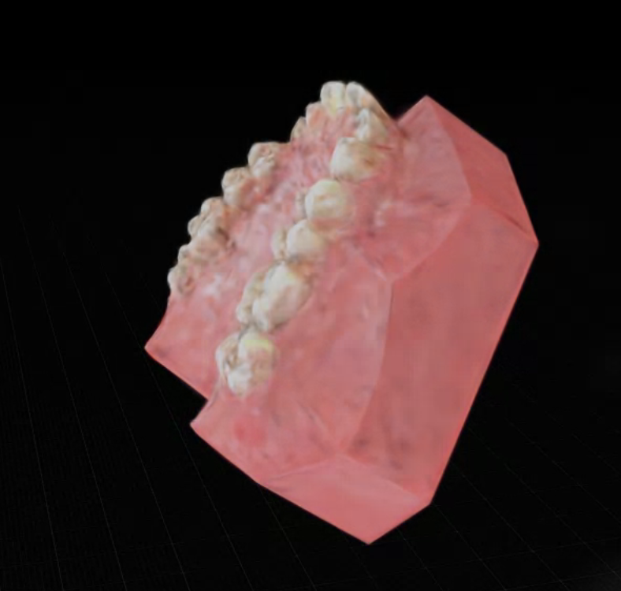 |

## 4. 추후 계획
- 위 비교 표에서 오리지널 GS는 mesh constraint 되어있는거고, wild GS는 일단 기본 설정값 그대로 적용한거라 적용 안되어있음 depth map 활용과 mesh constraint 적용 wild GS에도 해봐야 함.
- wild-nerf에서 GS를 돌려보기 위한 사진을 뽑아야하는데 몇장이 적절한지 탐구 후 사진 뽑고 GS에 넣어보기
