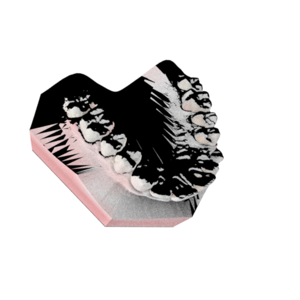
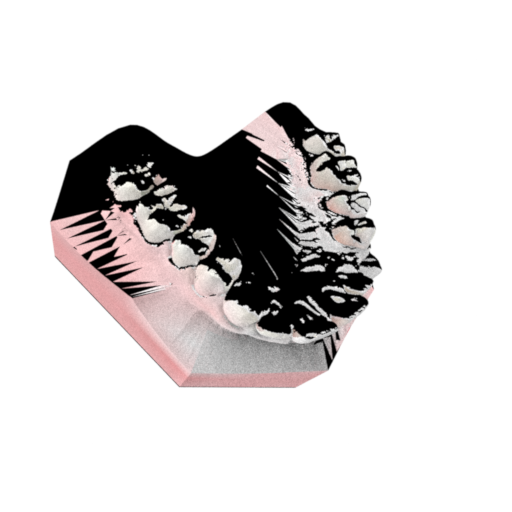
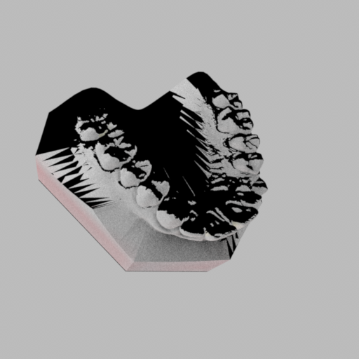

# Mitsuba Single-view Inverse Rendering Test

## 0. 환경 및 데이터 준비
- 데이터셋 정렬 완료
- 환경 + 데이터 준비 완료
- 치아 mesh + UV를 scene으로 로드, 기본 렌더링 확인 완료
- Reference viewpoint에서 렌더링 vs reference 시각 비교 완료

---

## 1. 실험 목적
single lighting으로 렌더링한 이미지 한 장을 target으로 두고,  
single-view 기준 inverse rendering 파이프라인이 정상적으로 동작하는지 확인

---

## 2. Albedo-only Optimization

- albedo만 최적화 수행

**결과**
- loss가 초반에만 감소하고 이후 plateau
- target을 충분히 재현하지 못함

**해석**
- target 이미지에 shading / specular 성분이 포함되어 있어  
  albedo만으로는 설명 불가능한 상태

*iter: 2000  
*lr: 0.002  
*loss: iter0 = 0.685596 → iter2000 = 0.677100  

---

## 3. Albedo + Roughness + Specular Optimization

- material parameter 확장하여 최적화 수행

**결과**
- roughness가 상한값으로 수렴
- specular는 일부 경우 거의 반영되지 않거나, 경계값으로 수렴
- loss 감소는 제한적

**해석**
- optimizer가 실제 material을 찾기보다  
  loss를 줄이기 쉬운 boundary solution으로 수렴
- single-view + 현재 lighting 조건에서 material decomposition이 불안정
- roughness: 0.4 → 1.0, specular: 0.5 → 1.0 (경계값으로 수렴)

*iter: 2000  
*lr: 0.001  
*loss: iter0 = 0.685915 → iter2000 = 0.669063  

---

## 4. Lighting 조건 변경 실험

다음 조합으로 테스트:
- constant emitter(2, 3번에서 constant emitter로 진행)
- ambient + point light

**결과**
- material fitting은 여전히 불안정

**해석**
- lighting 조건이 일부 영향은 있으나  
  현재 문제의 핵심 원인은 material + target mismatch로 판단

*iter: 2000  
*lr: 0.001  
*loss: iter0 = 0.335660 → iter2000 = 0.324213  

---

## 5. 현재 결론

- single-view에서도 material parameter가 안정적으로 추정되지 않음
- 특히 roughness/specular가 경계값으로 몰리는 현상 지속

single-view에서도 material parameter가 안정적으로 추정되지 않는 상태라서 바로 multi-view로 넘어가기보다는, single-view에서 설정을 먼저 안정화해야 하는 단계로 보고 있음

