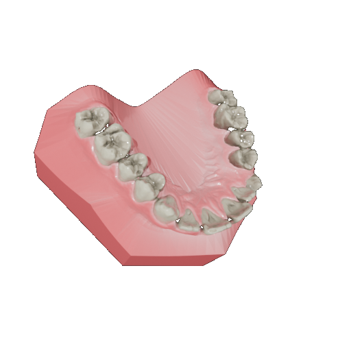
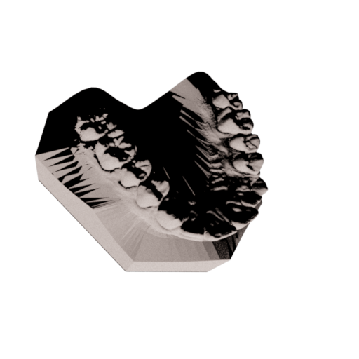
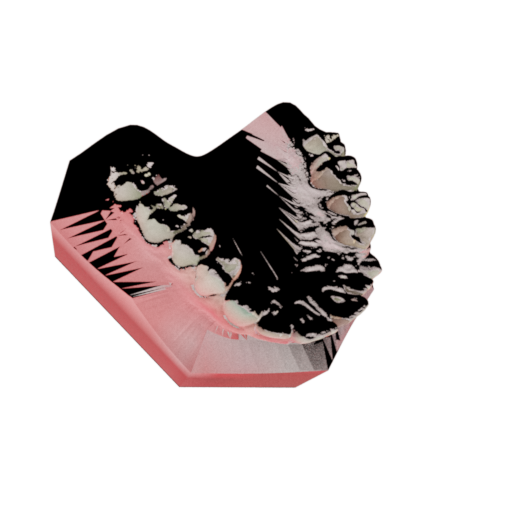
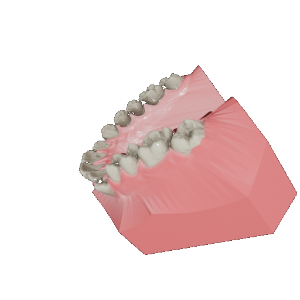
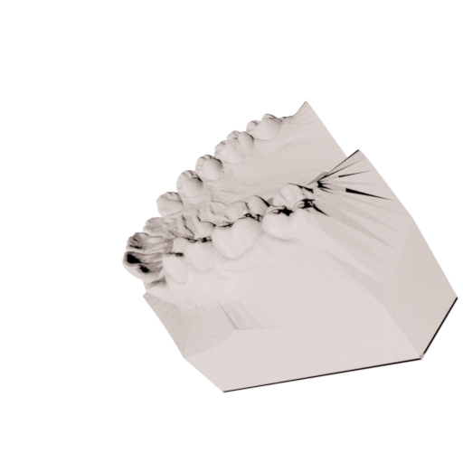
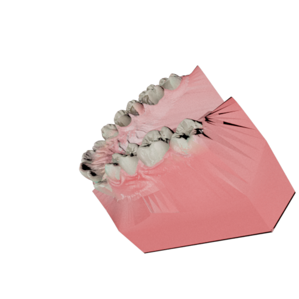

1. 블렌더 (target 이미지) 의 채널 (RGBA?). 그리고 mitsuba (src 이미지) 의 채널 (RGB?) 확인 => 둘 다 RGB로 받고 있었음, 해당 부분 RGBA받도록 수정 완료
2. loss 계산 시 배경 제외하고 geometry 영역만 mask하여, masked L1 loss 수행하도록 수정 완료
3. 파이프라인(블렌더)과 동일한 lighting 사용 완료
- 블랜더 : 
    - **SUN light** `energy=5`, `light_obj.parent = cam_obj` → 카메라와 함께 움직이는 directional light (front-lit)
    - `cycles.max_bounces = 8`
    - World 배경: Blender default (매우 낮은 ambient)
- Mitsuba 대응 : 
    ```python
    # 카메라 방향 = (target - origin).normalized()
    light_dir = (target - origin) / ||target - origin||

    'sun': {
        'type': 'directional',
        'direction': light_dir,
        'irradiance': {'type': 'spectrum', 'value': 5.0}
    }
    'integrator': {'type': 'prb', 'max_depth': 8}
    ```
    - World Ambient 1.0으로 설정(Blender denoiser + Filmic 톤매핑이 그림자를 물리값보다 밝게 표현하므로 보정)

4. 톤메퍼 Reinhard 사용(Reinhard + sRGB encode하면 색이 쨍하게 나옴, 품질 저하(loss에서 밝은 치아 영역의 gradient가 감마 커브로 압축되어서 라고 예측))
5. sRGB Gamma 처리는 이미지 저장 시 진행

## 결과

| Image | Mitsuba Rendering | Inverse Rendering |
| --- | --- | --- |
|  |  |  |
|  |  |  |

의문 : 그림자 부분은 렌더링 안됨 UV에 따라 렌더링되어 자연스러운 현상인건지 아니면 lighting 문제인건지, 아니면 다른 문제가 있는건지 확인 필요