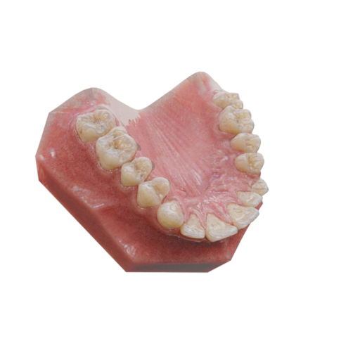
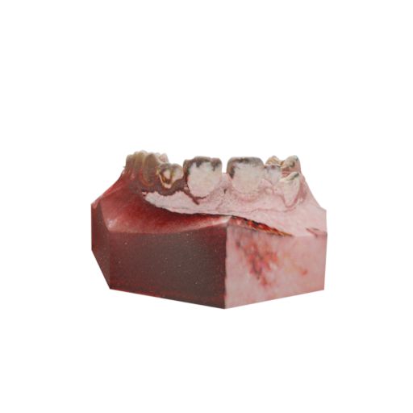

## Multi-view Texture Filling Pipeline

1. Nanobanana로 single-view 이미지 생성 (lighting 포함)
2. inverse rendering으로 texture 추출 (UV 매핑)
3. unseen view에서 비어있는 영역 확인
4. 기존 영역 mask 후 nanobanana로 추가 생성
5. 다시 inverse rendering → 반복

## Issue: Shading으로 인한 Multi-view 불일치

첫 번째 view에서 생성된 결과가 lighting을 포함하고 있어  
inverse rendering 이후에도 shading 정보가 texture에 남아 있음  

| Reference View | New View |
| --- | --- |
|  |  |

→ 다른 view에서 보면  
- 비어있는 영역뿐 아니라  
- 이미 채워진 영역에도 view-dependent shadow 존재  

## 문제

현재 구조는 `view-dependent appearance`를 그대로 texture로 사용하는 방식이라  

- 기존 영역: 이전 view 기준 shading  
- 새 영역: 현재 view 기준 shading  

→ 경계에서 불일치 발생  
→ 자연스럽게 이어지지 않음  
단순 hole filling 문제가 아니라, texture 자체가 inconsistent한 상태

## 고려 방향

1. shading 제거 후(albedo 기반) 채우기  
2. 기존 영역 포함 전체 texture 재생성  
3. multi-view를 동시에 고려한 생성  

=> 점진적으로 옆으로 돌리며 생성