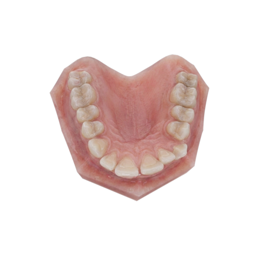
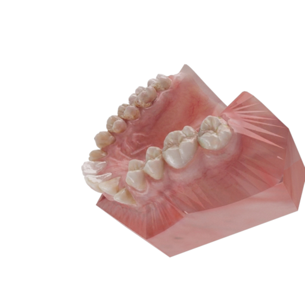
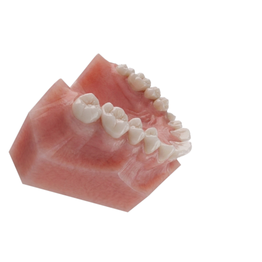
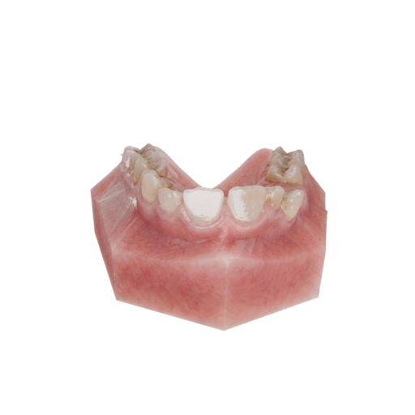
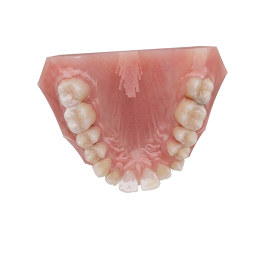
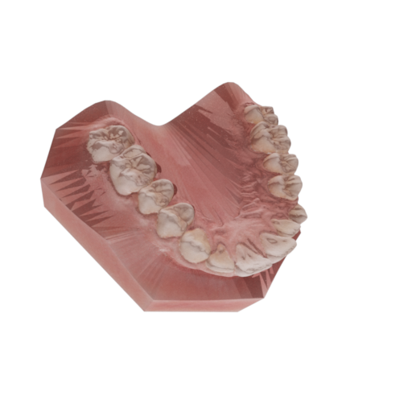
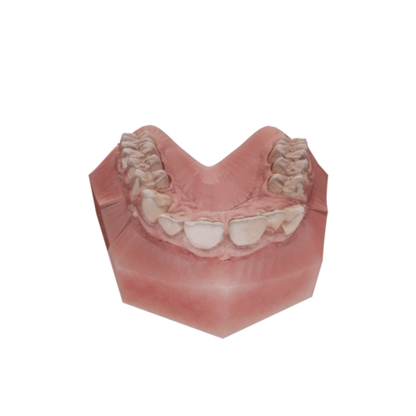
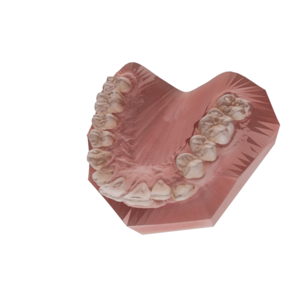

2026-04-22
회의내용 정리, 보고

1. 나노바나나는 버전 선택 불가 → qwen, flux 등 대체 오픈소스 검토
2. PBR 분리(albedo/roughness/metallic) 시
→ Mitsuba 기반 physically-based inverse rendering 필요 (비용 증가)
→ Blender 결과는 렌더러 불일치로 신뢰 어려움
→ Mitsuba 최적화 결과를 Mitsuba 렌더 기준으로 평가 후 추가 논의
3. i2i는 기존 유지 + hole만 채우는 용도 → 반드시 mask 기반으로 제한
4. Shading baked 결과 기반 global optimization 수행 (5 views)
- 현재: 이미지 평균 기반 bake (단순 평균)

| input view1 | input view2 | input view3 | input view4 | input view5 |
| --- | --- | --- | --- | --- |
|  |   |   |   |   | 

| result view1 | result view2 | result view3 |
| --- | --- | --- |
|  |   |   |
*mitsuba에서 렌더링한 결과

- 변경해야할 부분: shading bake를 inverse rendering으로 수행 (unlit 최적화) 
- 즉, inverse rendering을 albedo 추출이 아니라 픽셀 색 자체를 직접 최적화하는 방식으로 전환

정리하자면, shading bake는 inverse rendering(unlit)으로 수행하고, i2i는 기존 결과 유지 + hole만 채우는 용도로 mask 기반으로 제한, 이후 inverse rendering 결과 기준으로 global optimization을 수행할지, 기존 평균 기반 bake 결과로 수행할지 추가 확인 필요, 그리고 i2i는 qwen, flux 등 대체 오픈소스 검토.