# Euclidean distance 기준 → Viewing direction 방향 depth 기준

## 기존 문제
- 기존 Z-buffer Visibility 구현에서는 `expected_depth`를 camera origin에서 texel 위치까지의 Euclidean distance로 계산. 즉, camera에서 texel까지의 직선 거리 기준
- 하지만 렌더링에서 depth 판정은 fragment와 camera origin 사이의 직선 거리가 아니라, camera viewing 축 방향의 depth 기준으로 이루어져야 함
- 기존 방식은 `sampled_depth`와 `expected_depth`를 Euclidean/ray distance 기준으로 비교했기 때문에, 렌더링 depth 판정 기준인 camera viewing 축 방향 depth와는 다른 기준을 사용한 상태였음
- 이로 인해 측면이나 depth 변화가 큰 영역에서 reject 결과가 의도와 다르게 나타날 가능성 존재

---

## 수정 방향
- `expected_depth`와 `sampled_depth`를 모두 camera viewing 축 방향 depth 기준으로 변경. 
- camera center에서 point까지의 직선 거리가 아니라 camera-space view-axis depth를 기준으로 비교.

---

## 구현 변경

#### Depth visibility 판정 방식
- `sampled_depth`: projected coordinate `(px, py)`에서 camera viewing 축 방향 depth map을 sampling한 값. 해당 screen 위치에서 renderer가 실제로 보고 있는 표면의 camera viewing 축 방향 depth
- `expected_depth`: 현재 texel이 해당 view에서 보인다면 가져야 하는 camera viewing 축 방향 depth 값
- `cond_depth`: 현재 texel이 해당 screen 위치에서 실제로 보이는 표면과 depth 기준으로 일치하는지에 대한 판정 값

```
cond_depth = abs(sampled_depth - expected_depth) <= depth_eps
```

#### 1. `expected_depth` 계산 기준 변경
- 기존에는 camera origin에서 texel 위치까지의 Euclidean distance를 `expected_depth`로 사용
- 즉, texel과 camera center 사이의 직선 거리 기준
- 수정 후에는 texel의 3D 위치를 camera space로 변환한 뒤, camera viewing 축 방향의 depth를 `expected_depth`로 사용
- 현재 projection convention에서는 camera 앞쪽을 `z_cam < 0`으로 판단하므로, positive depth 값은 `-z_cam`으로 계산

#### 2. `sampled_depth` 계산 기준 변경
- 기존 AOV의 `dd.y:depth`는 camera center에서 fragment까지의 Euclidean/ray distance에 가까운 값이므로, camera viewing 축 방향 depth와 기준이 다를 수 있음
- 수정 후에는 AOV `pos:position`으로 screen pixel에서 실제 hit된 world position을 얻음
- 해당 world position을 camera space로 변환한 뒤, `-z_cam`을 사용해 camera viewing 축 방향의 `sampled_depth`를 계산

#### 3. depth 비교 기준 통일
- 현재 depth visibility에서는 `sampled_depth`와 `expected_depth`가 모두 camera-space view-axis depth 기준
- 즉, 두 값 모두 Euclidean/ray distance가 아니라 camera viewing 축 방향 depth
- 따라서 depth 비교는 렌더링 depth 판정과 같은 camera viewing 축 방향 depth 기준 안에서 수행

#### 4. 최종 visibility 조건 유지
- depth visibility의 최종 조건 구조는 기존과 동일하게 유지
- 단, 비교하는 depth 값의 기준만 Euclidean/ray distance에서 view-axis depth로 변경
- 현재 조건은 `abs(sampled_depth - expected_depth) <= depth_eps`일 때 해당 texel을 현재 view에서 visible한 것으로 판단

---

## 결과

| view | pre render | Gemini | post render |
| --- | --- | --- | --- |
| view1 | 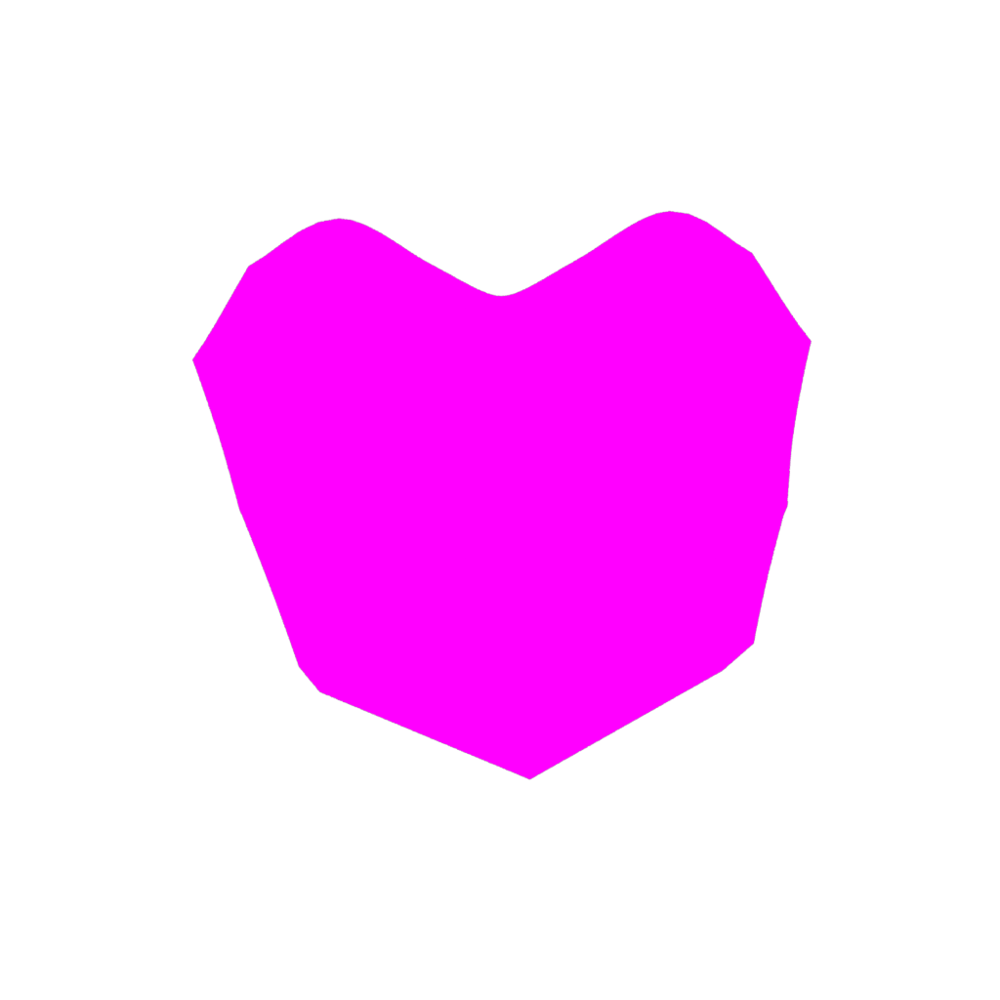 |  |  |
| view2 | 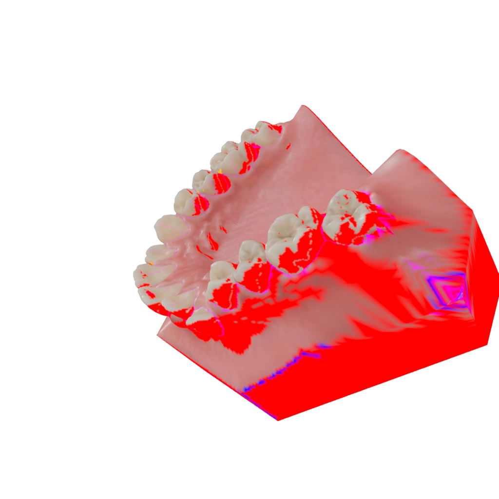 |  |  |
| view3 | 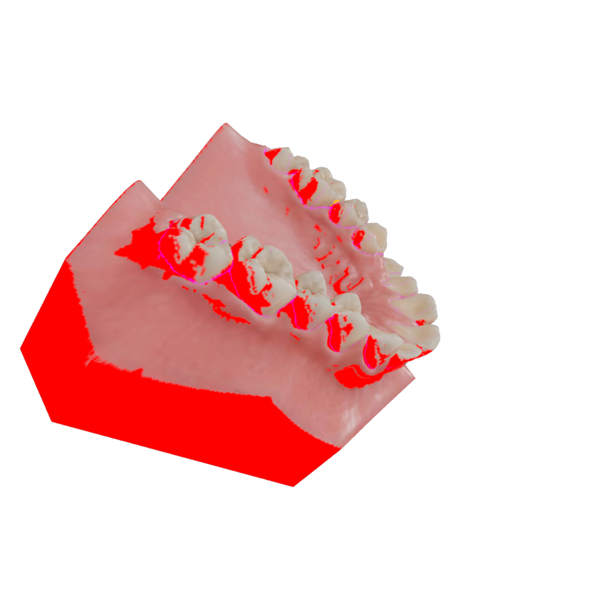 |  |  |
| view4 | 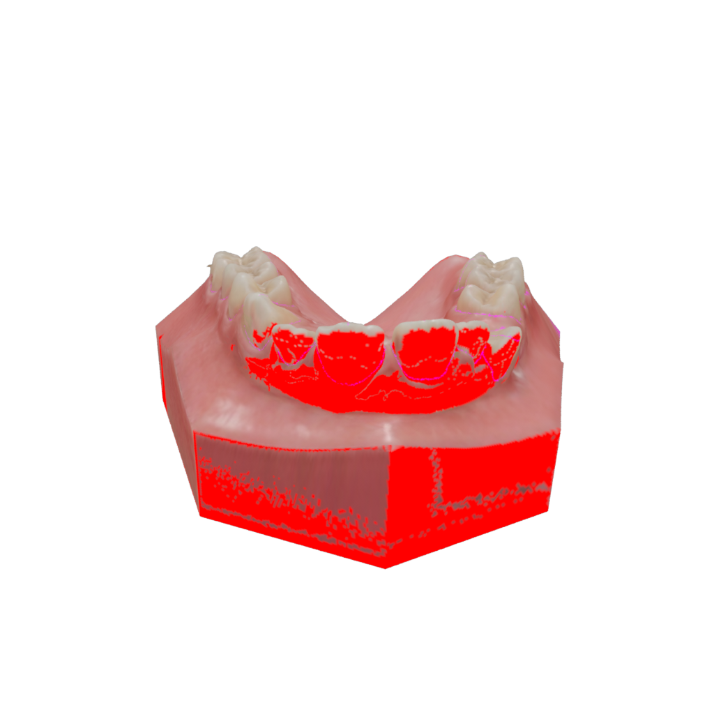 |  | 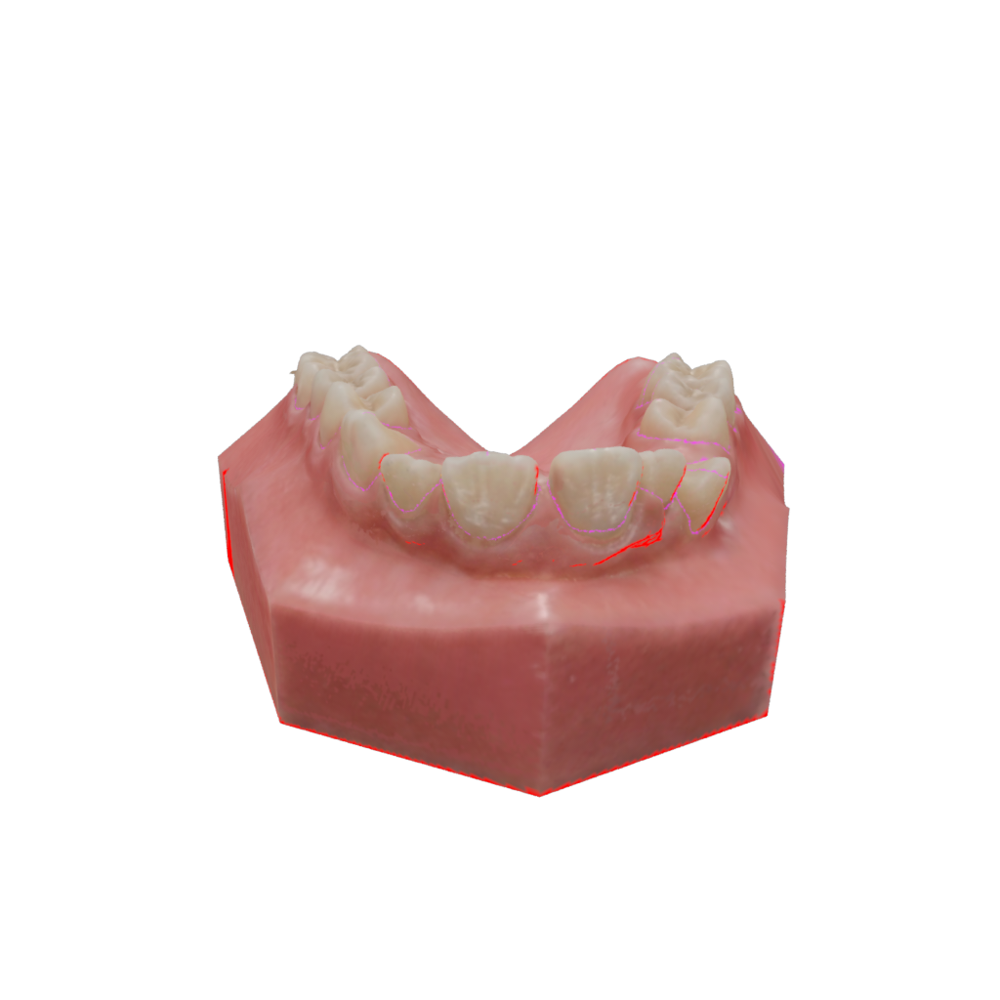 |
| view5 | 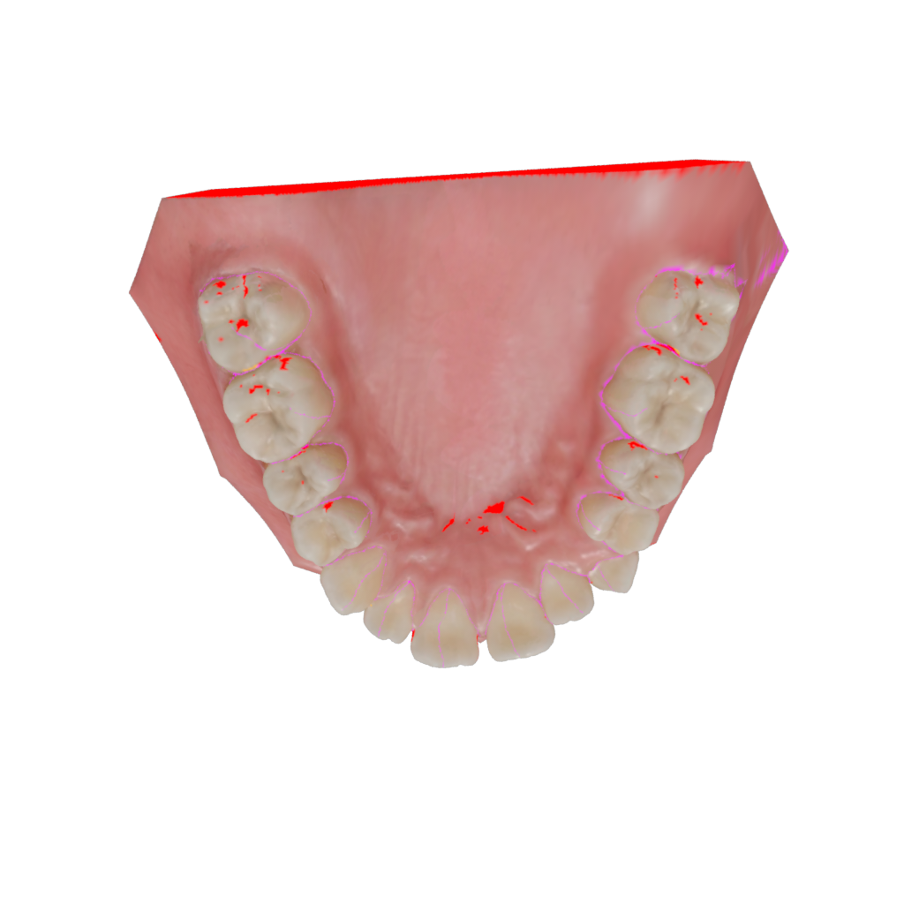 |  |  |


---

## 기존 방식(Euclidean/ray distance 기준)과 현재 방식(viewing direction 방향 depth 기준) 비교

| 방식 | view1 | view2 | view3 | view4 | view5 |
|---|---|---|---|---|---|
| 기존 방식 |  |  |  |  |  |
| 현재 방식 |  |  |  |  |  |


---
## 남아 있는 red reject 영역 UV 확인
- Viewing direction 방향 depth 기준으로 수정한 후에도 view1, view3에서 일부 red reject 영역이 남음
- 해당 영역이 실제 occlusion/back-side인지, cliff/grazing 영역인지, 또는 UV seam/경계 관련 영역인지 확인 필요

| view1 | red reject 영역 | UV 영역 확대 | UV 색 확인 |
|---|---|---|---|
|  | 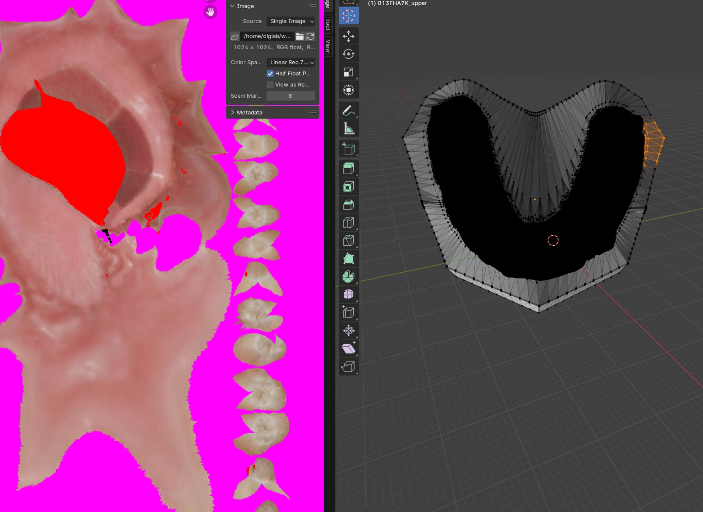 | 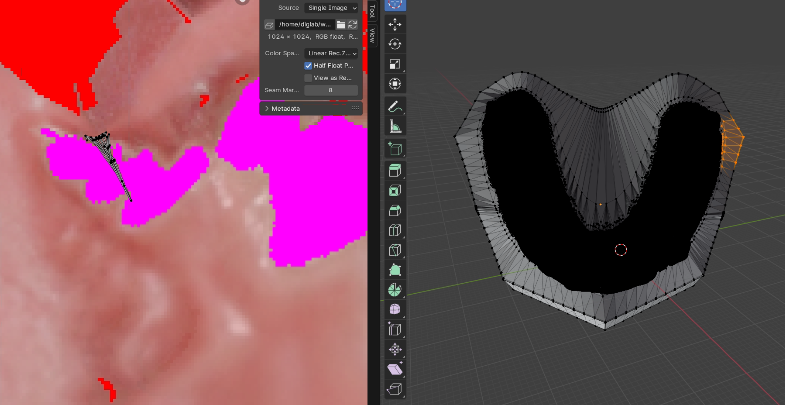 | 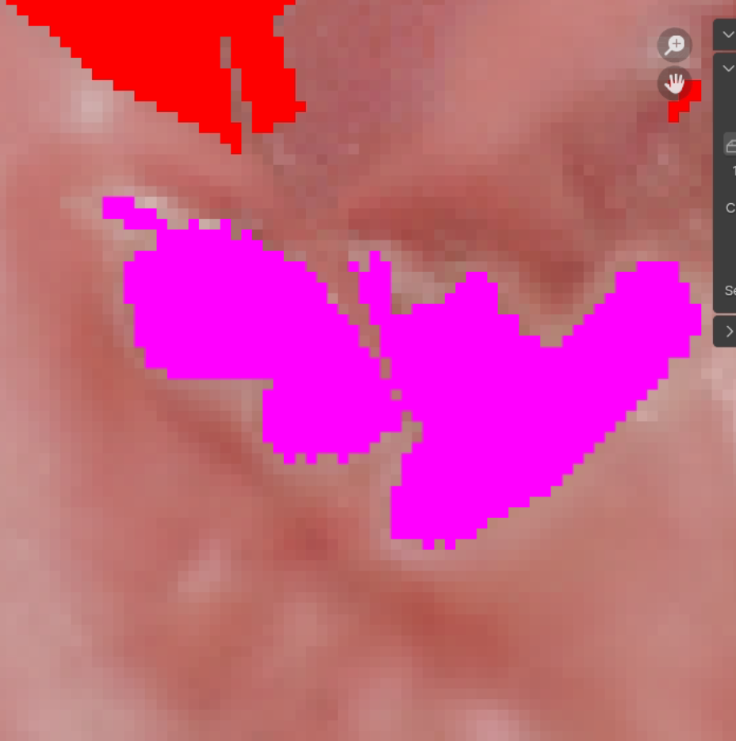 |

- reject 영역이 UV 상에서 비교적 작은 영역에 몰려 있음


| view3 | red reject 영역 | UV 영역 확대 | 인접한 back-facing triangle의 UV 위치 |
|---|---|---|---|
|  | 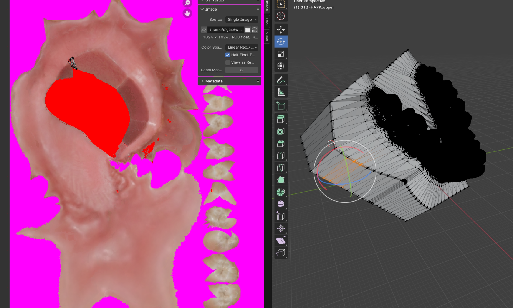 | 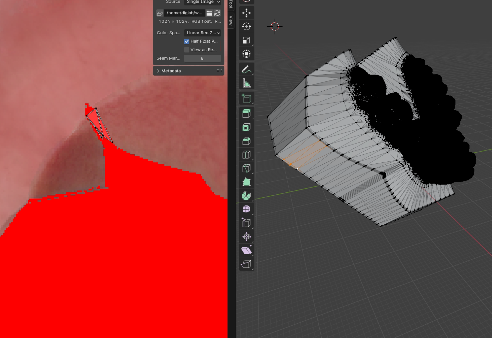 | 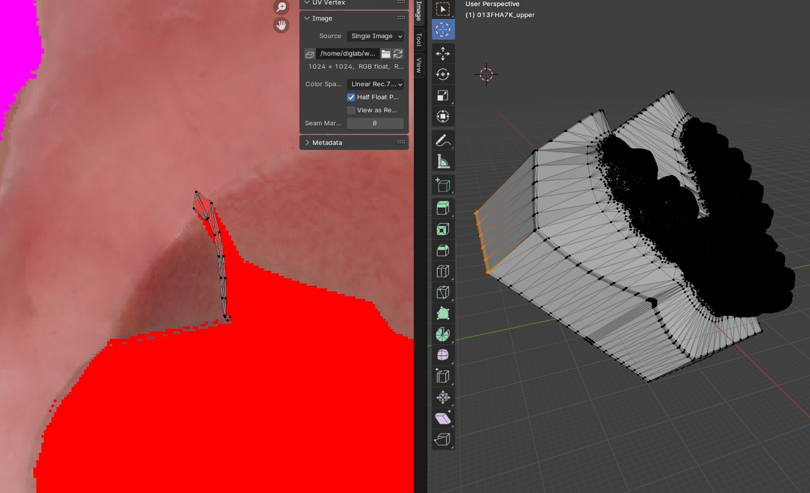 | 

- triangle overlap이 일부 존재