# Semantic Segmentation Conditioning Test

nano banana에 Semantic segmentation map을 추가 입력으로 제공했을 때, 치아-잇몸 경계 유지 및 hole 주변 geometry consistency가 개선되는지 확인하였다.

---

## 1. Frontal View (Zero-shot)

- Input:
  - lit image
  - tooth/gum segmentation map

| Lit Image | Segmentation | With Segmentation | Boundary Overlay | Without Segmentation | Boundary Overlay |
|---|---|---|---|---|---|
| 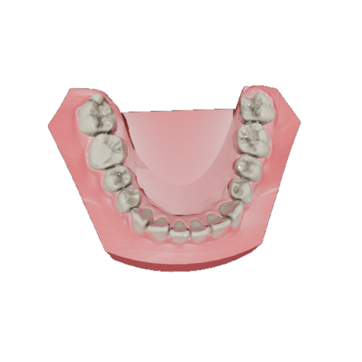 | 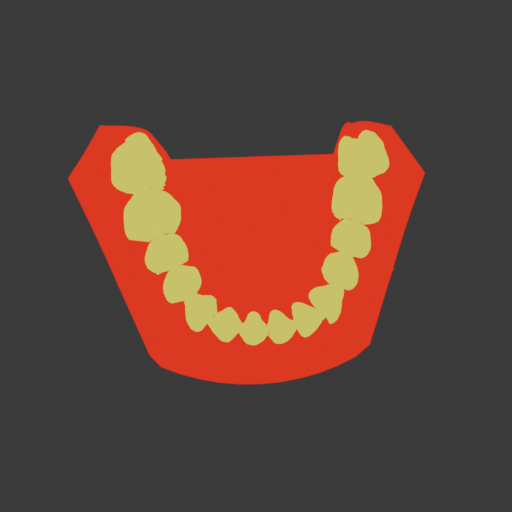 | 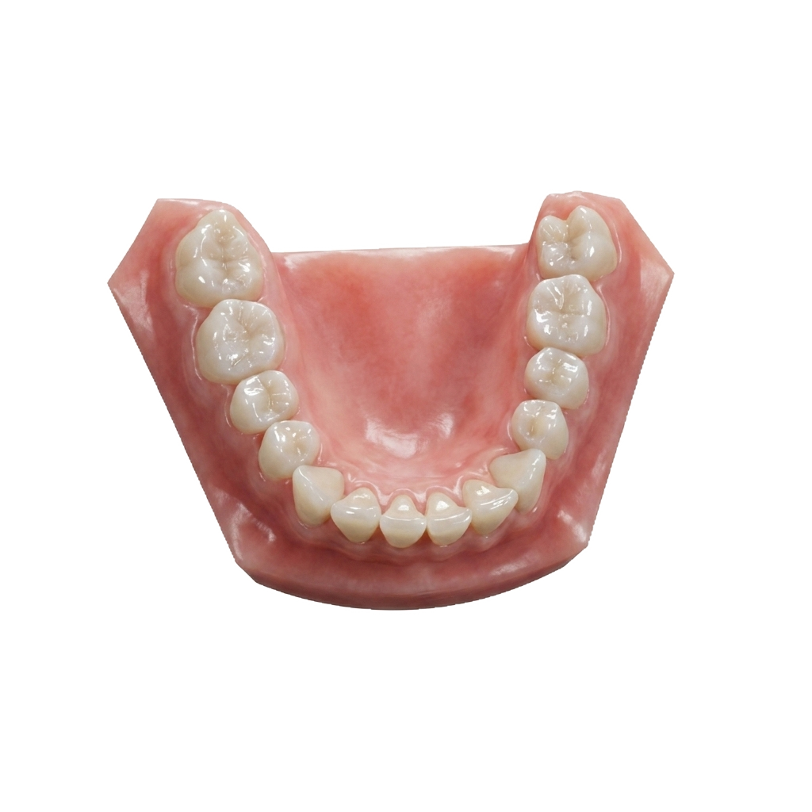 | 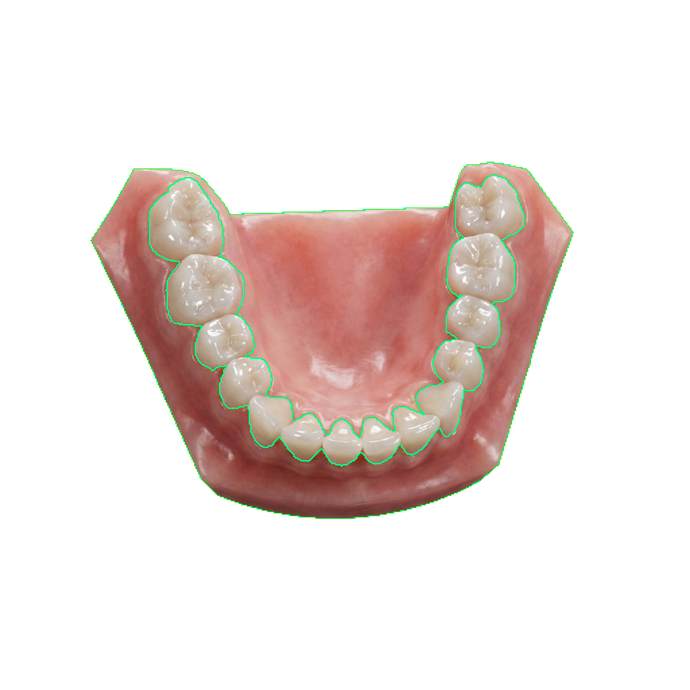 | 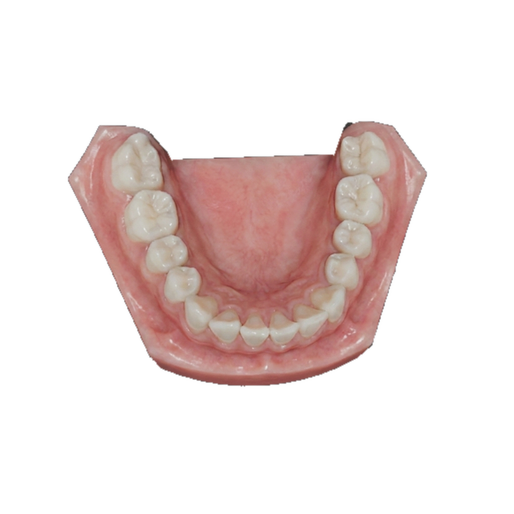 | 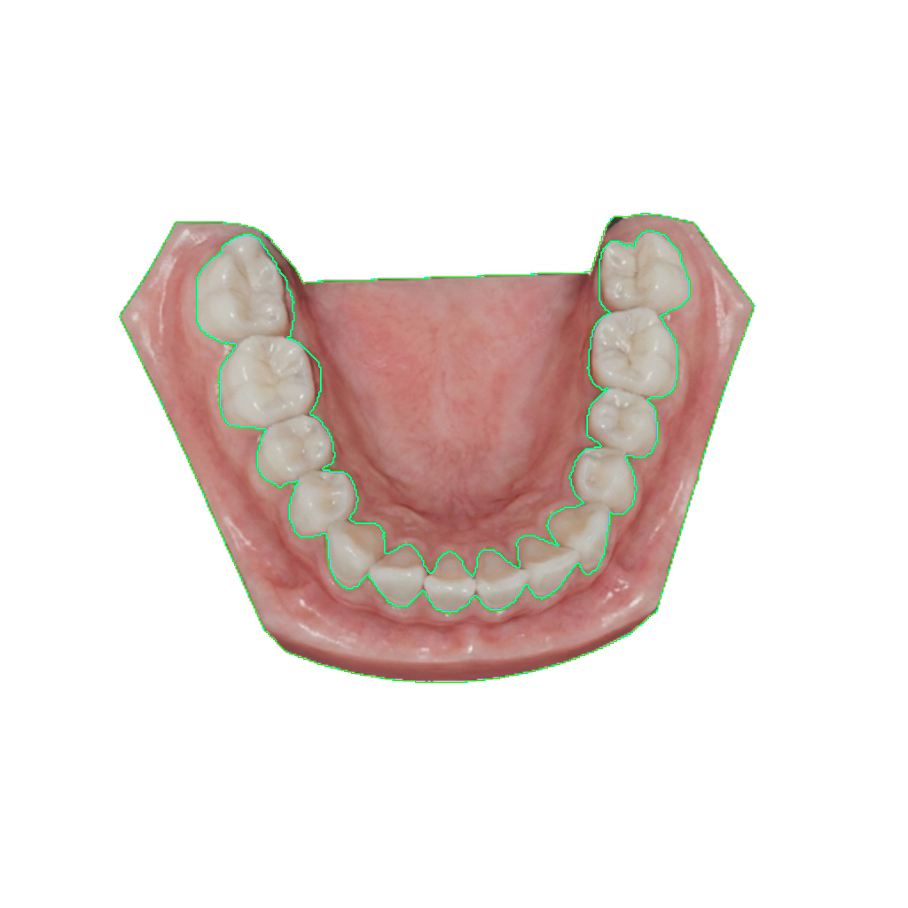 |

---

## 2. Side View with Hole Region

- Input:
  - hole region 포함된 측면 뷰
  - tooth/gum segmentation map

| hole region Image | Segmentation | With Segmentation | Boundary Overlay | Without Segmentation | Boundary Overlay |
|---|---|---|---|---|---|
| 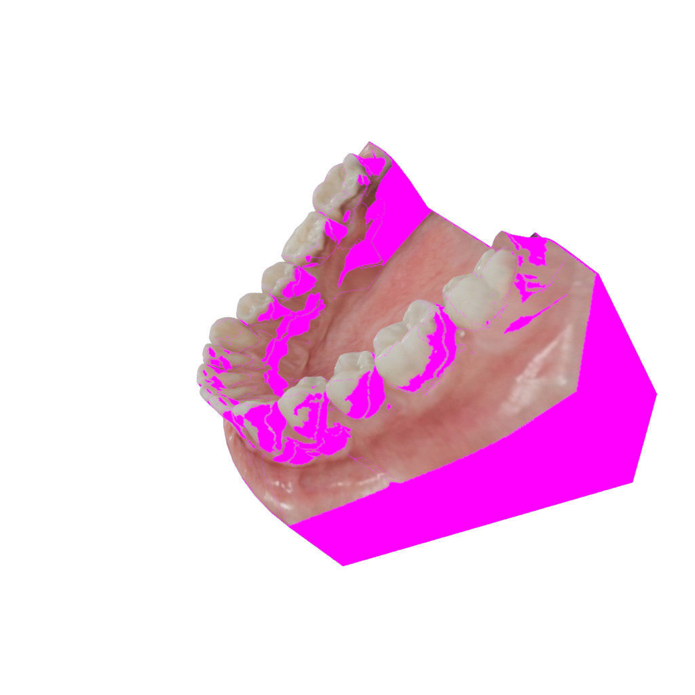 | 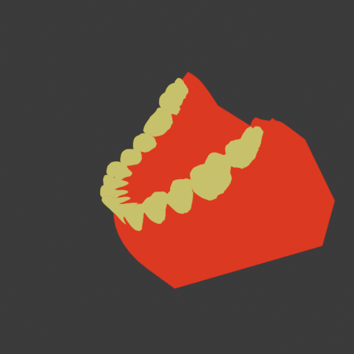 | 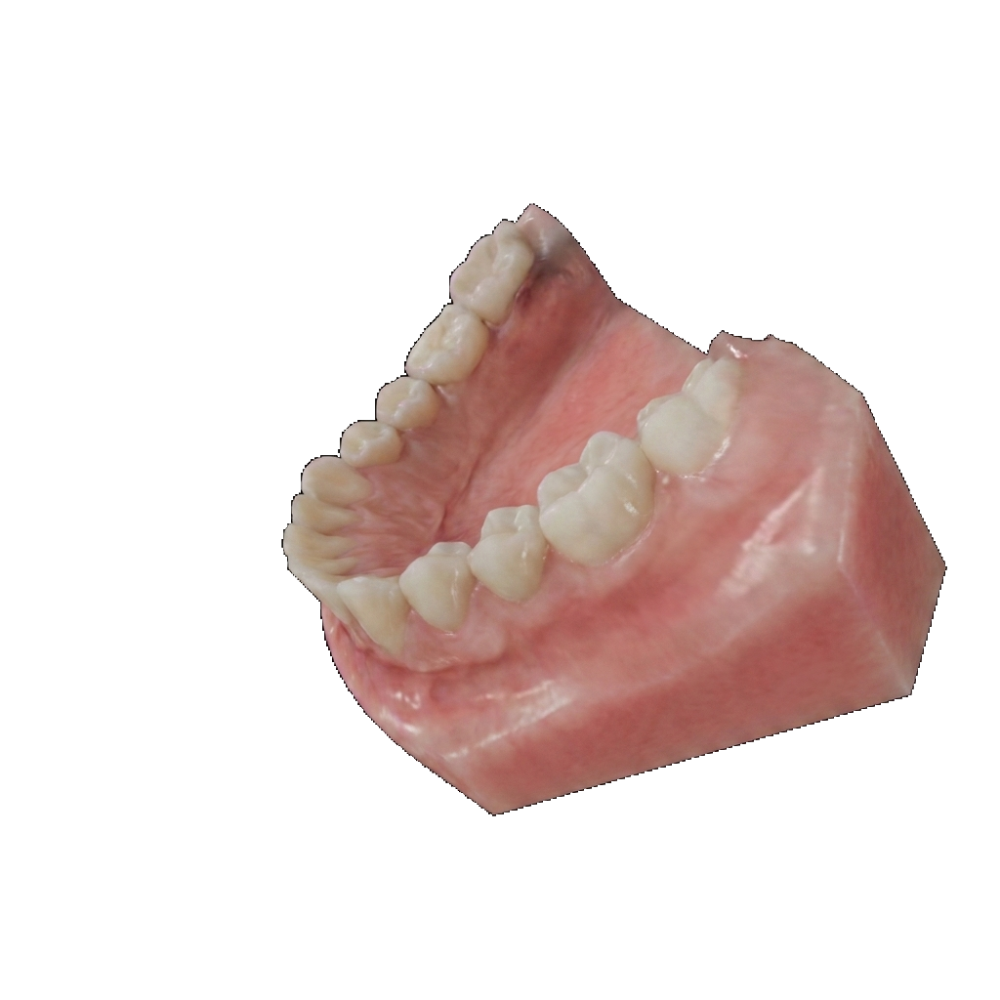 | 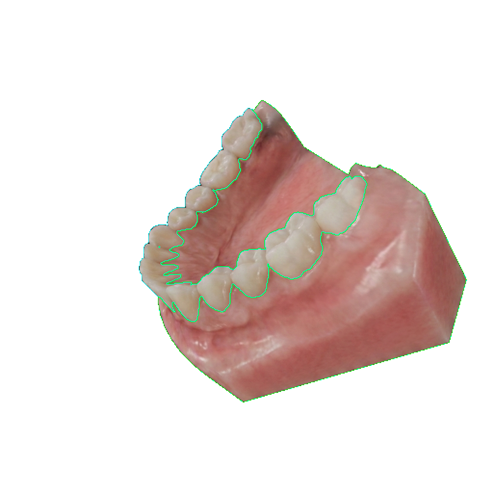 | 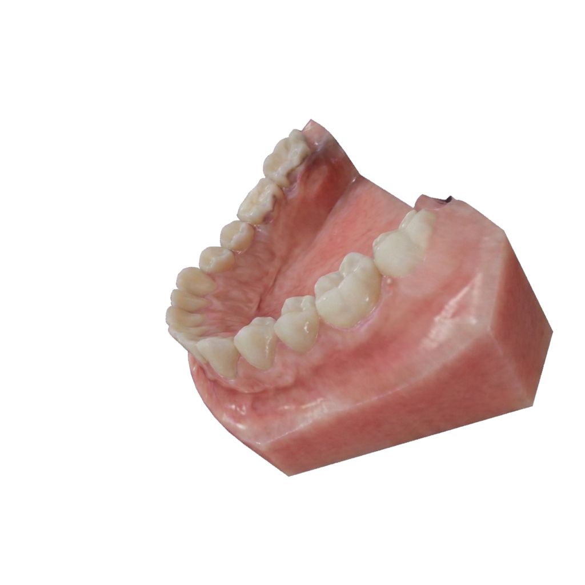 | 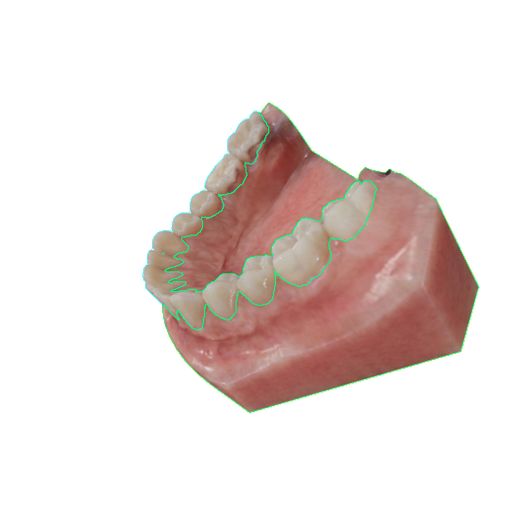 |

