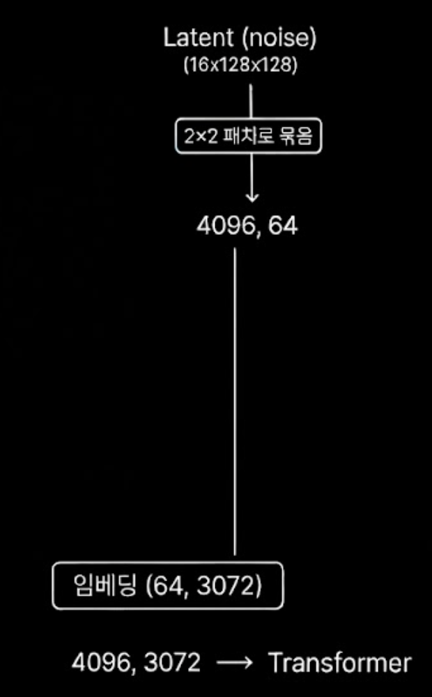
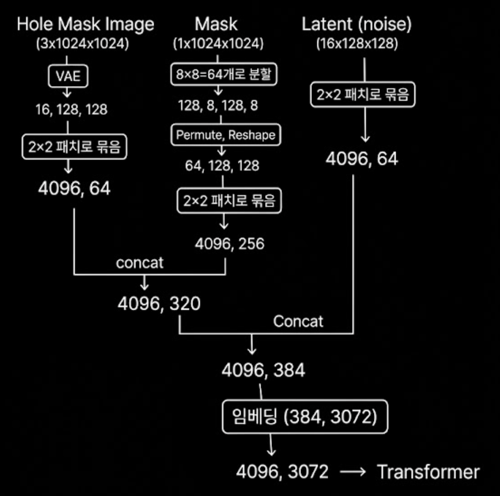

flux-Fill에서 홀을 작게 주면 안되는데, 그 이유와 기준 판정을 위한 flux-fill 구조 파악

## 기본 flux 구조 vs flux fill구조
<table>
<tr>
  <th>기본 Flux</th>
  <th>Flux Fill</th>
</tr>
<tr>
  <td></td>
  <td></td>
</tr>
</table>

임베딩 레이어만 다르고 결국 transformer에 들어가는 입력 구조는 동일.  


## mask가 공간 정보를 다 담는 이유

mask(1×1024×1024)와 latent(128×128 토큰)의 공간 해상도를 맞추기 위해  
**space-to-depth** 변환으로 8×8 픽셀 블록을 64채널로 재배열.  

```
mask: 1 × 1024 × 1024
    ↓  view(B, H/8, 8, W/8, 8) → permute → reshape   (space-to-depth)
    →  64 × 128 × 128    (채널 64개 = 8×8 픽셀)
    ↓  2×2 패치 묶음
    →  4096, 256
```

### space-to-depth (block_size=2 예시)

공간의 s×s 블록을 s² 채널로 변환하는 연산. 해상도는 1/s²로 줄고, 채널은 s²배 늘어남.  

원본의 각 블록이 토큰 1개로 대응되고, 블록 내 픽셀들이 채널로 들어감:  

```
원본 (| = 블록 경계):    각 블록 → 토큰 1개, 픽셀 4개가 채널로:
a b | c d               토큰(0,0): [a, b, e, f]   ← [0:2, 0:2]
e f | g h               토큰(0,1): [c, d, g, h]   ← [0:2, 2:4]
─────────               토큰(1,0): [i, j, m, n]   ← [2:4, 0:2]
i j | k l               토큰(1,1): [k, l, o, p]   ← [2:4, 2:4]
m n | o p
```

토큰 (i,j)에는 정확히 **픽셀 블록 [i×s:(i+1)×s, j×s:(j+1)×s]** 의 값만 포함. (s = block_size)  
Flux Fill은 s=8이므로 채널 64개 = VAE latent (i,j)와 동일한 픽셀 블록 [i×8:(i+1)×8, j×8:(j+1)×8] 담당.  


## vae와 mask공간 불일치가 살짝 있어도 괜찮은 이유
latent (i, j)의 receptive field:  
  ← 픽셀 (i×8, j×8) 중심이지만 경계가 흐릿하게 번짐  
  ← 인접 블록의 픽셀도 일부 영향  
  
마스크 view의 block partition:  
  ← 픽셀 [i×8:(i+1)×8, j×8:(j+1)×8] 딱 잘라서 hard 경계  

```
실제 VAE latent (0,0):        마스크 view (0,0):  
┌──────────────────┐          ┌────────┐   
│  ░░░░░░░░        │          │████████│  ← 정확히 8×8만    
│  ░████░░░        │          │████████│    
│  ░░░░░░░░        │          └────────┘    
└──────────────────┘    
   ↑ receptive field가  
     블록 경계 너머로 번짐  
```

불일치가 허용되는 이유  
1. 오차 미미: stride 자체는 8이라 (i,j)의 중심 기여도는 [i×8, j×8] 근방 픽셀이 압도적. 경계 번짐은 주변 몇 픽셀 수준.  
2. 학습된 보정: Flux Fill은 처음부터 이 불일치가 있는 상태로 파인튜닝. transformer가 "mask (i,j)와 latent (i,j)가 완벽히 같은 영역을 가리키지 않는다"는 걸 통계적으로 학습.  


## 홀을 작게 주면 안 되는 이유와 기준

### 이유

mask는 **8×8 픽셀 = latent 1토큰** 단위 처리.  
홀이 n×n 픽셀이면 마스크된 latent 토큰 수는 대략 `(n/8)²`개.  

홀이 작을수록 두 가지 문제 발생:  

1. **VAE 희석**: VAE receptive field가 경계 너머로 번지기 때문에, 홀이 작으면 latent에서 "완전히 마스크된" 토큰이 거의 없고 경계 토큰만 잔존. 모델이 채워야 할 영역이 latent space에서 미표현.  

2. **Transformer context 부족**: transformer는 마스크된 토큰들이 주변 4096개 토큰과 attention하면서 inpainting 수행. fill 대상 토큰이 극소수이면 공간적 일관성 확보에 불리한 조건.  

### 기준

| 홀 크기 (픽셀) | 마스크된 latent 토큰 수 | 판정 |
| ------------- | ---------------------- | ---- |
| < 8×8         | 0~1개                  | 사실상 마스크 부재 |
| 8×8 이상      | —                      | 실험으로 확인 필요 |
