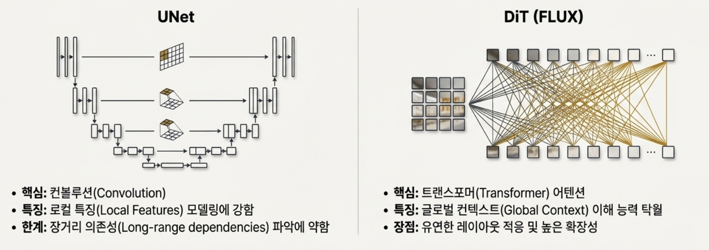
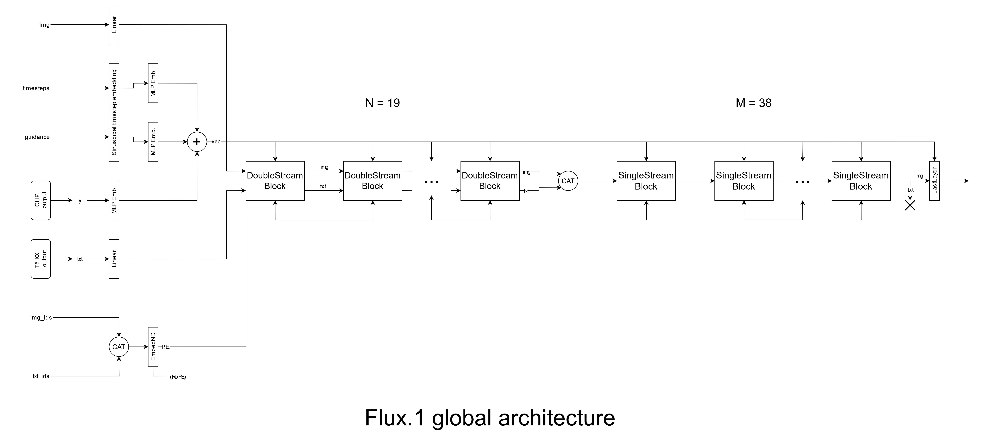
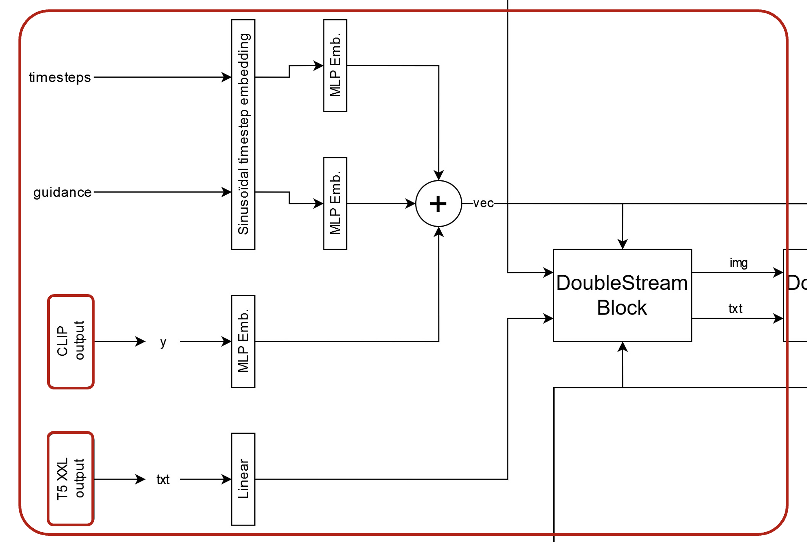
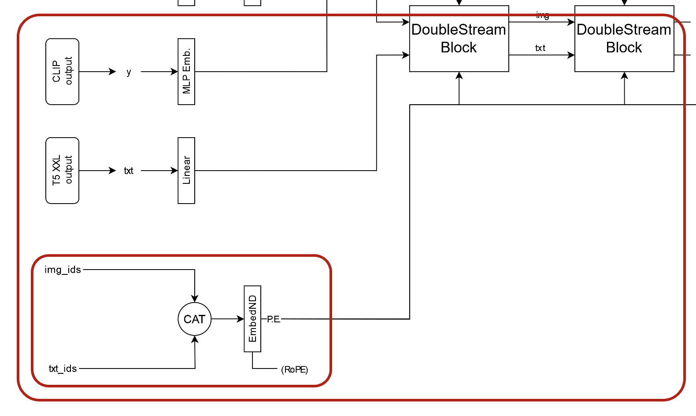
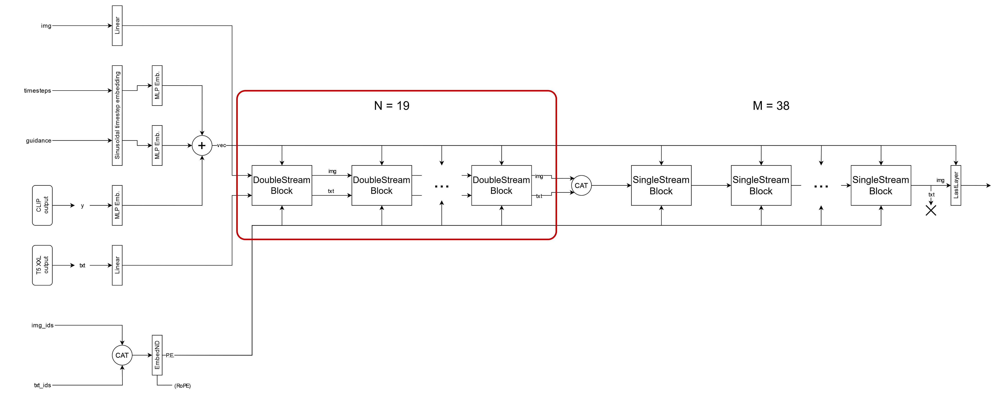
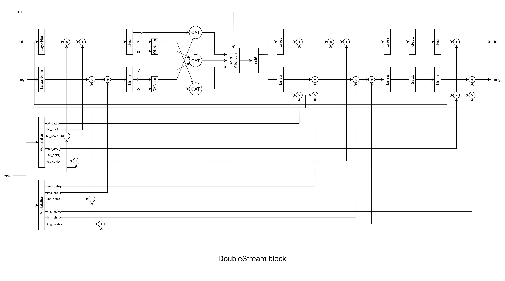
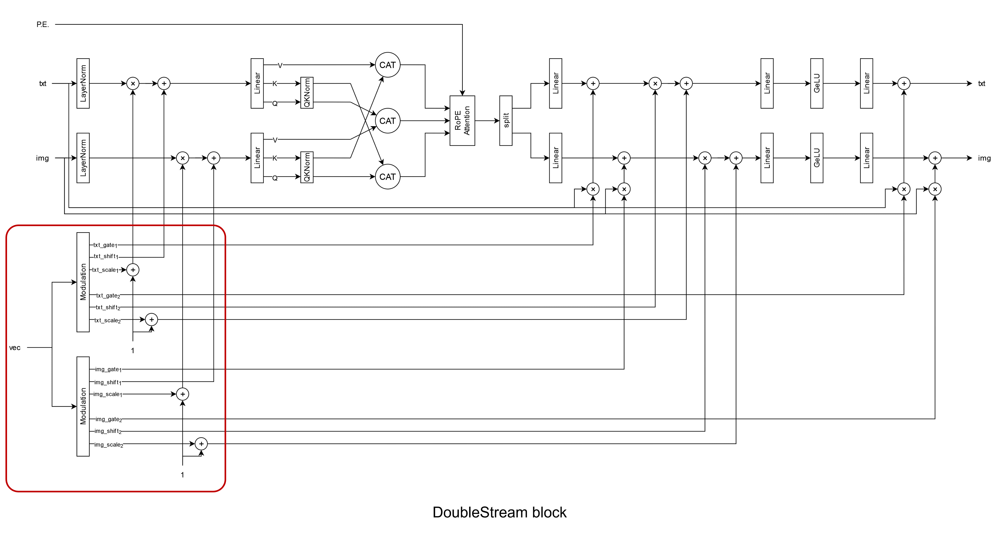
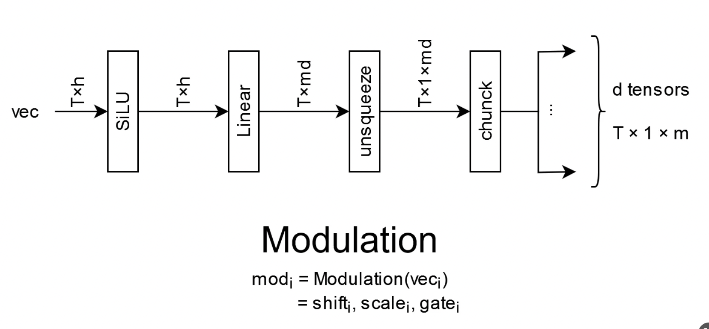
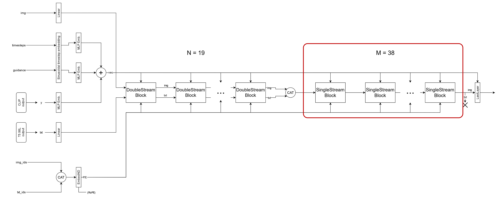
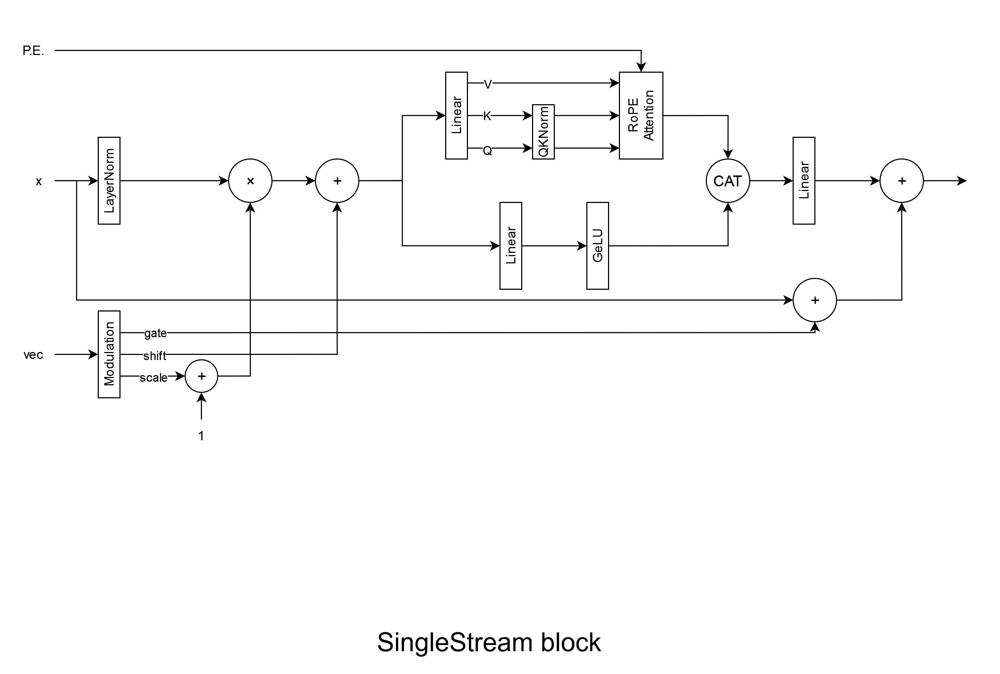

# FLUX

## 1. Overview
FLUX = **Transformer Diffusion** Based Multimodal Generative AI

기존의 UNet architecture는 convolution 연산의 특성상 local context를 모델링하는데 강점이 있지만, global context를 이해하는데 한계가 있음  
=> 이에 따라 FLUX는 UNet 대신 Diffusion Transformer(DiT) 계열 아키텍처를 채택하여
복잡한 global 컨텍스트를 보다 효과적으로 모델링함  
  

## 2. Architecture

1. Input Section

| Symbol | Description |  
|------|------------|  
| **img** | VAE Encoder를 통해 latent space로 변환된 이미지 토큰 |  
| **timesteps** | diffusion 과정의 단계 나타냄. Sinusoidal Timestep Embedding을 통해 벡터화됨 |  
| **guidance** | 텍스트 조건을 얼마나 강하게 반영할지 결정하는 가이드 스케일 |  
| **y** | CLIP 텍스트 인코더의 출력 (Global 텍스트 정보) |  
| **txt** | T5-XXL 텍스트 인코더의 출력 (시퀀스 단위 의미 정보) |  
| **img_ids** | 이미지 토큰의 공간 좌표 (h, w) 및 시간 인덱스 (used in RoPE) |  
| **txt_ids** | 텍스트 토큰의 위치 인덱스 (used in RoPE) |  

2. Main Architecture Components

| Symbol / Block | Description |
|---------------|------------|
| **CAT** | Concatenation |
| **DoubleStream Block (N = 19)** | 이미지 토큰과 텍스트 토큰을 분리된 스트림으로 병렬 처리하는 블록 |
| **SingleStream Block (M = 38)** | 이미지·텍스트 토큰을 하나의 시퀀스로 통합해 처리하는 블록 |
| **PE** | 3D RoPE 기반 위치 임베딩 (h, w, t 정보 포함) |
| **vec** | timestep 및 txt 전역 정보를 결합한 conditioning 벡터 |

3. Modulation & Conditioning

| Symbol | Description |
|------|------------|
| **Mod** | vec를 입력으로 받아 feature-wise modulation을 수행하는 유닛 |
| **α (gate**) | 연산 결과의 기여도를 조절하는 게이팅 파라미터 |
| **β (shift**) | feature 값을 평행 이동시키는 bias 항 |
| **γ (scale**) | feature 강도를 조절하는 scaling 계수 |
| **Chunk** | 하나의 modulation 벡터를 (α, β, γ)로 분할 |
| **Unsqueeze** | modulation 값을 모든 토큰 차원에 브로드캐스트하기 위한 차원 확장 |

4. Spatial & Dimensional Notation

| Symbol | Meaning |
|------|--------|
| **t** | 참조 인덱스를 구분하는 오프셋 |
| **T** | 시퀀스의 총 길이 (H × W × (N+1) |
| **N** | reference 이미지 수 |
| **h** | Hidden Dimension(채널) |
| **md** | modulation이 적용되는 feature dimension 크기 |
| **d tensors** | chunk 연산을 통해 생성된 개별 modulation 파라미터 텐서 |




```
Input
├── Text Prompt: T5 및 CLIP을 통해 처리
└── Image: diffusion timestep t에서의 latent (x_t), optionally initialized from a reference image

Process
├── Text Encoding → T5 Text Encoder 및 CLIP
├── Image Encoding → VAE Encoder → 16개 채널의 Latent code z 로 변환
├── Mechanism (Transformer 기반):
    ├── Double Stream Blocks: 텍스트와 이미지 토큰을 개별 가중치로 병렬 처리
    ├── Single Stream Blocks: 결합된 시퀀스를 통합 처리하여 효율성 극대화 (38개 블록)
    └── 3D RoPE (Rotary Positional Embeddings): 시공간 좌표(t, H, W) 인덱싱으로 구조적 정밀도 향상
└── In-Context Integration → Sequence Concatenation: 참조 이미지 토큰을 타겟 토큰에 직접 연결

Output
└── VAE Decoder → 고해상도 이미지 생성 (1024×1024 표준, Pro Ultra의 경우 최대 4K 지원)

```

### 2.1 Text Encoding



FLUX는 텍스트 조건 처리를 위해 **T5와 CLIP 인코더를 모두 사용**하는 구조 채택.

#### Text Encoders
- T5 (T5-v1.1-XXL):  
  매우 방대한 파라미터를 가진 텍스트 인코더
  자연어의 복잡한 문맥과 상세한 지시 사항을 깊이 있게 이해하는 데 사용
  Flux 모델이 긴 프롬프트를 정확하게 따르고 높은 수준의 '프롬프트 충실도(Prompt Following)'를 보여주는 핵심 이유
- CLIP (CLIP-L):  
  시각 정보와 텍스트 사이의 연관성을 학습한 인코더
  프롬프트의 의미가 이미지와 시각적으로 얼마나 잘 일치하는지를 조절하는 global guide 역할
  
#### Text Encoders
- **T5 출력(txt)**  
  시퀀스 형태의 텍스트 토큰으로 유지되며,
  각 Transformer block에서 self-attention과 MLP 연산을 거치면서
  이미지 토큰과의 상호작용에 따라 **점진적으로 갱신됨**.
- **CLIP 출력(y)**  
  timestep 및 guidance 정보와 함께 결합되어,
  토큰마다 변하지 않는 **전역(global) conditioning 정보**로 사용됨.


### 2.2 Image Encoding
Image → VAE Encoder → Latent Space z 로 변환
이 과정에서 원본 이미지는 **C × H × W** 형태의 latent feature로 압축  

Transformer 기반 아키텍처는 2D feature map이 아닌 **1D 시퀀스 입력**을 요구하므로,  
latent의 각 공간 위치 `(H, W)`에 대응하는 **채널 벡터를 하나의 토큰으로 처리**  

즉, H×W 개의 좌표에 있는 벡터들을 일렬로 Flattening해서 하나의 긴 시퀀스로 만들어서 처리함  

예를들어, 512*512 image 이미지를 입력할 경우 VAE 출력이 16*64*64라면,  
**16차원 채널을 가진 4,096개의 이미지 토큰** 생성.

### 2.3 3D RoPE(3-Dimensional Rotary Positional Embedding)

앞에서 이미지 latent가 토큰 시퀀스로 펼쳐지기 때문에  
각 토큰이 원래 이미지에서의 위치 정보를 잃어버릴 위험이 있음  
따라서 이를 방지하기 위해 3D RoPE 사용

각 토큰의 원래 feature map에서의 **공간 좌표 (H, W**)와 토큰이 속한 이미지 그룹을 구분하기 위한 인덱스(t)를 인덱싱하여 주입
즉, 시공간 좌표((t,H,W))를 트랜스포머 연산에 사용할 수 있는 PE(Positional Embedding) 형태로 변환

text idx, noise img idx, reference img idx가 3차원으로 concat된 형태로 EmbedND에 들어감
=> EmbedND에서 각 오프셋에 대해 회전행렬 생성( 추후 RoPE attention에 사용)


### 2.4 Double Stream Blocks


이미지 토큰과 텍스트 토큰에 대해 각각 별도의 가중치(Separate weights)**를 할당하여 병렬로 처리하는 구조
Text Stream : 텍스트 인코더(T5, CLIP 등)를 통해 들어온 언어적 의미 정보를 처리
Visual Stream: VAE를 통해 인코딩된 이미지의 잠재 토큰(Latent tokens)들을 처리
1. 시퀀스 연결(Concatenation): 별도로 흐르던 이미지 토큰 시퀀스와 텍스트 토큰 시퀀스를 하나로 합칩니다.
2. 통합 어텐션 수행: 합쳐진 전체 시퀀스 위에서 어텐션 연산을 수행하여, 이미지 토큰이 텍스트의 맥락을 읽고 텍스트 토큰이 이미지의 구조를 파악하게 합니다.
3. 다시 분리: 어텐션 연산이 끝나면 정보가 교류된 토큰들을 다시 각자의 스트림(가중치)으로 돌려보내 다음 처리를 이어갑니다


#### Modulation


**vec (Vector Conditioning)**  
Diffusion timestep embedding과 텍스트의 전역적 의미 정보를 결합한 conditioning 벡터.
  
  
vec는 블록 내부의 Linear layer와 SiLU 활성화를 거쳐  
해당 블록에서 사용할 변조 파라미터 (α, β, γ)를 생성함.  
이 파라미터들은 이미지(img) 스트림과 텍스트(txt) 스트림에 각각 적용됨.

- Shift (β): 정규화된 데이터에 Bias 를 더해 특징의 기준점을 이동시킴
- Scale (γ): 정규화된 feature에 스케일을 곱해 특정 특징의 강도를 증폭 또는 감쇠하며 시각적 요소를 강조
- Gate (α): Attention이나 MLP 연산의 결과물이 Residual Connection을 통해 원래 데이터와 합쳐지기 직전에 적용. 해당 층에서 계산된 정보가 최종 출력에 얼마나 기여할지를 결정하는 역할, 모델의 학습 안정성을 높이고 조건부 생성을 정교하게 제어

트랜스포머 기반의 DiT 블록은 크게 두 부분으로 구성되며, 각 부분 직전에 Modulation이 적용되기 때문에 1과 2로 구분됨
- 1 (Pre-Attention): Attention 연산 이전에 적용되어, 이미지 및 텍스트 토큰의 특징을 조건에 맞게 정렬.
- 2 (Pre-MLP): Attention 이후 MLP 이전에 적용되어, 융합된 정보를 토큰 단위에서 정밀하게 조정.

이미지(img)와 텍스트(txt) 스트림이 분리되어 Modulation이 적용되는 이유는,  
Double Stream Blocks가 **이미지와 텍스트에 서로 다른 Weights**를 사용하는 구조이기 때문.


#### RoPE Attention

DoubleStream으로 이미지 토큰 시퀀스와 텍스트 토큰 시퀀스가 별도로 흐르지만, 그래도 서로의 영향을 주기 위해 attention 계산을 합쳐서 함. attention 계산 후 다시 분리

Positional Encoding을 사용하여 포지션도 적용함

텍스트/이미지 스트림에서 각각 Q,K,V 만들기
Q,K,V를 시퀀스 차원으로 concat
Q, K에 RoPE 적용 + Attention 계산 => 위치 정보는 attention score 계산에만 영향
attention 결과를 다시 텍스트/이미지로 분리


### 2.4 Single Stream Blocks


Double Stream Block에서는 이미지와 텍스트가 별도의 경로를 가졌으나,   
Single Stream Block에 진입하기 직전 두 시퀀스는 하나로 Concatenate

이미지 토큰과 텍스트 토큰이 구분 없이 **동일한 가중치(Unified weights**)를 공유하며 어텐션 및 MLP 연산을 수행


> 한 스텝에서 DoubleStream Block과 SingleStream Block에 각각 들어오는 P.E, vec값은 같지만, 
vec는 각 층의 Modulation유닛의 Linear층이 각 블록마다 다르게 학습된 가중치 가지고 있어서 동일한 vec들어오더라도 서로 다른 α,β,γ 파라미터 생성해냄
P.E도 RoPE Attention을 이용해서 들어가기 때문에, 블록마다 서로 다른 파라미터

> Skyfall-GS에서는 diffusion을 완전한 생성기가 아니라 구조가 이미 주어진 이미지의 노이즈 제거 및 정제 단계로 사용함
저노이즈, 저스텝 조건에서는 전역 구조를 강하게 유지하는 Transformer 기반 diffusion이 UNet 기반 모델보다 안정적일 수 있음

> reference image와 noise image가 항상 concat되어 img형태로 함께 사용되다가, 마지막 SingleStream Block을 지나고 다음 단계로 에측된 노이즈를 전달할 때에는 reference image가 슬라이싱되어 버려짐. 그리고 다음 단계에서는 다시 처음 준비된 latent 형태로 noise image와 concat 되어 들어감
즉, Reference image는 처음 준비된 latent 형태로 매 스텝마다 동일하게 재사용됨


+FLUX.1 기반 모델들은 120억 개, 더 강력해진 FLUX.2 모델들은 240억 개의 파라미터


## 3. FlowEdit
FlowEdit : FLUX.1과 같은 Rectified Flow모델을 활용하여 실제 이미지를 편집하는 새로운 방식

- 기존 방식 (FLUX.1 Fill 등)
    - 일반적으로 이미지를 편집할 때 이미지를 노이즈로 변환(Inversion)한 뒤 다시 복원하며 편집하는 과정
    - 생성 모델이기 때문에 처음부터 그림을 그리는 데 최적화
- FlowEdit
    - 이미지를 노이즈로 바꿨다가 다시 돌아오는 복잡한 경로 대신, 원본 이미지 분포에서 목표 이미지 분포로 직접 연결되는 최단 경로(ODE)를 설계, 노이즈 공간을 거치지 않기 때문에 원본의 구조를 훨씬 더 정밀하게 보존할 수 있음
    - 원본 이미지의 구조적 특징은 유지하면서 텍스트 프롬프트에 명시된 부분만 정확하게 바꾸는 능력"**이 탁월


> FLUX는 token-based Transformer diffusion 구조로 인해 UNet 기반 ControlNet이 전제하는 spatially-aligned feature injection 방식과는 구조적으로 잘 맞지 않으며, 이로 인해 geometry-aware conditioning에는 상대적으로 불리함  
> (controlNet은 UNet의 같은 위치 feature에 영향을 줘야하는데, FLUX는 픽셀이 아니라 token 단위로 처리하기 때문에 공간 제약을 둘 수 없음)  


