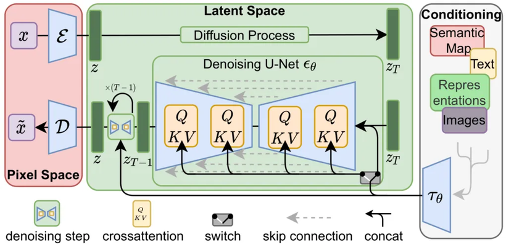

# LoRA (Low-Rank Adaptation)
***LORA: LOW-RANK ADAPTATION OF LARGE LANGUAGE MODELS***

LoRA (Low-Rank Adaptation)는 **대규모 pretrained model의 weight를 직접 fine-tuning하지 않고**,
weight update를 **low-rank matrix 분해 형태로 제한**하여 학습하는 **parameter-efficient fine-tuning (PEFT)** 기법이다.

### 1.1 기본 아이디어

Pretrained linear layer의 weight를 다음과 같이 분해한다.

```
W = W0 + ΔW
ΔW = B · A
```

- `W0`: pretrained weight (freeze)
- `A`: (r × d)
- `B`: (d × r)
- `r`: rank (r << d)

즉, 실제로 학습되는 것은 **저차원 subspace**에 해당하는 `A`, `B`뿐이다.

### 1.2 Forward 동작

```
y = W0 x + (α / r) · B A x
```

- `α`: scaling factor
- inference 시에는 `W = W0 + B A`로 merge 가능
- **추론 latency 증가 없음**

### 1.3 LoRA의 장점

- 학습 파라미터 수 대폭 감소
- optimizer state 포함 VRAM 사용량 감소
- base model 보존
- adapter 단위 관리 가능

---

## 2. Stable Diffusion 구조 요약

Stable Diffusion은 다음 세 모듈로 구성된다.

```
Text Encoder (CLIP)
        ↓
   Text Embedding
        ↓
UNet Denoiser  ← Cross-Attention → Image Latent
        ↓
      VAE Decoder
```

이 중 **LoRA는 거의 항상 UNet 내부에 적용**된다.

---

## 3. Stable Diffusion에서 LoRA가 적용되는 위치

### 3.1 핵심 위치: Cross-Attention

UNet의 각 block에는 text condition을 반영하기 위한 **Cross-Attention layer**가 존재한다.

```
Q = Wq · h
K = Wk · c
V = Wv · c
```

- `h`: image latent feature
- `c`: text embedding

LoRA는 여기서 다음 projection weight에 삽입된다.

- `Wq`
- `Wk` (선택적)
- `Wv`
- sometimes `Wo`

---

## 4. Stable Diffusion + LoRA 구조 그림

### 4.1 기존 구조



> UNet Cross-Attention에서 image latent와 text embedding이 결합됨

---

### 4.2 LoRA 삽입 구조


```
Wq = Wq0 + Bq Aq
Wv = Wv0 + Bv Av
```

- base weight는 freeze
- LoRA adapter만 학습

---

## 5. Stable Diffusion LoRA 학습 흐름

### 5.1 Training 단계

```
Image + Prompt
      ↓
Text Encoder (freeze)
      ↓
UNet (LoRA only trainable)
      ↓
Noise prediction loss
```

- UNet의 대부분 weight는 freeze
- LoRA module만 gradient update

### 5.2 저장 결과

- `.safetensors` 또는 `.pt`
- base model 없이도 **adapter 단독 배포 가능**

---

## 6. Inference 시 LoRA 동작 방식

```
Base SD Model
     +
LoRA Adapter (α 조절)
     ↓
Modified Image Generation
```

- α 값으로 LoRA 영향도 조절
- multiple LoRA 병합 가능 (가중합)

---

## 7. Diffusion 관점에서 LoRA의 역할

LoRA는 diffusion process 자체를 바꾸지 않는다.

- noise schedule 변경 없음
- sampling 방식 변경 없음

대신 **denoiser의 조건 반응 공간(condition-to-image mapping)**을 저차원 방향으로 이동시킨다.

---
