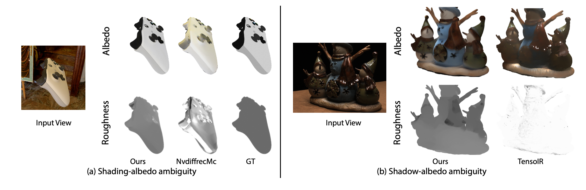

# IntrinsicAnything: Learning Diffusion Priors for Inverse Rendering Under Unknown Illumination

## 1. Motivation
Inverse Rendering under unknown lighting
I = geometry × material × lighting
=> 하나만 바꿔도 같은 이미지 만들 수 있음, 해가 무한개 (ill-posed)

기존 접근 : differentiable rendering, GT image reconstruction loss 최소화
문제
- shading ↔ albedo 구분 못함 ex.노란 조명 → albedo도 노랗게 학습됨, 흰색 albedo + 노란 조명 / 노란 albedo + 흰 조명 둘 다 같은 이미지
- shadow ↔ albedo 구분 못함 ex.그림자가 texture에 박힘 (baked-in)
=> 추가적인 prior가 없으면 inverse rendering은 해결 불가능함. 따라서, diffusion으로 albedo / specular 분포 학습

## 2. Mechanism
기본 구조
- input : multi-view RGB images, geometry, UV mapping (단, 조명은 모든 이미지에서 동일해야함(unknown static illumination))
- rendering : PBR (albedo + roughness + lighting → RGB)

geometry, albedo, roughness, lighting로 PBR RGB 렌더링 후 inverse rendering
*하지만 여기서 끝내면, shading이 albedo에 박히고, shadow가 texture에 baked-in 되고 lighting/material이 서로 뒤섞임
=> diffusion prior 추가

하지만 diffusion output은 원래 stochastic하므로, view마다 결과가 약간씩 달라져서 multi-view consistency가 약함 그러므로, 두 단계 최적화 진행

Stage 1: **coarse inverse rendering** - diffusion prior에서 나온 albedo / specular 샘플을 supervision으로 사용하여 일단 coarse material + lighting을 잡는 단계
Stage 2: **guided diffusion refinement** - Stage 1에서 얻은 coarse albedo / specular를 다시 diffusion sampling의 guidance로 사용하여 diffusion sample 자체를 더 deterministic하고 multi-view consistent하게 만드는 단계, 여기서 만든 guided sample로 다시 inverse rendering을 supervision 함

### 2-1. Rendering model

## 3. 우리 방식에 적용 가능 여부
조건 : 
1. 조명이 모든 이미지에서 동일해야 함