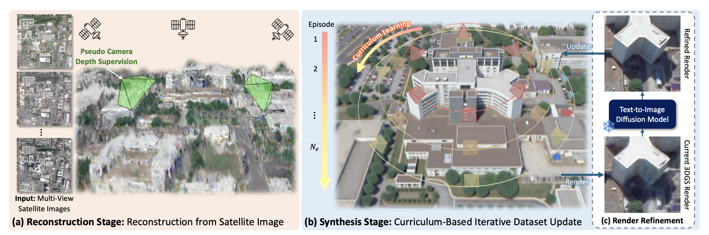
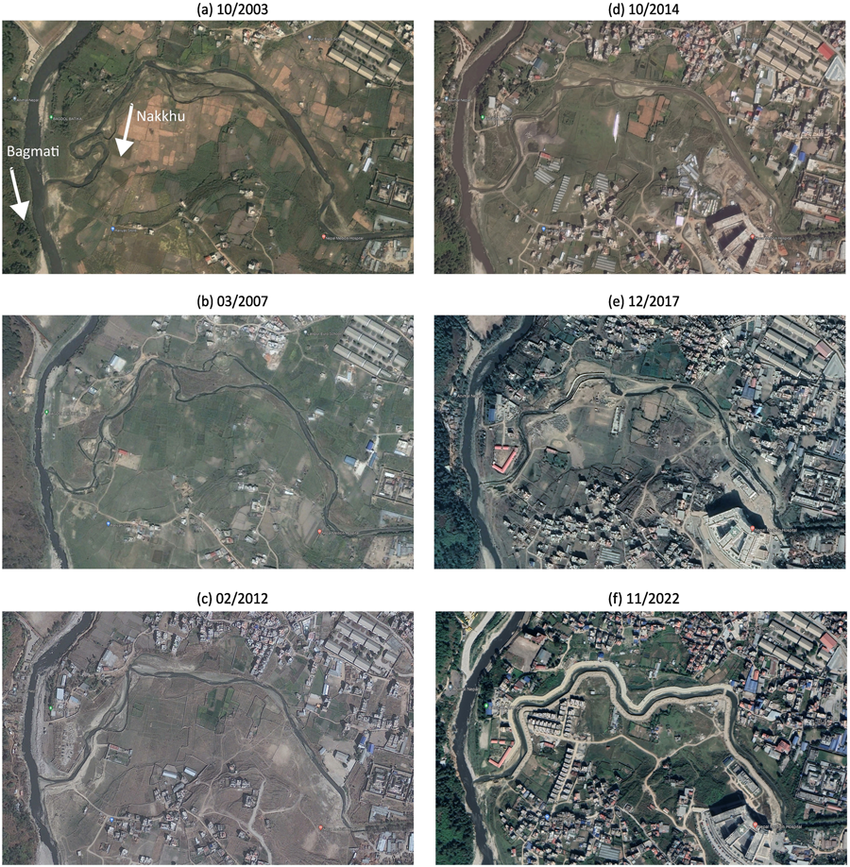
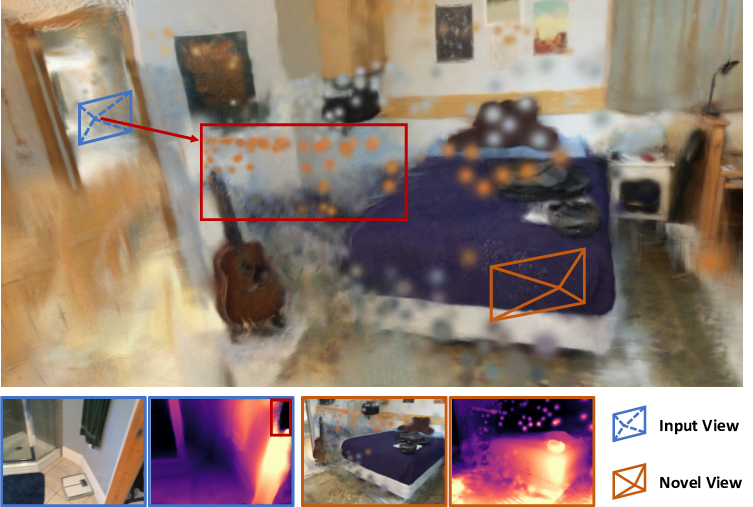
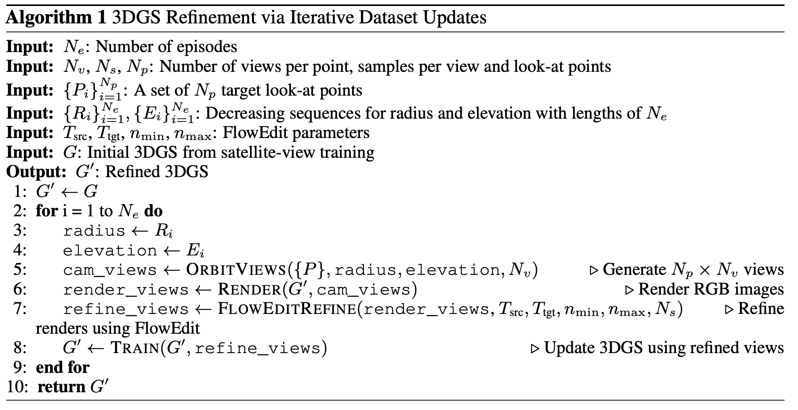
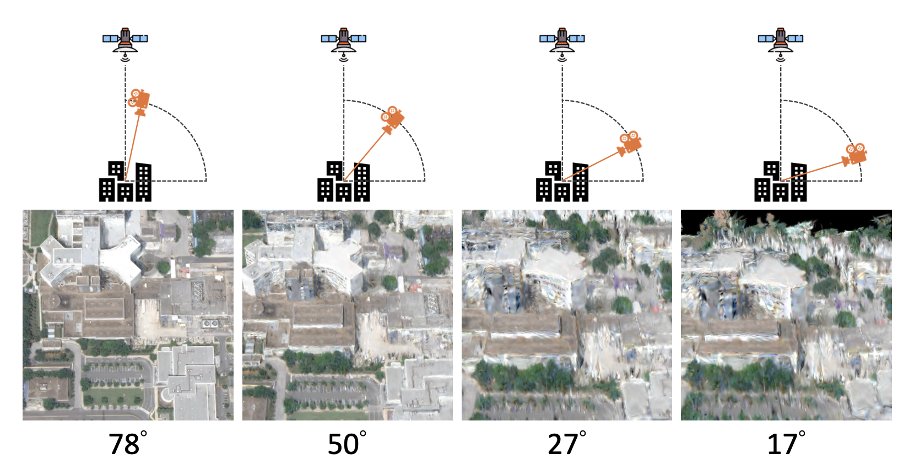

# Skyfall-GS: Synthesizing Immersive 3D Urban Scenes from Satellite Imagery

GS 와 diffusion 의 조합 논문  
우리와 같이 diffusion 모델을 쓰면서 GS로 뷰를 재구성하기 위해 논문 읽음  

---

## 1. Motivation

### Problem
- **위성영상 → 3D city reconstruction**
  - 위성 시점에서는 건물의 측면 구조가 거의 관측되지 않음
  - 촬영 시점 및 계절 차이로 인한 조명과 색감 불일치 문제

### Limitations of Existing Methods
- **Sat-NeRF**: 위성 영상만을 이용한 geometry 복원으로 인한 구조 흐림 및 파사드 뭉개짐.
- **CityDreamer / GaussianCity**: semantic map과 height map 기반 접근으로 구조적 안정성은 확보되나, 텍스처의 synthetic한 특성과 단순화된 도시 구조.
- 기존 **NeRF / 3D Gaussian Splatting** 계열 방법: satellite view에서 학습된 표현의 low-altitude 및 ground-level view로의 일반화 실패.

결과적으로, 위성 영상 supervision만으로는 큰 시점 변화에 대해 기하적·외관적으로 일관된 3D 도시 표현을 학습하기 어려운 문제 발생
---

## 2. Mechanism

Skyfall-GS는 **satellite imagery 기반 3D city reconstruction**을 위한  
**two-stage framework**로 구성.

**3D scene representation은 3D Gaussian Splatting(3DGS)이 담당하며,  
diffusion model은 image-level supervision만 제공하는 구조.**

*Source: Skyfall-GS (Lee et al., 2025), Fig. 3*

핵심 구성 요소는 다음 두 단계.

### Stage 1 — Initial Reconstruction (3DGS-based)
- satellite images 입력을 기반으로 **initial 3D Gaussian scene** 생성.
- photometric supervision을 통한
  - roof surfaces
  - ground planes
  중심의 **coarse geometry 복원**.
- 생성된 3DGS의 한계:
  - ground-level view에서 불완전한 geometry.
  - facades 및 occluded regions의 복원 실패.

### Stage 2 — Synthesis via Iterative Dataset Update (IDU)
- 현재 3DGS를 다양한 **camera angles**에서 rendering.
- rendered images를 입력으로
  - **diffusion model 기반 image-level refinement** 수행.
  - artifacts 제거 및 texture realism 향상.
- diffusion으로 생성된 **refined images**를
  - 새로운 supervision data로 사용.
  - 3DGS 재학습에 활용.
- 위 과정을 **Iterative Dataset Update (IDU)** 방식으로 반복.

Diffusion model의 역할 :
- 3D geometry를 직접 생성하거나 수정하지 않음.
- **3DGS 학습을 위한 고품질 target images 제공 역할.**

---

## 2.1 Stage 1 — Initial Reconstruction (3DGS-based)

- satellite images 입력을 기반으로 한 **initial 3D Gaussian scene 생성**.
- photometric supervision을 통한 roof surfaces 및 ground planes 중심의 **coarse geometry 복원**.
- Stage 1에서 학습된 3DGS의 특성:
  - top-down 및 high-altitude view에서 상대적으로 안정적인 구조.
  - ground-level view에서 불완전한 geometry.
  - facades 및 occluded regions의 복원 실패.

초기에는 Satellite SfM(Structure from Motion)를 통해 초기 3D구조를 예측

---

### 2.1.1 Appearance Modeling

  
*Source: Satellite imagery examples illustrating seasonal and illumination-induced appearance variation*

위성 영상 간 촬영 시점·계절 차이로 인한 appearance 불일치 문제.

각 Gaussian의 색상은 **Spherical Harmonics(SH)** 계수로 표현되며,  
색 변화는 appearance MLP가 담당하고, geometry는 구조 학습에만 사용되는 분리 구조 사용.

Appearance는 다음 세 입력으로 구성.

- **Color (SH coefficients)**  
  각 Gaussian의 색상 정보.  
  SH DC component는 방향과 무관한 base color 역할.

- **Per-Gaussian embedding (g)**  
  Gaussian 위치 기반 embedding.  
  공간 위치에 따른 국소적 appearance variation 표현.

- **Per-image embedding (a)**  
  이미지별 appearance embedding.  
  조명, 계절, 시간대 차이에 따른 image-dependent appearance 표현.

Appearance conditioning 연산 흐름:

- 입력: (color, g, a).
- 세 입력을 concatenate하여 appearance MLP에 전달.
- MLP 출력:
  - color scale **m**
  - color offset **Δc**
- 최종 색상 보정:
  - **c' = c · m + Δc**

Image-dependent appearance 변화는 scale과 offset으로만 반영되며,  
base color(SH DC)는 geometry와 정렬된 상태로 유지.

Appearance variation과 geometry 최적화 간 간섭 최소화.  
Multi-date satellite imagery 환경에서 Stage 1 학습 안정성 확보.

> 참고: Spherical Harmonics(SH) 계수에 대한 정리는  
> [`notes/graphics/spherical-harmonics.md`](../../notes/graphics/spherical-harmonics.md) 참고.

---

### 2.1.2 Opacity Regularization

Satellite imagery 환경에서는 parallax가 거의 발생하지 않아
depth cue 확보가 어려운 조건.

이 환경에서 photometric loss만으로 3DGS를 학습할 경우,
실제 surface와 무관한 위치에 Gaussian이 배치되는
**floaters** 현상 발생.

  
*Source: Example of floating artifacts commonly observed in NeRF / 3DGS reconstructions*

Floaters의 특징:
- 실제 surface가 아님.
- 3D 공간에 공중 부유한 형태.
- **중간 opacity (α)** 값을 가짐.
- 색 기여를 위한 임시 요소 역할.

Skyfall-GS는 floaters를 억제하기 위해
Gaussian의 **opacity (α)** 에 대해 **binary entropy regularization** 적용.

- entropy H(α)는
  α = 0.5 일 때 최대값을 가짐.
  H(α) = − α log α − (1 − α) log (1 − α)
- α가 0 또는 1에 가까워질수록
  entropy 값은 감소.
- **−H(α)** 를 loss로 사용하여 중간 opacity 값을 갖는 Gaussian에 강한 penalty를 부여.

- 중간 opacity 영역에 머무는 Gaussian은 억제됨.
- Gaussian의 opacity는 학습 과정에서
  두 가지 상태로 분리됨:
  - α = 1: 실제 surface에 대응하는 Gaussian.
  - α = 0: 제거 대상 Gaussian.

의미 없는 Gaussian(floaters)의 기여를 억제하고,
Stage 1에서 안정적인 coarse geometry 형성.

---

### 2.1.3 Pseudo-camera Depth Supervision

Satellite imagery 환경에서는 카메라가 지상으로부터 매우 멀리 위치하여,
view 변화에 따른 **effective parallax**가 거의 발생하지 않음.
이로 인해 photometric supervision만으로는
roof, road, facade 간의 **depth ordering**을 안정적으로 고정하기 어려운 문제.

이를 보완하기 위해 Skyfall-GS는
**pseudo-camera depth supervision**을 도입하여
3DGS에 추가적인 **depth shape prior** 제공.

전체 depth supervision 흐름:

**3DGS → pseudo-camera RGB rendering → monocular depth prediction → depth prior → GS optimization**

Pseudo-camera depth supervision 구성 요소:

- **Pseudo-camera rendering**
  - scene 주변에 ground-level에 가까운 pseudo cameras 샘플링.
  - 각 pseudo camera에서 현재 3DGS로부터
    RGB image 및 depth map 렌더링.
  - 해당 depth는 현재 GS가 추정한 geometry 기반.

- **Monocular depth prediction (MoGe)**
  - 렌더링된 RGB image를
    monocular depth model (MoGe)에 입력.
  - 단일 RGB image로부터
    pixel-wise depth ordering 및 자연스러운 depth gradient 예측.
  - absolute scale은 부정확하나,
    **relative depth structure**는 신뢰 가능한 pseudo ground-truth로 사용.

- **Depth correlation loss**
  - GS 렌더링 depth와 MoGe 예측 depth 간의
    **scale-invariant correlation loss (Pearson correlation)** 계산.
  - 절대 depth 값이 아닌
    **depth shape와 ordering**만을 supervision으로 사용.

Camera scale이나 정확한 거리 정보 없이도
geometry가 합리적인 3D 형태를 따르도록 유도.
Stage 1에서 facade 및 수직 구조의 depth 안정성 확보.

---

## 2.2 Stage 2 — Synthesis via Iterative Dataset Update (IDU)

Stage 1에서 학습된 3DGS는
satellite view 기준의 coarse geometry만을 복원한 상태.

Stage 2에서는
**diffusion 기반 image synthesis**와
**Iterative Dataset Update (IDU**)를 통해
보이지 않던 facade 및 occluded region 정보를
학습 데이터 형태로 점진적으로 보완.

Stage 2의 특징:
- diffusion model의 출력을 최종 결과로 사용하지 않음.
- diffusion 결과를 **3DGS 재학습을 위한 supervision data**로 활용.
- 반복적인 IDU 과정을 통해
  low-altitude 및 ground-level view로의 일반화 성능 향상.

### 2.2.1 Diffusion Refinement (FlowEdit + FLUX.1)
  
*Source: Skyfall-GS (Lee et al., 2025), Algorithm 1*

Stage 2에서 diffusion model은
3D geometry를 직접 생성하지 않으며,
**현재 3DGS가 만든 renderings를 고품질 이미지로 보정(refinement)**하는
image-level supervision 역할만 수행.

Skyfall-GS는 diffusion model로 **FLUX.1**을 사용하고,
image-to-image refinement를 위해 **FlowEdit** 프레임워크 적용.

3DGS rendering은
완전한 noise가 아닌,
artifact와 불완전한 texture를 포함한 중간 상태 이미지로 해석.
해당 이미지를
diffusion denoising trajectory의 **중간 noisy sample**로 두고,
남은 denoising steps를 수행하도록 구성.

Diffusion refinement 흐름:

- 현재 3DGS로부터 RGB image 렌더링.
- FlowEdit를 통해 해당 이미지를
  diffusion denoising 과정 중간에 삽입.
- FLUX.1이 남은 denoising steps 수행.
- 구조는 유지한 채
  texture, edge, illumination artifact를 중심으로 보정된
  refined image 생성.

이렇게 생성된 refined image는
최종 결과로 사용되지 않으며,
3DGS 재학습을 위한 **supervision data**로만 활용.

Diffusion refinement는
IDU(Iterative Dataset Update) 루프 안에서 반복 수행되며,

coarse 3DGS → render → diffusion refinement → refined images → GS retraining → improved 3DGS
의 **self-bootstrapping 구조**를 형성.

Diffusion model의 역할 정리:

- scene representation 아님.
- 3D geometry 직접 수정하지 않음.
- **3DGS가 학습해야 할 target image distribution을 점진적으로 개선**하는 역할.

### 2.2.2 Multi-sample Diffusion

Diffusion refinement를 단일 샘플로 수행할 경우,
서로 다른 camera view 간 **visual consistency가 쉽게 붕괴**되는 문제.

이는 diffusion의 **stochastic denoising process** 특성상,
각 view가 서로 다른 denoising trajectory를 따르기 때문.

또한 단일 view에 대한 refinement 결과만 supervision으로 사용할 경우,
3DGS가 해당 view에 과도하게 맞춰지는
**single-view overfitting** 위험 존재.
이로 인해 novel view에서 geometry distortion 및 artifacts 발생 가능.

이를 완화하기 위해
Skyfall-GS는 각 camera view에 대해
diffusion refinement를 **multiple times (Ns samples)** 수행.

- 동일한 3DGS rendering을 입력으로 사용.
- 서로 다른 random seed로
  여러 denoising trajectory 샘플링.
- 논문에서는 **Ns = 4** 사용.
- 생성된 모든 refined images를
  3DGS 재학습을 위한 supervision data로 활용.

이 과정을 통해
diffusion의 stochastic hallucination이 평균화되며,
여러 sample에서 **공통적으로 유지되는 구조만** 3DGS에 반영.

결과적으로 3DGS는
특정 view에만 맞는 해가 아니라,
**multi-view consensus를 만족하는 geometry**로 수렴.

### 2.2.3 Curriculum Learning for Camera Angles
  
*Source: Skyfall-GS (Lee et al., 2025), Fig. 4*

Stage 2에서 diffusion refinement를
처음부터 ground-level view에 적용할 경우,
현재 3DGS의 geometry가 이를 지탱하지 못해
hallucination이 geometry로 고정되는 위험 존재.

이를 방지하기 위해 Skyfall-GS는
**camera elevation을 점진적으로 낮추는 curriculum learning strategy** 적용.

Curriculum 구성 방식:

- 초기 episode:
  - **높은 camera elevation + 큰 radius** 설정.
  - scene을 위에서 내려다보는
    상대적으로 **안전한 view** 위주로 supervision 수행.
- 이후 episode로 갈수록:
  - camera elevation을 점차 낮추고,
  - 지상에 가까운 view를 단계적으로 포함.

이 과정에서,
이전 episode에서 diffusion refinement와 IDU를 통해
**이미 안정화된 3DGS**가
다음 episode의 더 어려운 view를
**구조적으로 제약하는 역할**을 수행.

Camera setup in IDU:

- **N_p look-at points**:
  - scene 전체에 균일하게 분포된 target points.
  - 각 camera가 바라보는 중심점 역할.
- 각 look-at point 주변에:
  - **circular orbit** 형태로 camera 배치.
  - 서로 다른 elevation과 radius에서 scene 렌더링.

이러한 camera sampling 전략을 통해,
Stage 2 전반에 걸쳐
geometry 안정성을 유지한 상태로
view distribution을 점진적으로 확장.

---

## 3. Training

Skyfall-GS는
satellite imagery 기반 3D reconstruction의 특성을 고려하여,
**two-stage training pipeline**으로 구성.

---

### Stage 1 Training

Stage 1에서는
satellite images를 입력으로
3D Gaussian Splatting(3DGS)을 학습.

학습 특징:

- photometric loss 기반 supervision.
- roof surfaces 및 ground planes 중심의
  coarse geometry 복원.
- appearance modeling, opacity regularization,
  pseudo-camera depth supervision을 통한
  geometry 안정화.

Stage 1의 목표는
완전한 3D reconstruction이 아닌,
Stage 2를 위한 **안정적인 초기 3DGS 생성**.

---

### Stage 2 Training

Stage 2에서는
Stage 1에서 학습된 3DGS를 초기값으로 사용.

훈련 방식:

- 3DGS를 다양한 camera view에서 렌더링.
- diffusion refinement를 통해
  렌더링 이미지를 고품질 pseudo supervision으로 변환.
- refined images를 포함한 dataset으로
  3DGS 재학습.

이 과정은
**Iterative Dataset Update (IDU)** 형태로 반복 수행.

Stage 2 학습 특징:

- diffusion model은 고정된 상태로 사용.
- 3DGS만을 반복적으로 업데이트.
- multi-sample diffusion 및
  camera angle curriculum을 통해
  supervision 안정성 확보.

Training 전반에 걸쳐,
diffusion은 scene representation이 아닌
**image-level supervision generator**로만 작동.

---

## 4. Experimental Results

---

## 5. Limitations

Skyfall-GS는
satellite imagery 환경에서 부족한 기하 정보를 보완하기 위해
**diffusion 기반 image-level supervision**에 의존하는 구조를 채택.

이로 인해 다음과 같은 한계 존재.

- **Diffusion prior 의존성**
  - Stage 2의 refinement는 자연 이미지 분포에 학습된 diffusion prior에 기반.
  - hallucination이 완전히 제거되지는 않으며,
    satellite imagery 특유의 구조가 왜곡될 가능성 존재.
  - refined images는 ground-truth가 아닌 pseudo supervision에 해당.

- **절대적 geometry 정확도 한계**
  - pseudo-camera depth supervision은 relative depth ordering을 안정화하는 제약.
  - absolute depth scale 및 metric-level geometry 정확도는 직접적으로 보장되지 않음.

- **Curriculum 설계 민감성**
  - Stage 2의 안정성은 camera angle curriculum 설계에 크게 의존.
  - curriculum progression이 부적절할 경우,
    diffusion artifact가 geometry로 고정될 위험 존재.

- **높은 계산 비용**
  - multi-sample diffusion과 반복적인 IDU 과정으로 인해
    training time 및 연산 자원 요구량 증가.
  - 대규모 도시 장면 적용 시 비용 부담 큼.

