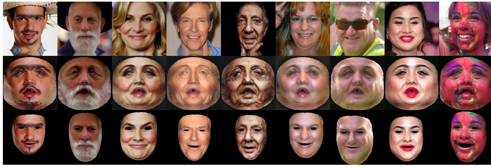
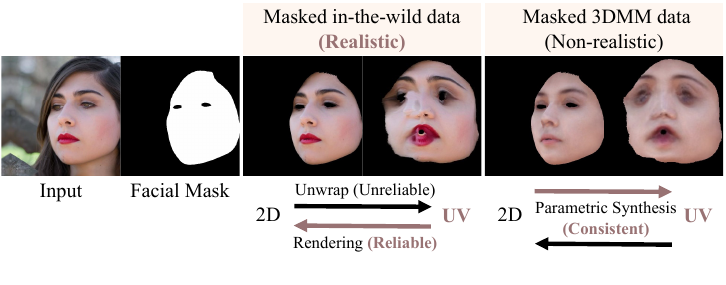
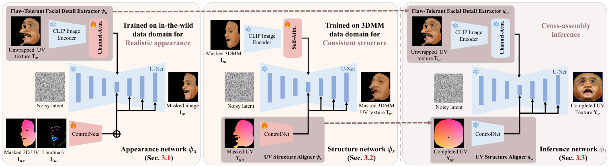
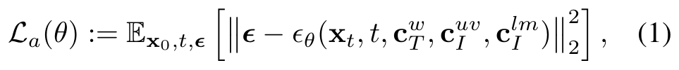
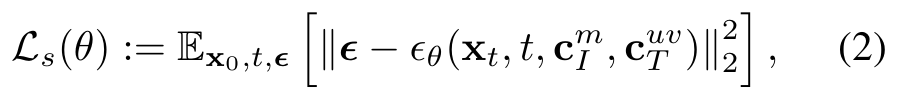

# FreeUV

> **한 줄 요약** : Image → UV (ground-truth-free)  
> UV ground truth 없이, 외형을 담당하는 network와 구조를 담당하는 network를 따로 학습한 뒤 추론 시 조합(Cross-Assembly)하여 단일 얼굴 이미지에서 완성된 UV texture 복원



## 1. 배경

**목표**
- 단일 in-the-wild 이미지에서 3D face UV texture 복원
- 주름, 모공, 수염, 화장 같은 복잡한 detail과 occlusion 처리
- 학습 시 annotated 또는 synthetic UV data 불필요

**기존 방식의 문제**: 대부분의 UV texture 생성 방법이 ground-truth UV dataset이 필요한 supervised learning에 의존

| 분류 | 방식 | 한계 |
|---|---|---|
| 촬영 data 사용 | 특수 장비로 촬영한 UV dataset으로 학습 | 고비용, in-the-wild generalization 부족 |
| 합성 data 사용 | StyleGAN으로 UV dataset 생성 후 학습 | (1) StyleGAN의 능력에 제한되어 화장 같은 unseen 얼굴 처리 어려움 (2) 다단계 과정(GAN inversion으로 multi-view 생성 후 blending)에서 identity, expression, 조명, appearance 불일치 발생 |

- FFHQ-UV : 얼굴 정규화 UV map을 만드나 자원 소모가 큰 iterative refinement 필요
- Makeup Prior Models : 화장 UV texture를 iterative optimization으로 생성
- UV-IDM : multi-view 이미지를 먼저 생성해 이미지와 UV map 쌍을 합성한 뒤 diffusion 모델 학습 (StyleGAN 의존)
- HRN, NextFace : coarse-to-fine로 texture와 geometry를 함께 개선하나 geometry 중심이라 세밀한 texture에 한계
- DSD-GAN : UV ground truth 없이 texture를 완성하는 유일한 기존 방법 (UV space와 image space의 이중 discriminator, 공식 코드 미공개)

**핵심 아이디어** : 실제 in-the-wild 이미지와 3DMM data 각각의 강점을 선택적으로 조합

| Mapping | Domain | Appearance | Structure | 선택 |
|---|---|---|---|---|
| UV-to-2D | 3DMM | Non-realistic | Consistent | ✗ |
| UV-to-2D | In-the-wild | **Realistic** | Reliable | ✓ |
| 2D-to-UV | 3DMM | Non-realistic | **Consistent** | ✓ |
| 2D-to-UV | In-the-wild | Realistic | Unreliable | ✗ |



- In-the-wild : UV로 펼치는 방향(unwrap)은 3DMM 정합 오차로 신뢰할 수 없으나, UV에서 2D로 렌더링하는 방향은 신뢰 가능 → 사실적인 외형 학습에 활용
- 3DMM : parametric 합성이므로 2D와 UV 사이 대응이 구조적으로 일관 → UV 구조 학습에 활용
- 따라서 UV-to-2D는 in-the-wild 도메인, 2D-to-UV는 3DMM 도메인에서 학습한 모듈을 추론 시 합쳐 UV-to-UV 생성

**기여**
1. FreeUV : 고가의 annotated data나 대규모 합성 data 없이 고품질 face UV texture 생성
2. Cross-Assembly Inference Strategy : 특징 추출(UV to 2D)과 구조 복원(2D to UV)을 따로 학습한 두 network를 추론 시 결합(UV to UV)하여 3DMM UV layout에 정렬된 texture 생성, UV unwrapping 왜곡(큰 각도, self-occlusion) 완화
3. Flaw-Tolerant Facial Detail Extractor : channel attention을 더한 얼굴 detail 추출기 (수염, 주름, 화장을 구조를 유지하며 포착)

## 2. 방법론



**공통 구조**
- backbone : pretrained Stable Diffusion (v1.5)
- 외형 feature 추출기 : pretrained CLIP image encoder 기반, Stable-Makeup 방식으로 CLIP visual backbone의 여러 layer feature를 feature 축으로 concatenate
- 구조 제어 : ControlNet
- feature embedding은 U-Net의 cross-attention layer에 주입 (IP-Adapter 계열 방식)
- 두 network는 대칭 구조 : `phi_a`는 UV-to-2D, `phi_s`는 2D-to-UV
  - 입력과 출력이 비슷해지는 것을 막아 module 간 disentanglement 강화

### 2-1. 학습 data 준비

- 3DMM : FLAME 기반, 3DMM fitting 방법(Deep3Dface를 FLAME용으로 re-train한 방법) 사용 (추가 학습 없음)
- 한 장의 얼굴 이미지 `I`에서 아래 data 생성

| 기호 | 의미 |
|---|---|
| `M_I^w` | 얼굴 segmentation으로 얻은 skin 영역 mask |
| `M_I^m` | 3DMM으로 재구성한 skin 영역 mask |
| `M_I` | 위 두 mask를 element-wise 곱한 최종 mask (두 domain이 공유하는 skin 영역) |
| `I_w` | `M_I`를 원본에 적용한 masked in-the-wild 이미지 |
| `Î_m`, `I_m` | 3DMM 렌더링 이미지, masked 3DMM 이미지 |
| `T_w` | `I_w`의 pixel을 3DMM shape으로 UV에 펼친 unwrapped UV texture (정합 오차와 self-occlusion 때문에 왜곡과 빈 영역 존재) |
| `T_m` | masked 3DMM UV texture |
| `T_uv` | masked UV position map (3DMM) |
| `I_uv` | `T_uv`를 2D로 재투영한 masked 2D UV |
| `I_lm` | 이미지에서 검출한 2D landmark |

- in-the-wild와 3DMM data 모두 masked data를 써서 추론 시 두 module을 결합할 때 일관성 확보
- 완전한 UV ground truth는 사용하지 않음

### 2-2. Appearance Network `phi_a` : Flaw-Tolerant Facial Detail Extractor

- `psi_a` = CLIP image encoder + channel attention layer
  - 목적 : unwrap된 in-the-wild UV data에 흔한 왜곡과 flaw에 robust하면서 세밀한 얼굴 detail 포착
  - channel attention : 관련 있는 정보는 강조하고 덜 중요한 feature의 영향은 감소
- 입력/출력 (UV-to-2D, 신뢰할 수 있는 rendering으로 해석 가능)
  - `psi_a`가 `T_w`에서 얼굴 detail feature 추출, 부정확한 feature는 선택적으로 무시
  - ControlNet이 `I_uv`(masked 2D UV position map)와 `I_lm`(landmark)을 구조 단서로 받아, masked skin 영역 이미지 `I_w` 생성
- 2D landmark를 쓰는 이유 : 3DMM fitting이 `I_uv`와 `I_w` 사이의 pixel 수준 정렬을 만들지 못하므로 보조 정렬 guide로 사용



```
L_a = E[ || epsilon - epsilon_theta(x_t, t, c_T^w, c_I^uv, c_I^lm) ||^2 ]
```

- `c_T^w`, `c_I^uv`, `c_I^lm` : 각각 `T_w`, `I_uv`, `I_lm`에서 embedding한 condition

### 2-3. Structure Network `phi_s` : UV Structure Aligner

- `psi_s` : 3DMM UV layout과 정밀하게 정렬되는 구조 일관성을 담당 (ControlNet 기반)
- 같은 3DMM 파라미터에서 나온 pixel 수준으로 정렬된 data로 학습 (2D-to-UV, 일관된 mapping으로 해석 가능)
  - 입력 : masked 3DMM 이미지 `I_m` (CLIP encoder + self-attention), masked UV position map `T_uv` (ControlNet)
  - 출력 target : masked 3DMM UV texture `T_m`
- feature 추출기에 CLIP 기반 spatial-aware self-attention 사용 (Stable-Makeup 방식)



```
L_s = E[ || epsilon - epsilon_theta(x_t, t, c_I^m, c_T^uv) ||^2 ]
```

**attention 종류를 mapping마다 다르게 선택하는 이유 (가설)**
- UV-to-2D : 해상도 차이로 UV texture에서 pixel을 선택적으로 샘플링하는 downsampling → 필요한 feature를 선택하는 channel attention
- 2D-to-UV : 2D 이미지를 펼치면서 빈 detail을 보간하는 upsampling → feature 간 관계를 포착하는 self-attention
- 역할을 바꾸면 artifact 발생 (Ablation에서 확인)

### 2-4. Cross-Assembly Inference

- 학습한 두 network에서 UV 전용 module을 골라 pretrained SD에 통합한 inference network `phi_i` 구성
  - `psi_a`(appearance network 것)가 `T_w`에서 사실적인 얼굴 detail feature 추출
  - `psi_s`(structure network 것)가 UV position map으로 구조 가이드 제공
- 완전한 UV texture `Υ_w`를 복원하기 위해 완전한 UV position map `Υ_uv` 사용 (UV-to-UV 생성)
- **색 보정 후처리**
  - classifier-free guidance scale이 UV texture의 색조에 영향을 주어 원본 `I_w`와 색조를 맞추기 어려움
  - Lab 색 공간에서 생성 texture `Υ_w`의 평균과 표준편차를 `I_w`에 맞추는 color transfer 적용

## 3. 실험

**구현**
- 학습 data : FFHQ에 face segmentation을 적용해 얼굴 영역 분리, segmentation 오류, 머리카락, 가림이 있는 이미지를 수동 제거하여 33,419장 선별
- backbone : Stable Diffusion v1.5, texture 해상도 512×512
- 학습 : A100 1장, 80,000 iteration, batch size 4, learning rate 3×10⁻⁵
- 추론 : DDIM 30 step, guidance scale 1.4, 4.75초/회

**평가 설정**
- data : FFHQ와 CelebAMask-HQ에서 각 10,000장, LPFF(Large Pose Face Dataset)에서 2,000장
- 비교 대상 : Deep3Dface, FFHQ-UV, HRN, UV-IDM, Makeup Prior Models
- 3D face reconstruction은 비교 방법이 서로 다른 3DMM과 shape reconstruction에 의존하므로 정량 비교 없이 정성 비교만 수행
- UV texture 정량 비교는 UV-IDM의 방식을 따라 iterative 방법(FFHQ-UV 등)을 제외
- metric : DINO-I, CLIP-I, FID (원본 2D 얼굴 이미지와 복원 UV texture 사이의 semantic 정렬과 시각 품질)

**정량 결과**

| Method | FFHQ CLIP-I ↑ | FFHQ DINO-I ↑ | FFHQ FID ↓ | CelebAMask-HQ CLIP-I ↑ | CelebAMask-HQ DINO-I ↑ | CelebAMask-HQ FID ↓ | LPFF CLIP-I ↑ | LPFF DINO-I ↑ | LPFF FID ↓ |
|---|---|---|---|---|---|---|---|---|---|
| HRN | 0.8327 | 0.7389 | 166.19 | 0.8259 | 0.7382 | 189.74 | 0.7368 | 0.5951 | **142.82** |
| UV-IDM | 0.7986 | 0.5836 | 228.74 | 0.7458 | 0.5690 | 258.34 | 0.7440 | 0.5345 | 239.10 |
| FLAME-based | 0.8218 | 0.7269 | 158.06 | 0.8016 | 0.7640 | 164.98 | 0.7822 | 0.6724 | 166.31 |
| FreeUV | **0.8490** | **0.7559** | **142.39** | **0.8272** | **0.7948** | **153.43** | **0.7997** | **0.6835** | 158.55 |

- LPFF의 FID는 HRN이 가장 우수하고, 나머지 8개 항목은 FreeUV가 최고

**정성 결과**
- 극단적 조명, specular highlight, 수염, 주름, 화장, 안경/머리카락 occlusion에서도 세밀한 detail과 색상 유지
- Makeup Prior Models 대비 eyeliner 같은 화장 detail 보존
- 입력의 왜곡, 오류, 큰 결측이 있어도 사실적인 UV texture 복원 (Flaw-Tolerant Facial Detail Extractor 덕분)

**Robustness**
- 정면 이미지의 unwrapped texture 일부를 가려 partial view를 시뮬레이션해도, 보이는 부분의 detail은 유지하고 가려진 부분은 색상과 연결이 자연스럽게 채워짐
- 극단적 occlusion에서도 그럴듯한 결과
- 여러 partial view를 batch로 `psi_a`에 입력하면 각 view의 최선의 feature를 통합하여 완전한 정면 view에 가까운 결과 (multi-view stereo, video 기반 texture 복원 가능성)

## 4. 응용

- **Customized local editing** : 입술, 눈, 수염 같은 특정 부위를 다른 이미지에서 unwrap해 base face의 UV texture에 겹쳐 놓으면, network가 하나의 일관된 texture로 완성
- **Facial feature interpolation** : 두 이미지에서 `psi_a`로 feature를 각각 추출하고 spherical linear interpolation(slerp)으로 섞어 부드럽게 전환 (예 : 3D face aging)
- **Multi-view texture recovery** : 여러 partial view를 함께 입력

## 5. Ablation

**Classifier-free guidance scale과 색 보정**

| CFG scale | 효과 |
|---|---|
| 낮음 | detail 감소 |
| 높음 (2.4, 3.0 등) | 과도한 detail과 noise, 원본과 색 불일치 |
| 1.4 | detail과 자연스러움의 최적 균형 |

- Lab 색 보정을 적용하면 색조가 일관되고 시각 품질 향상

**Module 선택** (channel attention `ch` vs self-attention `self`)

| 구성 (`phi_a` + `phi_s`) | RMSE ↓ | SSIM ↑ | LPIPS ↓ | PSNR ↑ |
|---|---|---|---|---|
| ch + self (선택한 구성) | **0.0276** | **0.8001** | **0.0463** | **30.848** |
| self + self | 0.0302 | 0.7881 | 0.0474 | 30.397 |
| self + ch | 0.0367 | 0.7876 | 0.0539 | 28.693 |
| ch + ch | 0.0379 | 0.7648 | 0.0639 | 28.417 |
| w/o landmark | 0.0292 | 0.7928 | 0.0481 | 30.624 |
| w/o color adjustment | 0.0282 | 0.7992 | 0.0531 | 30.828 |

- UV-to-2D(in-the-wild)에는 channel attention이 세밀한 detail을 잘 보존, self-attention은 detail이 평활화되어 약간 흐려짐
- 2D-to-UV(3DMM)에는 self-attention이 3DMM UV layout과의 구조 정렬을 잘 유지, channel attention은 왜곡 유발
- landmark를 제외하면 detail 손실 (3DMM fitting의 구조 오차 때문)

**Network 구조 (부록)**
- `phi_a` 단독 또는 `phi_s` 단독으로는 3DMM UV 구조를 보존하지 못함
- `phi_s`를 UV-to-2D 입출력으로 학습해도 구조가 붕괴
- UV-to-UV Cross-Assembly만이 일관된 정렬과 구조를 보장하며 두 network가 서로의 강점을 보완

**DSD-GAN과 비교 (부록)** : 같은 ground-truth-free 설정에서 DSD-GAN은 코와 입술 영역에 misalignment artifact가 있으나, FreeUV는 구조 정렬과 texture fidelity가 우수하고 pretrained diffusion을 활용하므로 out-of-domain 상황에도 robust

## 6. 한계

- 액세서리, 점, 잡티 같은 아주 미세한 요소는 위치나 개수가 약간 어긋날 수 있음
- 해당 요소를 특정 영역에 정확히 위치시키지 못함
  - 예 : 모자로 가려졌던 영역을 복원할 때 주변 detail을 연속성을 위해 확장하여 국소 texture 정확도 저하
- 입력 이미지의 face segmentation이 실패하면 출력 품질 저하 (향후 더 발전된 segmentation 사용 계획)
