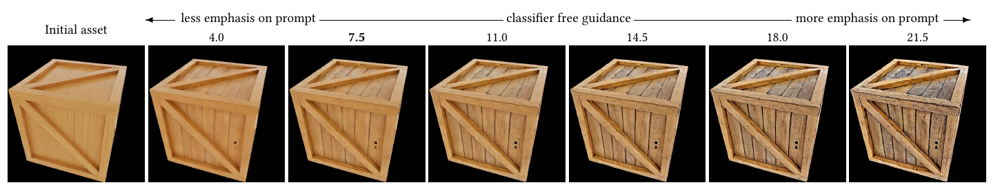
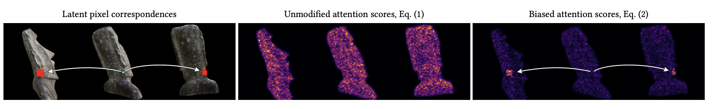
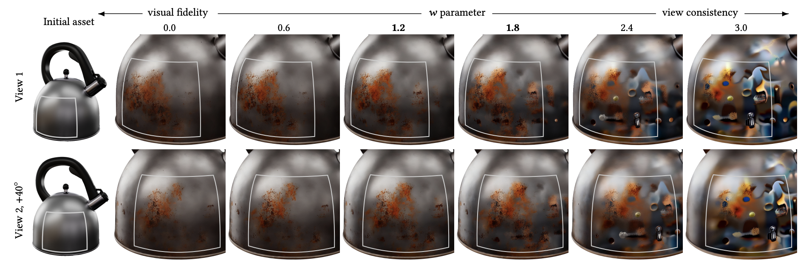

# Generative Detail Enhancement for Physically Based Materials

> **한 줄 요약** : pretrained 2D diffusion으로 multi-view 일관성을 갖춘 detail 이미지 생성 → inverse rendering으로 PBR material reconstruction (training-free)

## 1. 배경

- 3D asset의 기본적인 geometry와 material은 비교적 쉬운 구성이 가능하나, 실제감을 주는 wear, rust, dust, crack, weathering 등 세밀한 material detail은 수작업 제작에 많은 시간 필요
- 대규모 자연 이미지 데이터로 학습된 2D diffusion model은 현실적인 high-frequency visual detail 생성 능력이 뛰어남
- 별도의 3D/material generative model을 새로 학습하는 대신, 기존 2D diffusion prior를 활용하는 방향 채택

### 기존 방식의 문제

- 일반적인 2D diffusion은 각 view를 독립적으로 생성하므로, 같은 3D surface에서도 서로 다른 detail 생성 가능
- multi-view consistency가 깨지면 inverse rendering 시 동일한 texture 위치에 서로 다른 supervision이 들어가 blur, detail 중첩, reconstruction failure 발생 가능
- 기존의 일부 geometry/material-aware 방법은 specialized object/material dataset과 추가 training 필요

### 목표

기존 asset의 geometry와 디자인을 유지하면서, 여러 view에서 일관된 high-frequency appearance detail을 pretrained 2D diffusion으로 생성하고, 이를 최종 PBR material로 reconstruction하는 것

### 포지셔닝

- material detail의 "auto-complete"를 지향하는 human-in-the-loop 도구
- artist를 대체하지 않고, 입력과 출력이 모두 기존 형식(mesh, PBR texture)이므로 기존 workflow로 추가 편집 가능
- 새 dataset과 retraining 불필요, 공개된 pretrained 구성 요소로 구성

## 2. 방법론

### 전체 구조


3단계 구성
1. Forward rendering : asset을 9~16개 view(asset 주변 orbit)에서 렌더링, 색상 이미지와 normal buffer 출력
2. Detail generation : 렌더링 결과를 text prompt와 함께 diffusion model에 입력하여 detail 추가
3. Inverse rendering : 생성된 detail을 원본 material parameter에 reconstruction

### 2-1. Structure-preserving generation : ControlNet

Stable Diffusion 1.5 기반의 공개된 ControlNet Tile + ControlNet Normal 사용

**Tile ControlNet**
- original rendered RGB를 condition으로 사용
- 원래 super-resolution용 ControlNet을 용도를 바꿔 사용 (입력 view를 존중하면서 detail enhancement)
- 기존 color / appearance / overall design을 최대한 유지

**Normal ControlNet**
- geometry에서 렌더링한 normal buffer를 condition으로 사용
- 원래 surface curvature와 geometry-related shading 구조를 보존하도록 유도

**추가 구성**
- 두 ControlNet의 출력을 합산하여 사용
- SDEdit 방식으로, 렌더링 이미지에 사용자가 조절 가능한 양의 noise를 더해 diffusion의 초기 상태로 사용 (noise 양으로 변화 강도 조절)
- Classifier-Free Guidance 값으로 detail 강도 조절 (값이 클수록 prompt 반영 증가)

입력 : Rendered RGB + Normal + Text prompt



### 2-2. Multi-view visual prompting

각 view를 별도로 생성하지 않고, 여러 view를 3×3 또는 4×4 grid 하나로 concatenate하여 동시에 생성

→ 하나의 diffusion forward 내부에서 self-attention이 다른 view의 latent까지 참고 가능하므로, coarse-level multi-view consistency 향상

**문제**
- 단순 grid prompting만으로는 "서로 다른 view의 어떤 pixel이 실제로 같은 3D surface point인가?"를 diffusion이 정확히 파악 불가
- 따라서 fine-scale detail은 여전히 view마다 어긋날 가능성 존재

이를 해결하기 위한 추가 기법 2가지 (2-3, 2-4)

### 2-3. View-correlated noise

- 기존 diffusion : 각 view가 서로 독립된 Gaussian noise 사용 → view마다 diffusion detail이 달라질 가능성 높음
- 해당 논문 : UV space에 공통 Gaussian noise field를 생성하고, 이를 각 camera view로 projection하여 diffusion noise로 사용
  → 같은 3D surface point는 어느 view에서 보이더라도 같은 UV noise source 참조
- 영상 분야의 noise warping(integral noise, Chang et al. 2024) 아이디어에서 출발
- 영상은 view 간 이동이 부드러우나, 여기서는 view가 sparse하고 disocclusion이 크므로 reference view에서 warp하지 않고 UV space에 noise를 고정


주의 : material texture에 noise를 넣는 방식이 아니라, UV space를 공통 좌표계로 사용하여 diffusion용 noise field를 정의하는 방식

**구현 방식** : diffusion은 noise 통계에 매우 민감하므로, view 내부에서 uncorrelated이고 분산이 균일(variance-preserving)해야 함
1. 1024×1024 UV noise texture 사용
2. 각 pixel을 4×4 subpixel로 나누고, subpixel 모서리를 UV space로 projection (supersampling)
3. projection된 subpixel 중심에서 noise를 sampling하여 면적 가중 평균 계산
4. 분산 보정 : projection 면적이 pixel마다 다르고 여러 subpixel이 같은 noise texel에 mapping될 수 있으므로 정규화

```
noise_pixel = Σ_i (f_i · A_i) / sqrt( Σ_i A_i^2 · (1 + Cov_i) )
Cov_i       = max(A_texel / A_i - 1, 0)
A_texel     = 1024^-2
```

- `f_i` : subpixel의 noise 값, `A_i` : projection된 subpixel 면적
- `Cov_i` : 같은 noise 값이 중복 계산되는 정도를 추정하는 공분산 항
- 안전장치 : noise texture가 극단적으로 확대되어 한 texel이 여러 pixel에 걸치는 경우(UV 누락/퇴화 시 발생), 독립 white noise와 부드럽게 blending

### 2-4. Pixel-correspondence Attention Bias

- View-correlated noise만으로는 diffusion 자체의 nonlinearity 때문에 detail의 완전한 일치 불가
- known geometry와 camera 정보를 이용하여, View A의 pixel과 View B의 pixel이 동일한 3D surface point를 보는지 계산

기존 attention 수식


```
Attention(Q, K, V) = softmax(Q K^T / sqrt(d_k)) V
```

- self-attention의 `Q K^T`는 `N × N` score matrix (`N` : 전체 latent pixel 수)
- 항목 `[i, j]`는 latent pixel `i`가 `j`에 attend하는 정도

bias를 추가한 attention 수식 (논문 Eq. 2)

```
Attention(Q, K, V) = softmax((Q K^T + B) / sqrt(d_k)) V
```

- 같은 3D surface를 바라보는 latent pixel pair (i, j)에 `B[i, j] = w`를 추가하여 서로 더 강하게 attention하도록 유도
- 대응 관계가 없는 pair는 `B[i, j] = 0`
- geometry와 camera가 이미 알려진 상태이므로, ray tracing + reprojection으로 correspondence를 사전에 계산하여 사용


**B 생성 절차**
1. latent pixel `j`의 중심을 지나는 ray를 3D scene에 쏴서 첫 hit point `p` 계산
2. `p`를 pixel `i`가 속한 image plane에 projection하여 `q` 계산
3. `p`와 `q`가 서로 보이는지(mutual visibility) 확인
4. `q`가 pixel `i`의 neighborhood `I` 안에 있으면 `B[i, j] = w`
5. U-Net의 attention 층마다 `I`의 크기를 조절하여 원본 image의 같은 크기 patch에 대응 (층 1~4에서 각각 9×9, 5×5, 3×3, 1×1)



**`w`의 trade-off**
- 값이 커질수록 view consistency 향상, 단 너무 크면 diffusion이 이미지 전체를 보는 능력을 잃어 appearance 품질 저하
- 이 scene에서는 1.2~1.8이 균형점, 실험에서 유효 범위는 0~3.5



**메모리와 scalability**
- `N × N` bias matrix를 명시적으로 저장하면 GPU 메모리 초과
- correspondence(pixel 좌표 쌍)는 사전 계산하여 저장, bias는 on-the-fly로 계산
- 테스트한 attention 구현 중 FlexAttention만 16 views / 1024² 규모를 지원
- xFormers는 약 2배 빠르나 9 views 이상, 1024²에서 메모리 초과

| 구성 | 4 views (512²) | 16 views (512²) | 16 views (1024²) |
|---|---|---|---|
| FlexAttention 시간 | 17s | 187s | 2816s |
| FlexAttention 최대 메모리 | 6.2GB | 9.7GB | 20.4GB |

(NVIDIA RTX 5880 기준)

### 2-5. Inverse Rendering

- Diffusion이 생성한 multi-view RGB image를 target image로 사용
- differentiable renderer(Mitsuba 3)를 이용하여 기존 material parameter optimization
- 원본 texture로 초기화하여 수렴 가능성 향상

| 구분 | 항목 |
|---|---|
| 고정 | Geometry, Lighting, Camera |
| optimization | Albedo, Roughness, Normal |

**세부 설정**
- HDR 렌더링 결과에 tone mapping(Reinhard) 적용 후, LDR인 diffusion 결과와 relative L2 loss로 비교
- 부드러운 specular highlight 유지와 zero gradient 방지를 위해 높은 값은 clipping하지 않음
- ControlNet이 실루엣을 정확히 지키지 못해 배경이 object로 "번지는" 현상 대응
  - 사전 계산한 object boundary 근처 pixel은 gradient 전파 차단
  - grazing angle에서는 cosine factor로 loss 축소
  - 가려진 점도 다른 view에서 coverage를 얻으므로 optimization에서 제외되지 않음
- 어떤 differentiable material 정의에도 적용 가능하나, 실험에서는 PBR(Burley 2012)의 albedo, normal, roughness 사용

## 3. 실험

**기존 방법과의 비교** (Kettle, "Rusty scratched kettle")

| 분류 | 방법 | 한계 |
|---|---|---|
| Image generator | SPAD, Diffusion Handles | 입력 geometry를 재현하도록 설계되지 않아 여러 view에서 asset 정확히 렌더링 불가 |
| Image generator | RGB↔X | scene intrinsic을 입력받으나 multi-view consistency 보장 없음 |
| Material generator | DreamMat, Paint-it | SDS 변형 기반, blur한 결과 |
| Material generator | TexPainter | view-dependent effect 불가 |
| Material generator | FlashTex, MaPa | specialized dataset으로 ControlNet 학습 필요 |

- 위 방법들은 material을 처음부터 생성하나, 본 논문은 기존 material의 enhancement가 목적이므로 입력 asset에 더 충실
- Material upscaling 연구(Gauthier et al.)는 flat geometry에 한정되어 object geometry에 맞는 detail 합성 불가

**Ablation** : 아래 순서로 view consistency 향상
1. ControlNet tile만 사용 : appearance는 바뀌나 view consistency 부족
2. + view-correlated noise : view 간 detail 존재 여부는 맞춰지나 일부 misalignment 잔존
3. + attention bias (full model) : consistency 추가 향상

**View consistency와 inverse rendering의 관계**
- 같은 surface에 대해 view마다 다른 detail이 나오면, inverse rendering 결과가 겹쳐 쌓이거나 수렴 실패

## 4. 한계 및 향후 방향

- **view-dependent 효과의 baked-in** : 거울 반사 같은 고주파 view-dependent 효과가 albedo texture에 baked-in 될 수 있음
  - 작은 scale의 view 간 불일치는 inverse rendering이 충돌하는 detail을 겹쳐 쌓는 방식으로 해소
  - 최종 표현은 view-consistent하나, 사용자 의도와 다를 수 있음
  - 해결 방향 : multi-step optimization, video model, 반사 경로 correspondence 추적(manifold walk) 등
- **`w` 수동 튜닝** : 저해상도 이미지에서 빠르게 조절 가능하나, parameter-free 방식이면 더 실용적
- **macro geometry 미개선** : texture map으로 표현 가능한 enhancement만 대상
- **제어 수단 한정** : 현재 text prompt만 제공, CLIP prior나 texture exemplar 등 세밀한 제어는 향후 과제
- **Stable Diffusion 3.x** 등 더 나은 text encoder와 ControlNet으로 교체하는 방안


