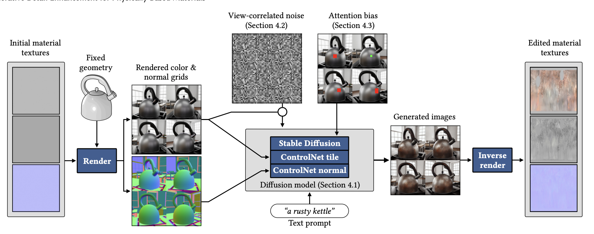
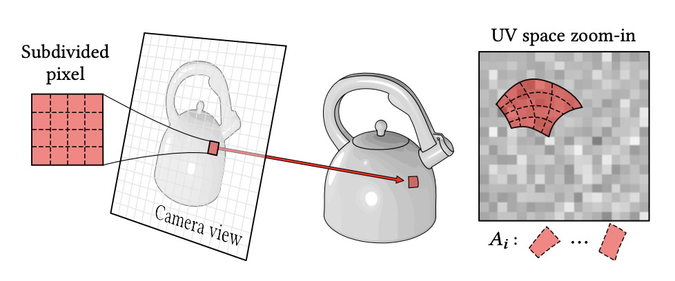
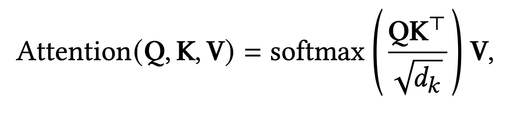
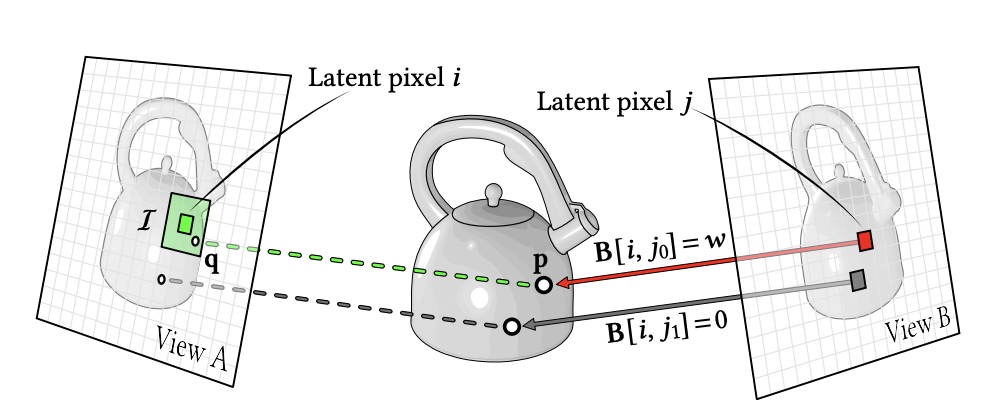
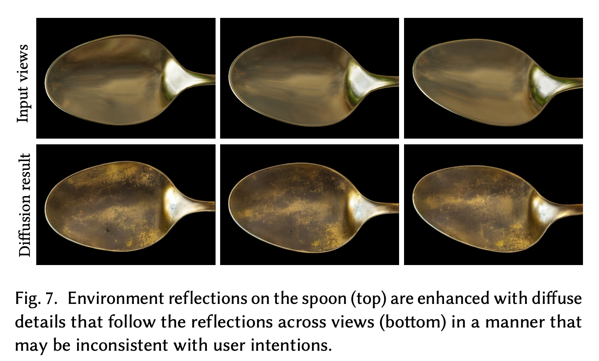

# Generative Detail Enhancement for Physically Based Materials

> **한 줄 요약** : pretrained 2D diffusion으로 multi-view 일관성을 갖춘 detail 이미지 생성 → inverse rendering으로 PBR material reconstruction

## 1. 배경

- 3D asset의 기본적인 geometry와 material은 비교적 쉬운 구성이 가능하나, 실제감을 주는 wear, rust, dust, crack, weathering 등 세밀한 material detail은 수작업 제작에 많은 시간 필요
- 대규모 자연 이미지 데이터로 학습된 2D diffusion model은 현실적인 high-frequency visual detail 생성 능력이 뛰어남
- 별도의 3D/material generative model을 새로 학습하는 대신, 기존 2D diffusion prior를 활용하는 방향 채택

### 기존 방식의 문제

- 일반적인 2D diffusion은 각 view를 독립적으로 생성하므로, 같은 3D surface에서도 서로 다른 detail 생성 가능
- multi-view consistency가 깨지면 inverse rendering 시 동일한 texture 위치에 서로 다른 supervision이 들어가 blur, detail 중첩, reconstruction failure 발생 가능
- 기존의 일부 geometry/material-aware 방법은 specialized object/material dataset과 추가 training 필요

### 목표

기존 asset의 geometry와 디자인을 유지하면서, 여러 view에서 일관된 high-frequency appearance detail을 pretrained 2D diffusion으로 생성하고, 이를 최종 PBR material로 reconstruction하는 것

## 2. 방법론

### 전체 구조



### 2-1. Structure-preserving generation : ControlNet

Stable Diffusion 1.5 기반의 공개된 ControlNet Tile + ControlNet Normal 사용

**Tile ControlNet**
- original rendered RGB를 condition으로 사용
- 기존 color / appearance / overall design을 최대한 유지하면서 detail enhancement 수행

**Normal ControlNet**
- geometry에서 렌더링한 normal buffer를 condition으로 사용
- 원래 surface curvature와 geometry-related shading 구조를 보존하도록 유도

입력 : Rendered RGB + Normal + Text prompt

### 2-2. Multi-view visual prompting

각 view를 별도로 생성하지 않고, 여러 view를 3×3 또는 4×4 grid 하나로 concatenate하여 동시에 생성

→ 하나의 diffusion forward 내부에서 self-attention이 다른 view의 latent까지 참고 가능하므로, coarse-level multi-view consistency 향상

**문제**
- 단순 grid prompting만으로는 "서로 다른 view의 어떤 pixel이 실제로 같은 3D surface point인가?"를 diffusion이 정확히 파악 불가
- 따라서 fine-scale detail은 여전히 view마다 어긋날 가능성 존재

이를 해결하기 위한 추가 기법 2가지 (2-3, 2-4)

### 2-3. View-correlated noise

- 기존 diffusion : 각 view가 서로 독립된 Gaussian noise 사용 → view마다 diffusion detail이 달라질 가능성 높음
- 해당 논문 : UV space에 공통 Gaussian noise field를 생성하고, 이를 각 camera view로 projection하여 diffusion noise로 사용
  → 같은 3D surface point는 어느 view에서 보이더라도 같은 UV noise source 참조



주의 : material texture에 noise를 넣는 방식이 아니라, UV space를 공통 좌표계로 사용하여 diffusion용 noise field를 정의하는 방식

### 2-4. Pixel-correspondence Attention Bias

- View-correlated noise만으로는 diffusion 자체의 nonlinearity 때문에 detail의 완전한 일치 불가
- known geometry와 camera 정보를 이용하여, View A의 pixel과 View B의 pixel이 동일한 3D surface point를 보는지 계산

기존 attention 수식



```
Attention(Q, K, V) = softmax(Q K^T / sqrt(d_k)) V
```

- 같은 3D surface를 바라보는 latent pixel pair (i, j)에 `B[i, j] = w`를 추가하여 서로 더 강하게 attention하도록 유도
- 대응 관계가 없는 pair는 `B[i, j] = 0`
- geometry와 camera가 이미 알려진 상태이므로, ray tracing + reprojection으로 correspondence를 사전에 계산하여 사용



### 2-5. Inverse Rendering

- Diffusion이 생성한 multi-view RGB image를 target image로 사용
- differentiable renderer를 이용하여 기존 material parameter optimization

| 구분 | 항목 |
|---|---|
| 고정 | Geometry, Lighting, Camera |
| optimization | Albedo, Roughness, Normal |

## 한계

- input으로 lighting을 적용해 렌더링한 RGB를 사용하므로 lighting 정보는 어느 정도 보존된다고 볼 수 있으나, 여전히 baked-in lighting 문제 존재


