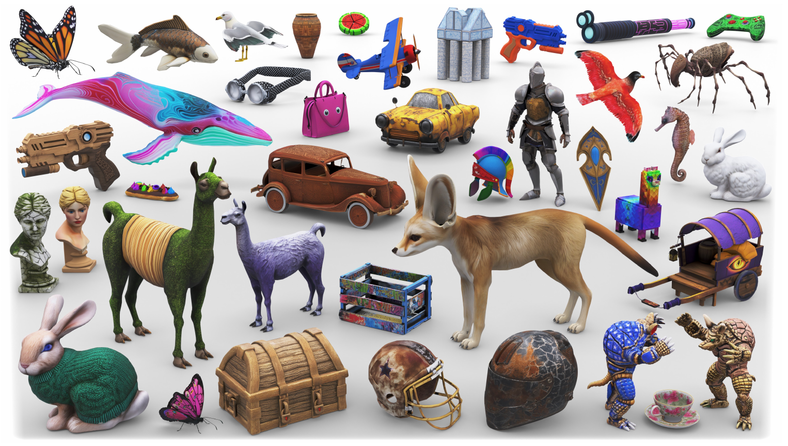
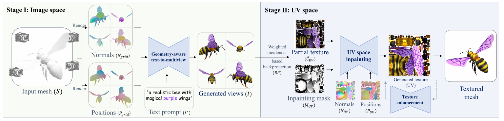
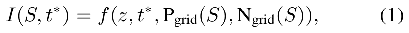
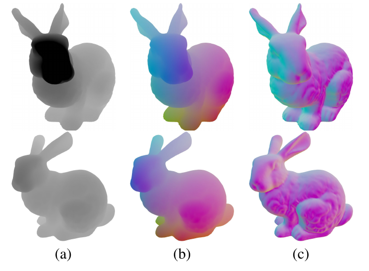
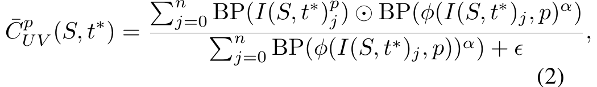
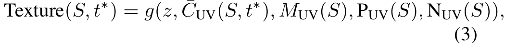

# Meta 3D TextureGen

> **한 줄 요약** : View → UV inpainting  
> Normal/Position 조건의 multi-view 생성 → UV projection → Normal/Position 조건으로 UV hole filling (feed-forward, 20초 이내)



## 1. 배경

**기존 방식의 문제 3가지**
1. Global consistency와 text faithfulness
   - 단일 이미지 생성과 여러 view 생성 사이에는 image-text 관계의 gap 존재
   - text-to-image 모델은 정면 view에 편향되어 있고 3D 이해가 부족
   - 작은 seam부터 대칭성 결여, 전체적인 불일치, Janus effect(얼굴·눈 같은 feature가 여러 곳에 중복 생성)까지 발생
2. 3D shape과의 semantic alignment
   - 미세한 3D 정보를 2D 공간에 일관되게 넣기 어려움
   - 기존 방식 : UV space에서 vertex/normal map 조건(Point-UV Diffusion) 또는 image space에서 depth map 조건(Text2Tex, Paint3D)
   - 정밀한 정렬과 fine detail 보존이 부족하여 복잡한 object에서 quality 저하
3. 추론 속도
   - 반복 생성(수~수천 번의 forward pass, SDS 등)으로 global consistency와 shape coverage 확보
   - 추론 시간이 수 분 단위여서 사용자 생성 콘텐츠나 빠른 iteration에 부적합

**목표**
- global consistency, quality, speed를 동시에 만족하는 texture 생성
- 임의 geometry에 대해 20초 이내, 단 2개의 diffusion 과정만 사용 (interleaved rendering이나 optimization 단계 없음)

**핵심 아이디어**
- text-to-image 모델을 3D semantic(position, normal) 렌더링으로 조건화하여 4개 view를 동시에 생성
  - view들의 통계적 의존성을 함께 반영하므로 Janus problem 같은 global consistency 문제 제거
- 2D에서 position/normal render로 geometry를 명시적으로 조건화한 첫 연구라고 주장

**관련 연구와의 차이**
- TexDreamer, Geometry Aware Texturing : UV space에서 직접 생성하나 각각 사람, 의류에 한정되어 임의 object로 확장 불가
- Point-UV Diffusion : category마다 별도 모델 학습 필요
- TEXTure, Text2Tex, Intex, Paint3D : zero-shot depth-to-image 반복 inpainting, 추론에 수 분 소요, 3D-aware하지 않아 Janus effect 발생
- SyncMVD : view별 diffusion을 매 step 동기화하여 품질은 향상되나 global consistency 문제 잔존
- TexFusion : 매 denoising step 후 latent texture map으로 aggregate하여 일관성 개선
- FlashTex : 유사하게 3D dataset으로 4-view grid 생성, 그러나 SDS optimization 단계 때문에 약 2분 소요

## 2. 방법론



전체 구조 : 2개의 sequential diffusion network
- Stage I (image space) : text와 shape 렌더링을 조건으로 multi-view 이미지 생성
- Stage II (UV space) : incidence 가중 backprojection 결과를 조건으로 UV texture map 완성
- 선택 확장 : texture enhancement network로 4k 해상도 up-scaling

### 2-1. 데이터 표현 (Preliminaries)

**Shape render** : 각 channel을 4개 view로 렌더링하여 하나의 이미지로 이어 붙임

| Channel | 용도 | 설명 |
|---|---|---|
| Combined pass (beauty pass) | 학습 target (추론 시 불필요) | 모든 material 속성 포함 렌더링, 모든 방향에서 균일한 조명(Blender) |
| Position pass | 학습/추론 condition | pixel마다 해당 점의 XYZ 위치, [0, 1] 정규화, 조명 없이 값 그대로 출력 |
| Normal pass | 학습/추론 condition | pixel마다 해당 점의 normal 방향, [0, 1] 정규화, 조명 없이 값 그대로 출력 |

- Combined pass를 조명 포함으로 쓰는 이유 : 나무, 플라스틱, 금속 등 material별 빛 반응이 diffuse color만으로는 표현되지 않음

**UV map**
- UV layout 조건 : 겹치는 UV island 없이 단일 정사각형 texture에 mapping
  - 겹치는 layout은 island를 자동 재배치
  - 적절한 UV가 없는 object는 Blender Smart Project로 새로 생성, 실패하면 데이터에서 제외
- Blender로 combined, position, normal pass를 UV space에 bake
  - combined는 학습 target, position/normal은 condition
- Backprojected texture : Stage I 출력을 흉내 내기 위해, 색상 렌더링을 같은 과정(2-3의 backprojection)으로 UV에 projection하여 학습 입력으로 사용
  - 네트워크 목표는 이 partial view들에서 전체 texture map 복원

### 2-2. Stage I : Image space 생성

- 모델 : Emu와 유사한 구조의 pre-trained latent diffusion model(U-Net 기반)을 fine-tuning한 `f`
- 입력 : 4개 view의 position grid `P_grid(S)`, normal grid `N_grid(S)`, text prompt `t*`
- view 구성 : 90° 간격 4개 view(360° 커버), elevation 20° 고정, 학습과 추론에서 동일



```
I(S, t*) = f(z, t*, P_grid(S), N_grid(S))
```

- `z` : 각 pixel이 i.i.d. 표준 Gaussian인 2D noise map
- 실제로는 diffusion step도 condition으로 입력 (수식에서는 생략)

**Geometry-aware 2D conditioning : depth 대신 position + normal**



- position : view에 의존하지 않는 global 값이므로, 서로 다른 view에서 같은 3D 점의 대응 관계를 제공하여 3D consistency 유도
- normal : surface 방향과 고주파 geometry detail 제공 (depth로는 포착하기 어려움)

### 2-3. Stage II : UV space 생성

목표 : self-occlusion으로 비어 있는 영역을 inpainting하고 전체 품질 개선

**Backprojection과 incidence 기반 weighted blending**
- 낮은 incidence angle(카메라를 정면으로 보지 않는 면)의 생성 결과는 신뢰도가 낮고, 단순 평균 시 고주파 detail(무늬, 글자)에 artifact 발생
- SyncMVD와 유사하게 incidence angle로 가중 평균하여 하나의 UV map으로 blending
- incidence : 시선 방향과 pixel의 normal 사이 각도의 cosine



```
phi(I_i, p) = cos( angle( v_i(p), n(I_i, p) ) )

C_UV(p) = ( Σ_j  BP(I_j)(p) ⊙ BP( phi(I_j, p)^alpha ) ) / ( Σ_j BP( phi(I_j, p)^alpha ) + epsilon )
```

- `v_i(p)` : camera `i`에서 pixel `p`로의 시선 방향, `n` : 해당 pixel의 normal
- `BP` : backprojection 연산, `epsilon` : 0 나눗셈 방지용 작은 상수
- `n = 4`(생성 view 수), `alpha = 6` (모든 실험 공통)

**UV-space inpainting network**
- 문제 : Stage I의 backprojection 결과는 sparse함
  - 선택한 view가 shape을 충분히 커버하지 못해 생기는 occlusion 영역
  - 생성된 렌더링과 UV map 사이에 pixel 일대일 대응이 없어 생기는 pixel 단위 hole
- 모델 : Stage I과 같은 pre-trained network를 fine-tuning한 `g`
- 입력 : blending된 partial texture `C_UV`, inpainting mask `M_UV`, position UV map `P_UV`, normal UV map `N_UV`



```
Texture(S, t*) = g(z, C_UV(S, t*), M_UV(S), P_UV(S), N_UV(S))
```

### 2-4. Texture enhancement network (선택)

- 기본 출력은 1024×1024, 응용에 따라 4k(4096×4096) 필요
- 임의 비율로 texture를 up-scaling하는 patch 기반 network (본 논문의 평가에서는 공정한 비교를 위해 사용하지 않음)
- patch 기반 이유 : GPU 메모리 한계로 4k 이미지를 한 번에 생성 불가
- patch 간 불일치(seam, 전체 pattern/색 불일치) 문제는 MultiDiffusion을 1D(panorama)에서 2D(정사각형 이미지)로 확장하여 해결
  - latent patch들을 aggregate하고 매 diffusion step에서 Gaussian 가중 평균 적용
  - encoder-decoder에는 tiled-VAE 방식 적용하여 고해상도 encoding/decoding 가능
- Real-ESRGAN 구조에서 영감을 받은 degradation pipeline 사용
  - Real-ESRGAN의 over-smoothing, 과도한 sharpening, ringing artifact를 피하기 위해 architecture를 diffusion model로 변경
  - Unsharp Masking과 additive Gaussian noise를 degradation에서 제외
- 학습 28k step, 추론 DDIM 50 step, 단 L1 loss 사용

### 2-5. 학습 설정

- 모든 모델이 같은 base text-to-image model(1024×1024 해상도)에서 fine-tuning
- 여러 condition은 원본 image encoder로 encoding한 뒤 channel 방향으로 concatenate
  - 첫 convolution layer에 입력 channel을 추가하고 weight는 0으로 초기화
- loss : Stage I은 L2, Stage II와 texture enhancement는 L1
- v-prediction 사용, noise schedule을 zero terminal SNR로 rescale
  - 렌더링 배경과 UV map의 mapping되지 않은 pixel처럼 background가 넓은 데이터에 유리
- learning rate 1e-5, batch size 256, H100 GPU 32장
- Stage I과 II는 각각 15k step, 추론은 DDPM solver 60 step

## 3. 실험

**데이터**
- 학습 : 사내 보유 260k textured 3D object, caption은 Cap3D와 유사한 방식으로 추출
- 평가 : Sketchfab(CC 라이선스, No-AI 태그 제외) 54개 + Stanford 3D Scanning Repository 2개
  - object마다 창의적 prompt 4개(user study용) + 원본 texture를 설명하는 prompt 1개(FID/KID용)

**비교 대상** : TEXTure, Text2Tex, SyncMVD, Paint3D, Meshy 3.0(상용)

**정량 결과**

| Method | Preference ↑ | Artifacts ↑ | FID ↓ | KID (×10⁻³) ↓ | Runtime ↓ |
|---|---|---|---|---|---|
| TEXTure | 78.5% | 76.5% | 91.4 | 8.4 | 90s |
| Text2Tex | 81.9% | 84.2% | 92.1 | 6.9 | 287s |
| SyncMVD | 67.4% | 66.7% | 77.7 | 3.8 | 81s |
| Paint3D | 78.9% | 79.5% | 86.1 | 5.2 | 66s |
| Meshy 3.0 | 64.5% | 68.4% | 99.7 | 10.7 | 85s (API 기준 추정) |
| Meta 3D TextureGen | - | - | 73.0 | 3.6 | 19s |

- Preference, Artifacts : 해당 baseline 대비 본 방법이 선택된 비율 (text 반영 정도와 artifact가 적은 정도)
- FID/KID : 정답 textured mesh와 생성 결과를 32개 view에서 렌더링하여 비교
- baseline runtime은 동일한 환경에서 측정한 값이 아님(원 논문 수치보다 빠르게 측정되었으나 GPU 환경이 다름)

**User study**
- 360° 회전 영상 2개를 나란히 비교, 순서와 좌우 무작위화
- 33명 참여(3D artist 10명, 3D 경험 있음 18명, 없음 5명), 754개 응답, max-voting으로 결정
- 모든 baseline 대비 선호도와 artifact 항목에서 우세

**Ablation**

| 구성 | 결과 |
|---|---|
| (a) Stage I 제거 (UV space만) | position/normal UV map과 text만 조건으로 학습, 3D semantic을 UV map으로만 받아 text alignment 문제와 UV fragment 경계의 seam 발생 |
| (b) Stage II 제거 (backprojection만) | view 4개가 shape 전체를 커버하지 못해 칠해지지 않은 영역 발생, backprojection 결과 품질도 저하 (Stage II는 occluded 영역 inpainting뿐 아니라 기존 영역 refinement와 artifact 완화 역할) |
| (c) 단순 평균 blending | 흐릿한 영역 발생, fine detail 부족 |
| (d) 제안 방법 | - |
| (e) 제안 방법 + texture enhancement | 4k 해상도에서 더 세밀한 detail |

**기타**
- 다양한 prompt(현실적인 것부터 매우 환상적인 것까지) 생성 가능
- 생성한 texture로 VR 환경(현실적, stylized)을 구성하는 응용 시연

## 4. 한계

- PBR material map(tangent normal, metallic, roughness) 생성 미지원 (future work)
- 현재 가장 빠른 방법이나 real-time은 아님
  - 병목은 text-to-image forward pass
  - ImagineFlash 같은 가속 기법을 적용하면 real-time 가능성
- global consistency에는 3D dataset 학습이 필수이나, 3D dataset 규모는 image/video dataset보다 작아 대규모 모델 학습에 제약
