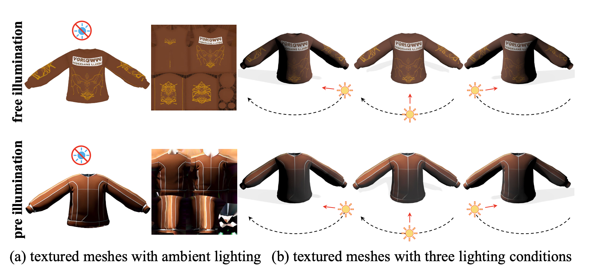
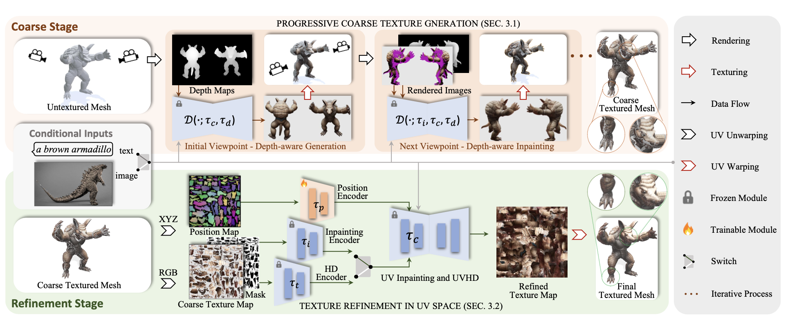
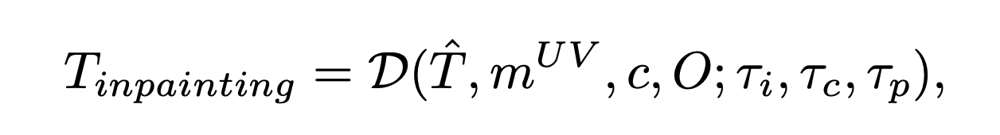
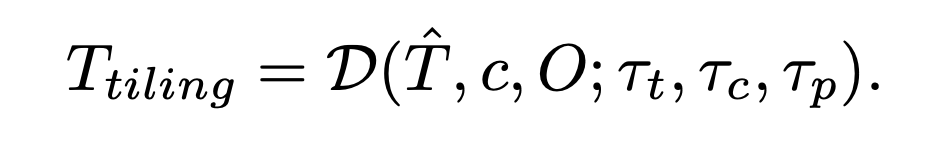

# Paint3D

> **한 줄 요약** : View → UV refinement  
> view에서 coarse texture 생성 → UV space에서 hole filling + 조명(lighting) 제거

## 1. 배경

**기존 문제**
- 2D diffusion model을 그대로 3D texturing에 사용하면, 시점마다 생성 이미지가 달라지는 현상 발생
- 그 결과 multi-view inconsistency, texture stretching, seam/blurry artifact 발생

**목표**
- 2D diffusion의 강력한 생성 능력을 사용하면서, 여러 시점에서 일관되고 고품질인 3D texture를 생성하는 것



## 2. 방법론

### 2-1. Coarse Texture Generation

1. 여러 camera view에서 mesh의 Depth Map 렌더링
2. pretrained depth-aware 2D diffusion model에 text/image condition + depth를 입력하여, 해당 view의 realistic한 RGB 이미지 생성
3. 생성된 RGB를 mesh 표면에 back-projection하여 UV texture에 반영

한 번에 끝내지 않고 여러 viewpoint를 traversal하며 UV를 점진적으로 채우는 방식
- view 1 생성 → UV에 projection
- view 2에서 아직 칠해지지 않은 부분 inpainting → UV에 projection
- 이후 반복

논문에서는 기본적으로 6개의 주요 view 사용

### 2-2. UV-space Texture Refinement

**Coarse texture의 문제**
1. 여러 view에서 생성하는 과정에서, occluded region에 texture hole 발생
2. 2D diffusion 이미지에 그림자, 하이라이트 같은 조명 정보가 이미 포함됨



두 문제를 해결하기 위해 아래 두 모델로 texture refinement 수행

#### UV Inpainting

: position map을 추가 condition으로 받아 UV map을 예측하는 ControlNet 모델

- ControlNet과 동일하게 기존 모델은 freeze, position map을 처리하는 부분만 학습
- `T` : 기존 UV texture
- `O` : UV에 XYZ를 rasterize한 position map (mesh 위 3D 위치 표현)
- (T, O) pair를 만들어 `T`를 ground truth target, `O`를 condition으로 사용
- hole 부분에 대해서만 동작



```
T_inpainting = D(T_hat, m_UV, c, O ; tau_i, tau_c, tau_p)
```

입력 항목
1. `T_hat` : 앞 단계에서 생성한 coarse texture
2. `m_UV` : Hole Mask
3. `c` : Text/Image condition
4. `O` : Position Map

`D`는 diffusion model, `tau_i` / `tau_c` / `tau_p`는 각각 Inpainting Encoder / 기존 diffusion model / Position Encoder (전체 pipeline 그림 참고)

#### UVHD (UV High Definition)

: blur, 낮은 detail, shadow, highlight 등 남은 문제를 처리하는 모델

- ControlNet에서 제공하는 image high-definition domain encoder 사용
- 3D object와 high-quality illumination-free texture를 supervision으로 학습
- 학습 target 자체가 illumination-free UV texture이므로, diffusion이 해당 UV texture distribution을 학습하면 lighting-less prior 확보 가능하다는 논리
- UV Inpainting과 달리 mask 입력 없음



```
T_tiling = D(T_hat, c, O ; tau_t, tau_c, tau_p)
```

입력 항목
1. `T_hat` : 현재 UV texture
2. `c` : appearance condition
3. `O` : Position Map

`tau_t`는 HD Encoder

## 추가 정보

- 데이터 : Objaverse의 textured mesh 사용
- 제외 대상 : texture가 없는 mesh, monochromatic mesh, 여러 mesh로 구성된 scene object 등
- 약 105,301개의 mesh 선별, 그중 105,000개를 Position Encoder training에 사용
