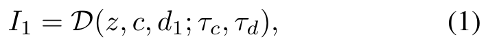
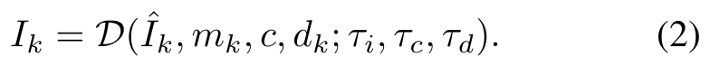
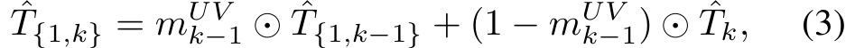
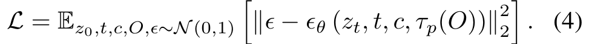

# Paint3D

> **한 줄 요약** : View → UV refinement  
> view에서 coarse texture 생성 → UV space에서 hole filling + 조명(lighting) 제거 (lighting-less 2K UV texture)


## 1. 배경

**핵심 문제 2가지**
1. 다양한 object와 prompt에 대한 generalization
2. pre-training에서 딸려온 illumination(조명) 정보 제거

**기존 방식의 한계**
- 2D diffusion 기반 방법(TEXTure, Text2Tex) : 고품질 texture를 생성하나 shadow/highlight가 texture에 이미 포함된 pre-illumination 문제 존재
  - 조명을 바꾸면 부적절한 그림자가 생겨, 기존 graphics pipeline(PBR 등)에서 재사용 불가
- 2D diffusion은 view domain에서만 결과를 만들므로 3D shape에 대한 이해가 없어 view consistency 유지 어려움
- 3D data로 학습한 방법(Point-UV Diffusion, Mesh2Tex 등) : 학습한 category를 벗어나면 generalization 부족, text/image prompt에 따른 다양한 texture 생성 어려움

**목표**
- 2D diffusion의 강력한 생성 능력을 사용하면서, 여러 시점에서 일관되고 고품질이며 lighting-less인 2K UV texture를 생성하는 것
- lighting-less texture는 relighting과 re-editing이 가능하여 기존 graphics pipeline과 호환


## 2. 방법론

**전체 구조** : coarse-to-fine 2단계

```
T = P(M, c) = F(C(M, c))
```

- `M` : untextured mesh, `c` : appearance condition (text 또는 image)
- `C` : coarse texture generation stage, `F` : texture refinement stage

**기호 정리** : `D(·; tau)`는 conditional diffusion model, `tau`는 조건별로 교체 가능한 domain-specific encoder

| 기호 | 의미 |
|---|---|
| `tau_c` | appearance encoder |
| `tau_d` | depth encoder |
| `tau_i` | inpainting encoder |
| `tau_p` | position encoder (새로 학습하는 부분) |
| `tau_t` | image enhance(HD) encoder |

### 2-1. Coarse Texture Generation

1. 여러 camera view에서 mesh의 Depth Map 렌더링
2. pretrained depth-aware 2D diffusion model에 text/image condition + depth를 입력하여, 해당 view의 realistic한 RGB 이미지 생성
3. 생성된 RGB를 mesh 표면에 back-projection하여 UV texture에 반영

한 번에 끝내지 않고 여러 viewpoint를 traversal하며 UV를 점진적으로 채우는 방식
- view 1 생성 → UV에 projection
- view 2에서 아직 칠해지지 않은 부분 inpainting → UV에 projection
- 이후 반복

**첫 번째 view** : depth 조건만으로 이미지 생성



```
I_1 = D(z, c, d_1 ; tau_c, tau_d)
```

- `z` : 랜덤 초기화된 latent, `d_1` : 첫 view의 depth map

**이후 view** : 이미 칠해진 영역은 유지하고 비어 있는 영역만 inpainting



```
I_k = D(I_hat_k, m_k, c, d_k ; tau_i, tau_c, tau_d)
```

- `I_hat_k` : 현재 view에서 렌더링한 부분 채색 RGB 이미지, `m_k` : 아직 칠해지지 않은 영역의 mask
- 현재 view의 texture를 UV에 합칠 때는 기존 영역 유지, 빈 영역만 갱신



```
T_hat_{1,k} = m_UV_{k-1} ⊙ T_hat_{1,k-1} + (1 - m_UV_{k-1}) ⊙ T_hat_k
```

- `m_UV_{k-1}` : 이전 단계까지 UV에서 칠해진 영역의 mask

**Multi-view Texture Sampling**
- 한 번의 diffusion 과정에서 대칭인 camera 2개의 view를 함께 샘플링
- 두 depth map(렌더링 이미지, mask 포함)을 가로로 이어 붙여 1×2 grid로 만든 뒤, 단일 이미지 대신 grid를 입력
- 기본 설정은 axis-aligned 주요 view 6개 (대칭 쌍으로 처리)

**View 수 ablation** (Total : 전체 view 수, One Iter : 한 번에 샘플링하는 view 수)

| Total | One Iter | FID ↓ | KID (×10⁻³) ↓ |
|---|---|---|---|
| 2 | 1 | 42.31 | 11.67 |
| 4 | 1 | 36.07 | 7.85 |
| 6 | 1 | 29.02 | 5.10 |
| 8 | 1 | 30.15 | 5.65 |
| 2 | 2 | 41.74 | 10.19 |
| 4 | 2 | 32.60 | 6.37 |
| 6 | 2 | 27.28 | 4.81 |
| 8 | 2 | 27.71 | 4.93 |

- view가 많을수록 좋은 것은 아님 (pretrained 2D diffusion이 illumination artifact를 더 많이 누적)
- 6개에서 최적, 한 번에 2개 view를 샘플링하면 추가 개선

### 2-2. UV-space Texture Refinement

**Coarse texture의 문제**
1. 여러 view에서 생성하는 과정에서, occluded region에 texture hole 발생 (self-occlusion)
2. 2D diffusion 이미지에 그림자, 하이라이트 같은 조명 정보가 이미 포함됨


두 문제를 해결하기 위해 아래 두 모델로 texture refinement 수행 (UV Inpainting → UVHD 순서)

**UV space refinement의 어려움**
- UV mapping은 연속적인 3D surface texture를 여러 fragment로 자르므로, fragment 간 3D 인접 관계 학습이 어려움
- 그 결과 texture 불연속 발생 가능
- 해결 : 3D 인접 정보를 담은 position map을 diffusion의 condition으로 추가

#### Position Encoder

- position map `O` : UV space에서 각 pixel이 3D 점 좌표(XYZ)를 담은 이미지
- 기존 image diffusion model에 position map encoder `tau_p`를 추가
- ControlNet 설계 원칙을 따라, 기존 encoder와 동일한 구조를 zero-convolution layer로 연결
- 기존 denoiser는 freeze, position encoder `tau_p`만 학습
- UV space의 texture는 원래 lighting-less이므로, 데이터 분포에서 lighting-less prior를 학습

학습 loss



```
L = E[ || epsilon - epsilon_theta(z_t, t, c, tau_p(O)) ||^2 ]
```

- `T` : 기존 UV texture, `O` : UV에 XYZ를 rasterize한 position map (mesh 위 3D 위치 표현)
- (T, O) pair를 만들어 `T`를 ground truth target, `O`를 condition으로 사용

#### UV Inpainting

: position map을 추가 condition으로 받아 UV map을 예측하는 ControlNet 모델

- 목적 : rendering 중 projection이 닿지 않은 blind spot의 texture hole 채우기 (예 : 주름치마 안쪽)
- ControlNet과 동일하게 기존 모델은 freeze, position map을 처리하는 부분만 학습
- hole 부분에 대해서만 동작
- UV space에서 수행하므로 occlusion 문제 없음


```
T_inpainting = D(T_hat, m_UV, c, O ; tau_i, tau_c, tau_p)
```

입력 항목
1. `T_hat` : 앞 단계에서 생성한 coarse texture
2. `m_UV` : Hole Mask
3. `c` : Text/Image condition
4. `O` : Position Map

#### UVHD (UV High Definition)

: blur, 낮은 detail, shadow, highlight 등 남은 문제를 처리하는 모델

- ControlNet에서 제공하는 image high-definition domain encoder(`tau_t`) 사용
- 3D object와 high-quality illumination-free texture를 supervision으로 학습
- 학습 target 자체가 illumination-free UV texture이므로, diffusion이 해당 UV texture distribution을 학습하면 lighting-less prior 확보 가능하다는 논리
- UV Inpainting과 달리 mask 입력 없음
- 기존 texture detail을 강화하고, monochromatic 영역에는 새로운 texture까지 생성 가능


```
T_tiling = D(T_hat, c, O ; tau_t, tau_c, tau_p)
```

(논문 표기 그대로 `T_tiling`, UVHD의 출력)

입력 항목
1. `T_hat` : 현재 UV texture
2. `c` : appearance condition
3. `O` : Position Map

## 3. 구현 및 실험

**구현**
- backbone : Stable Diffusion v1.5 text2image
- image condition : IP-Adapter의 image encoder 사용
- depth, inpainting, high definition 조건 : ControlNet의 domain encoder 사용
- denoising strength : coarse 단계 1, refinement 단계 0.75
- PyTorch + Kaolin(rendering, texture projection)
- UV unwarping : mesh에 UV 좌표가 있으면 원본 사용, 없으면 UV-Atlas 도구 사용

**데이터**
- Objaverse의 textured mesh 사용
- 제외 대상 : texture가 없는 mesh, monochromatic mesh, 여러 mesh로 구성된 scene object 등
- 약 105,301개의 mesh 선별, 그중 105,000개를 Position Encoder training에 사용, 301개를 평가에 사용
- 실제 환경에서 모은 30개를 더해 총 331개로 평가

**Text-to-texture 정량 결과**

| Method | FID ↓ | KID (×10⁻³) ↓ | Overall Quality ↑ | Text Fidelity ↑ |
|---|---|---|---|---|
| Latent-Paint | 62.22 | 15.81 | 2.83 | 3.29 |
| TEXTure | 43.13 | 11.13 | 3.36 | 4.12 |
| Text2Tex | 38.93 | 7.94 | 3.57 | 4.27 |
| Paint3D | 27.28 | 4.81 | 4.45 | 4.74 |

- FID 29.93%, KID 39.42% 개선
- user study : 30명, mesh 60개, 1~5점 척도
- 모든 baseline은 pre-illumination texture를 생성하여 relighting 시 부적절한 그림자 발생

**Image-to-texture 정량 결과**

| Method | FID ↓ | KID (×10⁻³) ↓ | Overall Quality ↑ | Image Fidelity ↑ |
|---|---|---|---|---|
| TEXTure | 40.83 | 9.76 | 3.56 | 3.73 |
| Paint3D | 26.86 | 4.94 | 4.71 | 4.89 |

**Ablation : 모듈별 효과**

| Coarse | UV Inpainting | UVHD | FID ↓ | KID (×10⁻³) ↓ |
|---|---|---|---|---|
| ✓ | - | - | 41.84 | 10.91 |
| - | ✓ | ✓ | 48.81 | 11.98 |
| ✓ | ✓ | - | 37.84 | 7.13 |
| ✓ | - | ✓ | 33.42 | 6.19 |
| ✓ | ✓ | ✓ | 27.28 | 4.81 |

- coarse stage 없이 UV space에서 바로 생성하면, texture fragment가 분리되어 있어 semantic confusion 발생
- refinement stage 없으면 texture가 pre-illuminated 상태로 남음
- UV Inpainting을 bilinear interpolation으로 대체하면 성능 저하

## 4. 한계

- coarse 단계의 multi-face problem
  - pretrained 2D diffusion이 multi-view data로 학습되지 않아 view 간 texture 불일치 발생
  - 실패 사례의 주요 원인
- PBR material map 생성은 여전히 어려움 (현대 PBR pipeline에서 일반적으로 사용)
- optimization 기반 3D 생성 방법과 달리 geometry의 생성이나 편집 불가
