# TEXGen

> **한 줄 요약** : 3D mesh의 UV texture map 자체를 diffusion model이 직접 생성하도록 학습한 모델 (feed-forward, test-time optimization 없음)

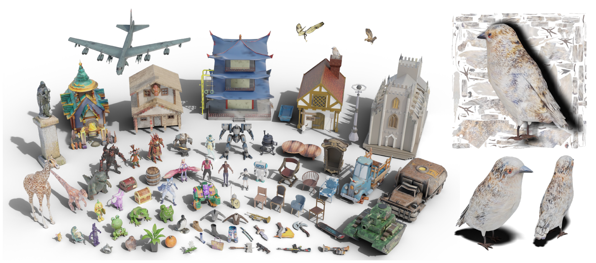

## 1. 배경

**기존 문제**
- 2D diffusion 기반 방법 : 여러 view를 순차적으로 생성·projection해야 하므로 속도가 느리고, view 간 불일치나 Janus problem 발생 가능
- 기존 UV 생성 모델 : 특정 object category에 한정되며, 일반적인 3D object로의 확장이 어려움
- Paint3D : 일반 object를 다루나 2단계 pipeline이며, 문제가 남음
  - 초기 texture 생성에 test-time optimization 필요
  - 학습된 diffusion model은 lighting 제거와 hole filling만 수행
  - 단계 간 quality 손실이 누적되어 최종 detail 저하

> **Janus problem** : 3D 물체의 여러 방향에 같은 semantic feature가 중복 생성되는 현상

**목표**
- Mesh + text + single-view image를 입력받아 전체 1024×1024 UV texture map을 직접 생성하는 general-purpose texture diffusion model 구축


## 2. 방법론

### 2-1. Representation for Texture Synthesis

- UV Texture Map을 2D 이미지처럼 사용하여 diffusion model에 바로 입력
- 2D convolution의 효율적 적용 가능 (texture feature 추출 및 학습 가능)
- ground-truth texture map으로 직접 supervision 가능하여 diffusion 학습과 호환

**문제점**
- UV mapping은 3D surface를 여러 개의 UV island로 잘라 펼친 결과물
- 실제 3D surface의 neighborhood 관계가 깨질 가능성 존재
  - `S1`과 `S2` : 3D surface에서는 인접하나 UV map에서는 멀리 떨어짐
  - `S1`과 `S3` : UV map에서는 가까우나 3D surface에서는 연결되어 있지 않음

→ 해결 : 2D UV space의 high-resolution feature learning + 3D point space의 global consistency 결합


### 2-2. Model Construction

- UNet 구조 기반
- 각 stage에 Hybrid 2D-3D block 사용 (해당 논문에서 설계)
- 5 stage 구성 (4 downsampling + 4 upsampling)
  - 첫 stage : UV block만 사용 (효율)
  - 둘째 stage : hybrid block이되 point attention을 sparse convolution으로 대체
  - 나머지 3 stage : hybrid block 전체 사용

#### 입력

| 기호 | 의미 |
|---|---|
| `x_t` | noise가 추가된 texture map |
| `x_pos` | mesh에서 rasterization하여 얻은 position map |
| `x_mask` | UV 영역 mask |
| `I` | single-view condition image |
| `c` | text prompt |
| `t` | diffusion timestep |

#### Image Condition 처리

- Single-view image의 pixel을 mesh surface에 projection한 뒤, 이를 다시 UV space로 옮김 → `x_I`
- 현재 camera에서 보이는 부분의 texture만 채워지고, occluded region은 빈 상태
- image `I`, text `c`, timestep `t`를 각각 CLIP, Text Encoder, Learnable Timestep Embedding (MLP)에 통과시킨 후 결합하여 global condition embedding `y` 생성

#### Hybrid 2D-3D Block


1. **UV Head Block** : 입력 UV를 2D convolution block으로 feature 추출 (위 그림 (c) 참고)
   - 2D convolution은 3D convolution이나 point cloud KNN보다 효율적이며, 고해상도로 확장 용이
   - island 내부에서는 volumetric neighborhood가 아닌 surface neighborhood 기준으로 feature 집계
2. **UV → 3D point** : 추출한 feature를 rasterization으로 3D point cloud feature에 mapping
3. **Grid Pooling** : point 수 축소 (dense → sparse)
4. **Serialized Attention**
   - Point cloud는 image와 달리 정해진 순서가 없으므로, space-filling curve를 이용해 point를 serialization
   - 사용 방식 : Z-order curve, Hilbert curve (아래 추가 내용 참고)
   - serialized code 기준으로 group/patch 구성 후 self-attention에 입력
5. **Position Encoding**
   - 3D 위치 정보를 제대로 활용하기 위한 단계
   - 계산량이 크므로 channel을 줄여 적용 (sCPE 사용)
6. **Condition Modulation** : 앞에서 생성한 global condition embedding을 MLP를 통해 UV Head block, Point block에 모두 주입 (DiT 방식)
7. **Point → UV 및 Fusion**
   - Point block에서 처리된 sparse point feature를 원래 dense coordinate로 scatter
   - mesh의 UV↔3D correspondence를 이용해 다시 UV space로 가져옴
   - UV branch에서 얻은 feature와 fusion

**Condition Modulation 수식**

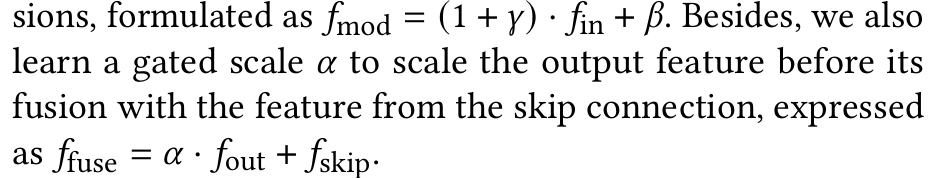

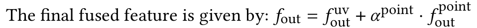

- `gamma`, `beta`, `alpha`, `alpha_point` : condition embedding `y`에서 MLP로 학습
- `f_skip` : skip connection feature

### 2-3. Diffusion Learning

- 기존 Stable Diffusion 학습 방식을 기반으로 하되 아래 설정 사용
  - zero-terminal SNR noise scheduler (`alpha_bar_t = 0` at `t = 1000`) : 학습과 추론의 시작점 간 gap 제거
  - v-prediction 사용
  - soft-min-SNR weighting `lambda_t` 적용
- 학습 중 text embedding과 image embedding을 확률 `p = 0.2`로 drop하여 CFG (Classifier-Free Guidance) 사용 가능하게 구성

**Loss**

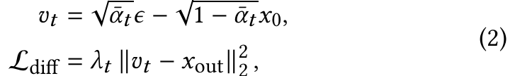

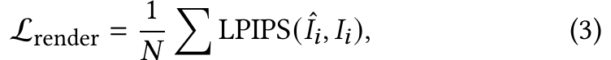

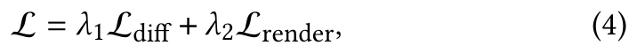

- `L_diff` : v-prediction 기준으로 target texture 복원 정도를 비교하는 loss
- `L_render` : v-prediction 출력에서 얻은 `x0_hat`을 mesh에 입혀 랜덤 viewpoint에서 렌더링한 `I_hat_i`와 ground truth `I_i`를 비교하는 LPIPS loss (multi-view 정합성 supervision)

### 2-4. 추론 및 응용 (training-free)

**추론**
- UV space의 pure Gaussian noise texture map에서 시작하여 DDIM 30 step으로 iterative denoising
- 최적 CFG weight는 `ω = 2.0` (일반 image diffusion의 7.5와 다름)

**Text-to-texture**
- text만 있는 경우, 임의 viewpoint에서 depth map을 렌더링하고 depth ControlNet으로 single-view image 생성 후 입력
- image는 text에서 쉽게 얻을 수 있으나 text-conditioned model은 image가 주는 control이 없어, image-conditioned model로 학습

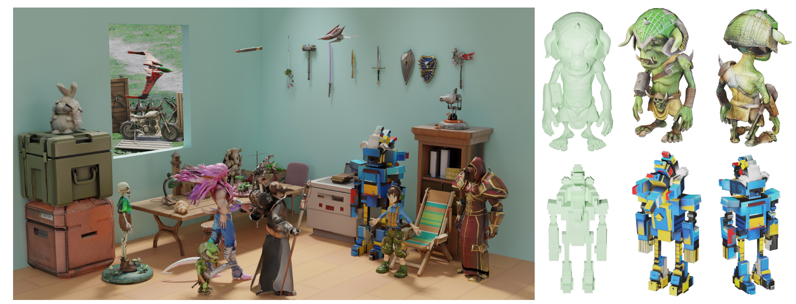

**Texture inpainting**
- 사용자가 준 partial texture map과 mask를 `x_I`로 직접 입력 (single-view projection 단계 생략)
- image embedding은 zero embedding으로 대체 (학습 중 random drop 덕분에 동작)

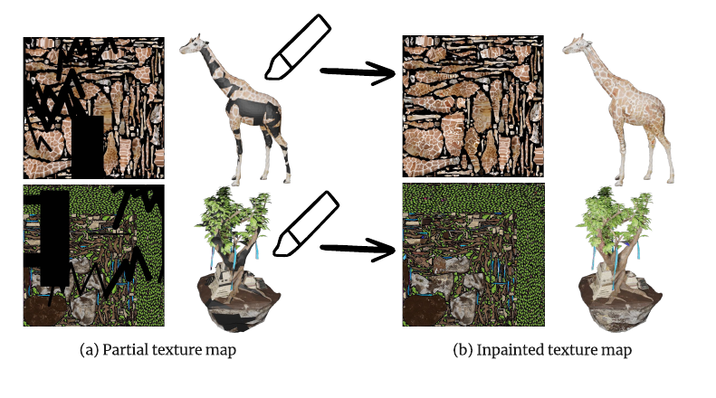

**Sparse-view texture completion**
- 여러 장(예 : 앞/뒤)의 image를 각각 projection하여 fusion
- image embedding 추출용으로는 한 장을 랜덤 선택
- 보이지 않는 영역을 채워 전체 texture map 복원

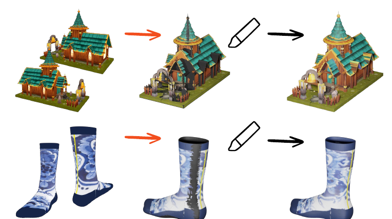

## 3. 실험

**데이터**
- Objaverse(800K+ mesh)에서 120,400개 선별 : 학습 120,000 / 평가 400
- 전처리
  - texture quality가 낮은 mesh 제외
  - xAtlas로 UV를 재전개하여 단일 UV atlas로 통일
  - 원본의 diffuse color를 새 UV에 bake
  - Gemini로 렌더링 이미지 기반 caption 생성
- 모델 규모 : 700M parameter

**정성 결과**

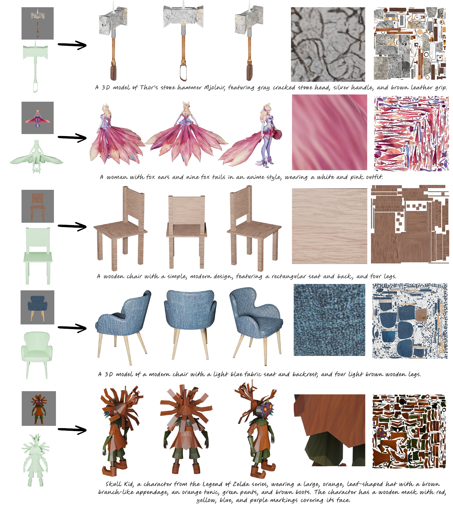

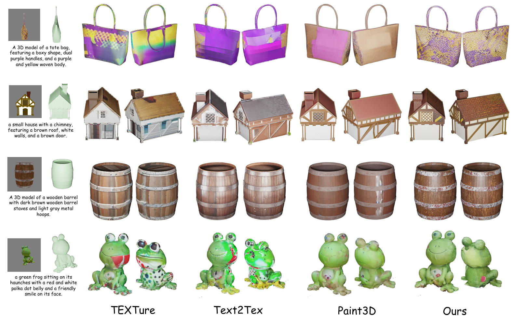

**정량 결과 (400개 test object)**

| Method | FID ↓ | KID (×10⁻⁴) ↓ | Time ↓ |
|---|---|---|---|
| TEXTure | 48.31 | 48.00 | 80s |
| Text2Tex | 49.85 | 47.38 | 344s |
| Paint3D | 43.55 | 25.73 | 95s |
| TEXGen | 34.53 | 11.94 | 10s |

- 추론 시간은 A100 1장 기준
- Janus problem 회피 (3D data와 3D representation으로 학습한 효과)

**Text-conditioned 평가** (user study 423 응답, MLLM score)

| Method | Paint3D | TEXTure | Text2Tex | TEXGen |
|---|---|---|---|---|
| Preference (%) | 16.5 | 7.1 | 7.1 | 69.3 |
| MLLM Score | 64.8 | 69.8 | 64.8 | 74.2 |

**Ablation : Hybrid block** (house category, 학습 10,000 / 평가 100, parameter 수 동일)

| Model | FID ↓ | KID (×10⁻⁴) ↓ | 특징 |
|---|---|---|---|
| A : Hybrid block | 69.74 | 17.89 | 일관성과 detail 모두 양호 |
| B : w/o point block | 72.58 | 25.52 | 스타일 불일치, seam artifact |
| C : w/o UV block | 94.22 | 159.94 | 일관적이나 high-frequency detail 부족 (blur) |

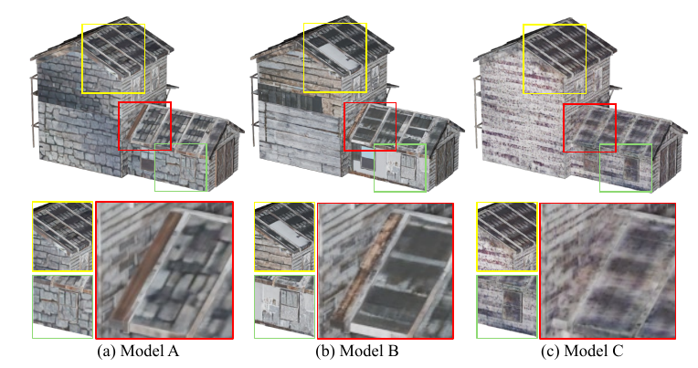

**Ablation : CFG weight** (`ω`)

| ω | 1 | 1.5 | 2 | 3 | 4 | 5 | 7.5 |
|---|---|---|---|---|---|---|---|
| FID ↓ | 35.01 | 34.73 | 34.53 | 35.19 | 35.69 | 36.69 | 39.58 |
| KID ↓ | 15.06 | 13.00 | 11.94 | 11.71 | 13.03 | 14.53 | 24.45 |

## 4. 한계 및 향후 방향

- 학습에 쓴 condition image가 pose-aligned, shape-aligned
  - 임의 image로 texture를 "transfer"하려는 경우에는 부적합
  - pixel projection 대신 cross-attention으로 dense image 정보를 넣는 방식 제안
  - 어려움은 적합한 dataset 구축
- 향후 PBR material map 생성으로 확장 계획
- feed-forward model이므로 model compression, consistency distillation 등 추론 가속 적용 가능

## 추가 내용

### Serialization

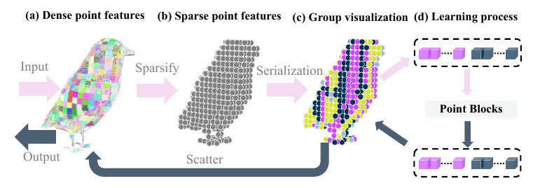

**Z-order curve**
- 3D coordinate를 grid coordinate로 quantization한 상태를 전제로 하는 방식
- 각 축 좌표의 bit를 번갈아 끼워 넣어(interleave) 1차원 code 생성 (Morton code, 논문 외 일반 지식으로 보충)
- 논문에는 상세 설명 없음, 참고 : Point Transformer V3

**Hilbert curve**
- 공간을 작은 cell로 계속 나누면서, 연속적인 하나의 경로로 모든 cell을 방문
- 3D에서는 cube를 8개의 sub-cube로 계속 나누면서 비슷한 방식으로 traversal

### Conditional Positional Encoding (CPE)

- 목적 : 3D point feature에 positional information 주입
- Transformer의 attention만으로는 point가 실제 (x, y, z) 상 어디에 놓였는지 충분히 반영하기 어려움
- 그래서 주변 spatial structure를 이용해 position 정보를 feature에 주입

**xCPE**
```
Point feature → Sparse Convolution → Position-aware feature → Attention
```
- Sparse Convolution을 feature에 직접 적용
- feature dimension이 2048처럼 크면 비용 증가

**sCPE**
```
Linear (차원 축소) → Sparse Convolution → Position-aware feature → Linear (차원 복구)
```
- 차원 복구는 skip connection feature의 dimension과 맞추기 위한 단계
