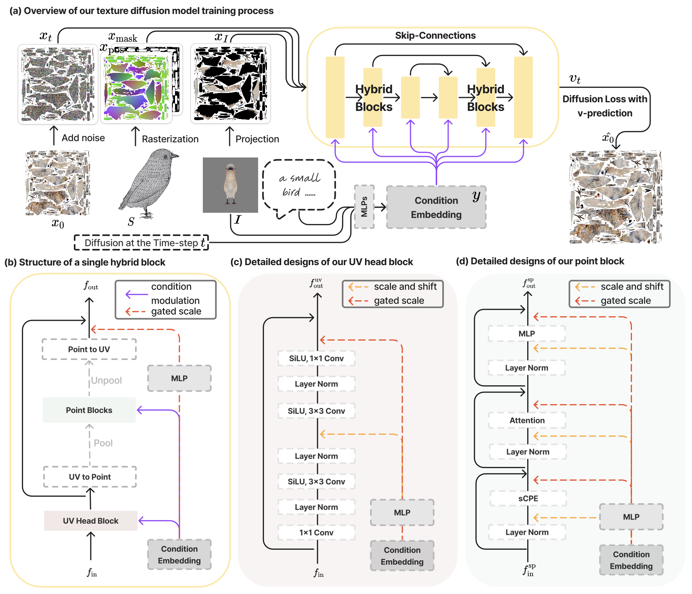
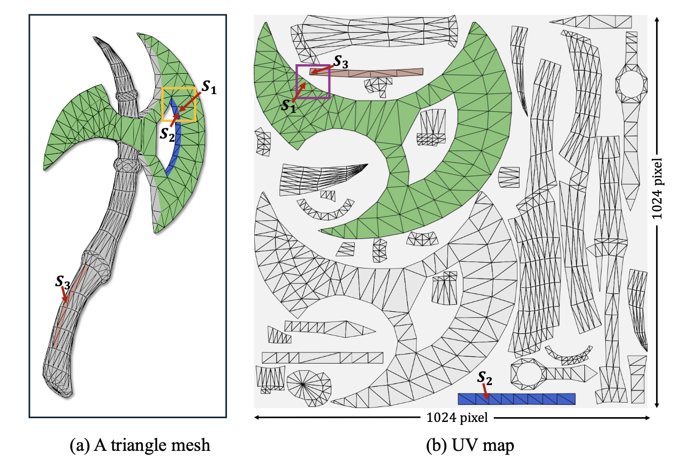
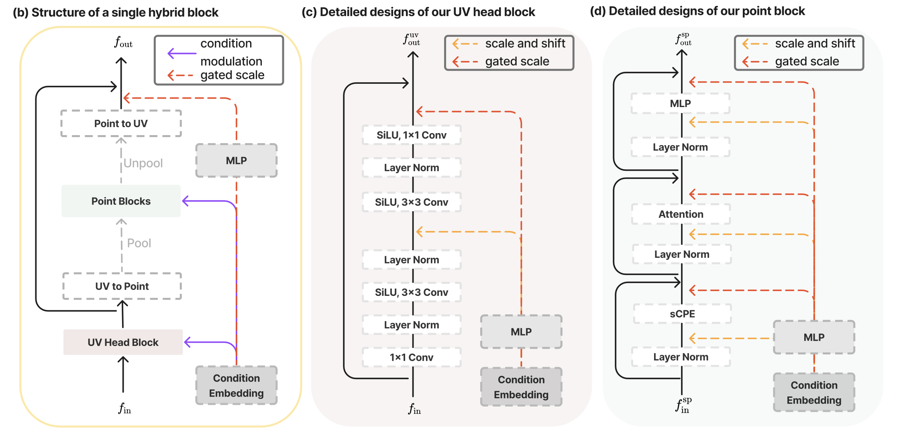

# TEXGen

> **한 줄 요약** : 3D mesh의 UV texture map 자체를 diffusion model이 직접 생성하도록 학습한 모델

## 1. 배경

**기존 문제**
- 2D diffusion 기반 방법 : 여러 view를 순차적으로 생성·projection해야 하므로 속도가 느리고, view 간 불일치나 Janus problem 발생 가능
- 기존 UV 생성 모델 : 특정 object category에 한정되며, 일반적인 3D object로의 확장이 어려움

> **Janus problem** : 3D 물체의 여러 방향에 같은 semantic feature가 중복 생성되는 현상

**목표**
- Mesh + text + single-view image를 입력받아 전체 1024×1024 UV texture map을 직접 생성하는 general-purpose texture diffusion model 구축



## 2. 방법론

### 2-1. Representation for Texture Synthesis

- UV Texture Map을 2D 이미지처럼 사용하여 diffusion model에 바로 입력
- 2D convolution의 효율적 적용 가능 (texture feature 추출 및 학습 가능)

**문제점**
- UV mapping은 3D surface를 여러 개의 UV island로 잘라 펼친 결과물
- 실제 3D surface의 neighborhood 관계가 깨질 가능성 존재

→ 해결 : 2D UV space의 high-resolution feature learning + 3D point space의 global consistency 결합



### 2-2. Model Construction

- UNet 구조 기반
- 각 stage에 Hybrid 2D-3D block 사용 (해당 논문에서 설계)

#### 입력

| 기호 | 의미 |
|---|---|
| `x_t` | noise가 추가된 texture map |
| `x_pos` | mesh에서 rasterization하여 얻은 position map |
| `x_mask` | UV 영역 mask |
| `I` | single-view condition image |
| `c` | text prompt |
| `t` | diffusion timestep |

#### Image Condition 처리

- Single-view image의 pixel을 mesh surface에 projection한 뒤, 이를 다시 UV space로 옮김 → `x_I`
- 현재 camera에서 보이는 부분의 texture만 채워지고, occluded region은 빈 상태
- image `I`, text `c`, timestep `t`를 각각 CLIP, Text Encoder, Learnable Timestep Embedding (MLP)에 통과시킨 후 결합하여 global condition embedding 생성

#### Hybrid 2D-3D Block



1. **UV Head Block** : 입력 UV를 2D convolution block으로 feature 추출 (위 그림 (c) 참고)
2. **UV → 3D point** : 추출한 feature를 3D point에 mapping
3. **Grid Pooling** : point 수 축소
4. **Serialized Attention**
   - Point cloud는 image와 달리 정해진 순서가 없으므로, space-filling curve를 이용해 point를 serialization
   - 사용 방식 : Z-order curve, Hilbert curve (아래 추가 내용 참고)
   - group/patch 구성 후 self-attention에 입력
5. **Position Encoding**
   - 3D 위치 정보를 제대로 활용하기 위한 단계
   - 계산량이 크므로 channel을 줄여 적용 (sCPE 사용)
6. **Condition Modulation** : 앞에서 생성한 global condition embedding을 MLP를 통해 UV Head block, Point block에 모두 주입
7. **Point → UV 및 Fusion**
   - Point block에서 처리된 sparse point feature를 원래 dense coordinate로 scatter
   - mesh의 UV↔3D correspondence를 이용해 다시 UV space로 가져옴
   - UV branch에서 얻은 feature와 fusion

### 2-3. Diffusion Learning

- 기존 Stable Diffusion 학습 방식과 동일한 방법 사용
- CFG (Classifier-Free Guidance) 사용
- Loss 구성
  - target texture를 제대로 reconstruction했는지 비교하는 loss
  - mesh에 texture를 입혀 여러 viewpoint에서 봤을 때의 정합성을 supervision하는 LPIPS loss

## 추가 내용

### Serialization

**Z-order curve**
- 3D coordinate를 grid coordinate로 quantization한 상태를 전제로 하는 방식
- (내용 보완 필요)

**Hilbert curve**
- 공간을 작은 cell로 계속 나누면서, 연속적인 하나의 경로로 모든 cell을 방문
- 3D에서는 cube를 8개의 sub-cube로 계속 나누면서 비슷한 방식으로 traversal

### Conditional Positional Encoding (CPE)

- 목적 : 3D point feature에 positional information 주입
- Transformer의 attention만으로는 point가 실제 (x, y, z) 상 어디에 놓였는지 충분히 반영하기 어려움
- 그래서 주변 spatial structure를 이용해 position 정보를 feature에 주입

**xCPE**
```
Point feature → Sparse Convolution → Position-aware feature → Attention
```
- Sparse Convolution을 feature에 직접 적용
- feature dimension이 2048처럼 크면 비용 증가

**sCPE**
```
Linear (차원 축소) → Sparse Convolution → Position-aware feature → 차원 복구
```
