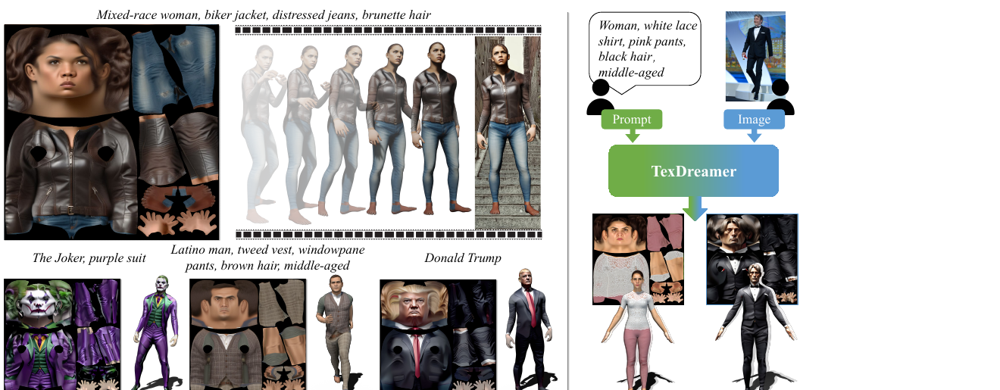
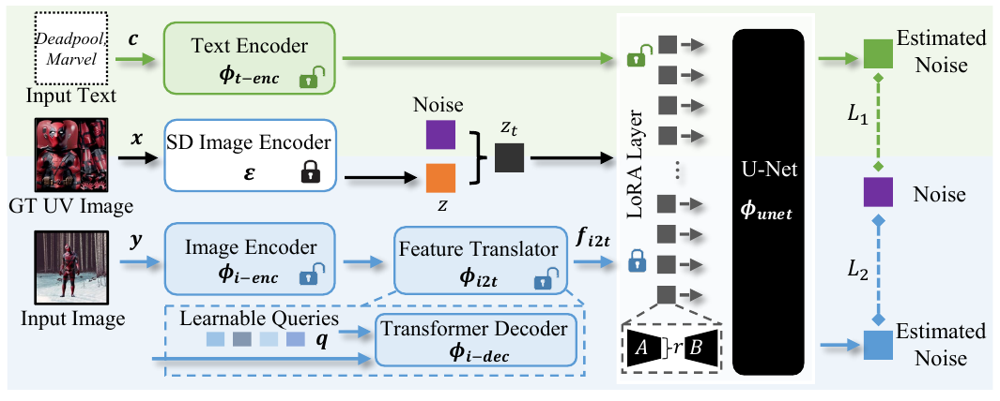
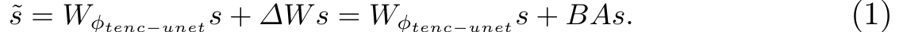
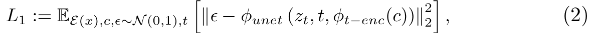
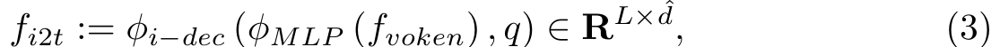
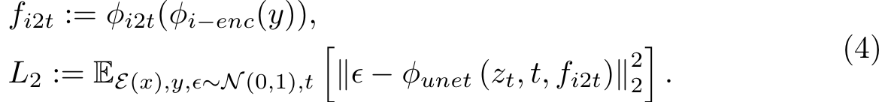
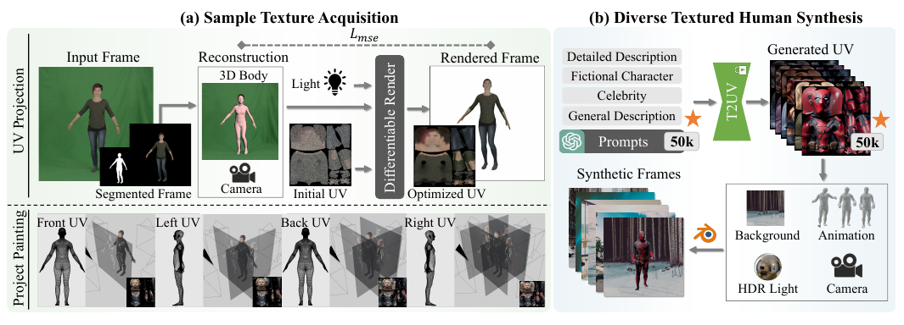

# TexDreamer

> **한 줄 요약** : 직접 생성 (semantic, 제한된 도메인)  
> UV LDM(Latent Diffusion Model)을 semantic UV texture domain(SMPL UV, 3D human)에 LoRA fine-tuning하여 text 또는 image에서 UV texture를 직접 생성 (zero-shot)



## 1. 배경

**문제**
- semantic UV map으로 3D human에 texture를 입히려면 reasonably unfolded UV 확보가 어려움
  - 고가의 3D scanner와 숙련된 texture artist(Substance Painter, ZBrush, Photoshop) 필요
  - 정돈된 human UV map 하나에 수 주 소요
- Human 대상 optimization 방법(AvatarCLIP, AvatarCraft 등)
  - 시간이 오래 걸리고 rendering 해상도 제약으로 texture 품질 제한
  - mesh 추출(marching cubes) 과정에서 UV layout과 mesh topology 유지가 어려워 수정이 불편
- object 대상 non-optimization 방법(TEXTure, Latent-Paint, Text2Tex)
  - 복잡한 입력 모델에서 inconsistency와 gap 발생
- 이미지에서 texture 예측 시
  - 보이는 부분 : pixel-to-surface correspondence 추정 정확도에 UV mapping이 좌우됨
  - 보이지 않는 부분 : 모델의 inpainting 능력에 의존, 고품질 data 없이는 artifact 발생
  - video dataset은 multi-view 정보를 주나 frame 간 correspondence 정밀도가 요구되고 수량이 제한적

**목표**
- text와 image 모두 입력 가능한 zero-shot, 고품질 3D human texture 생성 모델
- 소량의 sample texture와 pretrained T2I(Text-to-Image) model의 generalization 능력을 활용하여, 일반적인 character 생성과 UV 구성 요소 사이의 연결 학습

**기여**
1. 첫 zero-shot multimodal high-fidelity 3D human texture 생성 방법 (efficient texture adaptation fine-tuning + feature translator)
2. ATLAS : 가장 큰 고해상도(1,024×1,024) 3D human texture dataset (50k texture + text 설명)
3. text consistency와 UV 품질에서 기존 방법 능가

**관련 연구와의 차이**
- SMPLitex : UV texture 10개로 Stable Diffusion을 fine-tuning, 100개 texture만 제공하며 identity와 의상의 다양성 부족
- Texformer, Zhao et al. 등 image-to-UV : 2D 인체 segmentation에 의존
- DensePose의 partial texture를 inpainting하는 방식(GAN 기반)과 달리, image와 UV feature를 semantic한 latent space에서 연결

## 2. 방법론



전체 구조 : 2단계 학습
1. T2UV (Text-to-UV) : LoRA 기반 efficient texture adaptation fine-tuning으로 text에서 UV texture 생성
2. I2UV (Image-to-UV) : T2UV와 ATLAS 합성 렌더링을 이용해 feature translator 학습

### 2-1. Preliminaries : LoRA

| 방법 | 특징 |
|---|---|
| Dreambooth | LDM 전체 parameter fine-tuning, 결과는 좋으나 checkpoint 크기가 큼 |
| Textual Inversion | text embedding space의 새 "단어"로 concept 학습, 빠르나 단일 또는 소수 subject에만 적용 |
| LoRA | 모델에 새 weight를 추가하여 범용 제어, 학습 효율과 특정 concept 학습 능력 사이의 균형 |

LoRA : weight의 update가 낮은 "intrinsic rank"를 가진다는 점을 이용



```
W_new = W + delta_W = W + B A
B in R^(d x r),  A in R^(r x k),  r << min(d, k)
s_tilde = W s + B A s
```

- 학습 parameter는 `A`와 `B`뿐
- `A`는 random Gaussian으로, `B`는 0으로 초기화
- `W s`에 `alpha / r`을 곱해 scale (`alpha`는 `r`에 대한 상수)

### 2-2. Text-to-UV (T2UV)

- 각 attention layer에 소수의 학습 parameter(LoRA)를 추가하여, 작은 dataset의 공통 concept(UV 구조)을 학습
- 입력 GT UV image `x`는 SD image encoder `E`로 encoding, text는 text encoder `phi_t-enc`로 encoding
- U-Net과 text encoder의 LoRA를 함께 optimization



```
L1 = E[ || epsilon - phi_unet(z_t, t, phi_t-enc(c)) ||^2 ]
```

- 학습 data : 3.1절의 sample texture + 해당 prompt `c`
- 설정
  - backbone : stable-diffusion-2-1, text encoder는 clip-vit-large-patch14-336
  - LoRA rank와 `alpha` : U-Net 128 / text encoder 16
  - batch size 8, 2,000 step, AdamW, learning rate 1e-4, constant scheduler (warm-up 100 step), SNR-gamma 5
  - 추론 시 T2UV weight 1.0, 32 step
- rank와 `alpha`의 최적 조합은 L1 값이 아닌 CLIP score(T-pose 렌더링과 prompt 사이)로 결정
  - 조합을 조금만 바꿔도 결과가 크게 달라짐 (learning rate 조정과 비슷한 효과)
- **Alignment enhancement** : 학습 후 prompt마다 texture 4개를 생성하여 CLIP score가 가장 높은 1개만 선택
  - ATLAS 구축에 사용하며, I2UV에 쓰는 최종 T2UV는 text consistency가 가장 높음

**학습된 UV 구조**
- 같은 text 입력에 대해 원본 SD의 attention 반응 영역은 무작위, T2UV는 일관되게 학습된 UV 구조에 text를 mapping (원본 SD의 generalization 능력은 유지)
- 학습 sample 수는 약 100개에서 포화 (FID 기준, 이후 증가해도 개선 미미)

### 2-3. Image-to-UV (I2UV)

핵심 아이디어 : 서로 다른 구조의 human image와 UV texture를 semantic한 매개체인 textual feature로 연결

**Feature translator** (SD 쪽 text encoder 출력 공간으로 image feature를 변환)
1. 렌더링된 2D 이미지 `y`를 CLIP image encoder `phi_i-enc`로 encoding → `f_voken`
2. 2-layer MLP `phi_MLP`로 변환
3. 3-layer transformer decoder `phi_i-dec`가 learnable query `q`와 함께 처리
4. 결과 `f_i2t`는 text feature와 같은 형태



```
f_i2t = phi_i-dec( phi_MLP(f_voken), q )     # f_i2t in R^(77 x 1024)
```

- `77` : text encoder의 최대 입력 길이 `L`, `1024` : LDM encoder 출력 feature 차원 `d_hat`

**학습**
- `f_i2t`는 본질적으로 text feature이므로 T2UV 생성 과정에 condition으로 직접 사용 가능
- 생성된 UV texture를 ground truth로 사용하고, 이를 LDM image encoder로 encoding한 `z_0`에 noise `epsilon`을 더해 `z_t` 생성
- image encoder와 feature translator를 LDM denoise loss로 학습 (T2UV의 LoRA는 고정)



```
L2 = E[ || epsilon - phi_unet(z_t, t, f_i2t) ||^2 ],   f_i2t = phi_i2t( phi_i-enc(y) )
```

- 설정 : T2UV와 같은 batch size, 20,000 step, learning rate 1e-5, weight decay 0.01
- 학습 data : 4.2 million장의 실제 및 합성 human image (3.2절의 ATLAS 합성 렌더링 포함)
- DensePose 기반 partial texture 추출 대신, image와 UV를 semantic latent space에서 연결

### 2-4. ATLAS Dataset 구축



**(a) Sample Texture Acquisition** : scan 등록이나 artist 제작 없이 UV texture 획득
1. UV Projection
   - 분할(segmentation)한 frame에서 CLIFF로 global rotation, joint pose, 3D shape, camera parameter 추정
   - differentiable rendering으로 rendered frame과 GT frame의 차이(MSE)를 줄이며 초기 UV map 최적화
2. Project Painting
   - 추정 pose와 실제 pose 사이의 차이로 인한 품질 저하 보정
   - CGI 제작에서 쓰는 texture painting 기법으로, 여러 시점에서 SMPL UV map을 번갈아 수정
- 다양성 확보와 T2UV overfitting 방지를 위해 실제와 생성된 multi-view 이미지를 함께 사용
  - 실제 human : People-Snapshot, iPER video
  - 가상 character : ControlNet + DWpose + pretrained LDM으로 multi-view 이미지 생성
  - character마다 SMPL A-pose 8개 view(회전 각도 0, ±45, ±90, ±135, 180) 사용
  - LDM의 ID consistency 문제는 방향 설명을 positive/negative prompt로 추가해 완화
  - 예 : 뒷모습은 positive에 "the back of, backside", negative에 "face, front"

**(b) Diverse Textured Human Synthesis** : I2UV 학습용 이미지 합성
1. Texture 생성
   - 설명을 4가지로 구성 : detailed description, fictional character, celebrity, general description
   - detailed description은 인종/국가, 외형, 성별, 의상, 헤어, 나이 순으로 무작위 구성
   - fictional character와 celebrity는 이름 + 대표 의상(celebrity는 헤어 추가), general description은 category 하나
   - ChatGPT로 prompt 총 50k개 생성, 20%를 ATLAS test set으로 사용
   - T2UV로 50k개 texture 생성
2. Composite Rendering (Blender)
   - HDR image 기반 조명(IBL, 360° panorama 이미지로 장면 조명)
   - PBR human material shader (Disney principled BSDF 변형)
   - 자세 다양화 : AMASS motion capture data(40시간 이상, 300명 이상), motion rate 24로 총 8.3 million frame
   - camera는 pelvis joint를 추적하며 mesh 앞 5m, focal length 80mm, pixel당 sample 64
   - 배경 : Pexels의 royalty-free 이미지(자연, 거리, 실내, 추상, 단색), alpha channel을 계산하여 합성 (SURREAL이 쓴 LSUN은 256×256로 해상도가 낮음)

**Dataset 비교** (일부)

| Dataset | UV texture 수 | 해상도 | Text 설명 |
|---|---|---|---|
| SURREAL | 921 | 512×512 | ✗ (얼굴이 모두 평균 얼굴) |
| SMPLitex | 100 | 512×512 | ✓ |
| ATLAS | 50k | 1,024×1,024 | ✓ |

## 3. 실험

**평가 방법**
- T2UV : 생성 texture를 SMPL neutral body의 T-pose로 렌더링하여 CLIP score(text와의 일관성) 측정
  - text consistency 평가를 위해 기본 view에 azimuth 0, 90, 180, 270 view를 추가
- I2UV : SSIM/LPIPS는 pose 추정 정확도에 영향받아 texture 품질 측정에 한계
  - texture ground truth가 있으므로 MSE(texture 품질)와 CLIP score(text 일관성) 사용
- 모든 학습은 NVIDIA A100 GPU 1장

**Text-to-texture 정량 결과**

| Method | GPU (GiB) | Time (min) ↓ | CLIP Score ↑ |
|---|---|---|---|
| Text2Tex | 20.31 | ~14.35 | 29.962 |
| TEXTure | 12.05 | ~2.38 | 27.298 |
| Latent-Paint | 11.46 | ~13.95 | 26.378 |
| Fantasia3D | 12.42 | ~14.50 | 30.557 |
| SMPLitex | 7.77 | ~0.31 | 22.998 |
| AvatarCLIP | 37.74 | ~360 | 29.422 |
| AvatarCraft | 26.65 | ~480 | - |
| TexDreamer (T2UV) | 5.71 | ~0.17 | 31.297 |

- AvatarCraft는 시간과 자원 소모가 커서 효율만 비교, CLIP score 미보고

**User study** (14명, 1~5점)

| Method | Text Consistency ↑ | Image Quality ↑ |
|---|---|---|
| Text2Tex | 1.919 | 1.641 |
| TEXTure | 2.003 | 1.744 |
| Latent-Paint | 1.878 | 1.456 |
| Fantasia3D | 2.089 | 1.904 |
| AvatarCLIP | 1.752 | 1.341 |
| TexDreamer | 4.019 | 4.244 |

**Image-to-UV 정량 결과** (ATLAS test set에서 무작위 2 frame 입력)

| Method | MSE ↓ | CLIP Score ↑ |
|---|---|---|
| Texformer | 0.1148 | 21.811 |
| SMPLitex | 0.0783 | 22.488 |
| Ours-I2UV (image encoder 고정) | 0.0632 | 26.138 |
| Ours-I2UV (full) | 0.0442 | 27.334 |

**Ablation : T2UV의 LoRA rank와 alpha**

| U-Net r / alpha | text encoder r / alpha | CLIP Score ↑ |
|---|---|---|
| 128 / 128 | 8 / 8 | 28.64 |
| 128 / 128 | 16 / 16 | **29.29** |
| 128 / 128 | 32 / 32 | 28.36 |
| 64 / 64 | 16 / 16 | 28.20 |
| 192 / 192 | 16 / 16 | 29.19 |

- I2UV에서 image encoder를 함께 학습하는 full 구성이 가장 좋음

**정성 비교**
- Text2Tex, TEXTure, Latent-Paint, Fantasia3D, SMPLitex 대비 가장 세밀한 얼굴 detail과 높은 전체 품질
- AvatarCLIP, AvatarCraft는 texture 색과 얼굴 특징의 사실감이 부족
- I2UV : Texformer, SMPLitex 대비 identity와 texture 사실감 우수 (Market-1501과 ATLAS test set 모두에서 비교)

## 4. 응용

- **Texture editing** : text로 의상 종류(상의/하의), 색, 액세서리 등 수정 가능 (identity 유지, 빠른 virtual try-on 가능성)
- **Dressed avatar texturing** : text-to-3D avatar 방법(TADA)이 만든 복잡한 mesh에 생성 texture 적용
  - mesh 초기화 과정을 수정하여 원래 UV 정보를 유지하면서 mesh를 조밀하게 만듦

## 5. 한계

- I2UV는 DensePose segmentation 기반이 아니므로, 실제 이미지에 적용 시 일부 결과가 입력의 의상 무늬와 엄밀히 일치하지 않을 수 있음
- 사실적인 human texture 생성이 가능하므로 deepfake 등 윤리/프라이버시 우려
- 도메인이 SMPL UV 기반 3D human으로 제한 (임의 object로 확장 불가)
