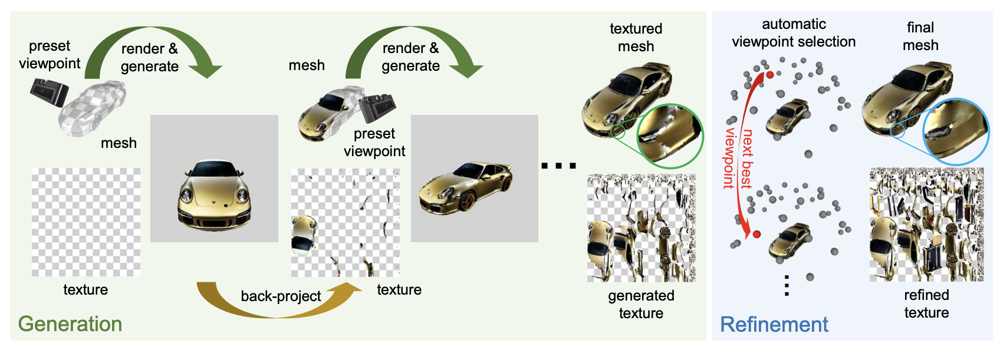
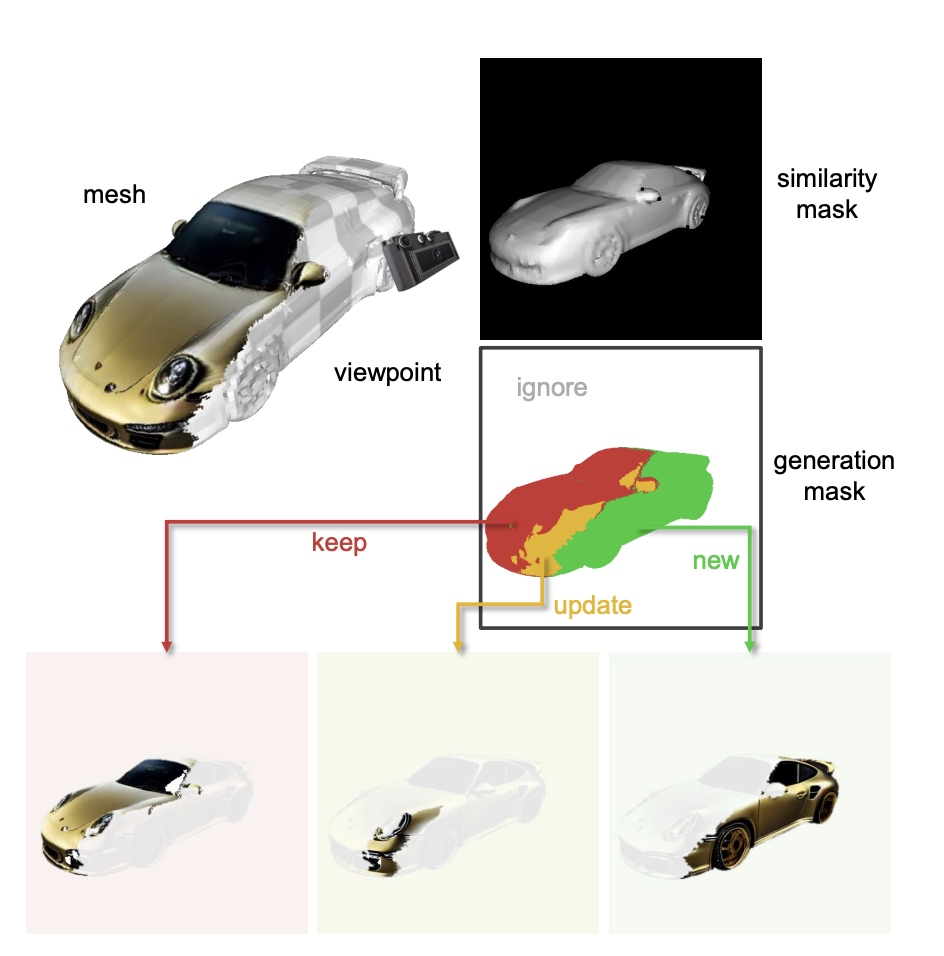

# Text2Tex

> **한 줄 요약** : View → UV projection  
> 각 view에서 diffusion으로 생성한 결과를 UV에 누적

## 1. 배경

**문제**
- 2D diffusion model을 그대로 3D texturing에 사용하면, 시점마다 생성 이미지가 달라지는 현상 발생
- 그 결과 multi-view inconsistency, texture stretching, seam/blurry artifact 발생

**목적**
- 2D diffusion의 강력한 생성 능력을 사용하면서, 여러 시점에서 일관되고 고품질인 3D texture를 생성하는 것

## 2. 방법론



### 2-1. Depth-aware Diffusion

- 일반 Text-to-Image 대신 Stable Diffusion v2 Depth2Image 사용
- mesh의 depth를 condition으로 입력하여 geometry를 최대한 유지

### 2-2. Progressive Texture Generation

- 한 시점에서 생성한 RGB를 해당 mesh의 UV texture에 back-project
- 비어 있는 partial texture를 점진적으로 채우는 방식
- 단순 반복 생성은 기존 texture를 망가뜨릴 수 있으므로, 현재 보이는 영역을 네 종류로 구분

| 영역 | 상태 | 처리 |
|---|---|---|
| New | 아직 texture 없는 영역 | 새로 생성 |
| Update | 이미 있으나 더 좋은 각도에서 보이는 영역 | 다시 생성/수정 |
| Keep | 이미 좋은 시점에서 생성된 영역 | 그대로 유지 |
| Ignore | background | 무시 |



예시
- 정면에서 잘 보이는 부분 → Keep
- 옆에서 더 잘 보이는 부분 → Update
- 비어 있는 부분 → New

### 정리

3D mesh를 여러 시점에서 렌더링 → Depth-conditioned diffusion으로 2D appearance 생성 → UV texture에 back-project → 좋은 시점에서 반복적으로 update

## 추가사항

Stable Diffusion v2 Depth2Image는 ControlNet이 아닌 pre-trained 모델
- 처음부터 아래 입력 구조로 설계된 모델
- input 차원이 높은 특징

```
noise/image latent + text + depth → image
```
