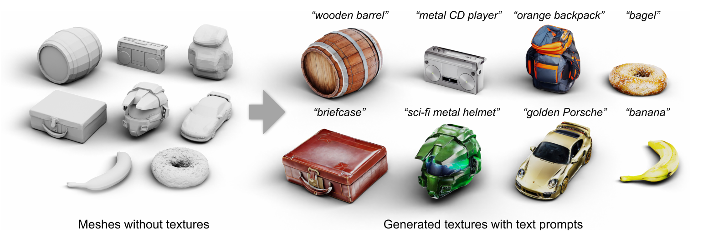
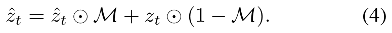
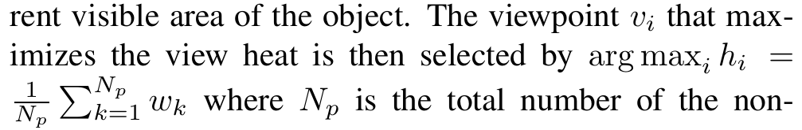
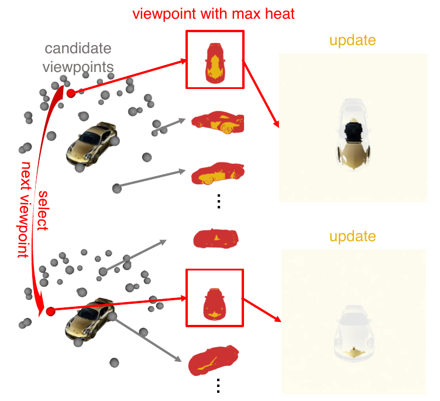
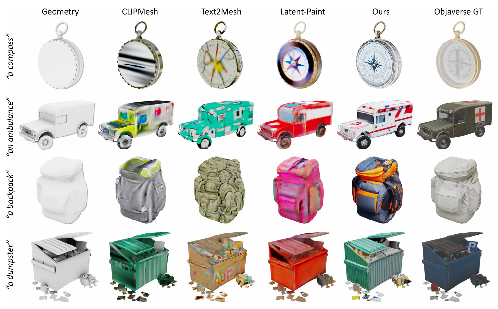
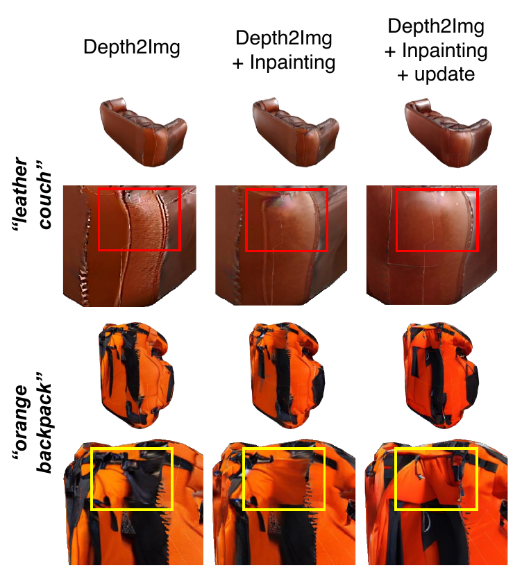
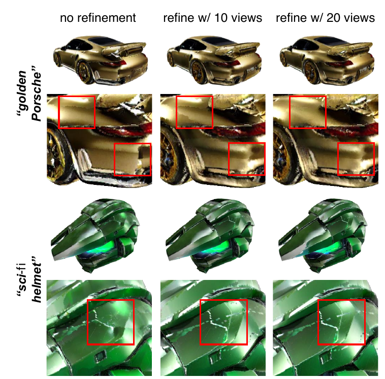

# Text2Tex

> **한 줄 요약** : View → UV projection  
> 각 view에서 depth-aware diffusion으로 생성한 결과를 UV에 누적한 뒤, 자동 선택한 view로 refinement



## 1. 배경

**문제**
- 2D diffusion model을 그대로 3D texturing에 사용하면, 시점마다 생성 이미지가 달라지는 현상 발생
- 회전된 view의 이미지를 curved surface에 back-project하면 stretched/inconsistent artifact 발생
- 그 결과 multi-view inconsistency, texture stretching, seam/blurry artifact 발생
- SDS(score distillation) 기반 optimization 방법은 수렴 시간이 김

**목적**
- 2D diffusion의 강력한 생성 능력을 사용하면서, 여러 시점에서 일관되고 고품질인 3D texture를 생성하는 것

**관련 연구와의 차이**
- 동시기 연구(TEXTure)도 사전 지정한 여러 view에서 progressive update를 수행
- Text2Tex는 refinement 단계의 view 순서를 자동으로 선택하여, mesh마다 view 순서를 사람이 설계하는 수고 제거

## 2. 방법론


전체 구조 : **generate-then-refine** 2단계
- Generation : 미리 정한 6개 view를 순서대로 돌며 partial texture 생성 (Sec 3.3)
- Refinement : 자동 선택한 view로 stretched/blurry 영역 보정 (Sec 3.4)

### 2-1. Depth-aware Diffusion

- 일반 Text-to-Image 대신 Stable Diffusion v2 Depth2Image 사용
- mesh의 depth를 condition으로 입력하여 geometry를 최대한 유지
- Depth2Image는 이미지 전체를 생성하는 모델이므로, inpainting mask `M`을 sampling 과정에 주입하여 생성할 영역과 고정할 영역 지정
- mask 적용 방식은 RePaint와 유사한 denoising guidance



- `z_hat` : denoise된 latent 추정
- `z_t` : noise가 추가된 기존 latent
- `M` : generation mask (1인 영역은 새로 생성, 0인 영역은 기존 내용 유지)

### 2-2. Progressive Texture Generation

- 한 시점에서 생성한 RGB를 해당 mesh의 UV texture에 back-project
- 비어 있는 partial texture를 점진적으로 채우는 방식
- 시작 view는 axis-aligned 6개
- 단순 반복 생성은 기존 texture를 망가뜨릴 수 있으므로, 현재 보이는 영역을 네 종류로 구분 (dynamic view partitioning)

**similarity mask**
- 각 pixel에서 visible face의 normal vector와 view direction 사이의 cosine similarity를 0~1로 정규화한 값
- 값이 높을수록 해당 face가 현재 view에서 더 좋은 각도로 관측됨
- 모든 view의 similarity mask를 texture space로 mapping하여 view 간 비교에 사용

**generation mask**

| 영역 | 상태 | 판정 기준 | 처리 | denoising strength |
|---|---|---|---|---|
| New | 아직 texture 없는 영역 | texture 없음 | 새로 생성 | 1.0 (pure Gaussian noise에서 시작) |
| Update | 이미 있으나 현재 view가 더 좋은 각도 | 현재 view의 similarity가 모든 view 중 최고 | 다시 생성/수정 | 0.5 (generation) / 0.3 (refinement) |
| Keep | 이미 더 좋은 각도에서 생성됨 | 다른 view의 similarity가 더 높음 | 그대로 유지 | - |
| Ignore | background | - | 무시 | - |


예시
- 이전 view에서 정면으로 잘 보이던 영역을 비스듬히 보는 현재 view → Keep
- 이전에는 비스듬히 보였으나 현재 view에서 더 정면에 가까운 영역 → Update
- 아직 비어 있는 영역 → New

denoising strength `γ` (0 < γ ≤ 1)
- diffusion을 time step `γT`부터 시작하게 하는 scaling factor
- 값이 작을수록 기존 이미지 정보를 많이 보존

### 2-3. Texture Refinement with Automatic Viewpoint Selection

- 문제 : 미리 정한 view만으로는 seam, stretch, blur가 남음
- 단순 해결책은 view 수 증가이나, 최적의 view 순서가 mesh마다 달라 수동 설정이 어려움

**방법**
1. refinement view `K`개를 반구(hemisphere) 위에 고르게 배치 (`K` > generation view 수 `N`, 아래쪽에서 올려다보는 view는 드물므로 제외)
2. 각 view의 generation mask에서 view heat `h_i` 계산
3. view heat가 최대인 view를 다음 update 대상으로 선택
4. 해당 view에서 Update 영역만 mild denoising strength(`γr`)로 다시 생성한 뒤 texture에 back-project
5. 반복



- `N_p` : background가 아닌 pixel 수
- `w_k` : generation mask 영역별 가중치
- Update 영역의 `w_k`를 Keep 영역보다 크게 설정하여, update 면적이 큰 view 우선 선택
- 즉 view heat는 현재 보이는 면적 대비 Update 영역의 정규화된 면적



### 정리

3D mesh를 여러 시점에서 렌더링 → Depth-conditioned diffusion으로 2D appearance 생성 → UV texture에 back-project → 좋은 시점에서 반복적으로 update → 자동 선택한 view로 refinement

## 3. 구현 및 실험

**구현**
- backbone : Stable Diffusion v2 Depth2Image
- generation view 6개, refinement 후보 view 36개 중 동적으로 20개 선택
- PyTorch + PyTorch3D(rendering, texture projection) 사용
- 1개 mesh 처리에 NVIDIA RTX A6000 기준 약 15분

**데이터**
- Objaverse subset : 410개 textured mesh (225 category), 원본 texture는 평가에만 사용
- ShapeNet car : 300개 mesh (GAN 기반 방법과 비교용)

**정량 결과 (Objaverse)**

| Method | FID ↓ | KID (×10⁻³) ↓ |
|---|---|---|
| Text2Mesh | 45.38 | 10.40 |
| CLIPMesh | 43.25 | 12.52 |
| Latent-Paint | 43.87 | 11.43 |
| Text2Tex | 35.68 | 7.74 |

- FID 19%, KID 26% 개선

**정성 비교 (Objaverse)**



**정량 결과 (ShapeNet car)**
- Texturify(GAN 기반 SOTA) : FID 59.55 / KID 4.97
- Text2Tex : FID 46.91 / KID 4.35

**User study** : 41명, 604 응답
- CLIPMesh 대비 83.92%, Text2Mesh 대비 76.47%, Latent-Paint 대비 64.18% 선호

**Ablation (generation 단계)**

| Depth2Img | + inpainting | + update | FID ↓ | KID (×10⁻³) ↓ |
|---|---|---|---|---|
| ✓ | - | - | 39.88 | 9.78 |
| ✓ | ✓ | - | 38.19 | 9.11 |
| ✓ | ✓ | ✓ | 37.09 | 8.78 |



**Ablation (refinement view 수)**

| view 수 | 0 | 5 | 10 | 15 | 20 |
|---|---|---|---|---|---|
| FID ↓ | 37.09 | 36.67 | 36.39 | 35.98 | 35.68 |
| KID (×10⁻³) ↓ | 8.78 | 8.31 | 8.12 | 7.98 | 7.74 |



## 4. 한계

- diffusion backbone의 특성상 texture에 shading effect가 함께 생성되는 경향
- prompt를 세심하게 조정하면 완화되나, 사람의 노력이 필요하여 대량 생성에는 부적합
- 해결 방향으로 shading을 제거하도록 diffusion model을 fine-tuning하는 방법 제시 (future work)
- 이 문제가 Paint3D의 lighting-less texture 접근(UVHD)의 동기와 연결

## 추가사항

Stable Diffusion v2 Depth2Image는 ControlNet이 아닌 pre-trained 모델
- 처음부터 아래 입력 구조로 설계된 모델
- input 차원이 높은 특징

```
noise/image latent + text + depth → image
```
