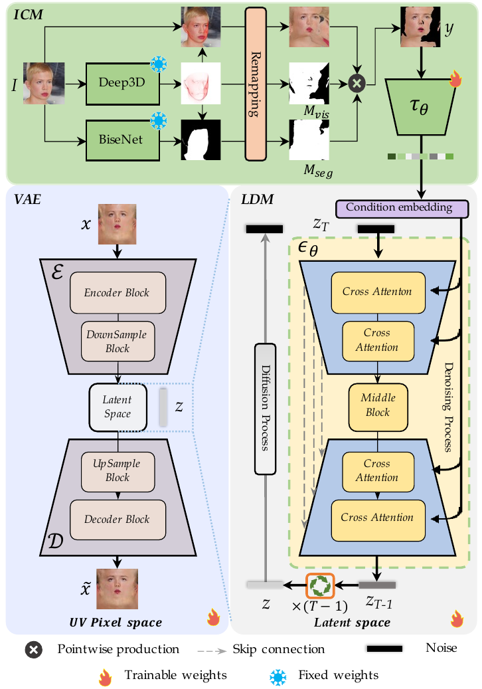
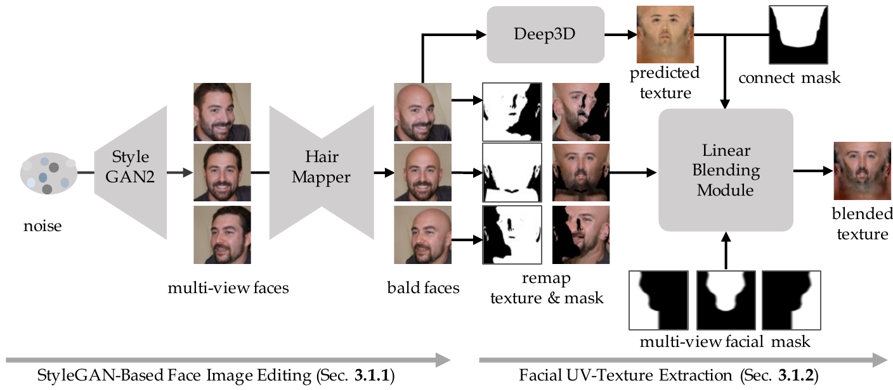

# UV-IDM

> **한 줄 요약** : Image → UV completion  
> in-the-wild 얼굴 이미지에서 추출한 incomplete UV texture를 identity condition으로 LDM(Latent Diffusion Model)에 넣어, BFM(Basel Face Model) 기반 UV texture를 생성 (plug-and-play texture generator)

## 1. 배경

**목표**
- 단일 in-the-wild 이미지에서 3D face의 고품질 UV texture 생성
- 요구 조건 : identity를 충실히 재현, illumination 복원, 복잡한 expression 처리, hair occlusion에 robust

**기존 방식의 문제**
- Linear 3DMM(3D Morphable Model) 기반 : 선형 모델의 표현력 한계로 저품질 texture, in-the-wild 이미지의 high-frequency feature 포착 불가
- GAN 기반 : over-smoothing으로 인한 identity leakage
- iterative optimization 기반 : 시간 소요가 크고 occlusion에 overfitting
- 실제 촬영 UV dataset(polarized spherical gradient illumination 장비) : 고비용이라 대규모 수집이 어렵고 모델의 generalization 제한
- FFHQ-UV : 공개 dataset이나 저작권 제한으로 재현 불가, 더 널리 쓰이는 BFM 기반 방법으로 직접 이전하기 어려움
- Relightify : unconditional diffusion의 image translation으로 texture 생성이 가능함을 처음 보인 연구

**접근**
- texture 생성을 texture-completion task로 정의
- in-the-wild 이미지에서 visibility mask와 UV mapping 관계로 incomplete texture를 추출한 뒤, 이를 condition으로 LDM이 완성

**기여**
1. identity-guided LDM 기반 face texture generator (UV-IDM) : 수 초 내에 고해상도 UV texture 생성
2. BFM-UV dataset : 80K 이상의 BFM 기반 UV texture, 제작 과정 공개 (다른 3DMM으로 확장 가능)
3. 3개 benchmark에서 정성/정량 결과 모두 SOTA

## 2. 방법론



전체 구조 : 2단계
1. UV texture dataset 생성 (BFM-UV)
2. condition 기반 LDM을 UV-texture generator로 학습 (VAE 학습 → ICM과 LDM 동시 학습)
- 추론 시 incomplete UV texture를 입력하면 현실적이고 high-fidelity한 UV texture 출력, 모든 BFM 기반 3D face reconstruction 방법에 적용 가능

### 2-1. Dataset 생성 (BFM-UV)



#### StyleGAN 기반 face image 편집

목표 : 가림(안경, 머리카락)이 없고 정면 및 좌우 3개 view인 face 이미지 대량 생성
1. FFHQ로 사전 학습된 StyleGAN2로 face 이미지를 무작위 생성하고, InterFaceGAN으로 W+ latent space에서 attribute 편집
   - 원본과 가까운 texture를 만들어야 하므로 조명과 expression attribute는 유지
   - 제거 대상은 hair, glasses, posture 등
2. Posture 정규화
   - 사전 학습된 posture 검출 network로 Euler angle(pitch, yaw, roll) 검출, 모두 5° 미만인 정면 이미지만 사용
   - yaw 방향 attribute vector를 조작하여 좌우로 돌린 이미지를 생성 (profile view의 texture 보강)
   - SVM을 attribute classifier로 사용하여 attribute 변경 방향을 찾고, 계수로 강도 조절
3. 안경 제거 : glasses classifier로 안경 없는 이미지만 선별
4. 머리카락 제거 : HairMapper 방식 사용
   - StyleGAN2 latent space에서 hair 제거 경로를 fully connected network로 학습
   - latent를 수정하여 새 portrait를 만들고 Poisson blending으로 원본과 자연스럽게 결합
   - 원본 이미지의 latent는 e4e encoding으로 획득
   - 결과 : 세 view의 bald portrait

#### Face UV-texture 추출

Deep3D 기반의 고전적 rendering 기법 5단계
1. BFM으로 학습된 Deep3D로 단일 이미지에서 정확한 3D face shape 추출
2. vertex 좌표에서 normal vector 방향을 계산하여 visible vertex index 파악
3. 3D 구조와 이미지의 projection 관계로 이미지 pixel에 대응하는 모든 3D vertex의 color 파악
4. vertex color를 사전 정의된 UV 좌표로 펼쳐 UV map 생성
5. vertex visibility로 UV map의 visible region mask를 만들고, 각 visible vertex의 pixel color에 대응하는 신뢰할 수 있는 incomplete UV texture 추출

세 view의 incomplete texture 합성
- bald face 이미지에서 view별로 incomplete texture 추출 (단일 view에서 손실되는 정보 보완)
- FFHQ-UV가 평균 texture를 template으로 쓰는 것과 달리, Deep3D의 linear texture basis로 정면 이미지에 대응하는 개별 UV texture를 template으로 사용
- YUV 색 공간 color matching과 사전 정의된 face visibility mask로 template과 세 view의 incomplete texture를 linear blending하여 완성된 UV texture 생성

**규모**
- 280K 이미지를 먼저 생성하여 나이와 인종의 다양성 확보
- FFHQ-UV가 제공한 정규화 이미지 50K 세트 추가
- 최종 약 80K의 BFM 기반 UV texture (256×256) → BFM-UV dataset

### 2-2. Identity-Conditioned Facial Texture Generator (LDM 기반)

#### VAE (UV texture용 perceptual compression)

- UV texture `x`를 encoder `E`로 저차원 latent `z = E(x) ∈ R^(32×32×4)`로 압축, decoder `D`로 복원
- UV pixel space보다 latent space에서 likelihood 기반 생성 모델을 학습하는 것이 효율적이며 메모리 절약

```
L_VAE = lambda_kl · L_KL + lambda_gan · L_GAN + lambda_lpips · L_LPIPS
```

- texture VAE는 UV texture의 detail을 잘 포착하여 다른 3D face reconstruction 작업의 pre-train model로도 활용 가능

#### Identity-Conditioned Module (ICM)

목표 : diffusion 과정에서 identity 정보 보존
- 입력 이미지 `I`에서 incomplete texture를 만들어 identity guidance condition `y`로 사용
1. Deep3D로 정렬된 얼굴 이미지와 3D vertex 획득
2. BiSeNet 얼굴 segmentation으로 얼굴 영역 mask `M_seg`(머리카락, 안경 제외)를 UV space로 remap
3. vertex normal로 결정한 vertex visibility mask `M_vis`를 UV space로 remap
4. 2-1의 5단계 composite texture와 두 mask를 곱하여 incomplete texture `y` 획득
5. embedding network `tau_theta`로 `y`를 condition embedding으로 encoding
6. cross-attention으로 LDM의 noise 예측 network `epsilon_theta`의 여러 level에 주입 (image prompt 처리 방식과 유사, IP-Adapter 참고)

- 큰 pose의 옆얼굴, 머리카락이 가린 뺨 등에서도 가능한 많은 정보 추출
- 추론 시 BiSeNet mask `M_seg`가 hair와 glasses 영역을 incomplete texture에서 제외

#### LDM 학습

```
L_LDM = E[ || epsilon - epsilon_theta(z_t, t, tau_theta(y)) ||^2 ]
```

- `x` : 완성된 UV texture(ground truth), `y` : incomplete UV condition, `t` : `{1, ..., T}`에서 균등 샘플링
- 최종 sampling된 latent는 `D`로 UV texture space에 decoding
- 학습 data 구성 : hair가 있는 원본 이미지를 입력으로, hair 제거 후의 texture를 정답으로 쌍을 이루게 하여 hair의 영향을 완화
- 학습 순서 : VAE를 먼저 따로 학습 → ICM과 LDM을 함께 학습

## 3. 실험

**구현**
- VAE : Adam (beta1 = 0.5, beta2 = 0.9), learning rate 5.76×10⁻⁴, `lambda_KL = 1e-6`, `lambda_GAN = 0.5`, `lambda_LPIPS = 1`
- LDM : AdamW (beta1 = 0.9, beta2 = 0.999, weight decay 0.01), learning rate 5.76×10⁻⁴
- 학습 시간 : VAE 3일, LDM 5일 (40GB A100 8장)
- 추론 : DDIM으로 denoising step 50

**평가 설정**
- benchmark : CelebAMask-HQ 1195장, FFHQ 2250장, AFLW2000 496장 (학습에 사용하지 않은 이미지, AFLW2000은 가림과 pose 변화가 심해 robustness 평가용)
- 평가 방법 : 생성한 UV texture를 정렬된 얼굴 이미지(정답)로 다시 rendering하여 비교
- metric : LPIPS(복원 정확도), FID(시각 품질), CSIM(face identity embedding의 cosine similarity, identity 유지)
- 비교 방식 : 기존 방법(Deep3D, HRN)의 texture를 UV-IDM으로 교체 (D-UV-IDM : Deep3D 기반, H-UV-IDM : HRN 기반)

**정량 결과 (rendering 품질)**

| Method | FFHQ LPIPS ↓ | FFHQ FID ↓ | FFHQ CSIM ↑ | CelebAMask-HQ LPIPS ↓ | CelebAMask-HQ FID ↓ | CelebAMask-HQ CSIM ↑ | AFLW2000 LPIPS ↓ | AFLW2000 FID ↓ | AFLW2000 CSIM ↑ |
|---|---|---|---|---|---|---|---|---|---|
| HRN | 0.1484 | 27.15 | 0.9518 | 0.1433 | 31.43 | 0.9573 | 0.1536 | 67.79 | 0.9361 |
| H-UV-IDM | 0.1527 | 23.91 | 0.9457 | 0.1474 | 26.90 | 0.9502 | 0.1635 | 57.36 | 0.9358 |
| Deep3D | 0.1638 | 25.63 | 0.9351 | 0.1578 | 28.71 | 0.9424 | 0.1615 | 62.14 | 0.9226 |
| D-UV-IDM | 0.1575 | 22.65 | 0.9428 | 0.1546 | 24.92 | 0.9501 | 0.1651 | 57.15 | 0.9346 |

- Deep3D와 HRN은 3D shape reconstruction 방식이 달라 각각 따로 비교
- HRN은 iteration을 0으로 설정하여 비교, 세 dataset 모두 HRN의 LPIPS와 CSIM이 H-UV-IDM보다 우수하나 이는 HRN 자체의 overfitting 때문이라고 해석
- FID는 H-UV-IDM이 더 우수
- FFHQ-UV, OSTeC, NextFace는 3DMM과 alignment 방식이 다르거나 occlusion에 overfitting되므로 정량 비교에서 제외

**추론 시간**

| 방법 | D-UV-IDM | H-UV-IDM | FFHQ-UV | OSTeC | NextFace | HRN |
|---|---|---|---|---|---|---|
| 시간 (s) | 6 | 6 | 150 | 800 | 160 | 18 |

- P40 GPU 기준, HRN은 50 step optimization
- 반복 optimization이 필요 없고 한 번의 추론으로 결과 획득

**정성 결과**
- Deep3D : linear base의 표현력 한계로 texture가 흐릿하고 high-frequency feature 누락
- FFHQ-UV(GAN 기반) : 결과가 매끈하여 광대뼈, 눈썹 등 세밀한 detail과 현실감 부족
- HRN : 머리카락 같은 occlusion이 geometry와 texture에 섞이고, 배경이 texture에 들어가 회색 영역과 검은 artifact 발생
- NextFace, HRN 등 iterative 방식 : 손이 texture에 합쳐짐, 모자 occlusion이 texture에 섞임
- UV-IDM : 머리카락, 모자, 안경, 학습에서 보지 못한 손 가림에도 texture에 복원하지 않아 robust

**Ablation : condition 종류** (D-UV-IDM)

| Condition | FFHQ LPIPS ↓ | FFHQ FID ↓ | FFHQ CSIM ↑ | CelebAMask-HQ LPIPS ↓ | CelebAMask-HQ FID ↓ | CelebAMask-HQ CSIM ↑ | AFLW2000 LPIPS ↓ | AFLW2000 FID ↓ | AFLW2000 CSIM ↑ |
|---|---|---|---|---|---|---|---|---|---|
| Original Image | 0.1625 | 23.39 | 0.9417 | 0.1581 | 23.74 | 0.9512 | 0.1703 | 56.80 | 0.9233 |
| Incomplete UV | 0.1575 | 22.65 | 0.9428 | 0.1546 | 24.92 | 0.9501 | 0.1651 | 57.15 | 0.9346 |

- 원본 이미지를 condition으로 넣어도 극단적 pose나 가림이 없으면 현실적인 texture 생성 가능
- 과장된 pose와 occlusion(머리카락)이 있으면, Incomplete UV를 condition으로 쓴 UV-IDM이 가려진 영역을 더 잘 복원하고 pose 변화에도 robust
- CelebAMask-HQ에서는 원본 이미지 condition의 FID와 CSIM이 더 우수하나, AFLW2000(복잡한 환경)에서는 incomplete UV condition이 comparable한 품질에 더 높은 identity consistency

## 4. 한계 및 향후 방향

- 합성 data가 FFHQ dataset의 inductive bias를 물려받을 수 있음
- StyleGAN2 기반 편집이 identity 정보 손실을 일으킬 수 있음
- 정면 이미지가 중심이며 측면 이미지는 profile detail 보강용으로만 사용
- 향후 계획
  - 3D-aware GAN으로 identity와 구조 일관성이 더 좋은 texture data 생성
  - geometry 생성과 light 분리를 통합하여 바로 쓸 수 있는 digital asset 생성
  - VLM(Vision-Language Model)을 결합하여 맞춤형 digital asset 생성
