# UltrAvatar

> **한 줄 요약** : Image → UV + PBR  
> diffusion feature로 입력 이미지의 조명을 제거(diffuse color 추출)한 뒤 FLAME mesh에 맞는 UV texture를 만들고, authenticity guidance로 PBR texture(diffuse, normal, specular, roughness)를 생성

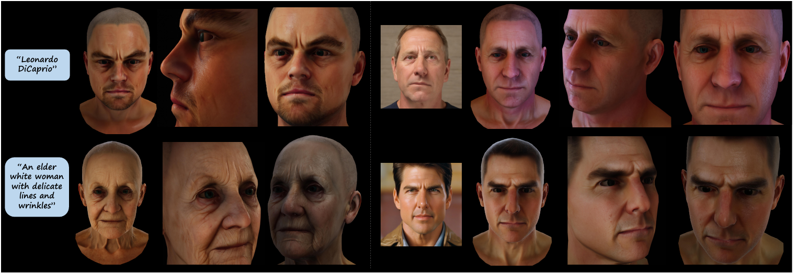

## 1. 배경

**목표**
- text prompt 또는 단일 얼굴 이미지에서 realistic, animatable 3D avatar 생성
- 다양한 rendering engine과 호환되는 PBR texture를 원치 않는 조명 없이 생성

**기존 방식의 문제**
- SDS(Score Distillation Sampling) loss 기반 : 결과가 over-smoothed되어 얼굴 detail이 적고, ancestral sampling에 비해 diversity 부족
- 단일 이미지 기반 : 원치 않는 조명(그림자, specular), 시점, 낮은 이미지 품질 때문에 정렬된 완전한 texture와 mesh 복원이 어려움
- 3DMM 파라미터 추정 방법 : occlusion과 조명에 민감, 고정된 texture basis를 쓰면 실제 얼굴 색과 skin detail 복원 불가
- NeRF 기반 : 계산량이 크고 mesh 기반 animation에 부적합, 보지 못한 시점의 photo-realism 부족
- 기존 avatar 생성 모델 : 원치 않는 조명을 고려하지 않아 diffuse texture 품질 저하, mesh 생성 오차와 visible/invisible 영역 차이로 texture와 mesh가 어긋남

**핵심 관찰**
- diffusion model의 self-attention block이 조명 효과를 포착하고 있음 → 이를 이용해 조명 제거

**기여**
1. self-attention feature와 조명 효과의 관계를 밝히고, 단일 이미지에서 조명을 제거하여 diffuse color를 추출하는 DCE(Diffuse Color Extraction) model 제안 (specular spotlight, shadow 제거 작업에 적합)
2. PBR texture를 생성하는 AGT-DM(Authenticity Guided Texture Diffusion Model) 제안
   - 3D mesh와 정렬된 고품질 완전한 texture, 조명 영향 없음
   - 두 가지 gradient 기반 guidance로 identity 고유의 얼굴 detail 유지, 생성 diversity 향상
3. DCE와 AGT-DM으로 구성한 3D avatar 생성 framework UltrAvatar

## 2. 방법론

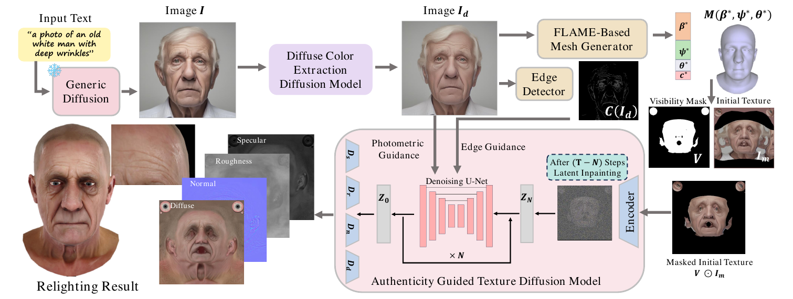

전체 흐름
1. text prompt를 일반 diffusion model(SDXL)에 넣어 얼굴 이미지 `I` 생성 (또는 얼굴 이미지를 직접 입력)
2. DCE model로 조명을 제거한 diffuse color 이미지 `I_d` 획득
3. `I_d`에서 FLAME 기반 mesh generator로 3D mesh와 camera parameter 추정, edge detector로 edge 이미지 생성
4. texture mapping으로 initial texture `I_m`과 visibility mask `V` 생성
5. masked initial texture `V ⊙ I_m`을 AGT-DM에 입력하여 PBR texture 생성

### 2-1. Preliminaries

- Stable Diffusion은 latent `z = E(x)`에서 동작, 최종 이미지는 `x_0 = D(z_0)`
- noise 예측 학습 목적

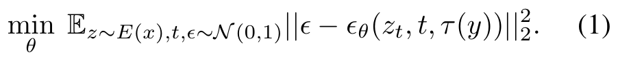

- U-Net의 각 layer = residual block + self-attention block + cross-attention block
  - residual block의 출력 : res-feature `f_t^l` (생성 이미지의 내용(RGB detail)에 기여)
  - self-attention의 입력 `phi_t^(l-1) + f_t^l`에서 query `q_t^l`, key `k_t^l`, value `v_t^l` 생성 (전체 구조/layout 정보)
- Classifier-Free Guidance

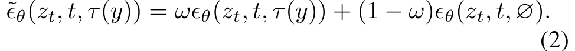

### 2-2. Diffuse Color Extraction (DCE) via Diffusion Features

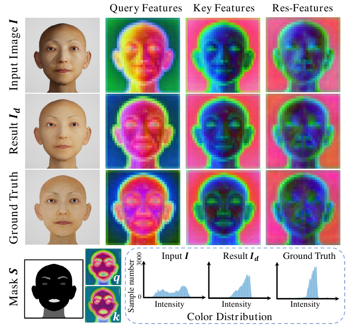

**핵심 관찰**
- res-feature `f`에는 RGB detail이 포함
- self-attention의 `q`, `k`는 이미지 layout을 반영하며, 같은 semantic 영역은 비슷한 값
- 추가로, `q`와 `k`의 변화는 한 semantic 영역 안의 조명 효과(shading, shadow, specular highlight)에 따른 변화를 반영
  - 어떤 pixel의 query는 같은 얼굴 부위의 key와 정렬되어 해당 부위에서 color를 가져옴
  - 조명이 더해진 이미지에서는 query가 조명에 의한 변화와 같은 방식으로 달라져, 그림자 영역은 근처 그림자 pixel의 color를, 하이라이트는 근처 하이라이트 pixel의 color를 가져오게 됨

**조명 제거 방법**
- `q`, `k`에서 조명 변화를 제거하면서 semantic 구조와의 정렬은 유지하면 됨
- semantic mask는 이 두 조건을 만족 (구조와 완벽히 정렬, 한 영역 내 값 균일)

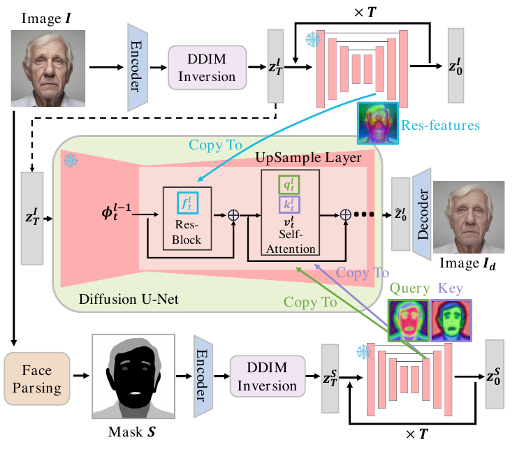

1. 입력 이미지 `I`에 face parsing model(BiSeNet)을 적용하여 semantic mask `S` 생성
2. `I`와 `S`에 각각 DDIM inversion(non-textual condition)을 적용하여 초기 noise `z_T^I`, `z_T^S` 획득
3. `z_T^I`의 denoising 과정에서 res-feature(`I`에서 추출)를 저장
4. `z_T^S`의 denoising 과정에서 query와 key(`S`에서 추출)를 저장
5. 마지막으로 `z_T^I`를 한 번 더 denoising하면서 저장한 feature를 복사
   - res-feature는 `I`에서, `q`와 `k`는 `S`에서 가져온 값으로 self-attention block의 `q`, `k`를 교체
6. 결과 latent를 decoding하여 diffuse color 이미지 `I_d` 생성

**설정**
- SD-2.1 base model, DDIM sampling 20 step
- res-feature는 U-Net upsampling layer 4~11번에서 추출하여 주입
- query와 key는 upsampling layer 4~9번에서 추출하여 주입 (마지막 몇 개 layer에 주입하면 identity가 약간 변하는 경우가 있어 전체 layer에는 주입하지 않음)
- 얼굴 이미지 외의 일반 이미지에도 적용 가능

### 2-3. 3D Avatar Mesh Generation

- geometry 표현으로 FLAME 사용
  - 33,000개 이상의 scan으로 학습된 3D head template model
  - 파라미터 : identity shape `beta`, expression `psi`, pose `theta`
  - 생성 mesh `M(beta, psi, theta)` : 5023개 vertex, 9976개 face (head, neck, eyeball 포함)
- `I_d`에서 파라미터 추정
  - shape `beta*` : MICA (expression, 조명, camera 변화에 robust한 neutral face shape 추정)
  - expression `psi*`, pose `theta*`, camera `c*` : EMOCA (이후 animation/driving에 활용)
- EMOCA가 FLAME texture basis로 만드는 color texture는 사용하지 않음
  - 실제 얼굴 색을 정확히 표현하지 못하고 skin detail과 PBR detail(diffuse, normal, specular, roughness)이 없기 때문

### 2-4. Authenticity Guided Texture Diffusion Model (AGT-DM)

**입력과 목표**
- 입력 : mesh `M(beta*, psi*, theta*)`, camera `c*`, 조명 제거된 `I_d`
- `I_d`를 mesh에 texture mapping한 뒤 UV로 projection하여 initial UV map `I_m` 생성
  - 단일 view이므로 incomplete, visible mask `V`로 표시
  - EMOCA의 pose/expression/camera 추정 오차 때문에 mesh와 완벽히 정렬되지 않을 수 있음
- AGT-DM의 역할
  1. `T - N` step 동안 latent inpainting으로 관측되지 않은 영역 채움
  2. texture diffusion model을 prior로 활용하여 texture와 mesh의 정렬 개선
  3. photometric/edge guidance 두 신호로 identity와 얼굴 detail 보존
  4. diffuse 외에 normal, specular, roughness map까지 출력

**학습**
- 데이터 : 3DScan 사이트의 고품질 3D face scan (diffuse, normal, specularity, roughness 등 PBR texture 포함, 별도 처리하여 사용)
- SD-2.1-base의 U-Net을 diffuse UV map으로 fine-tuning
  - prompt 앞에 "A UV map of"를 붙여 FLAME UV map 생성
- PBR texture 생성 : SD encoder는 freeze, specularity, roughness, normal 각각에 대해 decoder를 별도 fine-tuning
  - diffuse decoder `D_d`는 원래 SD decoder를 그대로 사용 (총 4개 decoder : `D_d`, `D_n`, `D_s`, `D_r`)
- 학습 data의 mesh와 texture가 이상적으로 정렬되어 있으므로, 추론 시 생성 texture와 mesh의 정렬이 개선됨

**추론 (두 단계)**
1. 처음 `T - N` step : visibility mask를 이용한 latent space inpainting으로 `V ⊙ I_m`의 빈 영역을 채워 `Z_N` 획득
2. 마지막 `N` step : photometric guidance와 edge guidance를 적용하여 관측/비관측 영역의 정렬 오차를 바로잡고 일관되게 결합
3. 결과 latent `Z_0`를 4개 decoder에 통과시켜 PBR map 획득
4. 사전 학습된 Stable Diffusion super-resolution network로 2K 해상도 texture 생성

**Photometric Guidance**
- 렌더링한 avatar와 `I_d`를 가깝게 하여 생성 texture를 입력 이미지와 정렬

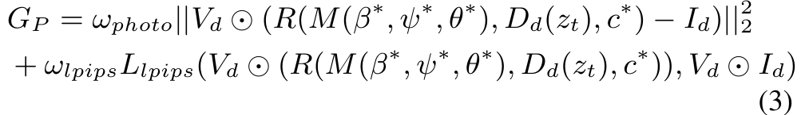

- `R(·)` : differentiable renderer, `V_d` : rendering된 얼굴의 visible part mask, `D_d(z_t)` : 시점 `t`의 diffuse color texture map

**Edge Guidance**
- canny edge로 high-frequency detail(주름, 주근깨, 모공, 점, 흉터) 유지

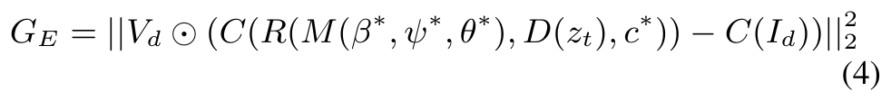

- `C(·)` : canny edge detection

**통합** : 두 guidance의 gradient를 classifier-free guidance sampling에 추가

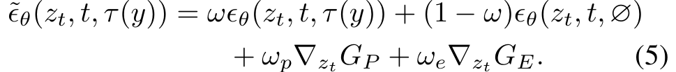

**하이퍼파라미터** : `T = 200`, `N = 90`, `omega = 7.5`, `omega_p = 0.1`, `omega_photo = 0.4`, `omega_lpips = 0.6`, `omega_e = 0.05`

## 3. 실험

**설정**
- text-to-image : SDXL
- face parsing : 사전 학습된 BiSeNet
- 비교 대상
  - text-to-avatar : Latent3D, CLIPMatrix, Text2Mesh, CLIPFace, DreamFace
  - image-to-avatar : FlameTex, PanoHead
- 평가 prompt : 40개 (연령, 인종, 성별, 유명인 포함)
- 평가 이미지 생성
  - DreamFace와 UltrAvatar : mesh를 50개 각도에서 5개 조명 조건으로 렌더링
  - PanoHead : prompt마다 SDXL로 5장 생성하여 총 200장, 각 50 view → 10k장
- 속도 : text prompt로 2분 이내 (DreamFace는 5분), A6000 1장
- metric : FID, KID (CLIPFace와 같이 배경, 눈, 입 내부를 제외한 FFHQ 이미지와 비교), text-to-avatar는 CLIP score 추가 (ViT-B/16과 ViT-L/14의 평균)

**생성 결과**

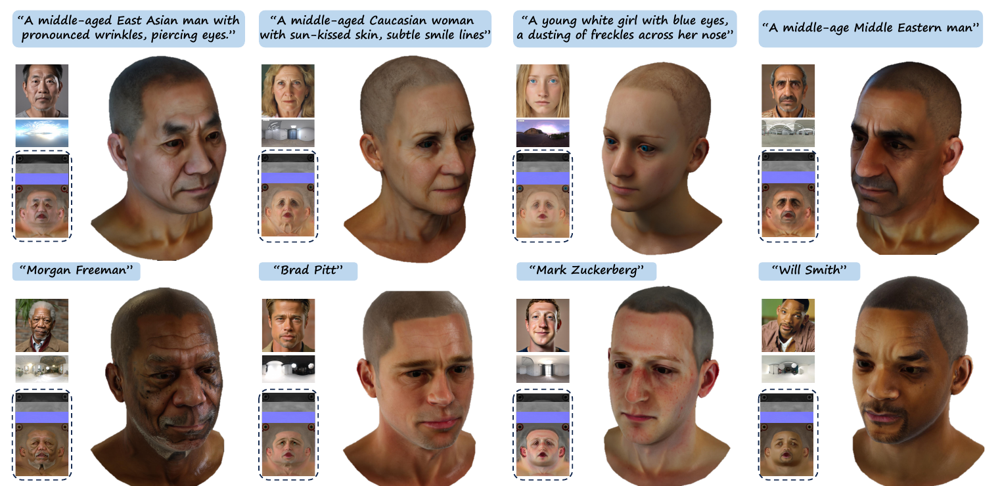

**정량 결과**

| Method | FID ↓ | KID ↓ | CLIP Score ↑ |
|---|---|---|---|
| DreamFace | 76.70 | 0.061 | 0.291 ± 0.020 |
| ClipFace* | 80.34 | 0.032 | 0.251 ± 0.059 |
| Latent3d* | 205.27 | 0.260 | 0.227 ± 0.041 |
| ClipMatrix* | 198.34 | 0.180 | 0.243 ± 0.049 |
| Text2Mesh* | 219.59 | 0.185 | 0.264 ± 0.044 |
| FlameTex* | 88.95 | 0.053 | - |
| PanoHead | 48.64 | 0.039 | - |
| UltrAvatar | 45.50 | 0.029 | 0.301 ± 0.023 |

- `*` 표시 결과는 CLIPFace 논문의 수치

**비교 분석**
- DreamFace : text와의 유사도는 높으나 realism과 diversity가 부족, 큰 코나 흔치 않은 유명인 같은 어려운 prompt에서 실패 (DreamFace 결과는 여러 번 실행한 것 중 최선)
- PanoHead(image-to-avatar) : 정면 rendering은 우수하나 pre-processing 추정 정확도에 크게 의존, NeRF 기반이라 relighting에 한계
- GPT-4V를 이용한 평가 : 5점 Likert 척도로 photo-realism, artifact 최소화, skin texture 품질, text prompt 일치, 선명도를 평가, UltrAvatar가 전반적으로 우수

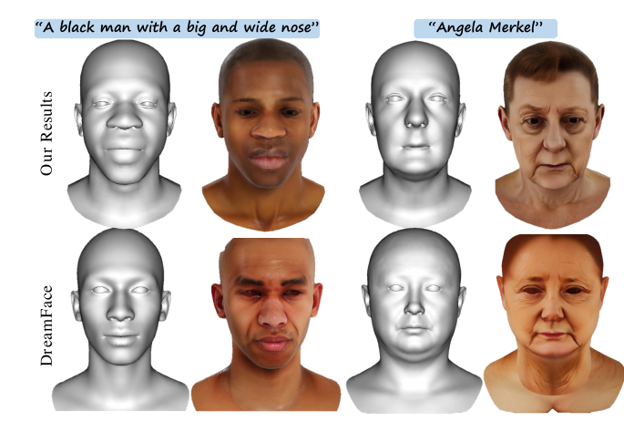

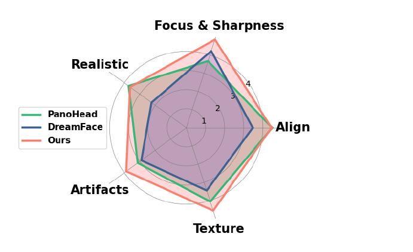

**Ablation : guidance** (Photometric과 Edge)
- G_P, G_E 모두 없는 경우, G_P만 있는 경우, 둘 다 있는 경우 비교
- photometric guidance : 생성 texture와 원본 이미지의 유사도 강화
- edge guidance : 생성 color texture의 detail 강화

**Ablation 결과**

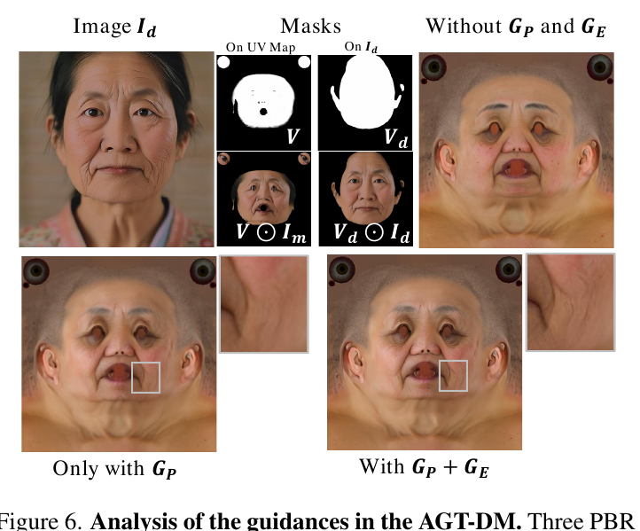

**기타 결과**
- Out-of-domain 생성 : 애니메이션/만화 캐릭터, 비인간 avatar도 생성 가능
- Animation과 editing : FLAME 기반이라 expression과 pose를 바꿔 animation 가능, AGT-DM의 text prompt로 texture 편집 가능
- 서로 다른 조명 조건에서 relighting한 avatar를 정확히 rendering, AGT-DM이 관측/비관측 영역의 일관성을 강제하여 다른 각도에서도 artifact 없이 사실적

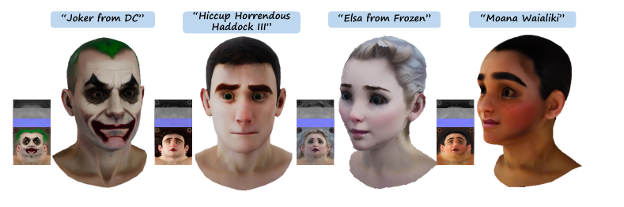

## 4. 참고

- 논문에는 별도의 한계 섹션이 없음
- 결론 : DCE와 photometric/edge guidance 기반 texture 생성 model을 통해 사실감, 품질, fidelity, diversity가 향상된 3D avatar 생성
