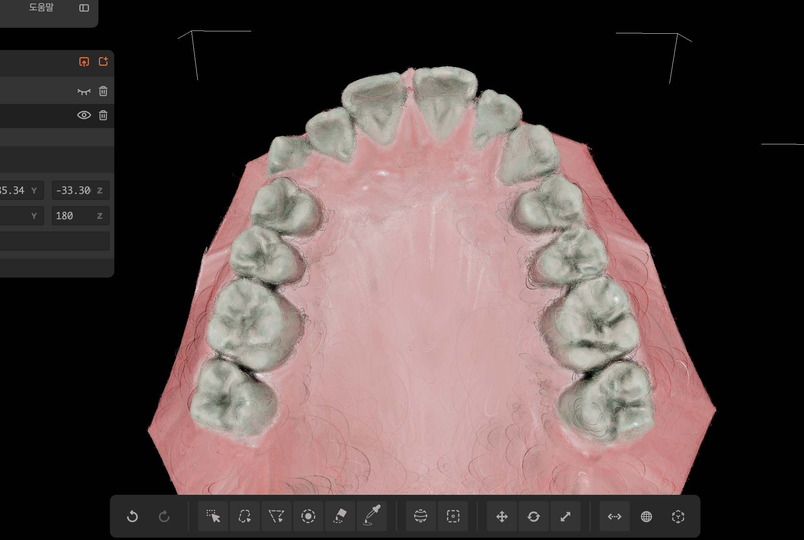
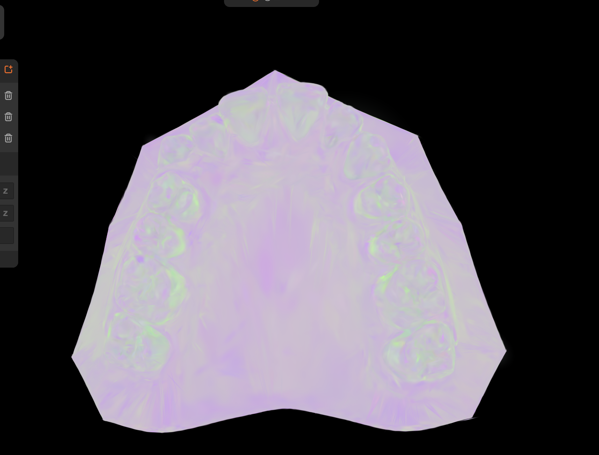

# Skyfall-GS 치아 실험 환경 정리

## 1. 실험 목적
- 치아 mesh 기반 입력으로
- Skyfall-GS Stage1 결과 검증
- ply 시각화 결과와 checkpoint 렌더링 결과 차이 원인 분석

## 2. 데이터 및 입력
- Point Cloud: 치아 mesh에서 추출한 point cloud (PLY)
- Images: mesh 기준으로 렌더링한 image sequence
- Camera:
  - mesh 렌더링 시 사용한 camera parameter
  - Skyfall-GS transforms_train.json 형태로 변환

---

## 3. 시각화 도구별 결과 비교

### 3.1 Supersplat (PLY 시각화)

- 사용 도구: Supersplat (Web version)
- 입력: Stage1 실행 후 생성된 기본 PLY
- 설정:
  - 기본 시각화 옵션
  - Gaussian silhouette 표시 옵션 활성화 상태

#### 관찰 사항
- Gaussian이 alpha blending 없이 기하적으로 시각화됨
- elongated Gaussian(늘어진 축)이 실처럼 드러나 보임
- Gaussian 분포 및 geometry 확인에는 유용
- checkpoint 기반 렌더링에서 보이는 appearance와는 차이가 있음

---

### 3.2 WebGL 3D Gaussian Splat Viewer (PLY 시각화)

- 사용 도구: WebGL 3D Gaussian Splat Viewer
- 입력: 동일한 기본 PLY

#### 관찰 사항
- Supersplat과 유사하게 PLY 기반 Gaussian을 시각화
- 렌더러 특성상 checkpoint 렌더링 대비
  색상 및 appearance 표현에 한계가 있음

---

### 3.3 Checkpoint 기반 렌더링 (Skyfall-GS renderer)

- 사용 도구: Skyfall-GS 내부 renderer
- 입력:
  - Stage1 checkpoint (e.g., `chkpnt30000.pth`)
  - 동일 camera path
- 방식:
  - screen-space alpha blending 기반 GS 렌더링

#### 관찰 사항
- alpha blending을 통해 Gaussian들이 자연스럽게 합성됨
- 치아 / 잇몸 영역의 appearance가 가장 안정적으로 표현됨

---

## 4. Color-baked PLY 생성 (확인용)

Stage1 실행 후 기본적으로 생성되는 PLY에는
Gaussian의 위치, 크기, 회전, opacity 등의 기하 파라미터는 포함되어 있으나,  
checkpoint 렌더링에서 사용되는 appearance 정보는
직접적으로 색으로 bake되어 있지 않았습니다.  
  
  
> 기본 PLY를 시각화한 결과, geometry 중심 표현만 확인되는 상태

시각화 차이 원인 확인을 위해,
checkpoint를 이용해 appearance를 PLY에 bake한
fused PLY를 별도로 생성하였습니다.  

### 4.1 동작 원리

- Checkpoint 로드 (`chkpnt30000.pth`)
  - 학습된 Gaussian 파라미터 (position, scale, rotation, opacity)
  - 학습된 `appearance_mlp` 가중치
  - Per-Gaussian embedding

- `save_fused_ply()` (`gaussian_model.py`)
  - `appearance_mlp`를 통해 각 Gaussian의 RGB 색상 계산
  - 계산된 색상을 SH DC component (`_features_dc`)에 bake
  - 색상이 포함된 fused PLY 저장

※ 해당 fused PLY는 **시각화 확인용**으로 생성

---

## 5. 정리 및 결론

- 기본 PLY:
  - Gaussian 파라미터를 포함한 geometry 중심 표현
  - 시각화 결과는 뷰어 및 옵션에 따라 크게 달라질 수 있음
- Checkpoint:
  - GS 렌더러에서 screen-space alpha blending 및
    view-dependent appearance가 반영됨

