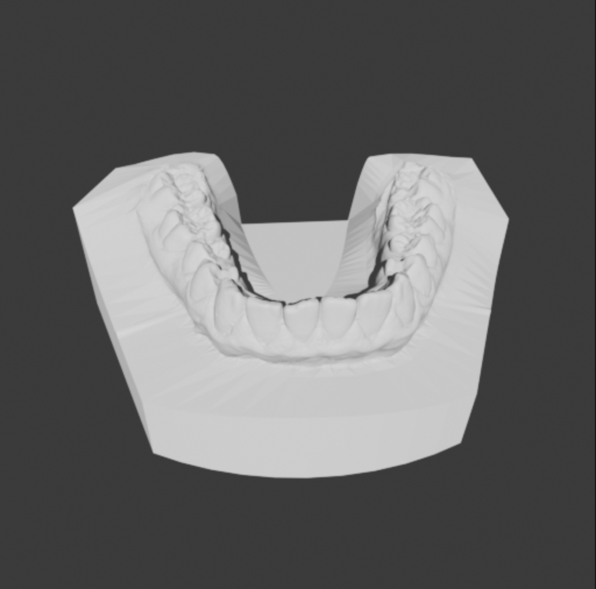
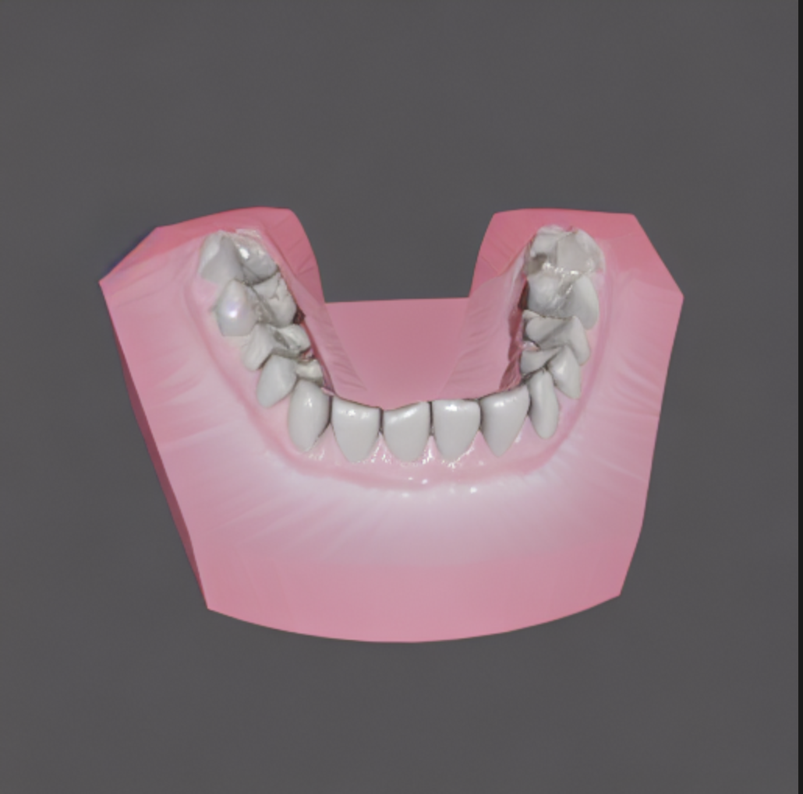
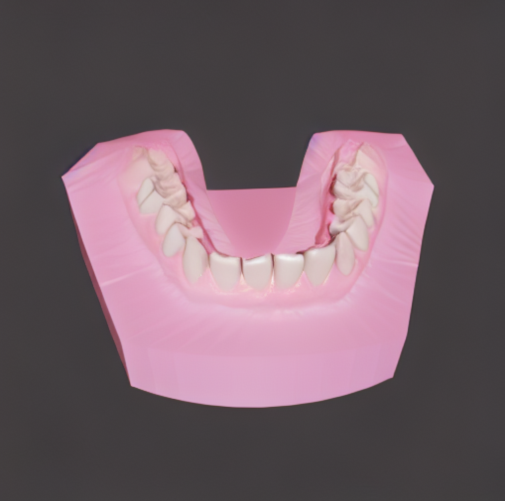

# ctrLoRA + StreamDiffusion Report

## 목적
- 단일 머티리얼 치아 렌더 이미지를 **사실화**하면서도 **real-time** 처리 가능성 확인
- segmentation / lighting map 다중 조건 적용 시 **consistency** 및 디테일 손실 여부 점검

---

## 실험 1: 두 조건 LoRA (segmentation + lighting, weight 0.5/0.5)

- 설정: segmentation, lighting map 각각 0.5 가중치로 LoRA 적용
- 결과: multi-condition interference 발생 (디테일/색상 간 간섭)

| Input (Segmentation) | Input (Lighting) | Output |
|---|---|---|
|  |  |  |

---

## 실험 2: LCM 적용 (single image)

- 설정: LCM 적용 완료
- 성능: 단일 이미지 기준 **1.53s**
  - stream diffusion batch 처리 적용 시, 두 번째 이미지부터 속도 추가 개선 예상

| Input | Output |
|---|---|
|  |  |

---

## 실험 3: segmentation 가중치 조정 (0.2, 0.1)

- 문제: segmentation과 lighting map이 역할 분리가 명시적이지 않아 상호 간섭 발생
- 조정: segmentation weight를 0.2, 0.1로 낮춰 테스트

| Segmentation weight 0.2 | Segmentation weight 0.1 |
|---|---|
|  |  |

---

## 해석 및 이슈

- segmentation은 색상 정보에, lighting map은 디테일 정보에 영향을 주는 경향
- 명시적 역할 분리가 없어 **color vs detail 간 간섭**이 발생하는 것으로 판단
