# NeRF And Gaussian Splatting Results

## Overview

- 목표: NanoBanana로 생성한 multi-view 결과를 `wild-NeRF`로 먼저 정렬한 뒤, `Gaussian Splatting` 계열 재구성에 넣었을 때의 품질을 비교

---

## 1. NanoBanana -> wild-NeRF

- NanoBanana로 생성한 54-view를 `wild-NeRF`에 입력하여 view consistency를 먼저 정렬

| NanoBanana | wild-NeRF |
| --- | --- |
| 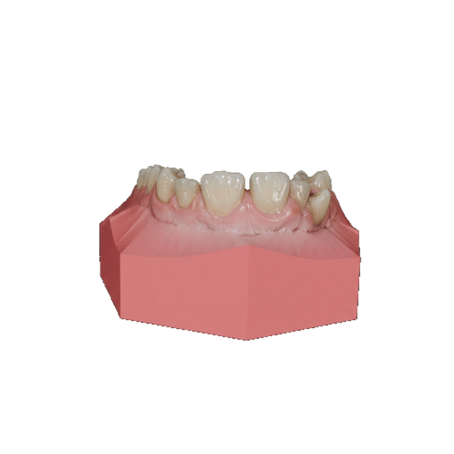 |  |
| 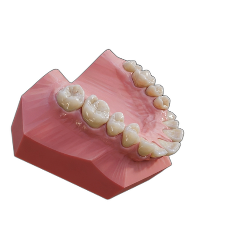 |  |
| 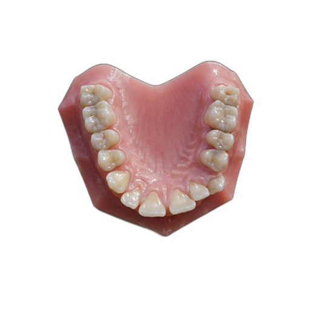 | 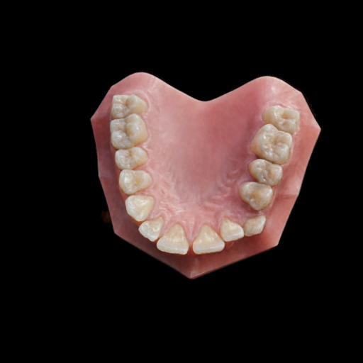 |
| 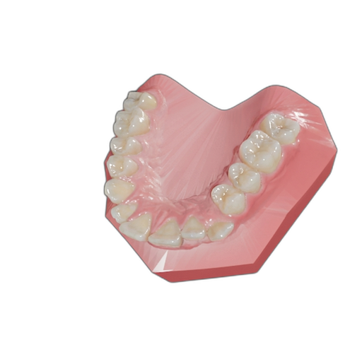 | 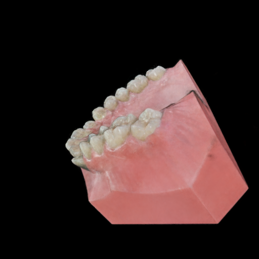 |

- `wild-NeRF`를 거치면 NanoBanana의 per-view appearance 차이가 어느 정도 흡수되며 전체적인 정렬감은 개선됨
- 다만 잇몸 부근의 shadow와 lighting residue는 그대로 남아 있어, 이후 재구성 단계에서 artifact 원인이 될 수 있음

---

## 2. NanoBanana -> wild-NeRF -> Gaussian Splatting

- `wild-NeRF` 결과에서 94개 view를 추출하여 `Gaussian Splatting`에 입력

| wild-NeRF | Gaussian Splatting |
| --- | --- |
|  | 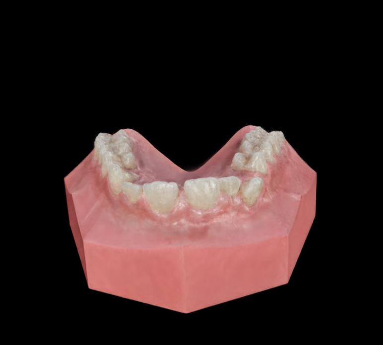 |
|  | 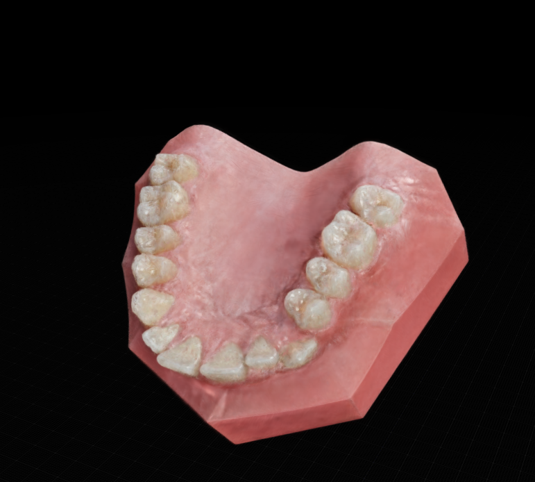 |
|  | 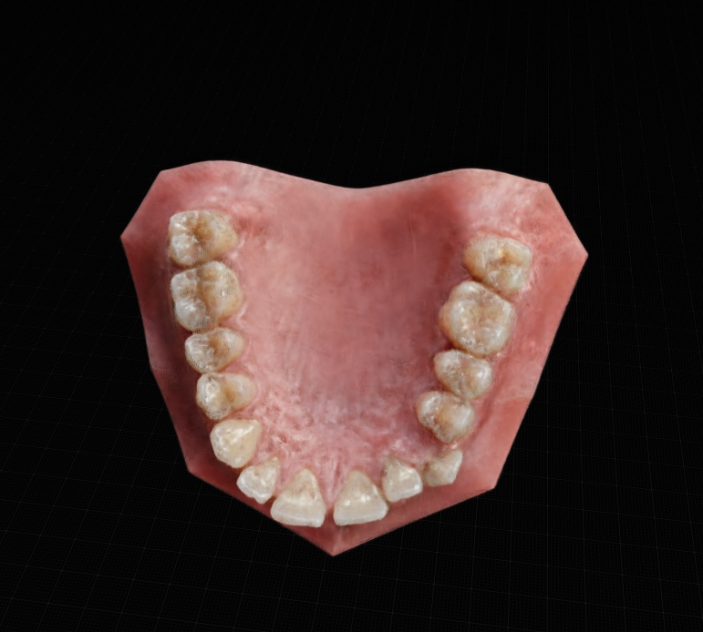 |
|  | 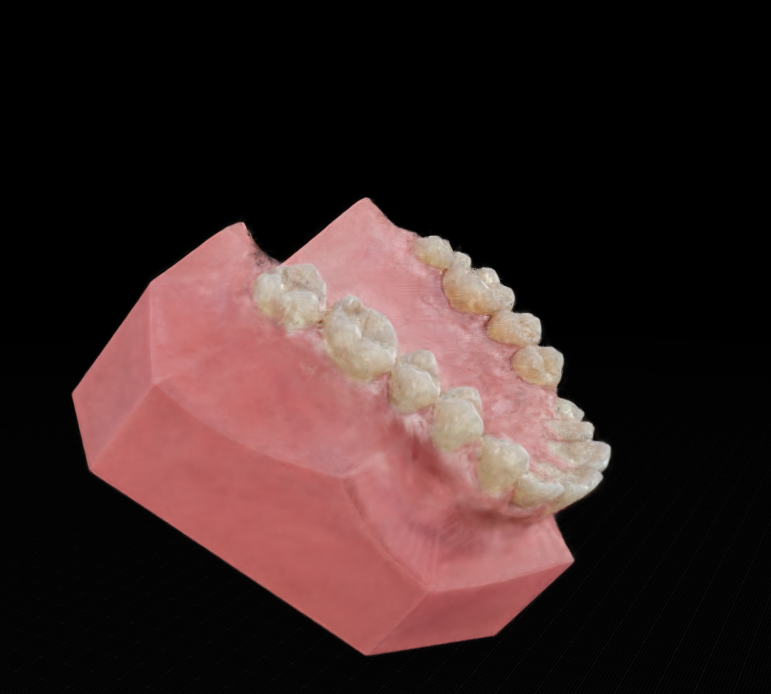 |

### Front View Comparison

| NanoBanana front | Gaussian Splatting front |
| --- | --- |
| 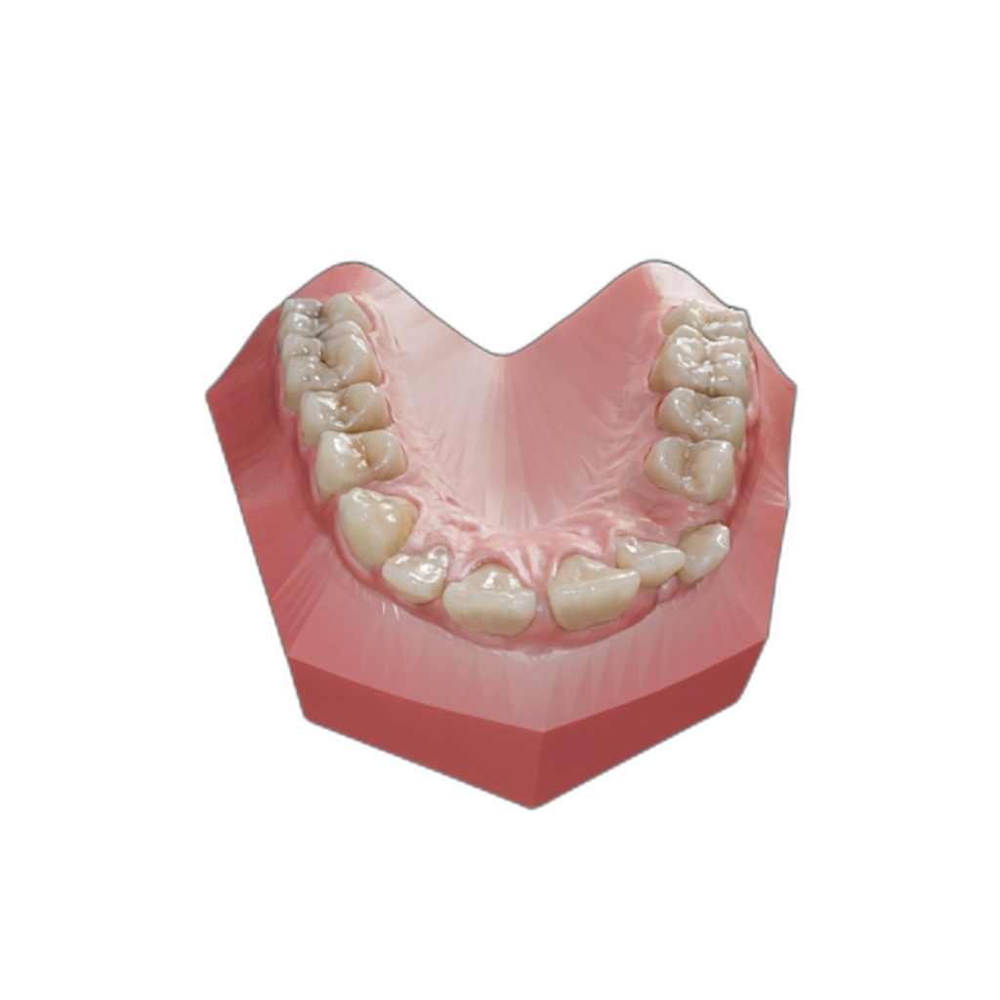 | 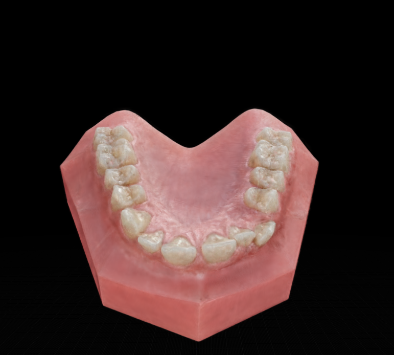 |
| 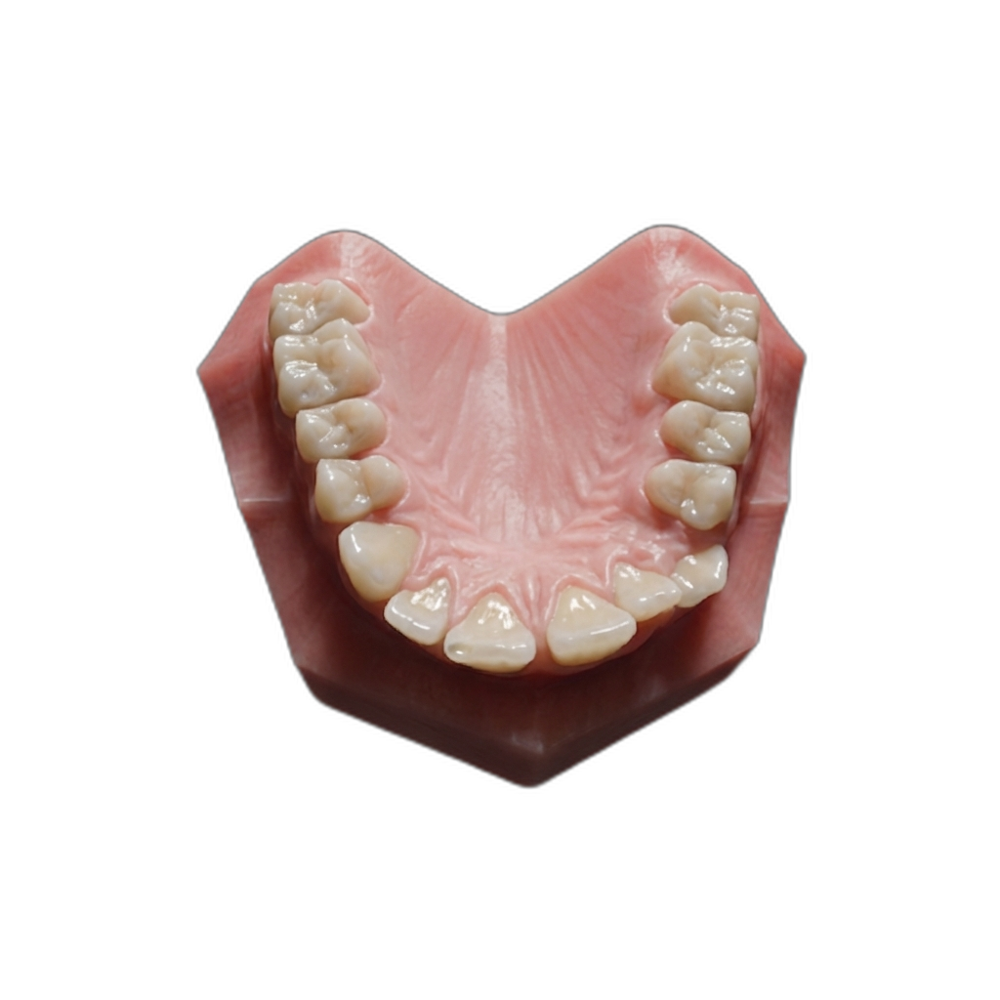 | 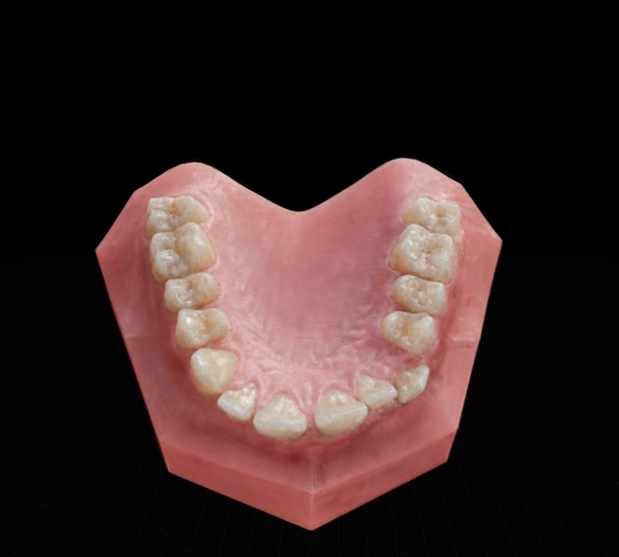 |
| 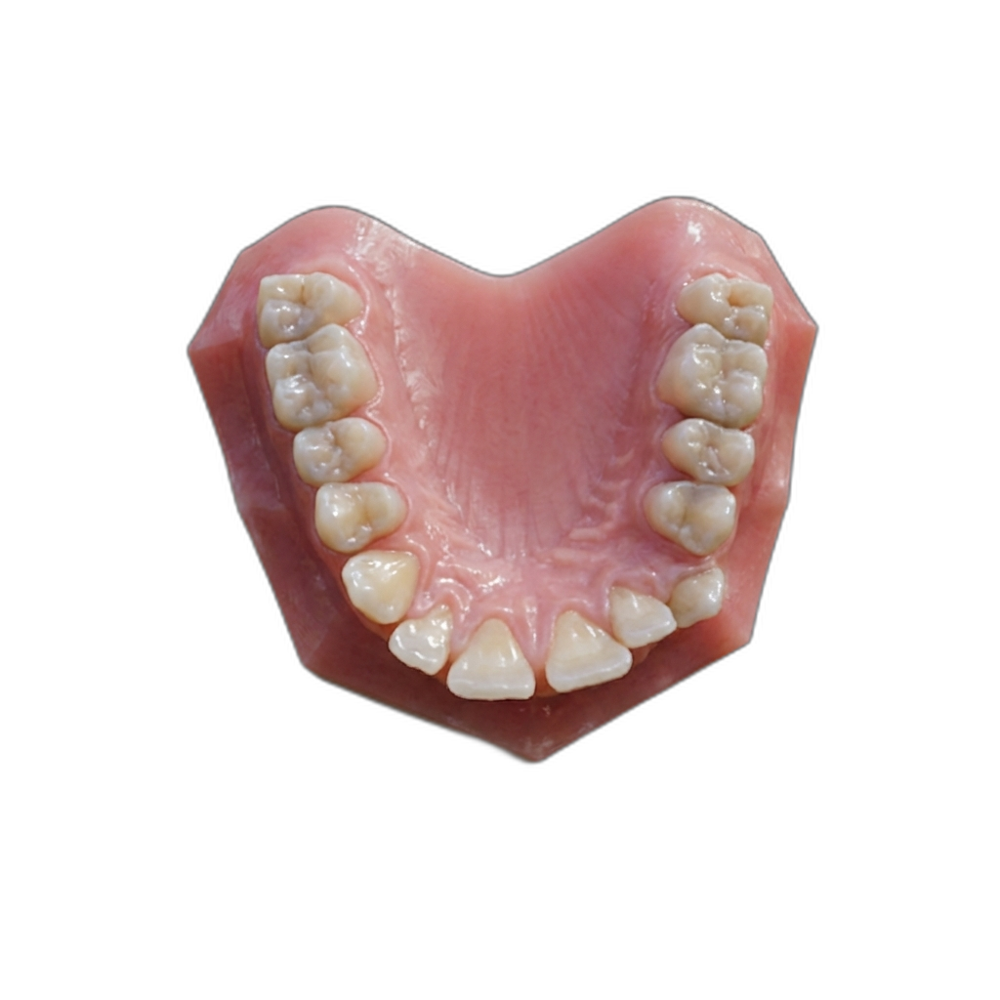 | 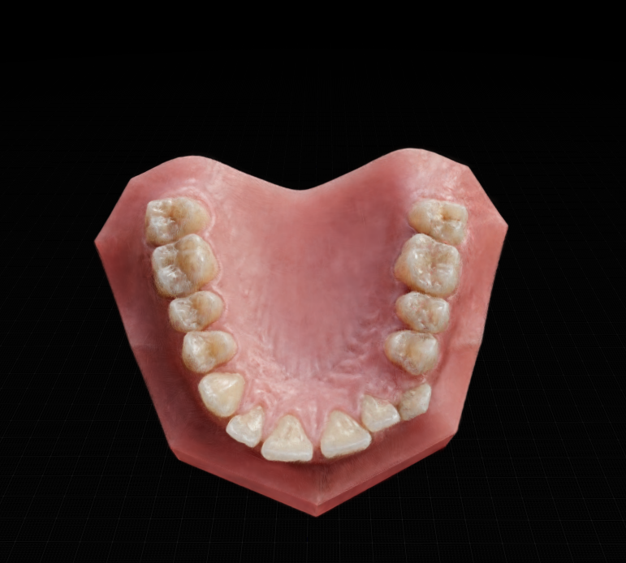 |

### Observation

- 정면 기준으로는 NanoBanana가 갖고 있던 appearance 경향이 어느 정도 유지됨
- 하지만 잇몸 그림자의 불일관성을 하나의 Gaussian set으로 동시에 설명하기 어려워, 여러 Gaussian이 낮은 opacity로 중첩되면서 appearance가 퍼지는 경향이 보임
- 그 결과 잇몸 영역에서 구멍처럼 보이는 artifact가 발생함

---

## 3. NanoBanana -> wild-NeRF -> wild-Gaussian Splatting

- 동일하게 `wild-NeRF`에서 추출한 94개 view를 `wild-Gaussian Splatting`에 입력

| wild-NeRF | wild-Gaussian Splatting |
| --- | --- |
|  | 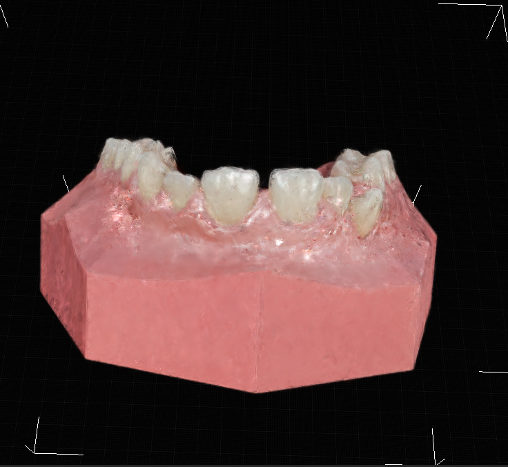 |
|  | 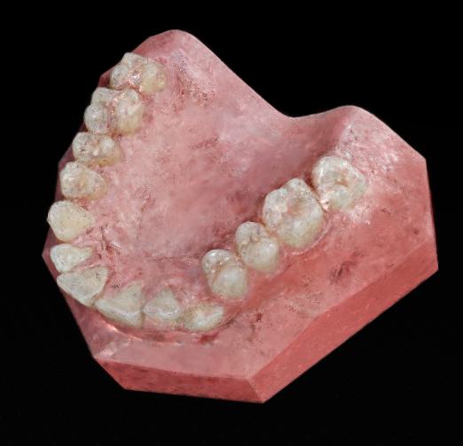 |
|  | 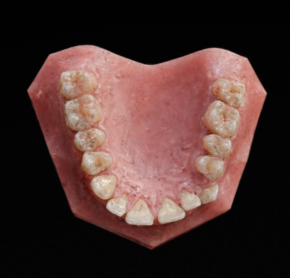 |
|  | 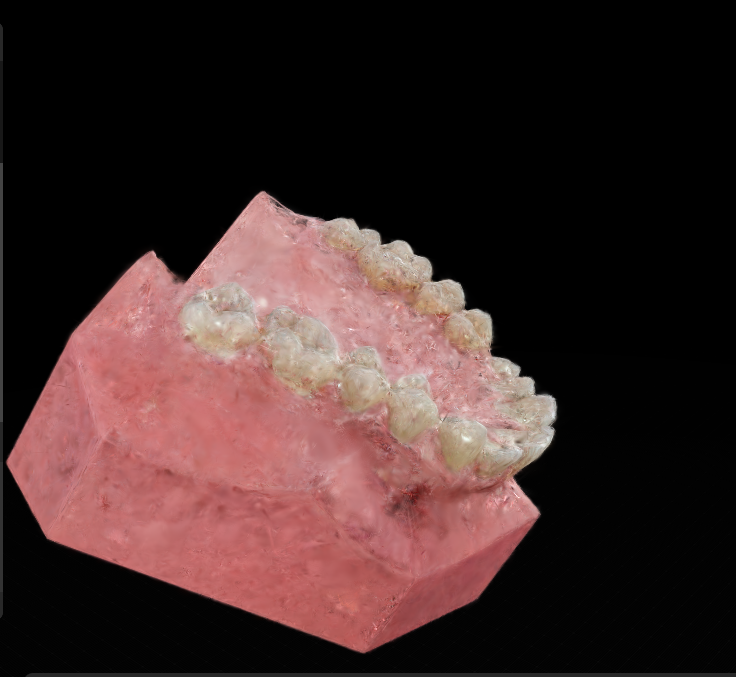 |

