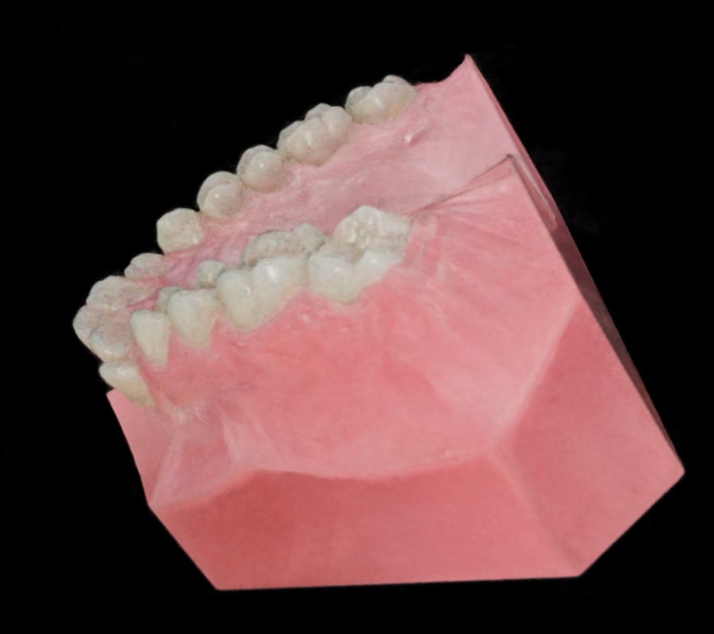
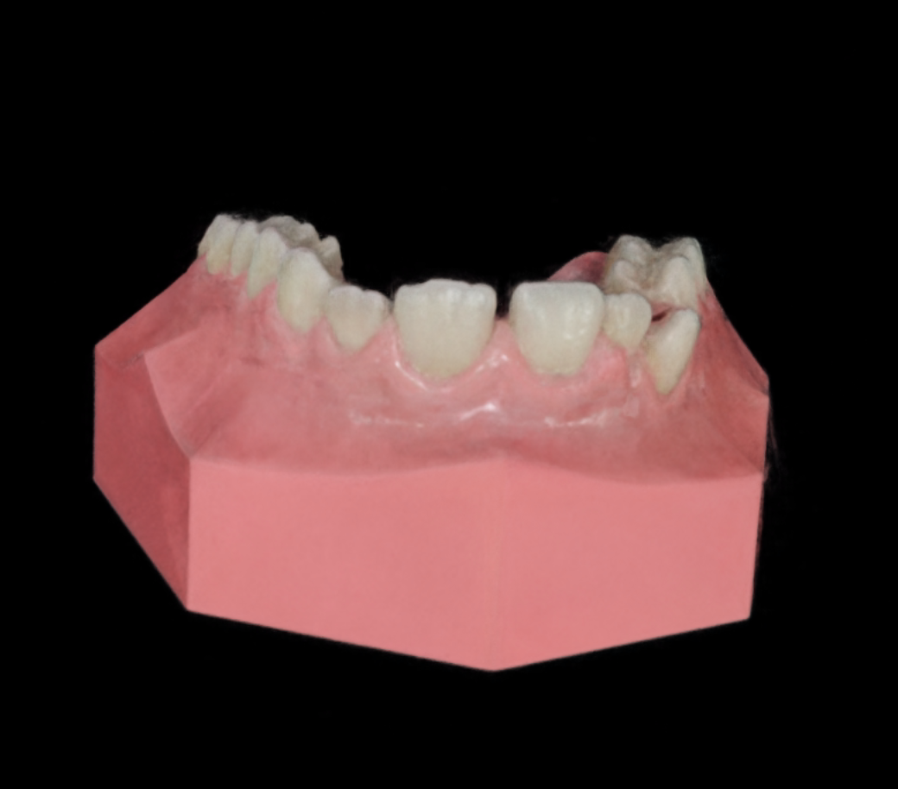
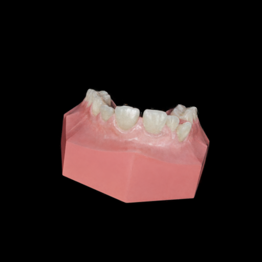
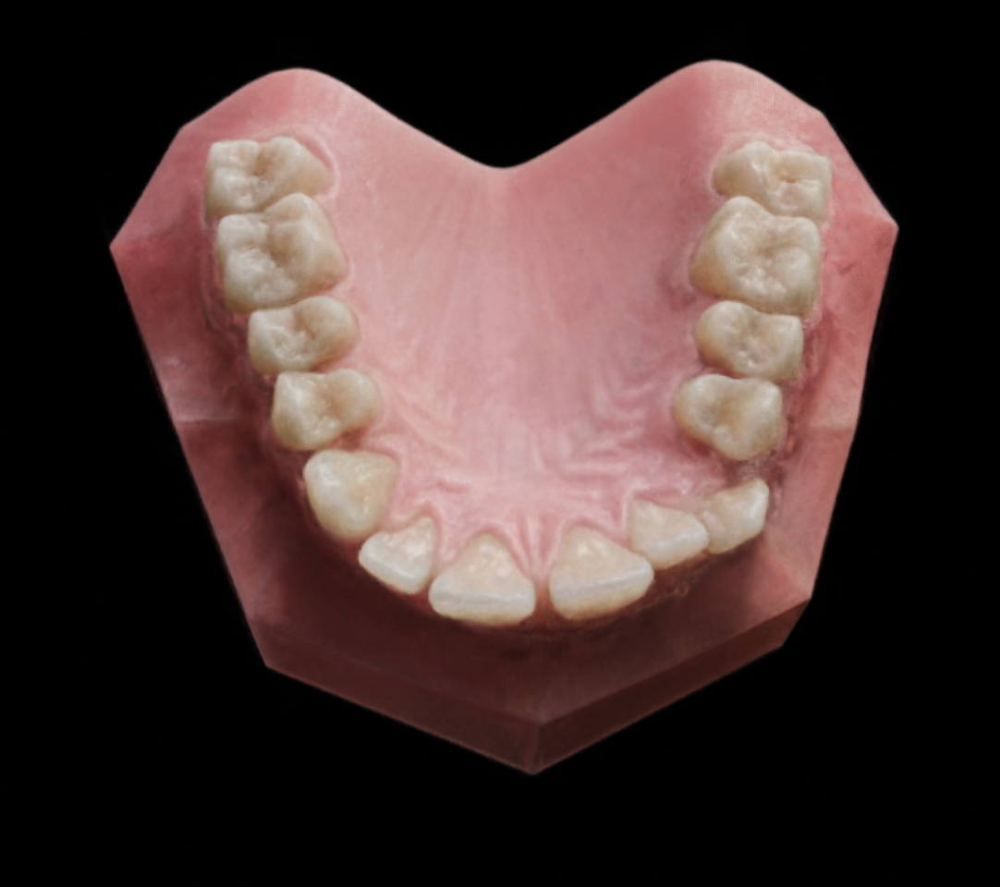

# Dental Texture Generation Pipeline Update

## Goal

- 목표: texture가 없는 치아 mesh에 대해 **geometry를 유지하면서 realistic texture를 생성**
- 조건: 치아/잇몸 mesh는 이미 정확하므로, 생성 결과도 **mesh에 맞게 정렬**되어야 함

---

## Why The Pipeline Changed

### 1. Direct image generation was not enough

- 초기에 Stable Diffusion 계열로 texture를 직접 생성하려 했음
- 그러나 view마다 결과가 달라져 **multi-view consistency** 문제가 크게 발생

### 2. MV-Adapter solved only part of the problem

- Multi-view adapter로 **일관된 6-view 생성**은 가능해짐
- 하지만 3DGS 학습에는 여전히 view 수가 부족했고,
- 이 sparse-view 문제를 보완하기 위해 **Skyfall-GS 방향**으로 전환

### 3. Skyfall-GS still depends on a generative prior

- Skyfall-GS의 view 보완은 결국 FLUX 같은 생성 모델에 의존
- 하지만 현재 문제는 "새로운 plausible image 생성"이 아니라
  "이미 알고 있는 정확한 mesh에 맞는 texture 생성"임
- 즉, geometry fidelity가 중요할수록 생성 모델의 자유도가 다시 문제가 됨

---

## Current Direction

### Core idea

- mesh와 segmentation 정보로 **single-lighting render**를 만들 수 있음
- 이 render를 각 view별로 생성 모델에 넣어 realistic appearance를 얻는 방향으로 전환

### Step 1. NanoBanana on many views

- 한 mesh에 대해 single-lighting된 여러 view를 생성
- 각 view를 NanoBanana에 독립적으로 넣어 실험
- 현재 기준으로 **54 views**까지 실험

| GT vs NanoBanana | Overlay |
| --- | --- |
|  |  |
|  |  |
|  |  |

| Generated views |
| --- |
|     |

### Observation

- 단일 view 품질은 좋음
- 하지만 view별 독립 생성이라 **색, 조명, 그림자**가 완전히 맞지 않음

| GT back view | NanoBanana back view | GS output |
| --- | --- | --- |
|  |  |  |

---

## Why NeRF Was Added

- GS는 입력 inconsistency에 매우 민감함
- 반면 NeRF는 view 사이의 mismatch를 어느 정도 흡수하면서 정렬 가능
- 그래서 현재는 **NanoBanana 결과를 바로 GS에 넣기보다, 먼저 wild-NeRF로 정렬**하는 방향을 사용

| Instant NeRF | Wild NeRF |
| --- | --- |
|  |  |
|  |  |
|  |  |

### Observation

- wild-NeRF를 거치면 NanoBanana raw 결과보다 consistency가 개선됨
- 하지만 여전히 약한 shadow, lighting residue가 남음

---

## Current Bottleneck

- 지금 병목은 geometry가 아니라 **relighting / intrinsic consistency**
- NanoBanana만으로는 view마다 lighting이 조금씩 다르고
- wild-NeRF는 이를 완전히 제거하지는 못함
- 결과적으로 GS에 넣기 전 단계에서 아직 shading residue가 남아 있음

---

## Next Step

1. wild-NeRF output에 대해 **relighting** 적용
2. view 간 shadow / highlight / color tone 정렬
3. 정렬된 결과를 **Gaussian Splatting**으로 재구성
4. reconstruction 결과 확인 후 종료

요약하면, 현재 파이프라인은 아래처럼 정리됨:

```text
mesh + segmentation
    -> single-lighting renders (54 views)
    -> NanoBanana per-view generation
    -> wild-NeRF for cross-view consistency
    -> relighting
    -> Gaussian Splatting reconstruction
```

---

## Takeaway

- 핵심 문제는 "view 수 부족" 자체보다,
  **정확한 mesh를 유지한 채 realistic하고 consistent한 appearance를 얻는 것**
- 따라서 현재 단계에서 가장 중요한 모듈은
  추가 생성이 아니라 **relighting을 통한 appearance normalization**임
