# Relighting Experiments

## Overview

- 목표: wild-NeRF 이후에도 남아있는 조명 차이 및 shading residue를 줄여, Gaussian Splatting 이전 단계에서 view consistency를 향상시키는 것

---

## 1. Relighting

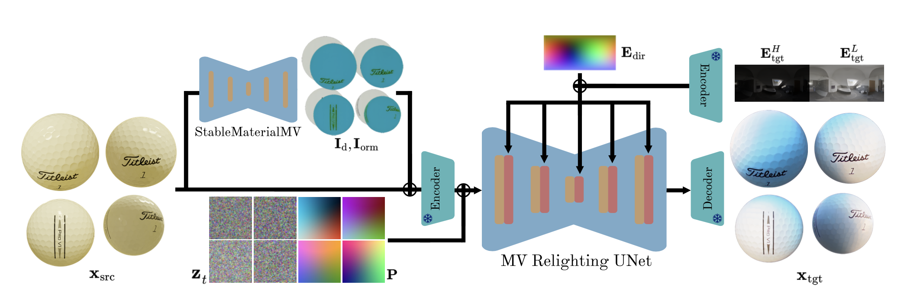 

StableMaterialMV를 이용하여 albedo map과 ORM map을 추정한 뒤, 이를 MV Relighting 모델의 입력 조건으로 사용하여 relighting을 수행함

- **StableMaterial**  
  MaterialFusion 논문에서 제안된 2D material diffusion prior로, 입력 RGB 이미지로부터 albedo 및 ORM(occlusion, roughness, metallic) map을 추정함

- **StableMaterialMV**  
  StableMaterial에 multi-view attention을 적용하여, 여러 view 간 일관된 material map을 추정하도록 확장한 모델

→ 따라서 StableMaterialMV의 성능을 먼저 확인할 필요가 있음

---

### 실험 1: 전체 view 입력

입력 데이터  
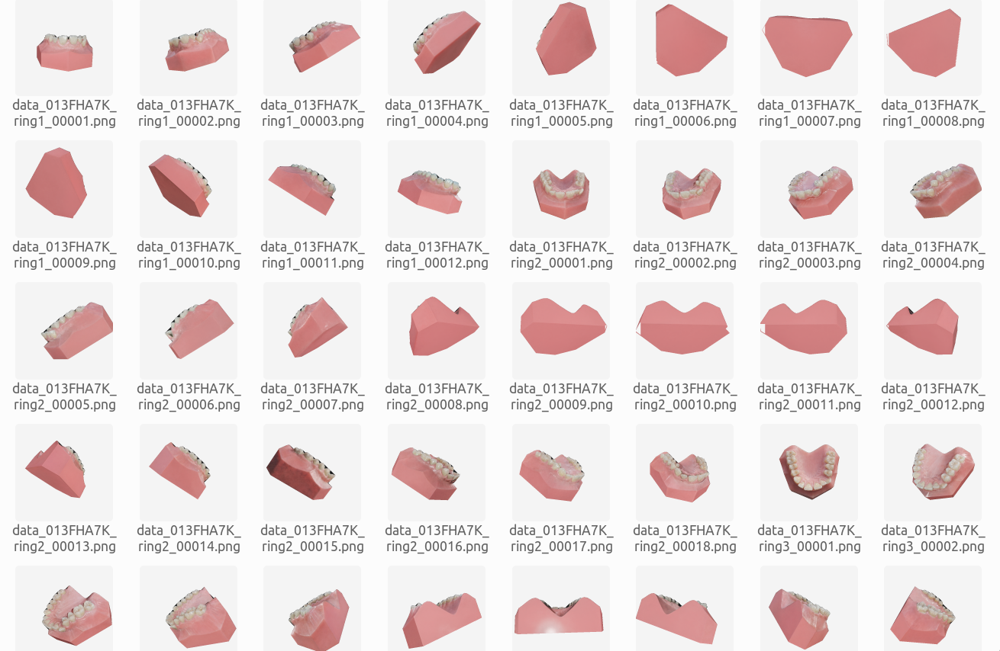

결과  
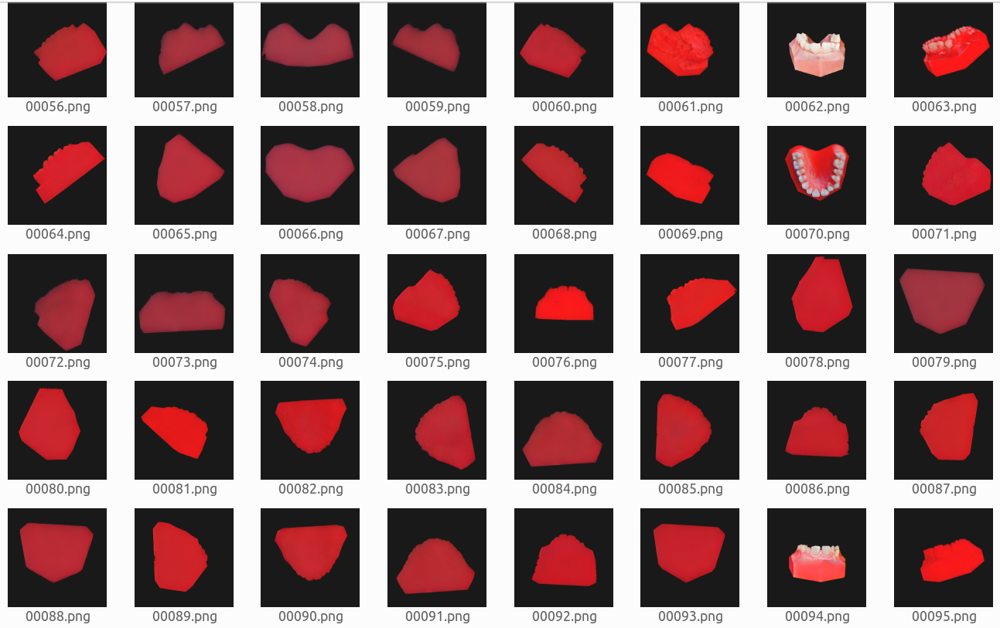

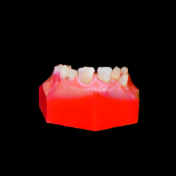 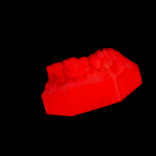 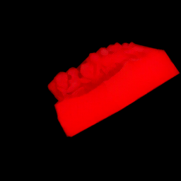 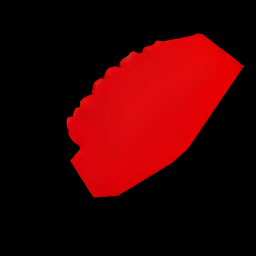

→ 멀티뷰 입력 시 치아 뒷면 이미지(잇몸 비중이 높은 view)가 전체 색 분포에 영향을 준 것으로 판단됨

---

### 실험 2: 앞면 view만 입력

입력 데이터  
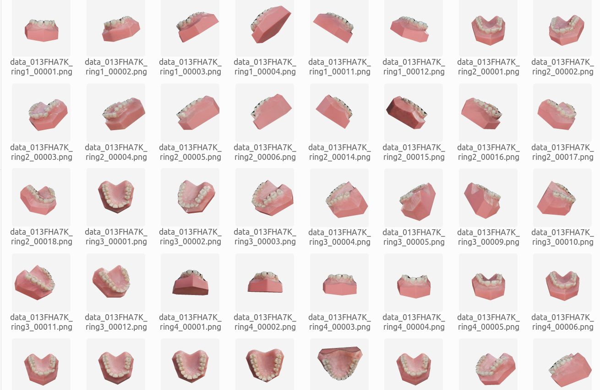

결과  
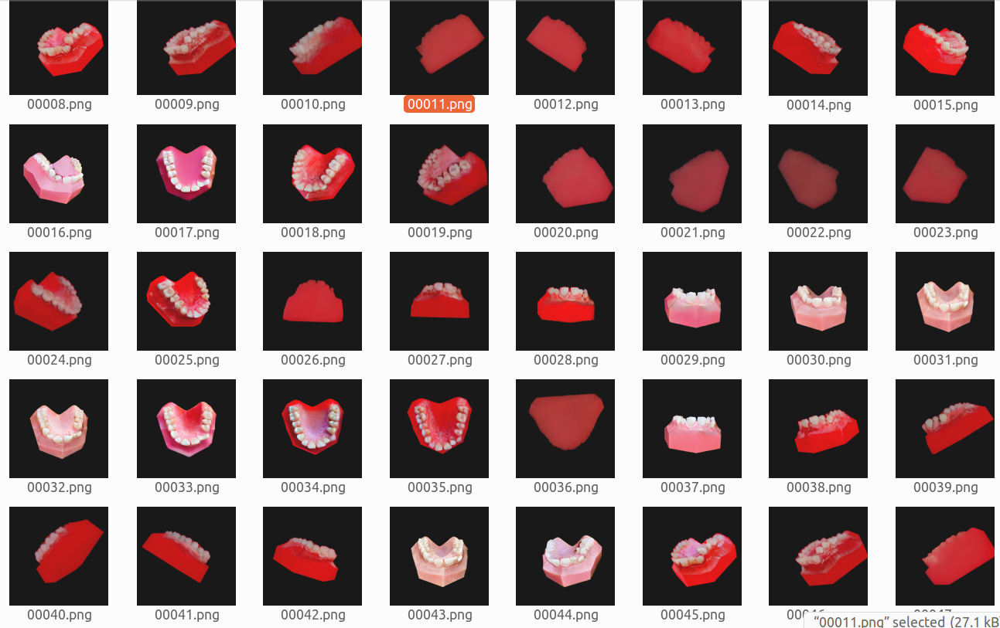

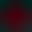 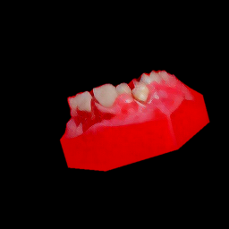 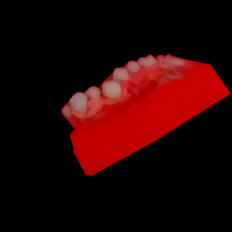 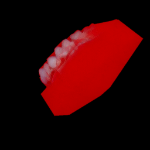

→ 전체적인 붉은 색 편향은 감소하였으나 완전히 제거되지는 않음  
→ 또한, 붉은 색이 상대적으로 적은 결과들 간에도 view 간 색상 차이가 여전히 존재함

---

## 2. Intrinsic

- relighting 이전에 input을 albedo / shading으로 분리할 수 있는지 확인

| Input | Albedo | Shading |
| --- | --- | --- |
| 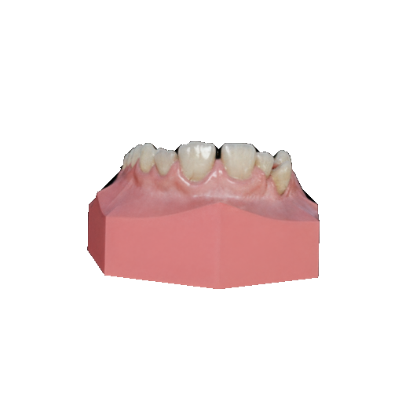 | 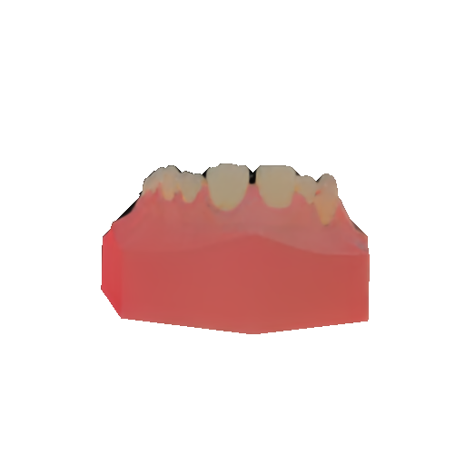 | 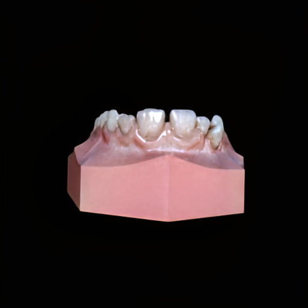 |
| 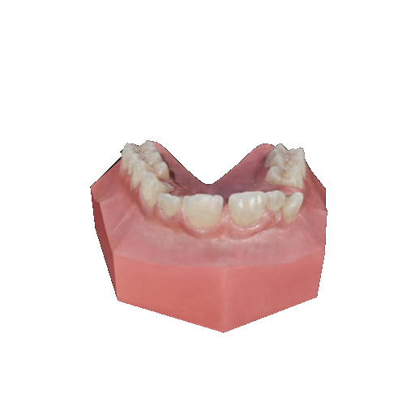 | 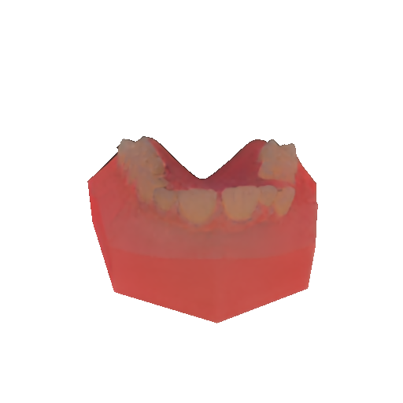 | 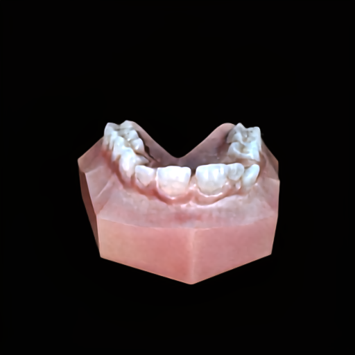 |
| 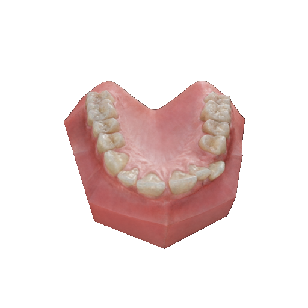 | 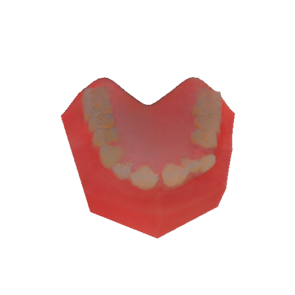 | 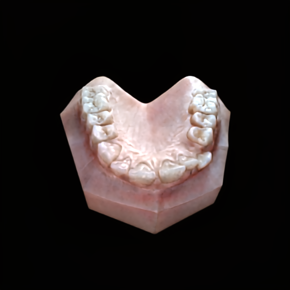 |
| 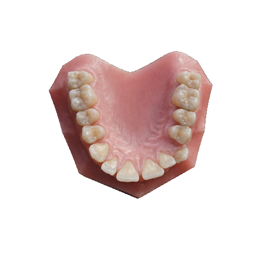 | 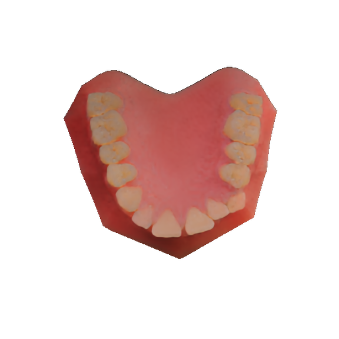 | 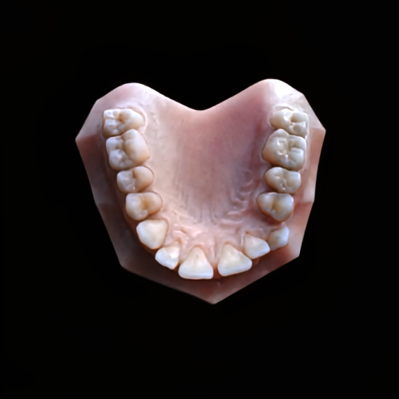 |

→ 일부 shading 제거 효과는 확인되나, single-view 기반 intrinsic decomposition이기 때문에 view 간 consistency는 보장되지 않음  
