## 1. Motivation

GS Falling 방식처럼 IDU를 반복 적용할 경우,
iteration이 증가함에 따라 geometry 및 appearance 품질이 점진적으로 향상되는지 확인하기 위함.

## 2. Experimental Setup

- 초기 모델: Stage1에서 학습된 체크포인트
- Iterations per cycle: 10,000
- Densification: On / Off
- SH degree: 3
- - Camera perturbation: 각 IDU cycle마다 기존 view에서 X +5°, Y +5°, Z +5° 회전을 순차 적용하여 perturbed view를 생성하고, 해당 refine 결과를 다음 GS update의 supervision으로 사용

### Variants (Ablation)

- (A) Baseline: Skyfall-GS 방식 그대로 IDU 수행 (depth loss = MoGS, point update/pruning/split = default)
- (B) Mesh-depth + point-fixed + pruning/split OFF + mask:
  - depth loss를 mesh로부터 계산
  - point position 고정
  - pruning, split 비활성화
  - mask 적용

## 3. Results
| stage1 | (A) Baseline | (B) Mesh-depth + fixed + no prune/split + mask |
|---|---|---|
| <video controls src="https://github.com/llljshlll/research-journal/discussions/1#discussion-9482233"></video> | <video controls src="https://github.com/llljshlll/research-journal/discussions/1#discussioncomment-15814519"></video> | <video controls src="https://github.com/llljshlll/research-journal/discussions/1#discussioncomment-15814538"></video> |

## 4. Refinement Failure Analysis

### 4.1 Rendering vs Refine

IDU 과정에서 GS가 크게 붕괴된 경우,
rendering 단계에서 과도한 noise와 geometry distortion이 발생함.

### 4.1 Rendering vs Refine – Angular Stability

#### +5° Rotation (3 Views)

| View | Stage1 Rendering | Stage2 (idu60000) | Stage2 (idu80000) |
|------|------------------|-------------------|-------------------|
| V1 | 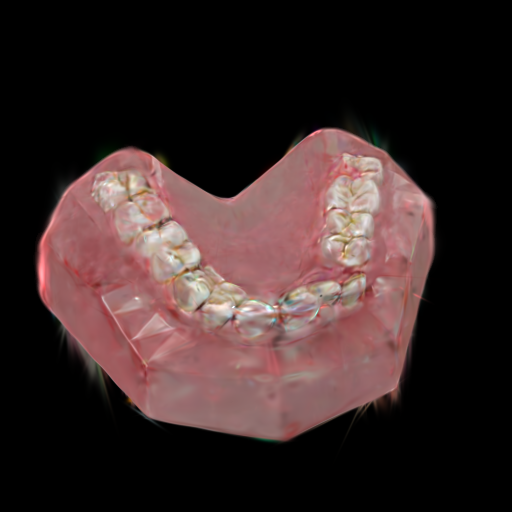 | 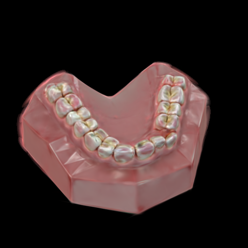 | 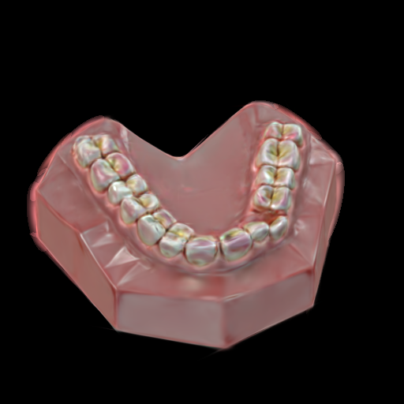 |
| V2 | 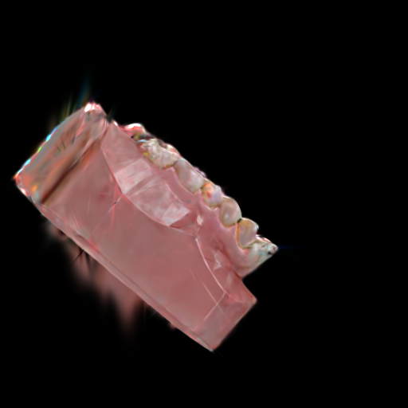 | 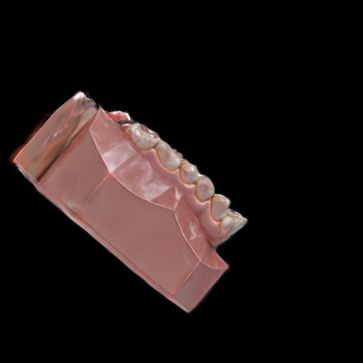 |  |
| V3 |  | 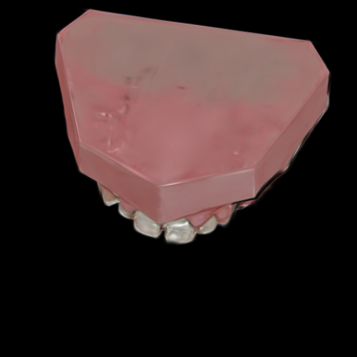 | 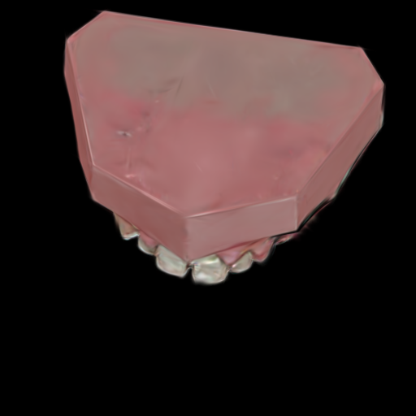 |

---

#### +10° Rotation (3 Views)

| View | Stage1 Rendering | Stage2 (idu60000) | Stage2 (idu80000) |
|------|------------------|-------------------|-------------------|
| V1 | 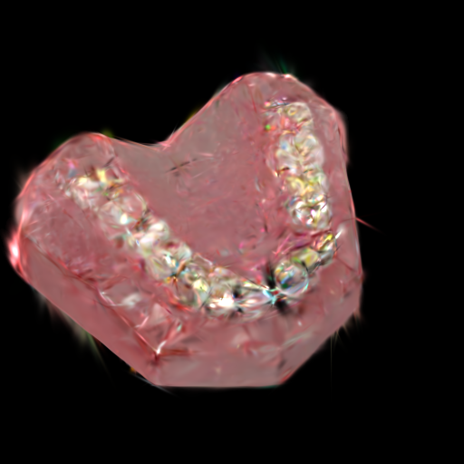 | 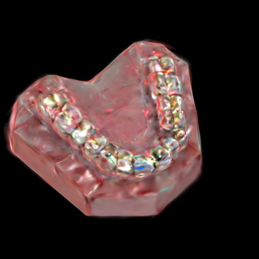 | 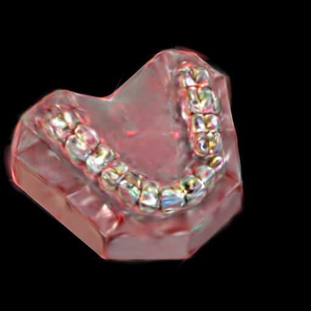 |
| V2 | 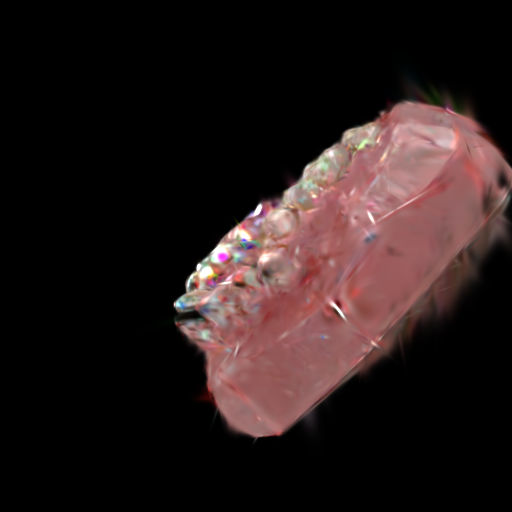 | 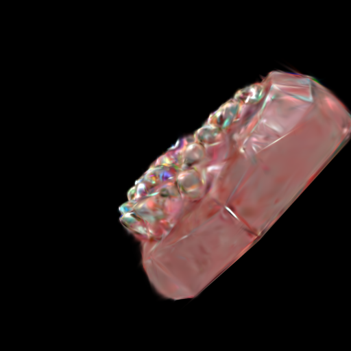 |  |
| V3 | 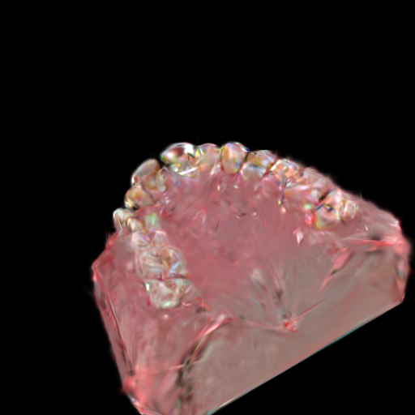 | 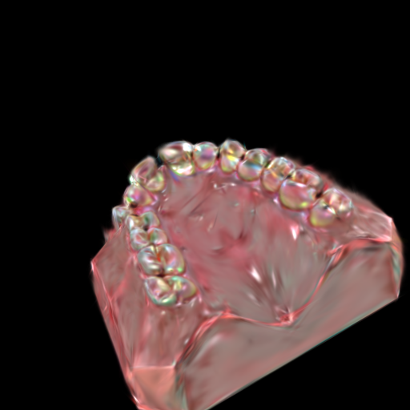 | 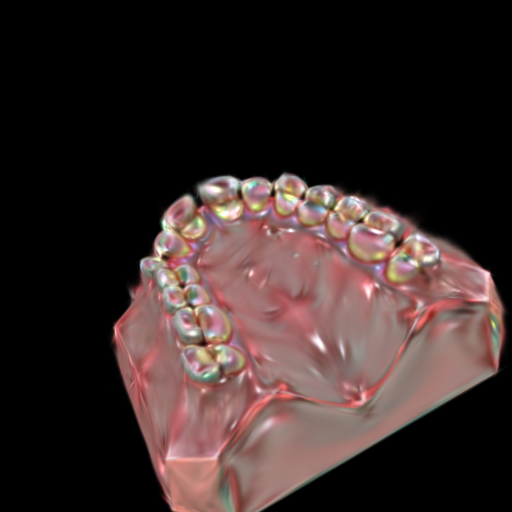 |

#### +15° Rotation (3 Views)
|------|------------------|-------------------|-------------------|
| V1 | 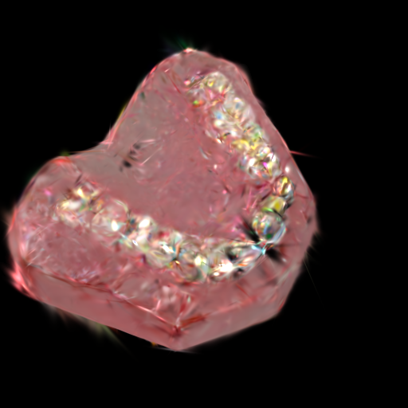 | 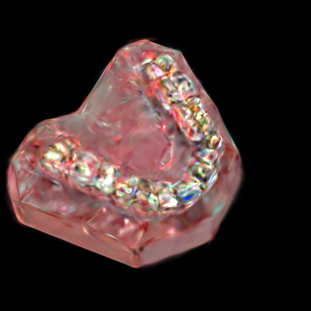 | 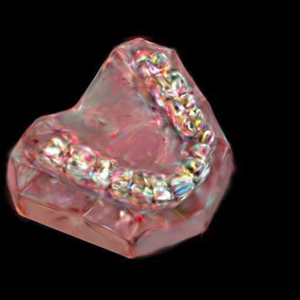 |
| V2 | 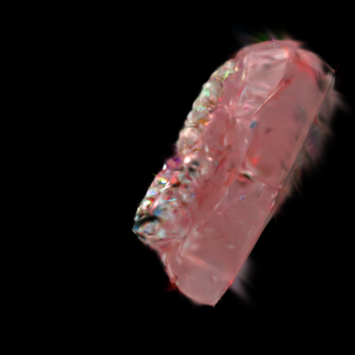 | 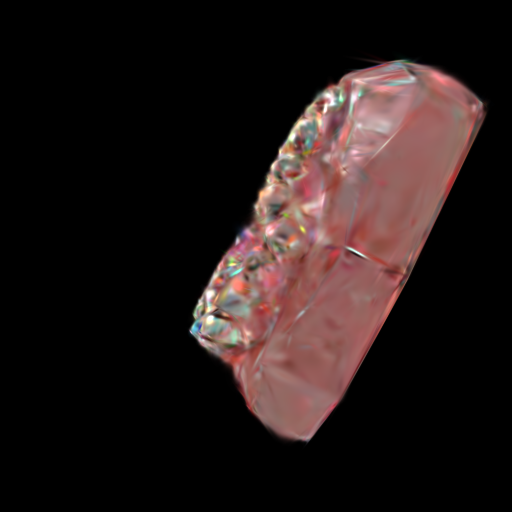 | 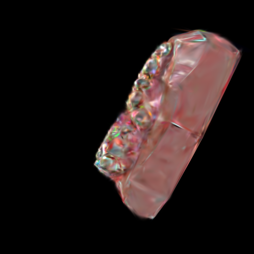 |
| V3 | 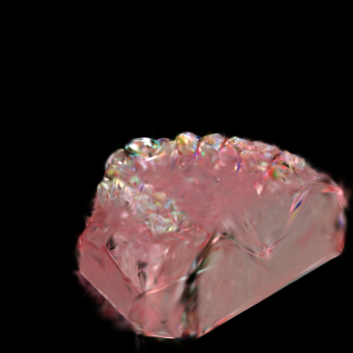 | 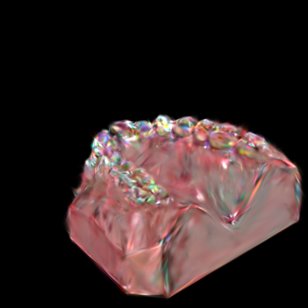 | 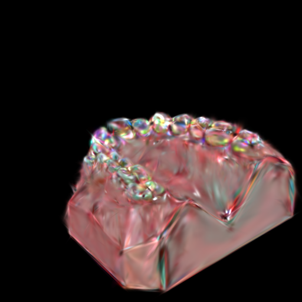 |

- FlowEdit는 원본 구조가 유지된 상태에서 발생한 경미한 blur, shading mismatch, artifact 정리에는 효과적임.
- 그러나 GS가 크게 붕괴되어 geometry 왜곡이나 강한 noise가 발생한 경우, 해당 상태 자체를 안정화시키거나 구조적으로 복원하지는 못함.

추가적으로 확인된 현상:
- Seen view에서 refinement 후 재학습을 반복해도,
  Unseen 영역의 품질은 거의 개선되지 않음.
- 이는 Stage2가 missing information을 생성하는 단계가 아니라,
  기존 appearance를 재정렬하는 단계이기 때문임.
- 붕괴된 GS를 입력으로 사용할 경우,
  diffusion은 이를 구조적으로 복원하지 못하고
  일관성 없는 texture hallucination을 유도할 수 있음.

결론:  
- GS가 일정 수준 이상 붕괴되면, Stage2만으로는 일정 수준 이상의 품질 회복이 불가능함.
