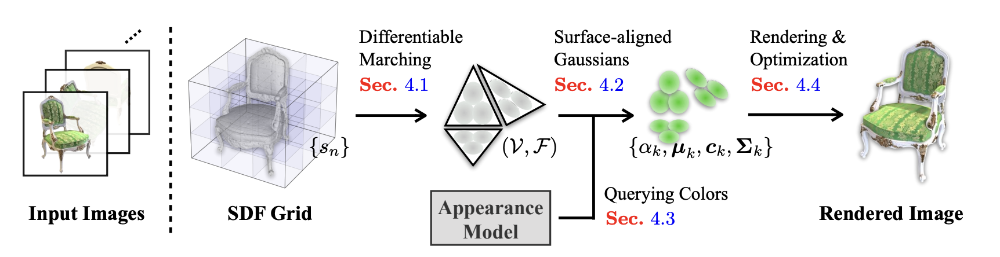
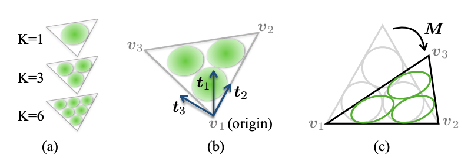

# GaMeS (Gaussian Mesh Splatting)

mesh surface 위에 Gaussian을 배치하여 appearance를 학습하는 방법  
기존 3D Gaussian Splatting과 달리 Gaussian center를 mesh 위로 제한하여 surface consistency를 유지

## Motivation

기존 방법  
- NeRF: rendering 느림  
- 3D Gaussian Splatting: Gaussian이 surface 밖으로 퍼질 수 있음  

GaMeS 해결 방식  
- Gaussian center를 mesh surface에 고정  
- geometry drift 방지

---

## Pipeline

1. mesh 입력  
2. triangle마다 Gaussian 생성  
3. Gaussian parameter 최적화  
4. Gaussian splatting renderer로 image 생성  


---

## Gaussian Placement

Gaussian center는 triangle 내부에 위치
```
x = a·v1 + b·v2 + c·v3

a + b + c = 1  
a,b,c ≥ 0  
```
이를 **barycentric coordinate**라고 하며, 이 방식으로 Gaussian은 항상 triangle surface 위에 존재함


---

## Surface-Aligned Gaussian

Gaussian orientation은 triangle surface에 정렬된다.
```
Σ = R S Sᵀ Rᵀ

R: rotation matrix  
S: scale matrix  

S = diag(sx, sy, sz)
```
- sx, sy → surface 방향  
- sz → normal 방향  

즉 Gaussian은 **surface 방향으로 넓고 normal 방향으로 얇은 ellipse** 형태가 됨

---

## Gaussian Parameters

각 Gaussian은 다음 파라미터를 가짐

- center (barycentric)  
- covariance Σ  
- opacity α  
- color / SH coefficients  

학습 대상

- appearance  
- opacity  
- covariance  
- (optional) mesh vertex

mesh vertex까지 학습하면 geometry refinement도 가능하지만 우리 연구에서는 필요X

---

## Rendering

GaMeS는 3D Gaussian Splatting renderer를 사용

과정  
Gaussian → screen projection → tile sorting → alpha compositing

---

## Loss
```
L = (1 − λ) L1 + λ DSSIM
```
L1: pixel reconstruction loss  
DSSIM: structural similarity loss

목표: rendered image ≈ ground truth image

---