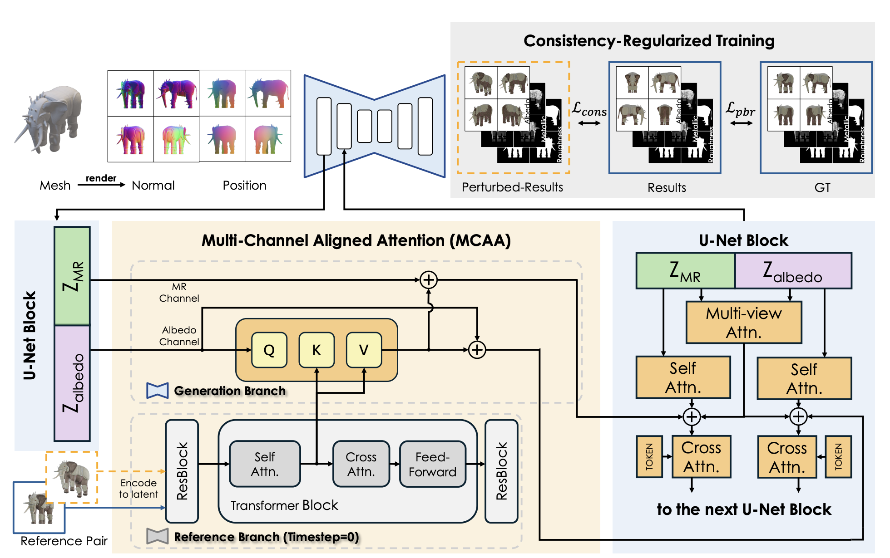
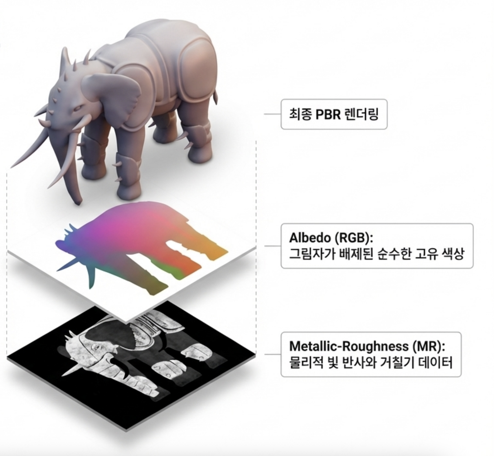
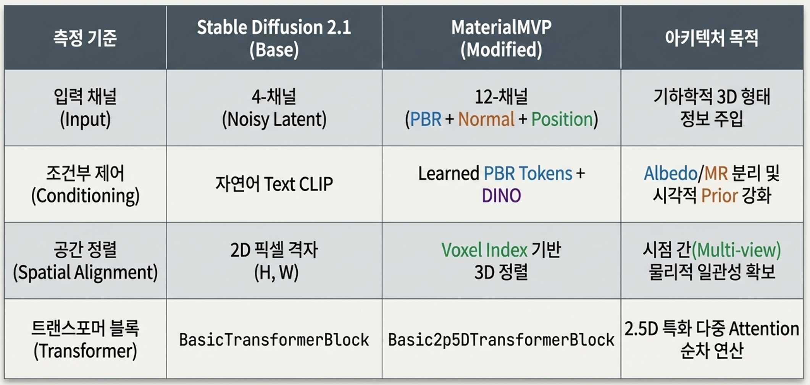
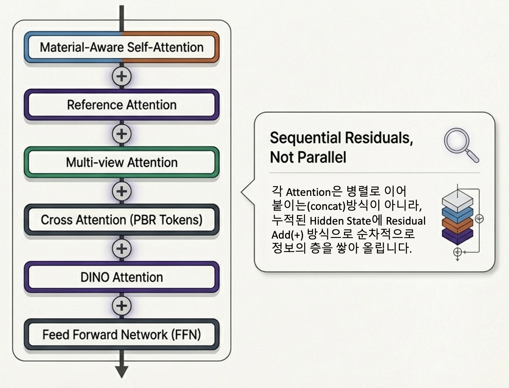
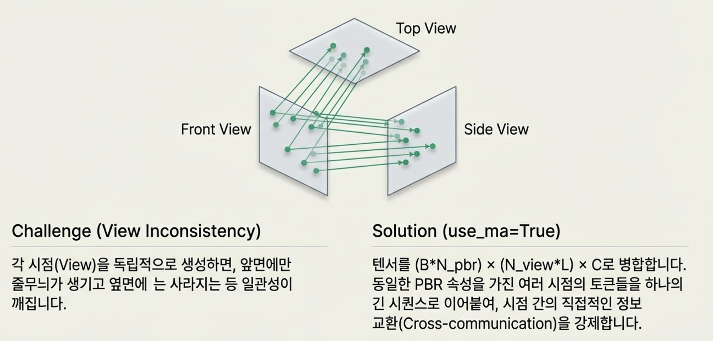
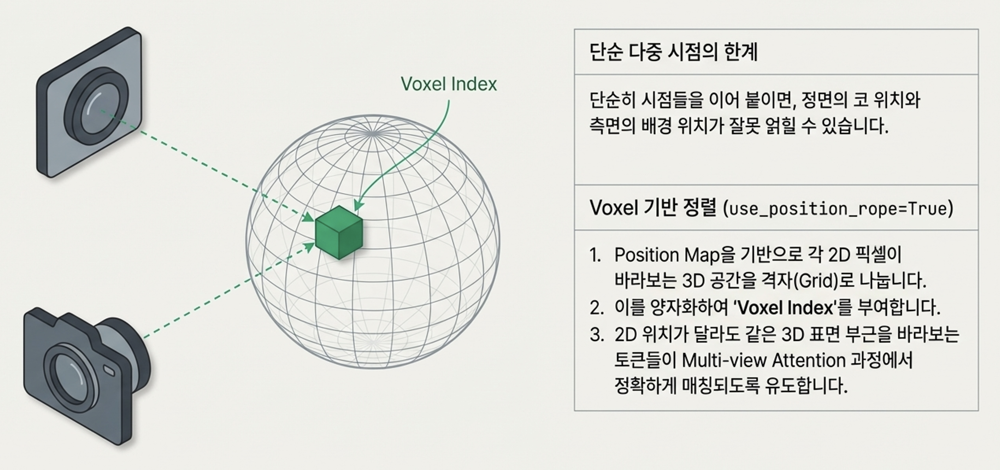
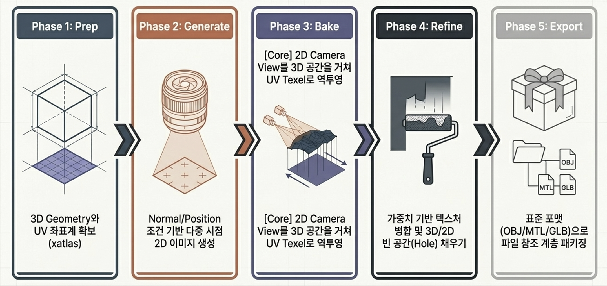
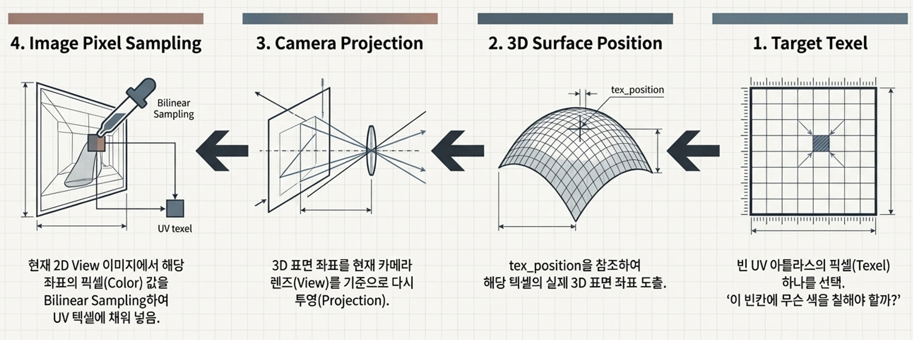
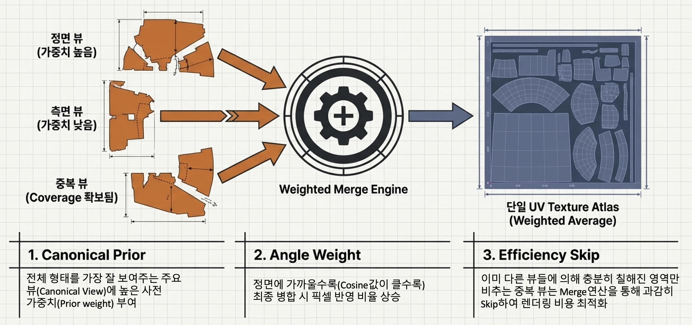

# MaterialMVP: Illumination-Invariant Material Generation via Multi-view PBR Diffusion

3D mesh와 reference image를 입력으로 받아  
**albedo / metallic / roughness(PBR)** 를 multi-view 일관적으로 생성하는 one-stage 방법.

핵심 목표 세 가지.

1. **multi-view consistency**
2. **illumination-invariant material generation**
3. **albedo와 MR(metallic+roughness) 정렬**

---

## Overall Pipeline

입력:
- 3D mesh
- reference image

출력:
- albedo map
- metallic map
- roughness map

전체 흐름:

1. mesh를 여러 시점에서 렌더링해 `normal`과 `position` 조건 생성
2. multi-view diffusion UNet을 통한 각 view의 PBR 표현 공동 생성
3. reference-conditioned training을 통한 조명과 시점 변화 민감도 완화
4. 생성된 multi-view 결과의 UV texture baking 및 mesh 반영

---

## 1. Input Representation

MaterialMVP의 입력은 단순한 image latent 하나가 아닌 구조.  
각 view마다 mesh에서 얻은 기하 정보를 함께 넣어 생성 결과가 geometry와 정렬되도록 만드는 방식.

각 시점에서 렌더링되는 조건:

- `normal map`
- `position map`

이 둘은 latent space로 인코딩된 뒤, noisy PBR latent와 **채널 방향으로 결합**되는 구조.

개념적으로 입력은:

`x = [z_t^{pbr} ; z^{normal} ; z^{position}]`

으로 표기 가능.

채널 수는:

`4 + 4 + 4 = 12`

가 되며, 각 view 입력은 `12-channel` 조건 보유.

중요한 점은 다음과 같음.

- view는 별도 축으로 유지되는 구조
- `normal`, `position`은 view를 합치는 정보가 아니라 각 view 내부의 geometry condition
- 따라서 multi-view 구조와 geometry condition의 동시 유지

PBR 생성 대상은 보통 두 종류의 재질 표현으로 구성.

- `albedo`
- `MR` (`metallic`, `roughness`)

즉 모델은 단일 RGB texture가 아니라 서로 의미가 다른 material 표현을 함께 생성하는 구조.

---

## 2. UNet Architecture

기본 backbone은 latent diffusion UNet이며, 실제 동작은 multi-view PBR generation에 맞는 형태로 확장된 구조.

핵심 아이디어는 두 가지.

1. 여러 view 사이 정보 교환 구조
2. `albedo`와 `MR`의 구분 및 공간 정렬 구조

기본 transformer block은

`self-attn -> cross-attn -> FFN`

이며, MaterialMVP에서는 이를 더 풍부한 조건 결합 구조로 확장한 형태.

개념적으로는:

`material-aware self-attn -> reference attn -> multiview attn -> cross-attn -> dino attn -> FFN`

### 2.1 Material-aware Self-Attention

`albedo`와 `MR`은 통계적 성질과 의미가 다른 표현.

- albedo: intrinsic color 중심 표현
- MR: 표면 반사 특성 중심 표현  
  
이를 완전히 같은 방식으로 처리할 경우 정렬 오류나 material artifact 발생 가능성.  
따라서 MaterialMVP는 두 표현을 구분해 다루되, 완전히 분리된 두 네트워크 대신 shared backbone 위의 PBR-aware separation 사용.  

이 구조 덕분에 `albedo`와 `MR`은 서로 다른 역할을 유지하면서도 동일한 geometry와 view 구조 안에서 정렬 가능.  
 
attention 과정은 다음과 같은 순서.  
1. 입력 hidden state를 `B x N_pbr x N_view x L x C` 형태로 reshape  
2. `N_pbr` 축을 따라 albedo와 MR 표현으로 분리  
   - albedo: `B x 1 x N_view x L x C`  
   - MR: `B x 1 x N_view x L x C`  
3. 각 PBR branch를 다시 `(B * N_view) x L x C` 형태로 펼쳐 self-attention에 입력  
4. attention 범위는 같은 PBR 내부로 제한되며, 각 view는 독립 sample에 가까운 방식으로 처리  
5. 결과적으로 한 번의 self-attention은 view 간 토큰 직접 혼합이 아니라 각 view 내부의 `L`개 token 관계 모델링에 초점  
6. attention 출력은 다시 원래 구조로 복원된 뒤 residual 형태로 hidden state에 누적  

### 2.2 Reference Attention

reference image는 reference branch를 거쳐 현재 layer에서 사용할 cached feature로 변환되며, 개념적으로는 `B x (N_ref * L) x C` 형태의 token memory에 해당.  
  
reference attention의 직접 역할은 **albedo 쪽 정렬 기준** 제공.  
  
attention 과정은 다음과 같은 순서.  
1. 현재 hidden state `(B*N_pbr*N_view) x L x C`를 `B x N_pbr x (N_view*L) x C`로 재구성
2. query에서는 `[:, 0, ...]`에 해당하는 albedo branch만 선택
3. key와 value는 reference branch에서 추출된 `B x (N_ref * L) x C` token memory 사용
4. attention 출력은 다시 `(B*N_pbr*N_view) x L x C` 형태로 reshape
5. 출력은 이전 hidden state에 residual 형태로 누적  
  
즉 direct effect는 albedo 중심 정렬, indirect effect는 shared representation을 통한 MR 전파라는 해석 가능.

### 2.3 Multi-view Interaction

여러 view가 독립적으로 생성될 경우 앞면, 옆면, 뒷면 사이 재질 불일치 발생 가능성.  
이를 줄이기 위한 장치가 view 사이 attention 구조.  

하지만 MaterialMVP의 핵심은 단순한 view mixing이 아니라 `position map` 기반의 3D correspondence 반영.  
즉, **서로 비슷한 표면 위치끼리 더 잘 대응되도록** 만드는 방식.  

즉 기준은 "같은 픽셀 위치"가 아니라 "비슷한 3D 위치".  
  
attention 과정은 다음과 같은 순서.  
1. hidden state `(B*N_pbr*N_view) x L x C`를 `(B*N_pbr) x (N_view*L) x C`로 reshape
2. 같은 PBR 안의 여러 view token을 하나의 시퀀스로 연결
3. 연결된 시퀀스에 self-attention 적용
4. 출력은 다시 `(B*N_pbr*N_view) x L x C`로 복원
5. 복원된 결과는 hidden state에 residual 형태로 누적
  
이 모듈의 역할은 view 간 consistency 유지와 3D surface correspondence 기반 정보 정렬.

### 2.4 Cross Attention

cross attention의 역할은 PBR별 learned condition token 주입.  
  
- query: `(B*N_pbr*N_view) x L x C`
- key, value: `(B*N_pbr*N_view) x 77 x 1024`
- token source: CLIP 기반 learned token  
  
branch별 대응 관계는 다음과 같은 형태.  
- albedo branch: albedo용 learned token 사용
- MR branch: MR용 learned token 사용  
  
즉 동일한 backbone 안에서도 branch별 조건 분리 유지 가능.  

### 2.5 DINO Attention

reference image의 의미 정보를 더 안정적으로 주입하기 위한 보조 semantic conditioning.  
  
이 보조 조건의 목적은 다음과 같은 성격.  
  
- texture의 저수준 색/패턴 복사 의존 완화  
- reference의 의미적 material cue 유지  
  
attention 과정은 다음과 같은 순서.  
1. reference image를 DINOv2에 넣어 raw feature `B x L_dino x 1536` 추출
2. projection을 통해 `B x L_dino' x C` 형태의 token으로 변환
3. query는 `(B*N_pbr*N_view) x L x C`
4. key와 value는 projection된 DINO token을 `N_pbr * N_view`만큼 repeat한 `(B*N_pbr*N_view) x L_dino' x C`
5. attention 출력은 hidden state에 residual 형태로 누적  
  
reference attention과의 차이는 적용 범위.  
- reference attention: albedo 중심 정렬
- DINO attention: albedo와 MR 모두에 semantic cue 제공  

---

## 3. Consistency-Regularized Training

논문이 다루는 핵심 문제는 두 가지.  
  
1. **view sensitivity**  
2. **illumination entanglement**  
  
즉 reference가 조금만 달라져도 결과가 흔들리고,   
reference의 조명이 albedo나 MR에 섞여 들어갈 수 있는 문제.  

이를 줄이기 위해 training 시 단일 reference 대신 **reference pair** `(I_1, I_2)` 사용.  

- 두 이미지는 같은 object 관측값
- 시점이나 조명이 약간 다른 쌍. 
  
이때 같은 latent target에 대해 두 조건이 유사한 예측을 내도록 하는 제약.  
  
기본 diffusion loss:  

`L_{pbr} = E[ ||ε - ε_θ(z_t, t, c(I_1))||_2^2 ]`. 

consistency loss:  

`L_{cons} = E[ ||ε_θ(z_t, t, c(I_1)) - ε_θ(z_t, t, c(I_2))||_2^2 ]`. 

최종 loss:  

`L = (1 - λ)L_{pbr} + λL_{cons}`. 

여기서 `λ = 0.1`.  
  
- `L_pbr`: 생성 품질 유지
- `L_cons`: reference perturbation에 대한 안정성 학습. 
  
결과적으로 조명과 시점 변화에 덜 민감한 material prior 학습.

---

## 4. From Multi-view Outputs to Texture Maps

UNet이 직접 만드는 것은 최종 UV texture map이 아니라,   
각 시점에서 보이는 **multi-view material image**.   
  
이 결과를 실제 mesh texture로 바꾸기 위한 후처리 필요.  
  
전체 과정은 다음과 같음.  
1. mesh의 UV 좌표 준비
2. 여러 view에서 생성된 `albedo`와 `MR` 이미지 획득
3. 각 view 결과의 UV atlas 역투영.  

4. 겹치는 영역 병합 및 비어 있는 영역 보완  

5. 최종 `albedo`, `metallic`, `roughness` texture 저장  
  
즉 MaterialMVP는 multi-view image generation과 texture baking을 연결하는 파이프라인.  

- view-consistent generation
- geometry-aligned projection
- mesh-ready PBR texture output

핵심 결과는 다음 세 요소의 결합.

---

## Summary

MaterialMVP는 mesh에서 얻은 `normal`/`position` 조건과 reference image를 함께 사용해,  
multi-view diffusion으로 `albedo`와 `MR`을 공동 생성하는 구조.  

핵심은 다음과 같음.

- geometry-aware `12-channel` 입력  
- `albedo`와 `MR`을 구분하는 shared UNet  
- position-aware multi-view attention  
- albedo 중심 reference alignment와 semantic conditioning
- reference pair 기반 consistency-regularized training
- multi-view 결과를 UV texture로 bake하는 후처리  
  
이 조합을 통해 조명에 덜 민감하면서도 view-consistent한 PBR texture 생성 목표.

---

## Reference

- Paper: `MaterialMVP: Illumination-Invariant Material Generation via Multi-view PBR Diffusion` (arXiv:2503.10289v2)
- Project: https://github.com/ZebinHe/MaterialMVP
