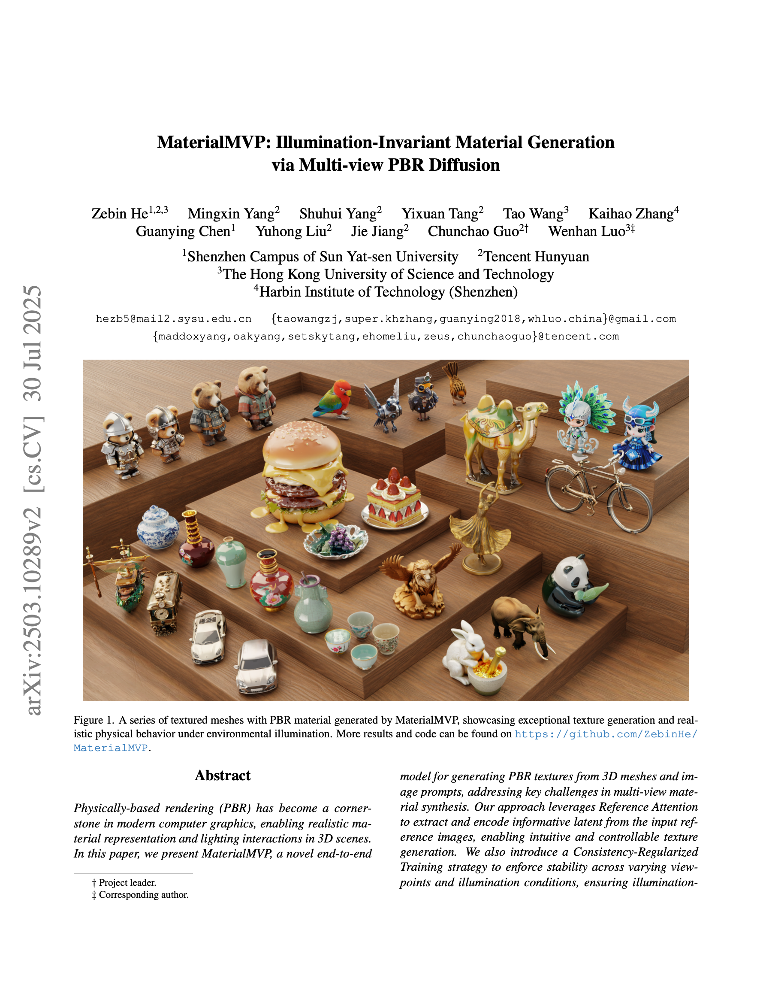
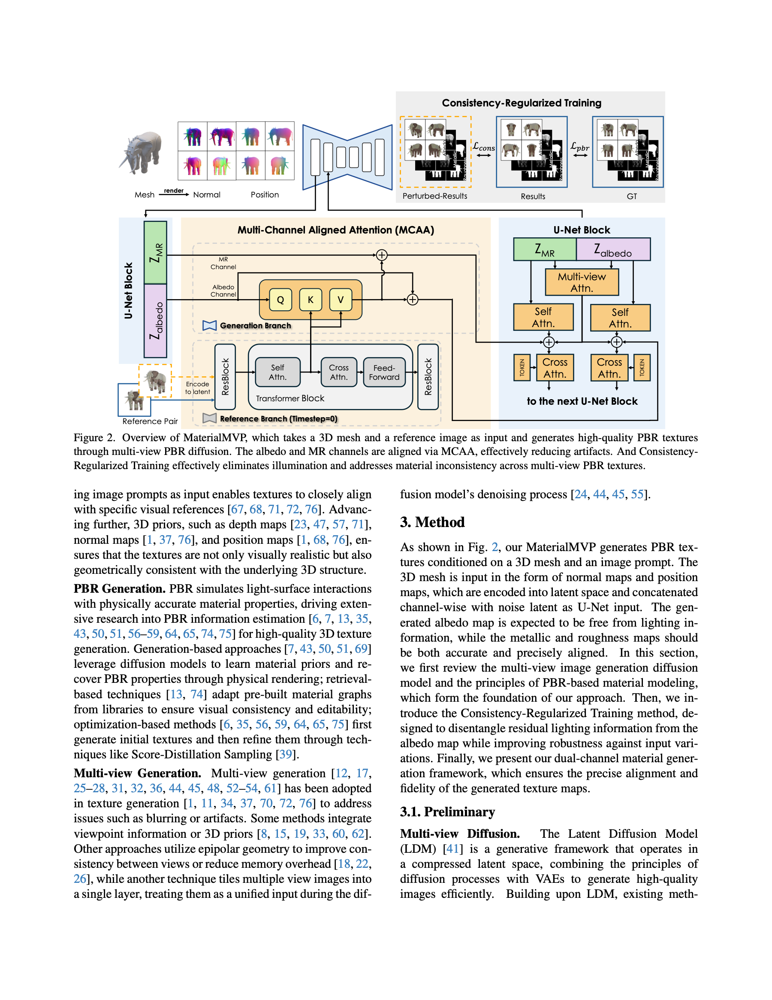
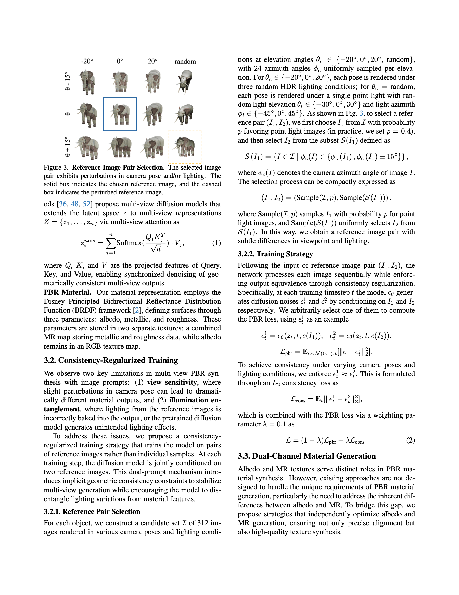
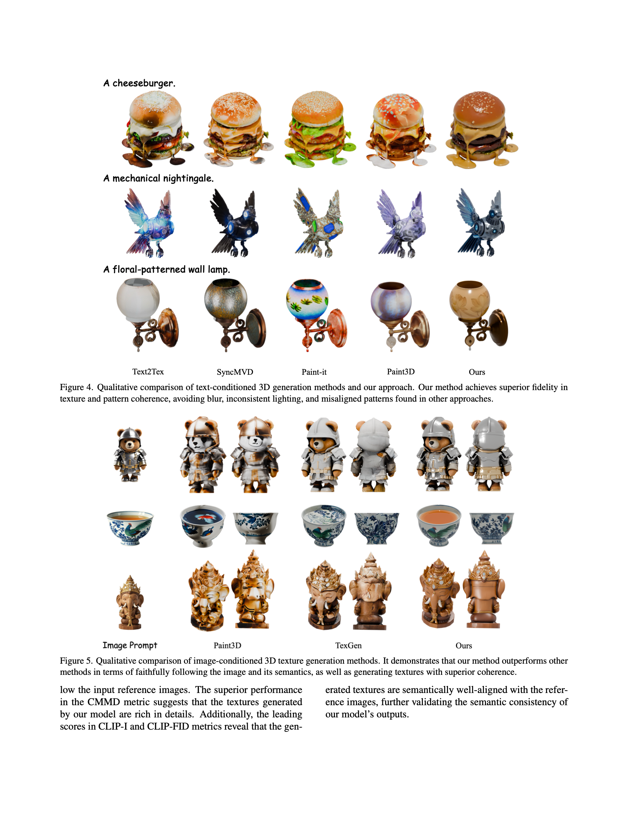
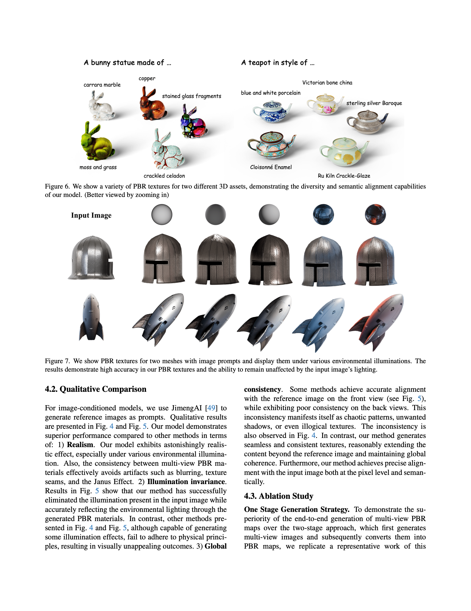
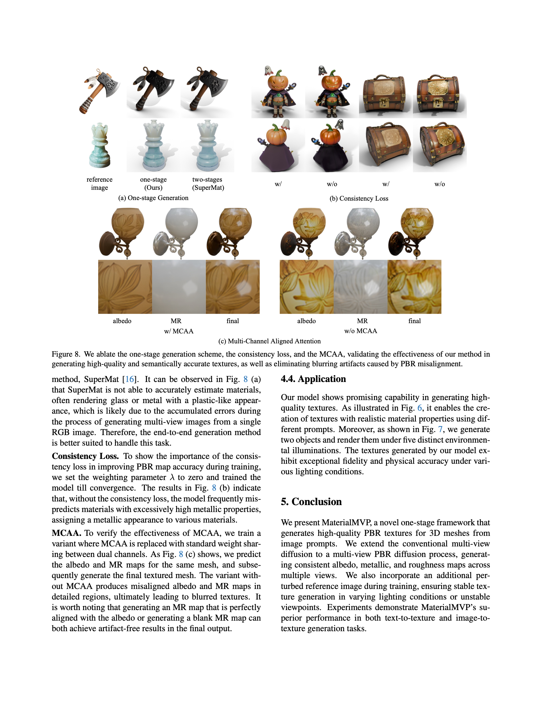

# MaterialMVP: Illumination-Invariant Material Generation via Multi-view PBR Diffusion

3D mesh + reference image를 입력으로 받아  
**albedo / metallic / roughness(PBR)** 를 multi-view 일관적으로 생성하는 one-stage 방법

---

## Motivation

기존 PBR texture 생성 방법의 핵심 한계:

- optimization 기반 방식:
  - 품질은 좋지만 반복 최적화로 inference가 느림
- single-view generation 방식:
  - front view는 맞아도 back/side에서 일관성 붕괴
- image-conditioned 방식:
  - 입력 이미지를 따라가지만 albedo/MR 정렬 불량
  - lighting 정보가 재질(texture)에 섞여 들어가는 문제

MaterialMVP가 해결하려는 포인트:

1. **multi-view consistency**
2. **illumination-invariant material generation**
3. **albedo와 MR(metallic+roughness) 정렬**

---

## Overall Pipeline

입력:
- 3D mesh
- reference image

출력:
- albedo map
- metallic map
- roughness map

핵심 구조:

1. mesh를 normal/position map 형태로 렌더링
2. multi-view diffusion backbone에서 view-consistent 생성
3. albedo 채널 + MR 채널을 분리한 dual-channel 생성
4. Consistency-Regularized Training으로 조명/시점 변화에 강건화
5. MCAA로 albedo와 MR의 공간 정렬을 유지

---

## 1. Preliminary

### 1.1 Multi-view Diffusion

논문은 latent diffusion의 multi-view 확장을 사용.  
각 view latent를 attention으로 동기화하여 denoising.

`z_i_new = sum_{j=1..n} Softmax((Q_i K_j^T) / sqrt(d)) * V_j`

- `Q, K, V`: attention에 쓰는 projected feature
- 목적: view 간 기하 일관성 유지

### 1.2 PBR Parameterization

Disney Principled BRDF 표현을 사용하며 재질을 아래 3개로 분해:

- `albedo`
- `metallic`
- `roughness`

텍스처 저장 방식:
- RGB albedo map
- MR map (metallic, roughness를 함께 저장)

---

## 2. Consistency-Regularized Training

논문이 지적한 핵심 문제 2개:

1. **view sensitivity**
   - reference camera pose가 조금만 달라도 결과 material이 크게 흔들림
2. **illumination entanglement**
   - 입력 reference의 조명이 albedo/MR에 섞여 들어감
   - diffusion prior가 원치 않는 lighting artifact를 생성

해결 전략:
- 단일 reference가 아니라 **reference pair `(I1, I2)`** 로 학습
- 두 reference는 시점/조명이 조금 다르지만 같은 object를 봄
- 모델 출력이 pair 간 일관되도록 제약

### 2.1 Reference Pair Selection

후보 집합:
- object당 `I` = 312개 렌더 이미지
- elevation: `{-20°, 0°, 20°, random}`
- azimuth: 각 elevation마다 24개 균일 샘플
- 조명: HDR 및 point light 조합

선택 규칙:

`S(I1) = { I in I | phi_c(I) in {phi_c(I1), phi_c(I1) ± 15°} }`

`(I1, I2) = (Sample(I, p), Sample(S(I1)))`

- `p = 0.4`: point light image를 우선 선택
- 결과적으로 `(I1, I2)`는 pose/light가 조금 다른 쌍이 됨

### 2.2 Loss Design

각 timestep `t`에서 pair 조건으로 noise를 예측:

`eps_t_1 = eps_theta(z_t, t, c(I1))`

`eps_t_2 = eps_theta(z_t, t, c(I2))`

기본 PBR diffusion loss:

`L_pbr = E_{eps~N(0,1), t}[ ||eps - eps_t_1||_2^2 ]`

consistency loss:

`L_cons = E_t[ ||eps_t_1 - eps_t_2||_2^2 ]`

최종 결합:

`L = (1 - lambda) * L_pbr + lambda * L_cons`

`lambda = 0.1`

의미:
- `L_pbr`: 개별 sample 품질 확보
- `L_cons`: 조명/시점 perturbation에 대해 출력 안정화
- 둘을 동시에 걸어 조명 분리와 view consistency를 같이 학습

---

## 3. Dual-Channel Material Generation

PBR에서 albedo와 MR은 분포/의미가 다르기 때문에,
RGB generation 방식 그대로 쓰면 alignment artifact가 생김.

MaterialMVP는 이를 위해 **albedo 채널**과 **MR 채널**을 분리하고,
두 채널을 연결하는 정렬 모듈을 넣음.

### 3.1 MCAA (Multi-Channel Aligned Attention)

albedo 채널:

`Attn_albedo = Softmax((Q_albedo K_ref^T) / sqrt(d)) * V_ref`

- reference image를 직접 cross-attention으로 따라감

MR 채널:

`z_MR_new = z_MR + Attn_albedo`

- MR은 reference latent를 직접 강제하지 않고
- albedo attention residual을 받아 spatial prior를 상속

핵심 효과:
- albedo/MR 불일치 감소
- flat region에서 발생하는 material artifact 감소
- 추가 파라미터를 크게 늘리지 않고 정렬 품질 개선

### 3.2 Learnable Material Embeddings

채널별 임베딩:
- albedo embedding: `16 x 1024`
- MR embedding: `16 x 1024`

각 채널 cross-attention에 주입하여,
- albedo와 MR의 분포 차이를 명시적으로 학습
- 채널별 역할 분리를 강화

---

## 4. Experiments

### 4.1 Setup

- 학습 데이터:
  - Objaverse + Objaverse-XL에서 70k assets
- object별 렌더:
  - elevation `{-20°, 0°, 20°, random}`
  - 각 elevation 24 view
  - 해상도 `512 x 512`
- 최적화:
  - AdamW
  - learning rate `5e-5`
  - warmup 2000 steps
- initialization:
  - SD2.1 ZSNR checkpoint

### 4.2 Quantitative Results (논문 Table 1 요약)

이미지 조건 기반 비교에서 MaterialMVP가 최상위 성능 보고:

- `CLIP-FID`: 24.78 (낮을수록 좋음)
- `FID`: 168.5 (낮을수록 좋음)
- `CMMD`: 2.191 (낮을수록 좋음)
- `CLIP-I`: 0.9207 (높을수록 좋음)
- `LPIPS`: 0.1211 (낮을수록 좋음)

### 4.3 Qualitative / Ablation

- illumination invariance:
  - 입력 조명이 달라도 물성 맵이 안정적
- global consistency:
  - front/back/side 패턴 일관성 유지
- ablation:
  - one-stage가 two-stage(SuperMat) 대비 안정적
  - consistency loss 제거 시 metallic 과예측 경향
  - MCAA 제거 시 albedo/MR 미정렬로 blur/artifact 증가

---

## 5. 우리 프로젝트 관점에서의 포인트

치아 도메인 관점에서 특히 유효한 지점:

1. `Consistency-Regularized Training`
   - reference perturbation에 대한 출력 안정화 아이디어는
     우리 IDU/novel-view consistency 문제와 직접 연결됨
2. `Dual-Channel + Alignment`
   - appearance와 물성/geometry 관련 채널을 분리해 다루는 설계는
     조건 간섭(condition interference) 완화에 유용
3. `Illumination disentanglement`
   - 입력 조명에 종속되지 않는 맵 생성은 dental rendering 파이프라인에서 중요

---

## Reference

- Paper: `MaterialMVP: Illumination-Invariant Material Generation via Multi-view PBR Diffusion` (arXiv:2503.10289v2)
- Project: https://github.com/ZebinHe/MaterialMVP
