# 2026_03 MaterialMVP Run (tooth domain 적용 실험)

## 1. Motivation

치아 도메인(mesh 기반)에서 **MaterialMVP** 를 그대로 적용했을 때, 안정적인 텍스처 생성이 가능한지 확인하고자 함.

---

## 2. Experimental Setup

- 입력 : mesh, reference image

| mesh | reference image |
|---|---|
| | 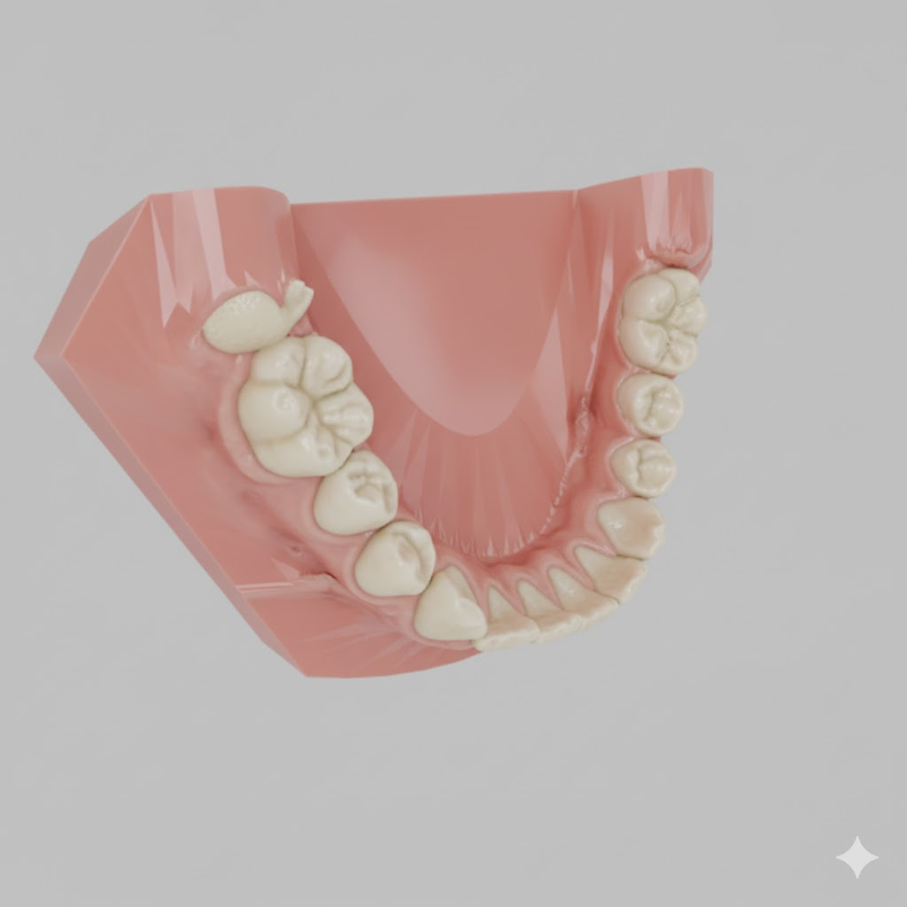 |

- MaterialMVP 논문/공개 구현의 기본 설정에서 원본 mesh를 수정하지 않고 고정하는 방향으로만 수정
> 기존 MaterialMVP는 원본 triangle을 그대로 쓰는 게 아니라 추론 전에 triangle 수를 줄이거나 메쉬를 다시 정리한 white_mesh_remesh.obj를 사용함

---

## 3. Results

|  | Front (0) | Right (1) | Back (2) | Left (3) | Top (4) | Bottom (5) |
|---|---|---|---|---|---|---|
| albedo | 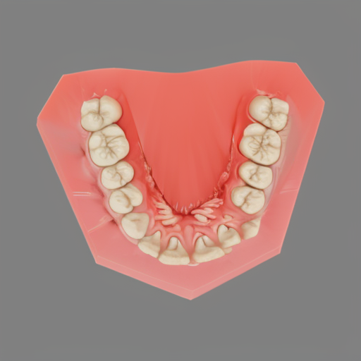 | 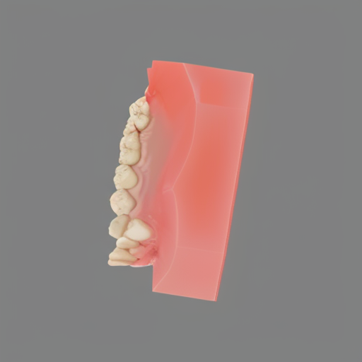 | 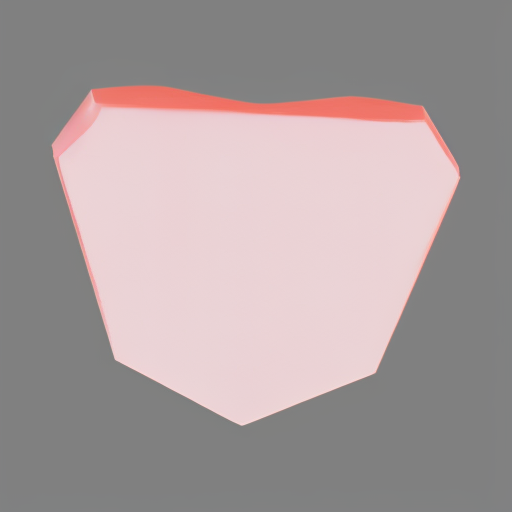 | 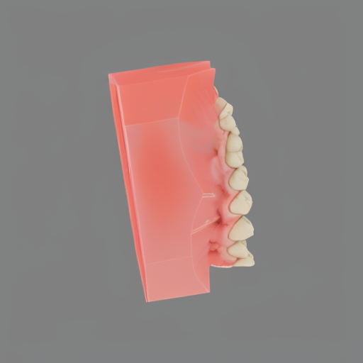 | 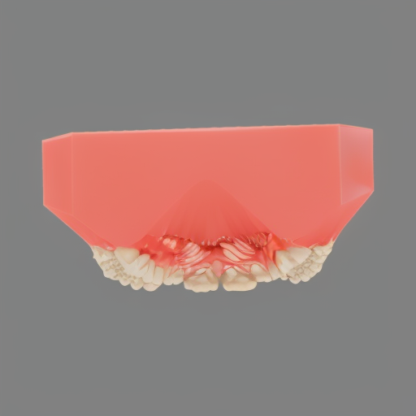 | 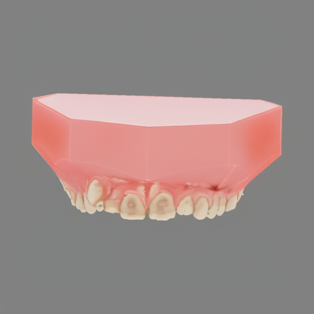 |
| MR (metallic + roughness) | 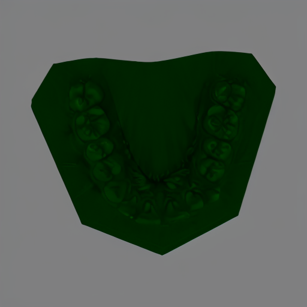 | 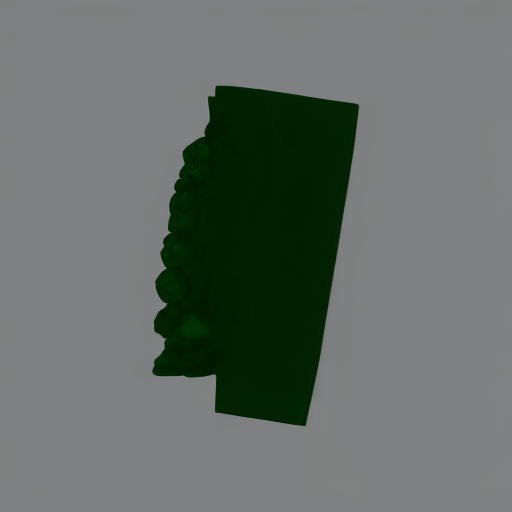 | 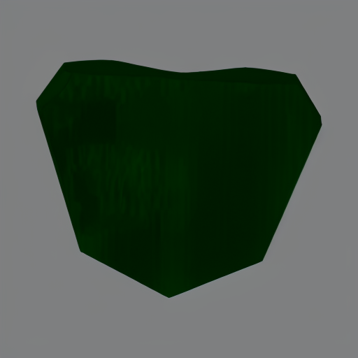 | 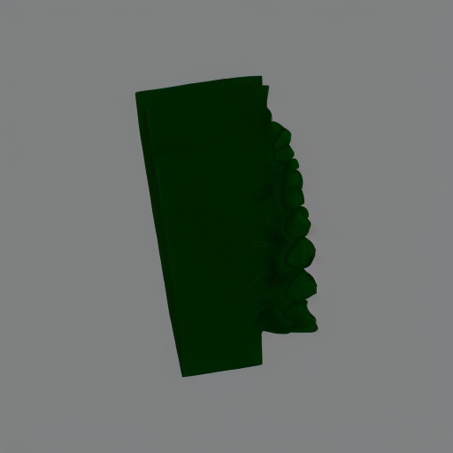 | 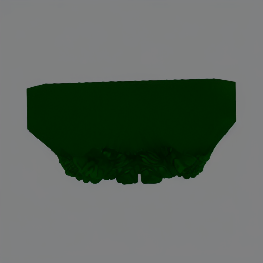 | 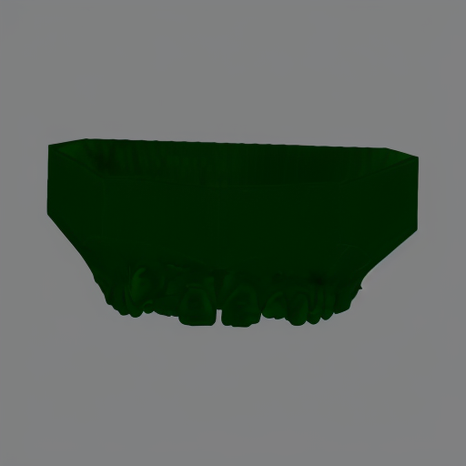 |

### Rendered Results

| View 0 | View 1 | View 2 | View 3 | View 4 |
|---|---|---|---|---|
| 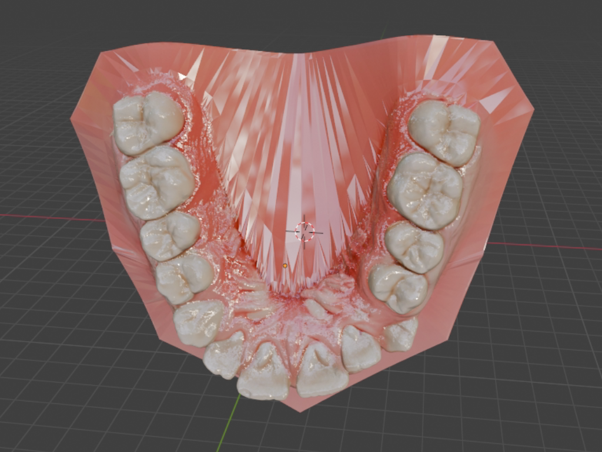 | 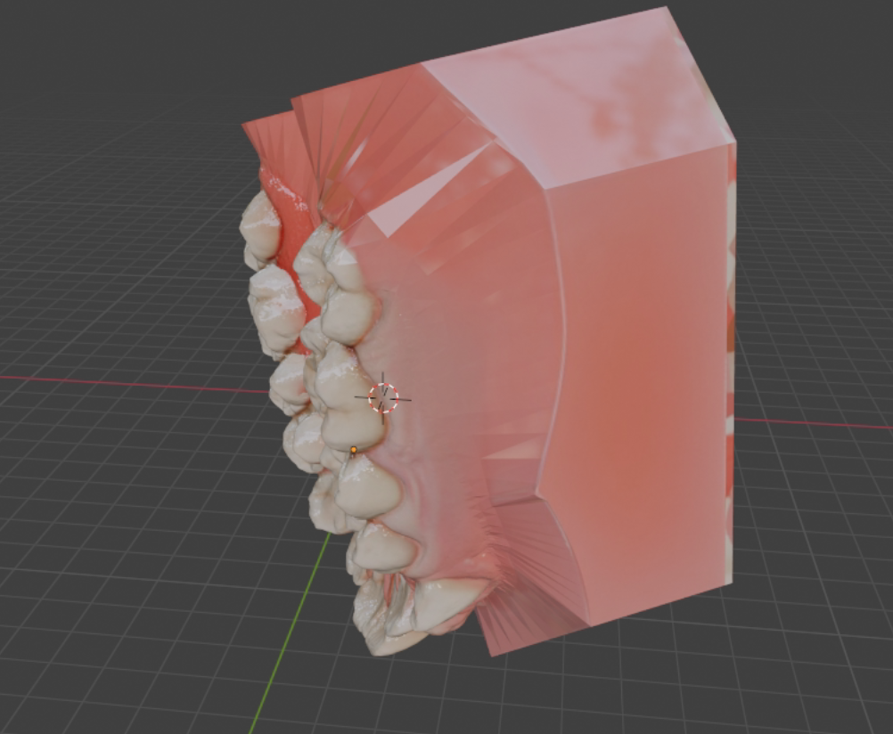 | 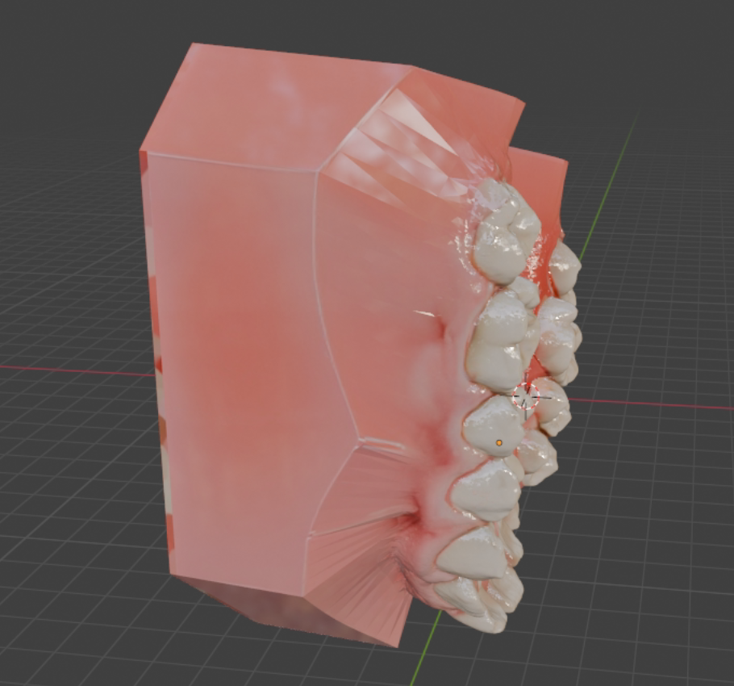 | 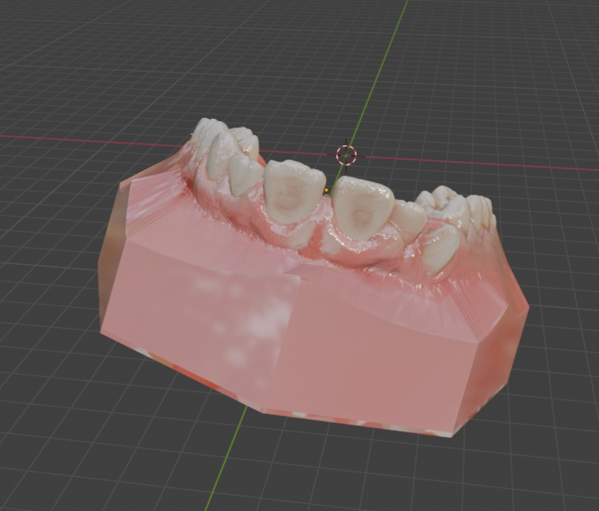 | 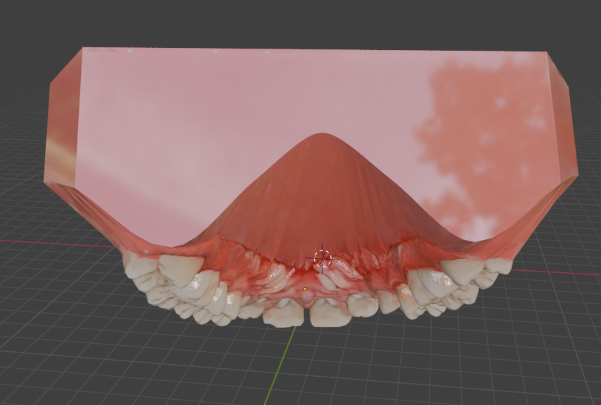 |

- 결과:
  - segmentation 정보를 별도로 주지 않았음에도 치아와 잇몸의 경계가 뚜렷하게 나타남
  - 6-view만 생성하는 설정에서도 전체 구역의 텍스처가 mesh와 잘 정렬되어 생성됨
  - 전반적으로 texture-to-geometry alignment가 안정적으로 유지되어, tooth domain에서도 MaterialMVP의 적용 가능성을 확인함

---

## 4. Artifacts

- MaterialMVP 개념 정리: [projects/skyfall-gs/references/MaterialMVP.md](../references/MaterialMVP.md)
