# FLUX.1-dev LoRA Fine-tuning for Dental 3DGS Refinement

> FLUX.1-dev에 LoRA를 적용하여 Skyfall-GS의 렌더링 결과물의 치아 이미지 품질을 향상시키기 위함
> FlowEdit 파이프라인과 결합하여 noisy 렌더를 clean 치아 이미지로 변환

---

## Overview

3DGS로 생성한 치아 렌더링 이미지에는 floating artifact, blurry edge, semi-transparent noise 등의 품질 문제가 존재
flux.1-dev 모델 또한 치아를 도메인으로 학습된 모델이 아니기 때문에 100% 복구하지 못함
때문에 FLUX.1-dev 모델에 LoRA를 fine-tuning하여 FlowEdit의 velocity field 예측을 치아 도메인에 특화시키기 위함

---

## Method

### FlowEdit + LoRA 결합 원리

FlowEdit은 inversion 없이 이미지를 편집하는 ODE 기반 방법:
`Δv_t = v_t_tar(z_t, p_tar) - v_t_src(z_t, p_src)`

LoRA로 transformer를 fine-tuning하여 `v_t_src`와 `v_t_tar` 모두 치아 도메인에 특화되도록 만듦


```
source image + source_text  →  flow matching loss   (Vt_src 개선)
target image + target_text  →  flow matching loss   (Vt_tar 개선)
```

두 방향을 모두 학습함으로써 FlowEdit의 delta 계산 정확도를 높임

### Flow Matching Loss

`z_t = (1 - σ) * z_0 + σ * ε,  σ ~ Logit-Normal(0, 1)`

`v_target = ε - z_0,  L = ||v_pred - v_target||^2`

- `z_0`: 원본 이미지의 latent
- `ε`: noise
- `σ`: 노이즈 혼합 비율 (0에 가까우면 clean, 1에 가까우면 noisy)
- `z_t`: 시점 `t`에서의 혼합 latent (`z_0`와 `ε`를 섞은 상태)
- `v_target`: 모델이 맞춰야 하는 목표 velocity
- `v_pred`: FLUX transformer가 예측한 velocity
- `L`: 예측값(`v_pred`)과 목표값(`v_target`) 사이의 MSE loss

---

## LoRA Architecture

### 적용 위치

FLUX transformer는 **Double Stream Block × 19** + **Single Stream Block × 38** 으로 구성됩니다.

**Double Stream Block**

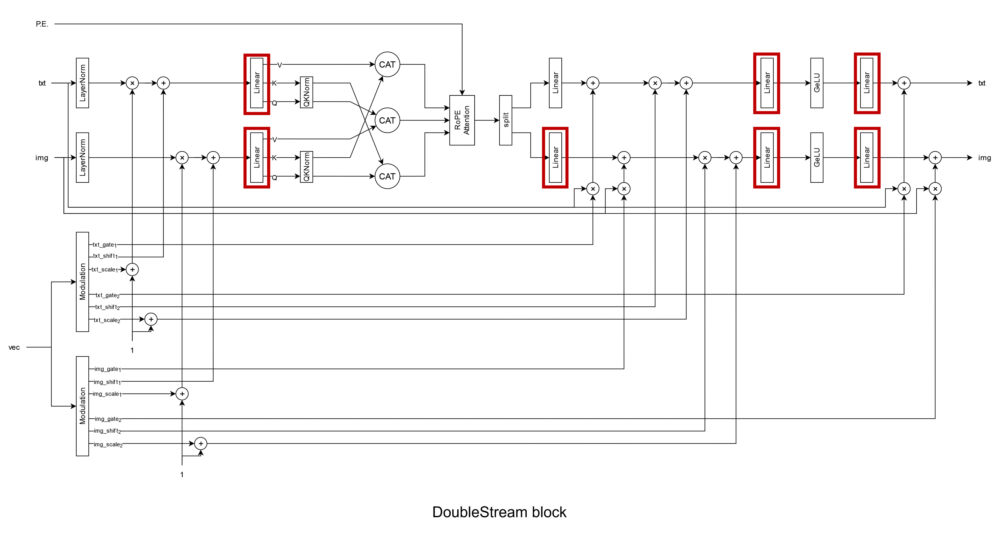

**Single Stream Block**

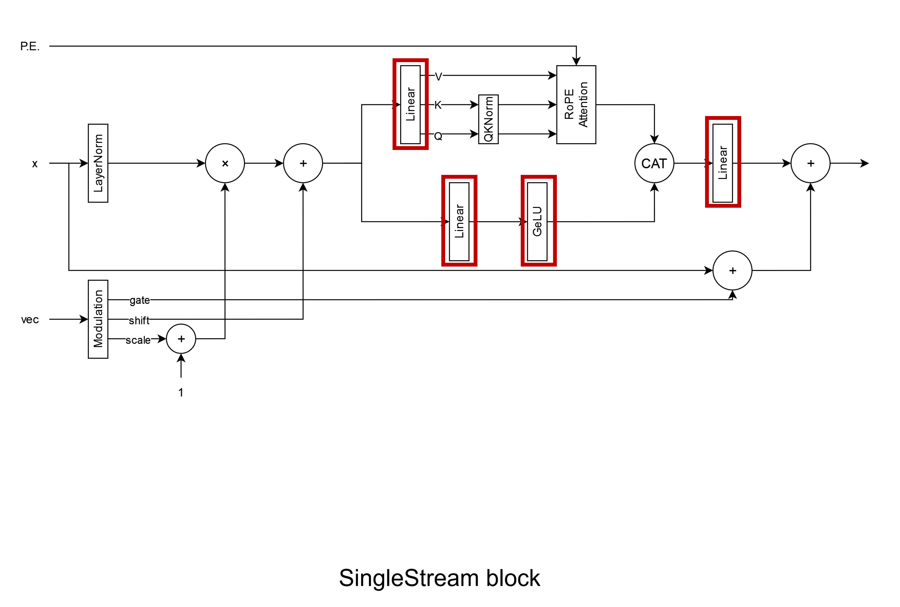


---

## Dataset

### 구성

- **Source**: 3DGS 렌더링 이미지 (noisy, floating artifact 포함)
- **Target**: 실제 치아 임상 사진 (clean GT)
- **총 54 pairs** → `both` mode로 **108 samples**

| Sample | 00011 | 00012 | 00013 | 00014 | 00015 |
|---|---|---|---|---|---|
| Source | 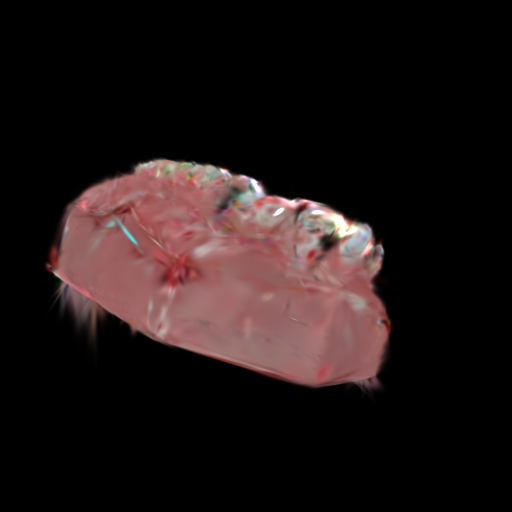 | 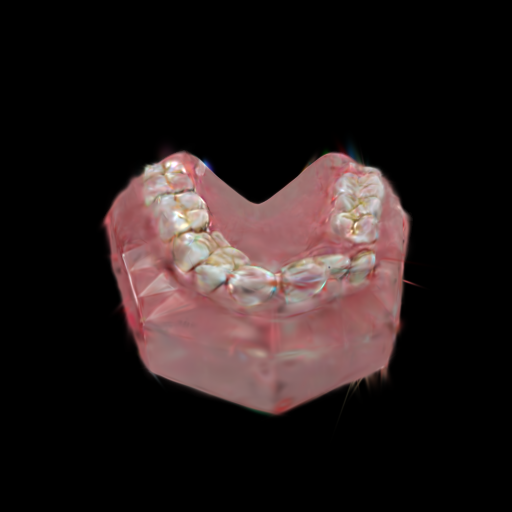 | 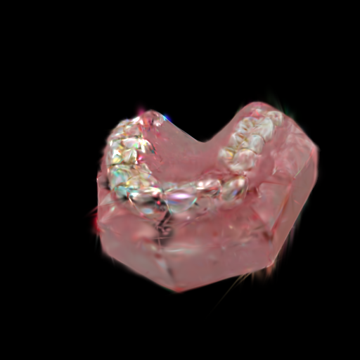 | 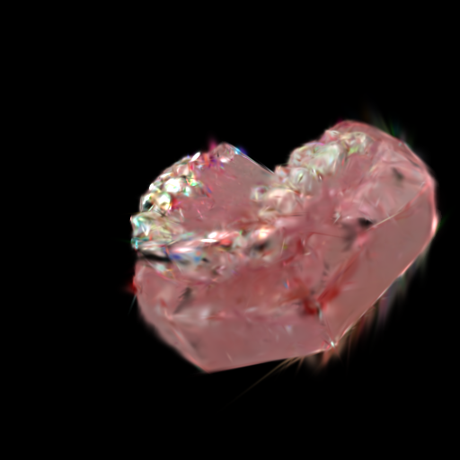 | 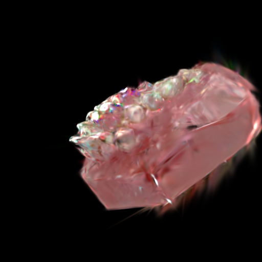 |
| Target | 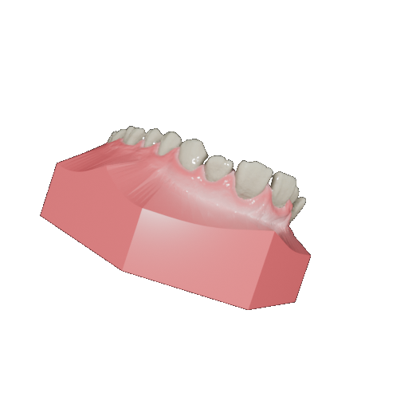 | 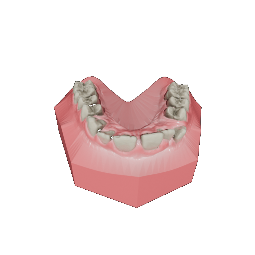 | 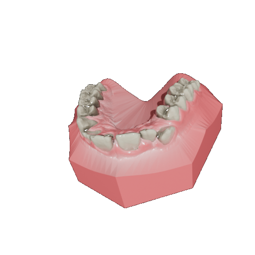 | 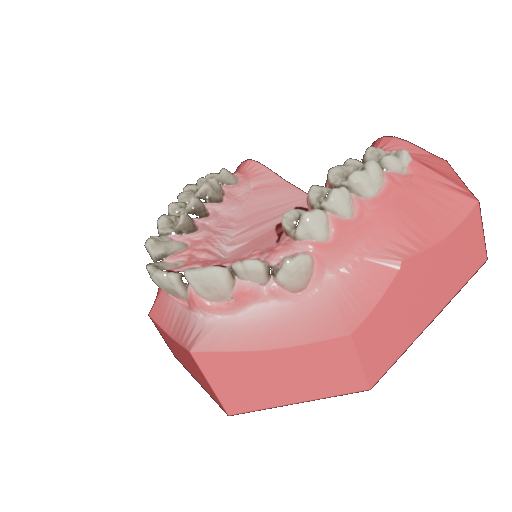 | 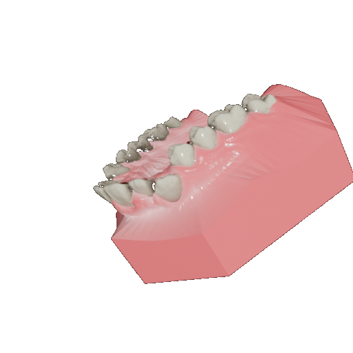 |

---

### 결과 비교

| View | Input | LoRA result (epoch30) | LoRA result (epoch70) |
|---|---|---|---|
| 00000 |  | 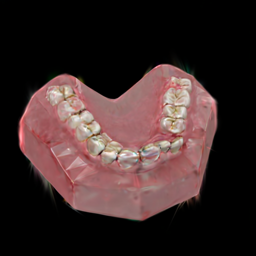 |  |
| 00001 | 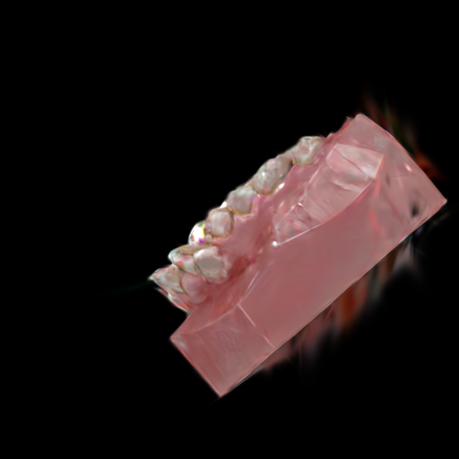 |  |  |
| 00002 | 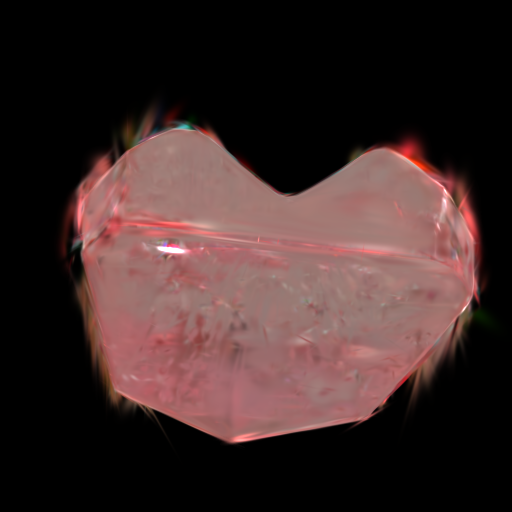 | 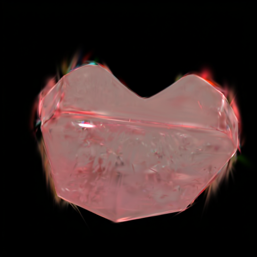 | 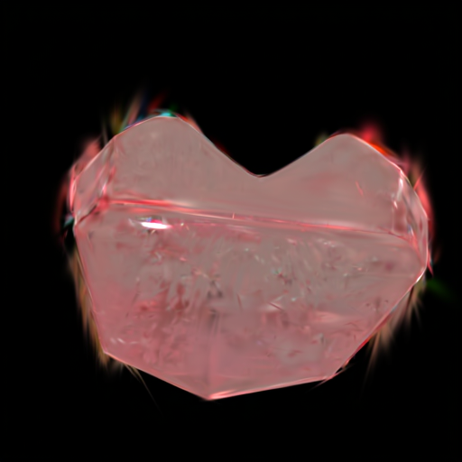 |
| 00003 |  | 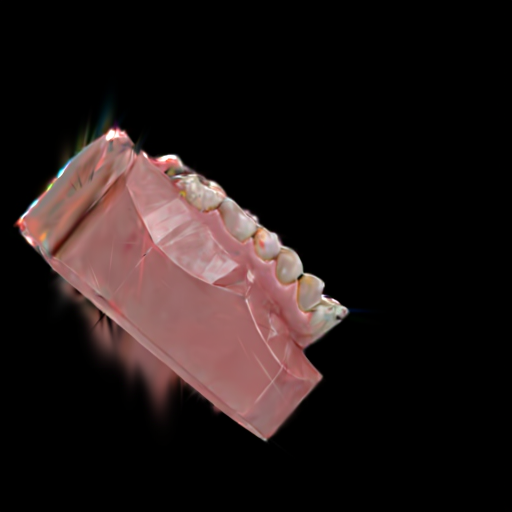 | 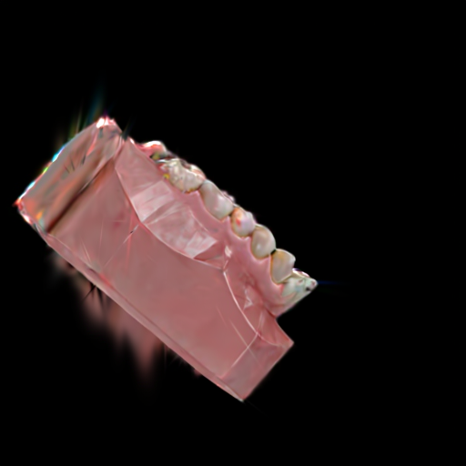 |
| 00004 |  | 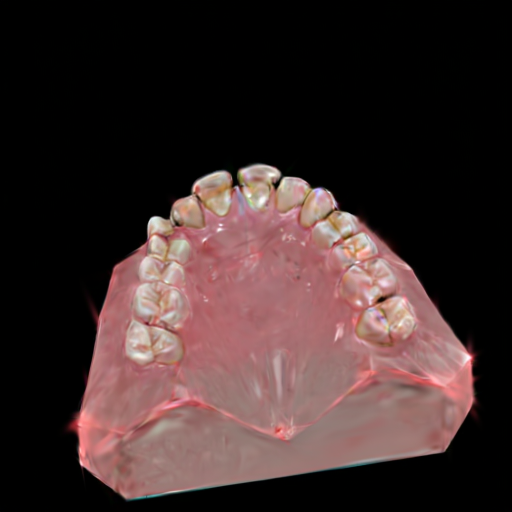 |  |
| 00005 |  |  | 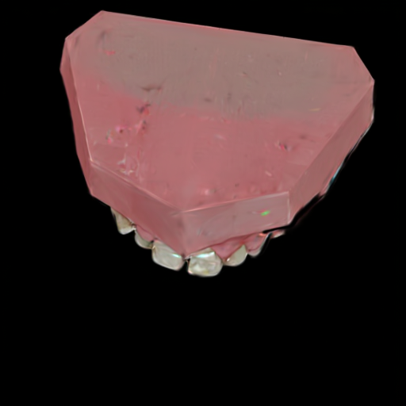 |

---

### 학습 설정 

```yaml
lora_rank: 4
lora_alpha: 4
num_epochs: 70
learning_rate: 1.0e-4
batch_size: 1
train_mode: "both"
use_qlora: true
use_8bit_adam: true
```
