# SDEdit + Sequential ControlNet for Dental 3DGS Refinement

> FlowEdit+ControlNet 방식 한계(cn_scale trade-off) 확인 후,
> SD1.5 img2img + 전용 ControlNet Sequential 방식으로 전환

---

## Overview

FlowEdit+CN에서 cn_scale을 높이면 이미지가 파괴되고 낮추면 효과가 없는 trade-off가 극단적이었음.

SD1.5 img2img 방식은 `strength`로 원본 보존 정도를 세밀하게 조절할 수 있고, segmentation/normal 전용 ControlNet을 각각 사용할 수 있음

두 condition을 동시에 주입하면 residuals가 합산되어 공간적 분리가 불가능하므로 (condition interference),
**Sequential 2-pass** 구조로 해결하려 함:

```
noisy render
    ↓ Pass 1: SD1.5 img2img + Seg CN     (잇몸/치아 경계 교정)
    pass1 result
    ↓ Pass 2: SD1.5 img2img + Canny CN   (normal map 기반 표면 디테일)
    final result
```

---

## Method

### Segmentation → ADE20K 색상 변환

`control_v11p_sd15_seg`는 ADE20K 150-class color로 학습됨.
치아/잇몸을 가장 가까운 ADE20K 클래스 색상으로 매핑:

| 영역 | 원본 seg 색상 | ADE20K 매핑 | 클래스 |
|------|--------------|-------------|--------|
| 배경 | 검정 | (120, 120, 120) | class 0: wall |
| 잇몸 | 빨강 (R>150, G<120) | (150, 5, 61) | class 12: person |
| 치아 | 흰-노랑 (R>190, G>120, B>70) | (230, 230, 230) | class 8: windowpane |

### Normal Map → Surface Edges

`control_v11p_sd15_normalbae`는 BAE 추정기(실사 사진) 기반 normal로 학습되어,
메시 렌더 normal과 좌표계/분포가 달라 이상한 이미지를 생성.

---

## Results

### Pass 1: Segmentation ControlNet (`sdedit_seg_02_04`)

| View | Input (render) | Input (seg) | No ControlNet | SD1.5 + Seg ControlNet |
|---|---|---|---|---|
| 00000 |  |  |  | 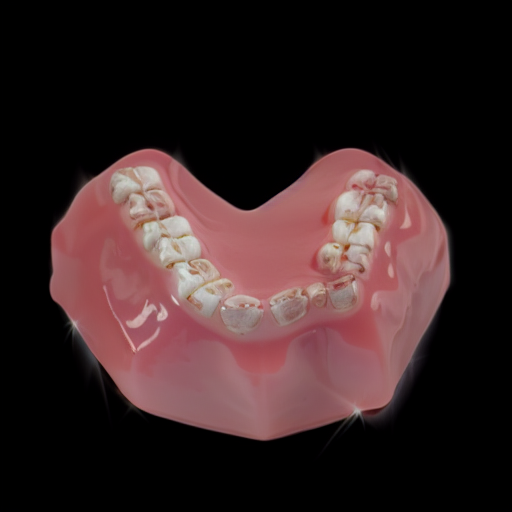 |
| 00001 |  |  |  | 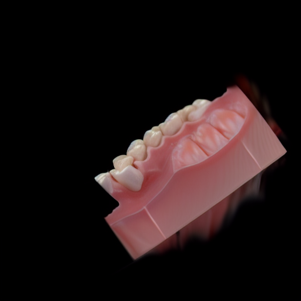 |
| 00002 |  |  |  | 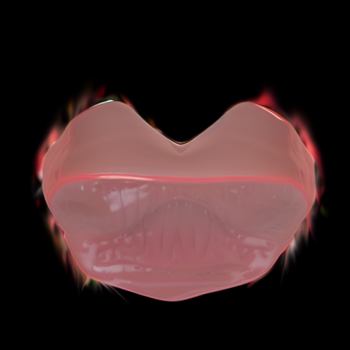 |
| 00003 |  |  |  | 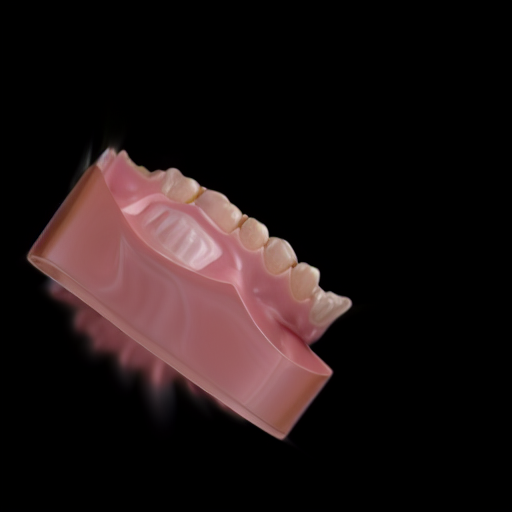 |
| 00004 |  |  |  | 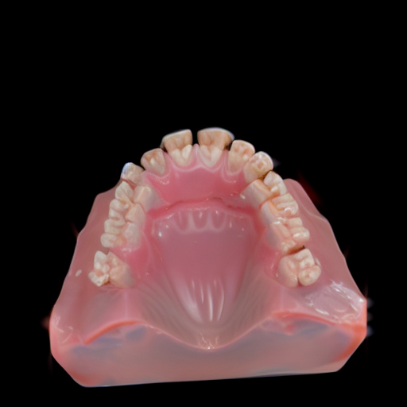 |
| 00005 |  |  |  | 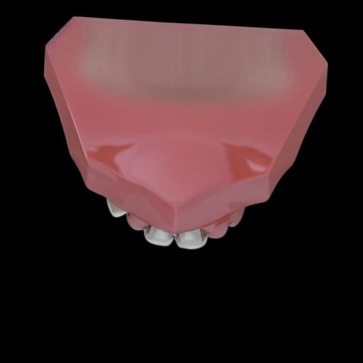 |

### Pass 2: Normal-derived Detail (`sdedit_normal`)

| View | Input (render) | Input (normal) | No ControlNet | SD1.5 + Detail (normal-derived) |
|---|---|---|---|---|
| 00000 |  |  |  | 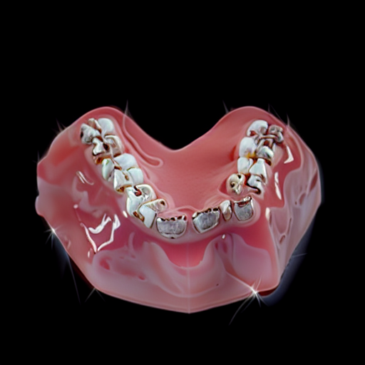 |
| 00001 |  |  |  | 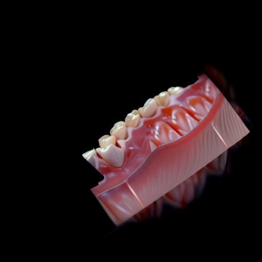 |
| 00002 |  |  |  | 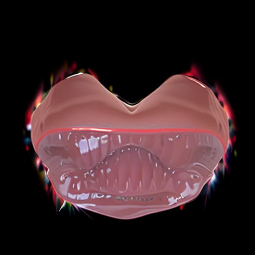 |
| 00003 |  |  |  | 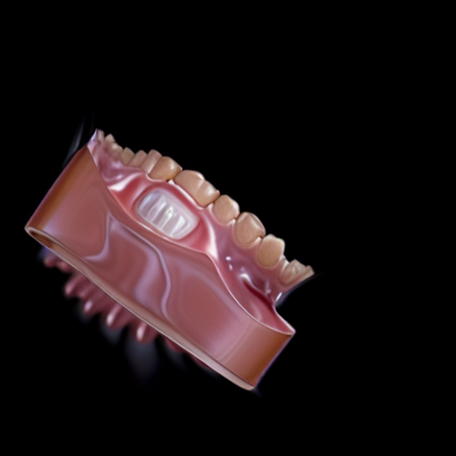 |
| 00004 |  |  |  | 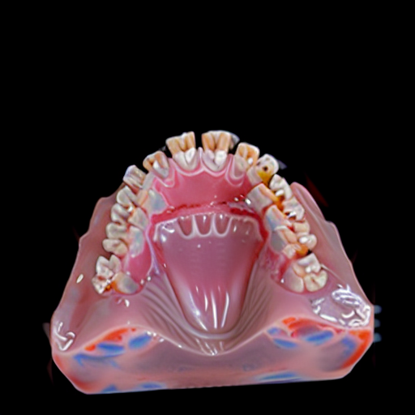 |
| 00005 |  |  |  | 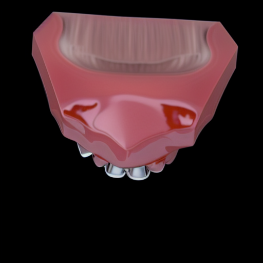 |


---

## 결과 분석
sd segmentation controlNet trained model 결과가 애초에 이상하게 나옴 


> FlowEdit+ControlNet 실험: [2026_03_flow-edit_control-net](./2026_03_flow-edit_control-net.md)
