# Skyfall-GS Stage2: FLUX 기반 Refinement Ablation

## Stage1 결과에 대한 FLUX / FLUX + ControlNet 적용 실험

## 1. Experimental Context

Skyfall-GS Stage1은 6개의 고정된 camera view를 사용하여 3D Gaussian Splatting(3DGS)을 학습한다.  
  
Stage1 학습 이후, GS로부터 렌더링한 6개의 view 세트를 대상으로  
FLUX 및 FLUX + conditioning을 적용하여 view 일반화 특성과 conditioning 효과를 비교한다.  

## 2. View Definition

모든 실험 조건에서 동일하게 6개의 view를 사용한다.  

- Seen Views (6 views):  
  Stage1에서 3DGS 학습에 사용된 camera views  
  
- Unseen Views (6 views):  
  Stage1 학습에는 사용되지 않은 camera views로,  
  기존 view에서 각도를 변경하여 GS로부터 새롭게 렌더링함  

## 3. Compared Settings

다음 설정들에 대해 각각 6개의 view 결과를 비교한다.  
1. Seen Views + FLUX (no conditioning)
2. Unseen Views + FLUX (no conditioning)
3. Seen Views + FLUX + ControlNet (Depth)
4. Seen Views + FLUX + Normal conditioning (weight = 0.3)
5. Seen Views + FLUX + Normal conditioning (weight = 0.6)
6. Seen Views + FLUX + Normal conditioning (weight = 0.9)

## 4.1 Seen vs Unseen Views (FLUX, no conditioning)

### 4.1.1 GT / Stage1 GS Rendering / FLUX

| View | GTimage | rendering (Stage1 GS) | FLUX |
|------|---------|------------------------|------|
| View 1 |  | 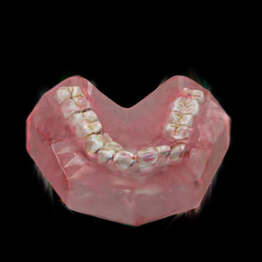 |  |
| View 2 |  |  |  |
| View 3 |  | 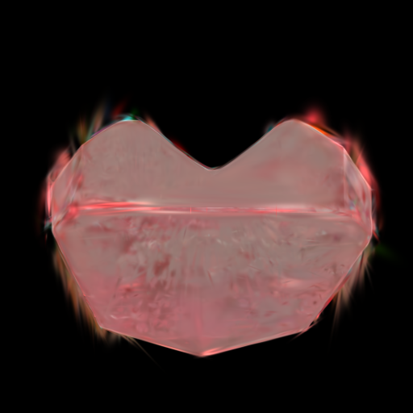 |  |
| View 4 |  |  | 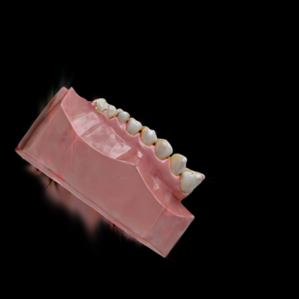 |
| View 5 | 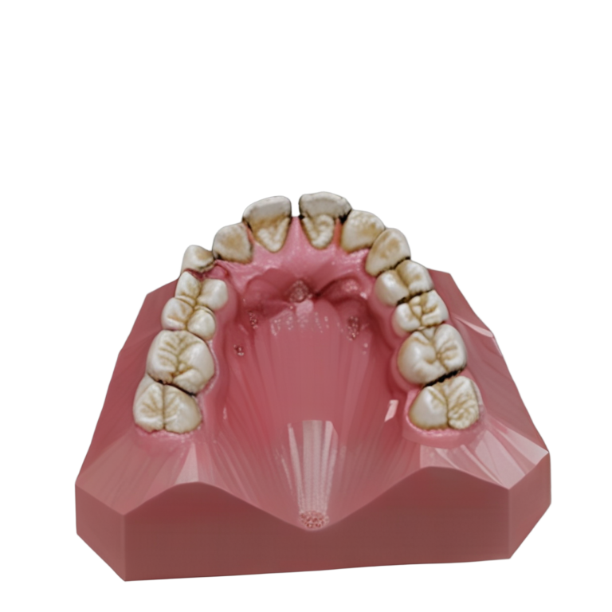 |  | 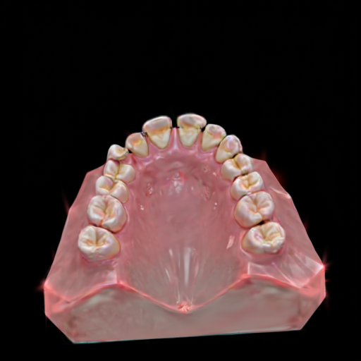 |
| View 6 | 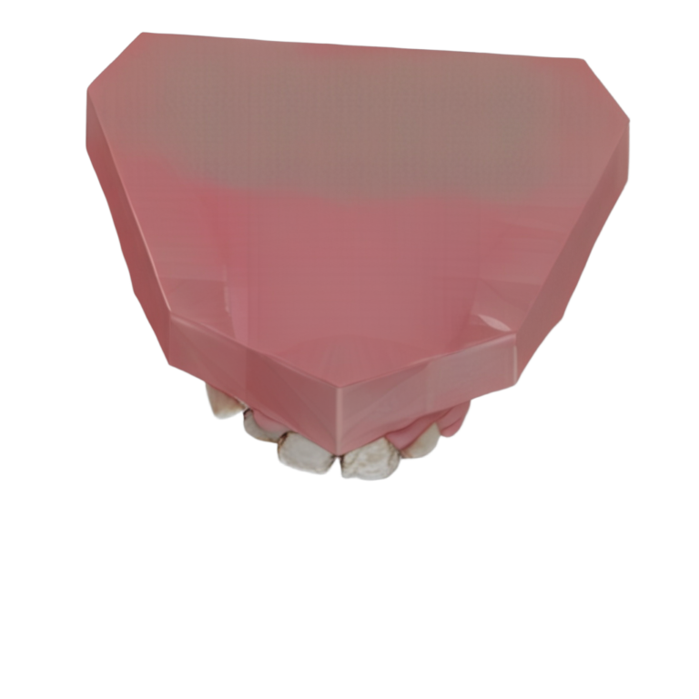 | 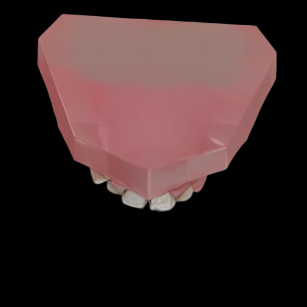 |  |

### 4.1.2 Unseen Views (Novel Views)

| View | Rendering (Stage1 GS) | FLUX |
|------|------------------------|------|
| View 1 |  |  |
| View 2 | 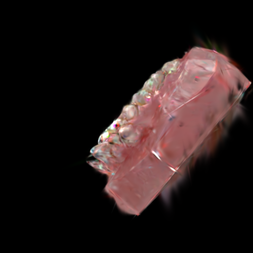 |  |
| View 3 |  | 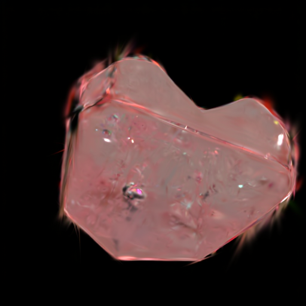 |
| View 4 | 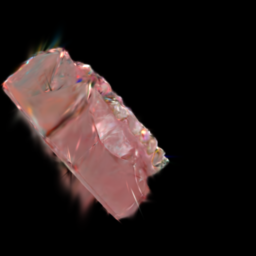 |  |
| View 5 |  |  |
| View 6 | 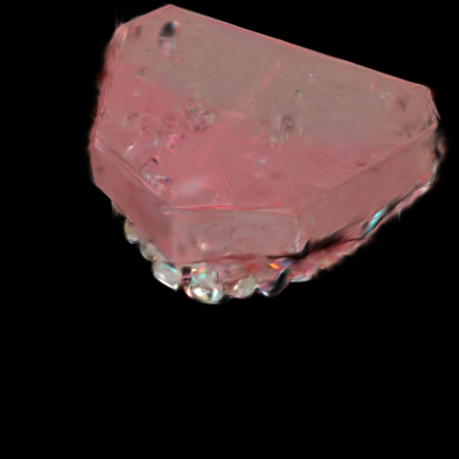 |  |

## 4.2 Depth Input vs FLUX + Depth ControlNet

| View | Input Depth | FLUX (no conditioning) | FLUX + Depth ControlNet |
|------|-------------|------------------------|-------------------------|
| View 1 |  |  | 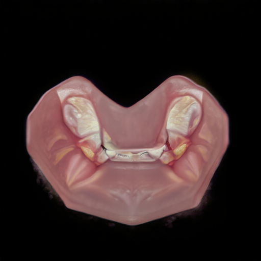 |
| View 2 |  |  | 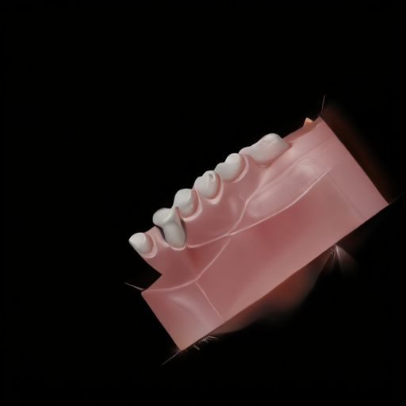 |
| View 3 | 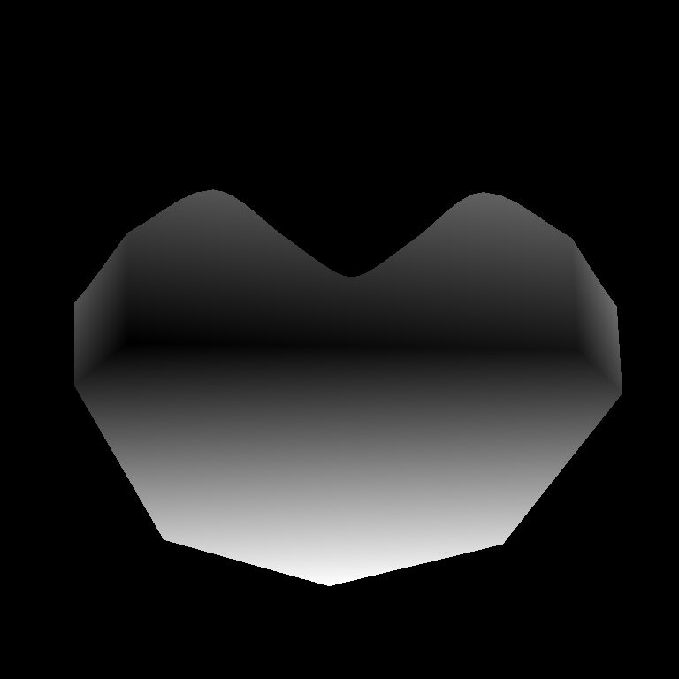 |  | 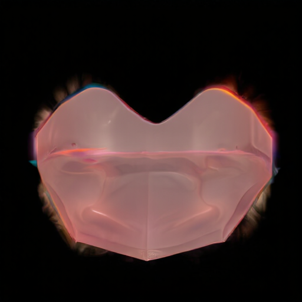 |
| View 4 | 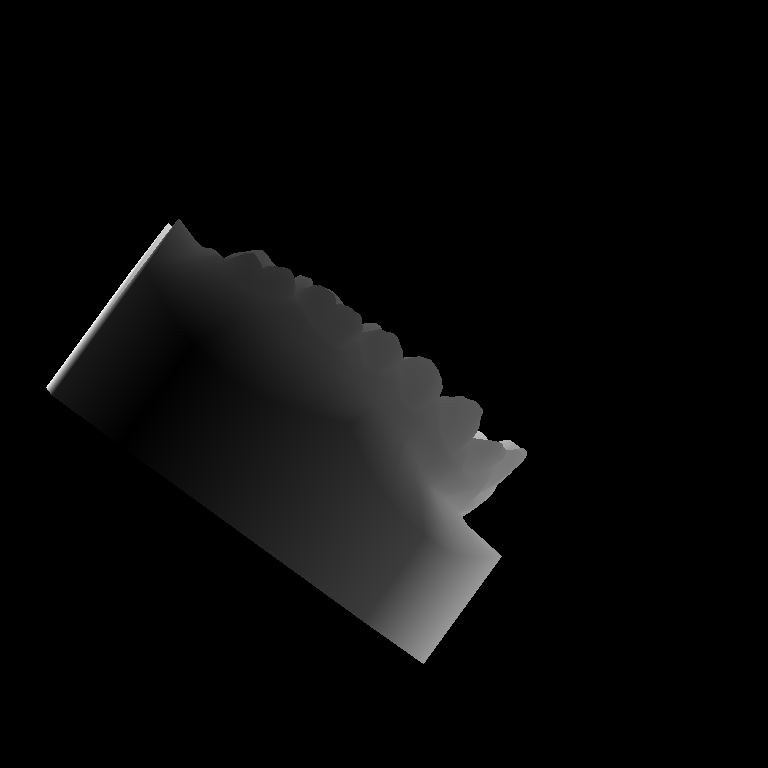 |  | 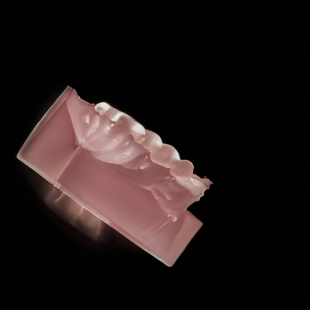 |
| View 5 |  |  | 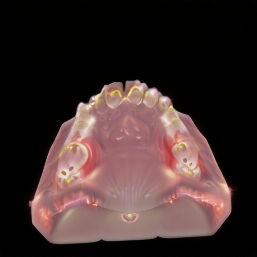 |
| View 6 |  |  |  |

## 4.3 Normal Input vs FLUX / Normal-conditioned FLUX

| View | Input Normal | FLUX (no conditioning) | Normal w=0.3 | Normal w=0.6 | Normal w=0.9 |
|------|--------------|------------------------|--------------|--------------|--------------|
| View 1 |  |  |  |  | 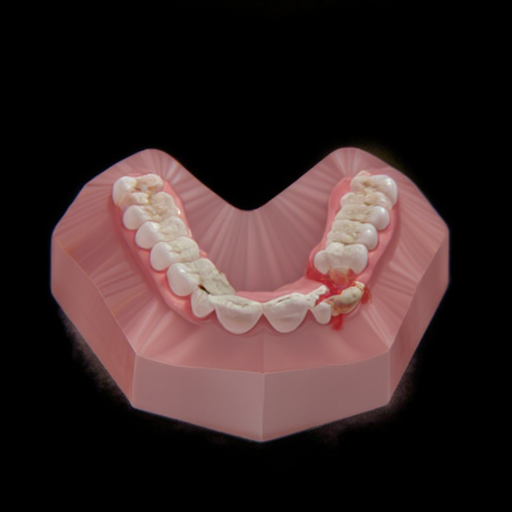 |
| View 2 |  |  |  |  | 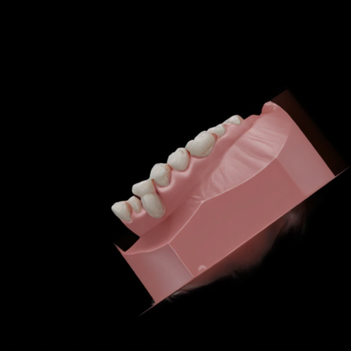 |
| View 3 |  |  |  |  |  |
| View 4 |  |  |  |  |  |
| View 5 | 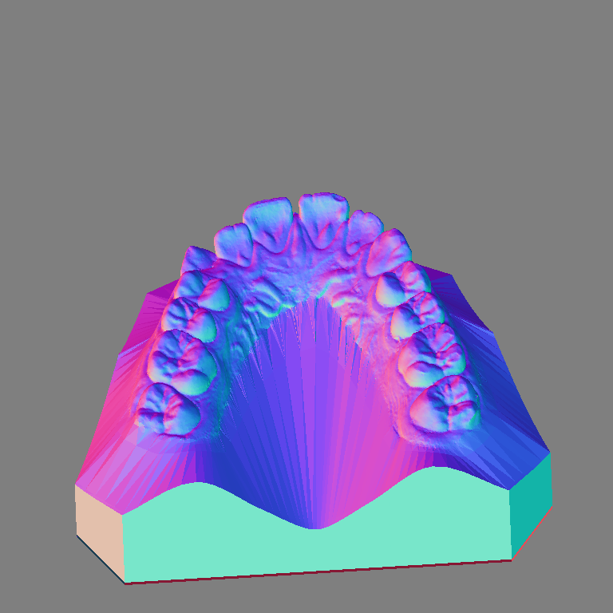 |  |  |  | 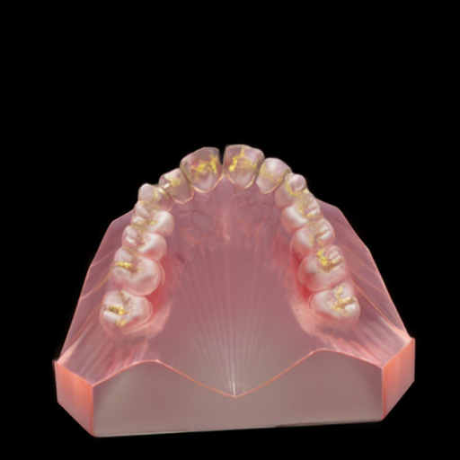 |
| View 6 |  |  | 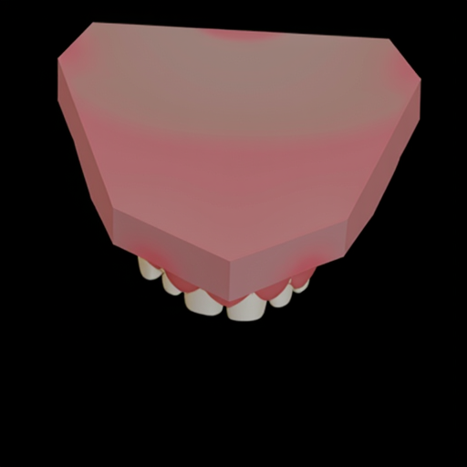 |  | 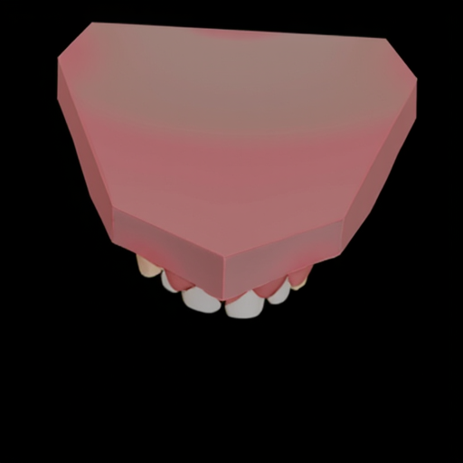 |
